# System Architecture

> **🎯 Purpose:** Understand the system before making changes. A misunderstanding of how the codebase works could lead to thousands of bad lines of code.

---

## Why This Document Matters

```
┌─────────────────────────────────────────────────────────────────┐
│                    THE LEVERAGE PYRAMID                         │
├─────────────────────────────────────────────────────────────────┤
│                                                                 │
│              ┌─────────────────────┐                           │
│              │     UNDERSTAND      │  ← YOU ARE HERE           │
│              │   (This Document)   │                           │
│              │                     │  Mistakes = 1000s of      │
│              │                     │  bad lines of code        │
│              └──────────┬──────────┘                           │
│                         │                                       │
│              ┌──────────▼──────────┐                           │
│              │       PLAN          │                           │
│              │  (Impact Analysis)  │  Mistakes = 100s of       │
│              │                     │  bad lines of code        │
│              └──────────┬──────────┘                           │
│                         │                                       │
│              ┌──────────▼──────────┐                           │
│              │     IMPLEMENT       │                           │
│              │ (Coding Standards)  │  Mistakes = 1 bad line    │
│              └─────────────────────┘                           │
│                                                                 │
└─────────────────────────────────────────────────────────────────┘
```

**Read this document FIRST.** If you misunderstand the architecture:
- You'll put code in the wrong place
- You'll break functionality you didn't know existed
- You'll duplicate existing solutions
- You'll violate design decisions that exist for good reasons

---

## What This System Is

**Real-Time Voice Agent Accelerator** — An enterprise-grade platform for building AI-powered voice agents using Azure services.

### The Big Picture

```
Phone Call → ACS → WebSocket → [Orchestrator] → AI Agent → Voice Response
                                     ↓
                              [STT → LLM → TTS]
```

### Core Value Proposition

| Capability | Implementation |
|------------|----------------|
| **Real-time voice** | Azure Communication Services + Speech Services |
| **Multi-agent AI** | YAML-driven agent framework with handoffs |
| **Dual orchestration** | SpeechCascade (control) or VoiceLive (low-latency) |
| **Enterprise-ready** | Container Apps, managed identity, observability |

---

## Architecture Modes

The system supports **two orchestration modes** that share the same agent framework:

### SpeechCascade Mode

```
Audio → Azure Speech STT → Transcript → Azure OpenAI → TTS → Audio
```

- **Full component control** — Swap STT, LLM, TTS independently
- **400+ Azure neural voices** — Full TTS customization
- **Custom Speech models** — Domain-specific STT
- **Best for:** Per-component debugging, LLM flexibility, on-premises

### VoiceLive Mode

```
Audio → OpenAI Realtime API (managed) → Audio
```

- **Lowest latency** — 200-400ms end-to-end
- **Managed pipeline** — No separate STT/TTS services
- **Native function calling** — Built-in tool execution
- **Best for:** Production deployments prioritizing latency

**Mode selection:** `ACS_STREAMING_MODE` environment variable (`MEDIA`, `TRANSCRIPTION`, `VOICE_LIVE`)

---

## Repository Structure

```
art-voice-agent-accelerator/
├── apps/artagent/
│   ├── backend/              # FastAPI voice service
│   │   ├── api/v1/           # REST + WebSocket endpoints
│   │   ├── voice/            # Orchestrators (cascade, voicelive)
│   │   ├── registries/       # Agents, tools, scenarios
│   │   └── config/           # Settings, feature flags
│   └── frontend/             # React UI
├── src/                      # Core libraries (reusable)
│   ├── acs/                  # Azure Communication Services
│   ├── aoai/                 # Azure OpenAI client
│   ├── speech/               # STT/TTS processing
│   ├── redis/                # Session state management
│   ├── cosmosdb/             # Persistent storage
│   ├── pools/                # Connection pooling
│   └── vad/                  # Voice Activity Detection
├── infra/                    # Terraform + Bicep IaC
├── tests/                    # Unit, integration, load tests
├── docs/                     # Architecture documentation
└── utils/                    # Cross-cutting (logging, telemetry)
```

---

## Key Modules & Responsibilities

### `apps/artagent/backend/` — The Application

| Folder | Responsibility | Key Files |
|--------|---------------|-----------|
| `voice/speech_cascade/` | SpeechCascade orchestrator | `orchestrator.py`, `handler.py` |
| `voice/voicelive/` | VoiceLive orchestrator | `orchestrator.py`, `handler.py` |
| `voice/handoffs/` | Agent handoff logic | `service.py` |
| `registries/agentstore/` | Agent definitions (YAML) | `base.py`, `loader.py`, `*/agent.yaml` |
| `registries/toolstore/` | Tool registry | `registry.py`, `*.py` tools |
| `registries/scenariostore/` | Industry scenarios | `loader.py`, `*/orchestration.yaml` |
| `api/v1/endpoints/` | HTTP/WebSocket handlers | `media.py`, `calls.py` |
| `config/` | App configuration | `settings.py`, `feature_flags.py` |

### `src/` — Core Libraries

| Module | Responsibility | Impact if Changed |
|--------|---------------|-------------------|
| `src/speech/` | STT/TTS processing | Affects all voice output |
| `src/aoai/` | Azure OpenAI client | Affects all LLM calls |
| `src/redis/` | Session state (MemoManager) | Affects all session persistence |
| `src/pools/` | Connection pooling | Affects latency & resource usage |
| `src/acs/` | ACS integration | Affects call handling |
| `src/cosmosdb/` | Persistent storage | Affects conversation history |
| `src/vad/` | Voice Activity Detection | Affects barge-in behavior |

### `utils/` — Cross-Cutting

| Module | Responsibility |
|--------|---------------|
| `ml_logging.py` | Centralized logging (`get_logger`) |
| `telemetry_config.py` | OpenTelemetry setup |
| `session_context.py` | Request context propagation |

---

## Data Flow Architecture

### Three-Tier Storage

```
┌─────────────────────────────────────────────────────────────────┐
│                     Application Memory                          │
│  • Active call state    • Audio buffers    • Connection pools   │
│  Access: Microseconds   Capacity: Container RAM                 │
└─────────────────────────────────────────────────────────────────┘
                              ↓ persist
┌─────────────────────────────────────────────────────────────────┐
│                        Redis Cache                              │
│  • Conversation context  • Session history  • Worker affinity   │
│  Access: Sub-millisecond   Capacity: 1-100GB                    │
└─────────────────────────────────────────────────────────────────┘
                              ↓ archive
┌─────────────────────────────────────────────────────────────────┐
│                        Cosmos DB                                │
│  • Call transcripts    • User profiles    • Analytics/Audit     │
│  Access: 1-10ms        Capacity: Unlimited                      │
└─────────────────────────────────────────────────────────────────┘
```

### Call Lifecycle

```mermaid
sequenceDiagram
    participant Phone
    participant ACS
    participant Backend
    participant Redis
    participant AI
    participant Cosmos

    Phone->>ACS: Incoming call
    ACS->>Backend: WebSocket connect
    Backend->>Redis: Initialize session
    
    loop Conversation
        Phone->>Backend: Audio stream
        Backend->>AI: Process (STT→LLM→TTS)
        AI->>Backend: Response
        Backend->>Redis: Update state
        Backend->>Phone: Audio response
    end
    
    Backend->>Cosmos: Persist transcript
    Backend->>ACS: End call
```



---

## Agent Framework

### Agent Structure

Agents are defined in YAML, not code:

```
registries/agentstore/
├── _defaults.yaml           # Inherited by all agents
├── concierge/
│   ├── agent.yaml           # Agent configuration
│   └── prompt.jinja         # System prompt template
├── fraud_agent/
│   ├── agent.yaml
│   └── prompt.jinja
└── [other agents]/
```

### Key Concepts

| Concept | Description | Location |
|---------|-------------|----------|
| **Agent** | AI assistant with specific role | `agentstore/*/agent.yaml` |
| **Tool** | Capability an agent can use | `toolstore/*.py` |
| **Scenario** | Wiring agents together | `scenariostore/*/orchestration.yaml` |
| **Handoff** | Transfer between agents | Defined in scenarios, not agents |

### Design Principle: Separation of Concerns

```
┌─────────────────┐     ┌─────────────────┐     ┌─────────────────┐
│     Agents      │     │    Scenarios    │     │      Tools      │
│  (capabilities) │     │   (routing)     │     │    (actions)    │
└────────┬────────┘     └────────┬────────┘     └────────┬────────┘
         │                       │                       │
         └───────────────────────┼───────────────────────┘
                                 ↓
                    ┌─────────────────────────┐
                    │   Unified Orchestrator   │
                    └─────────────────────────┘
```

**Why this matters:**
- Same agent can behave differently in different scenarios
- Handoff routing is declarative, not hardcoded
- Tools are shared across all agents

---

## Integration Points

### Azure Services

| Service | Purpose | Config Location |
|---------|---------|-----------------|
| **Azure Communication Services** | Telephony, WebSocket | `ACS_*` env vars |
| **Azure OpenAI** | LLM (GPT-4o) | `AZURE_OPENAI_*` env vars |
| **Azure Speech** | STT/TTS | `AZURE_SPEECH_*` env vars |
| **Azure Redis** | Session cache | `REDIS_*` env vars |
| **Cosmos DB** | Persistence | `AZURE_COSMOS_*` env vars |
| **App Configuration** | Dynamic config | `AZURE_APPCONFIG_*` env vars |
| **Application Insights** | Observability | `APPLICATIONINSIGHTS_*` env vars |

### External Touchpoints

When modifying these, consider downstream effects:

| Component | Depends On | Depended By |
|-----------|------------|-------------|
| `src/speech/` | Azure Speech SDK | Both orchestrators |
| `src/aoai/` | Azure OpenAI SDK | Cascade orchestrator, tools |
| `src/redis/` | Redis client | MemoManager, session state |
| `registries/toolstore/` | Tool definitions | All agents |
| `voice/handoffs/` | HandoffService | Both orchestrators |

---

## Critical Design Decisions

### 1. YAML-First Agents
**Decision:** Agents are defined in YAML, not Python classes.
**Why:** Non-developers can modify agent behavior. Same agent works with both orchestrators.
**Impact:** Don't create agent subclasses. Extend via YAML configuration.

### 2. Scenario-Based Handoffs
**Decision:** Handoff routing is defined in scenarios, not embedded in agents.
**Why:** Same agent can behave differently in banking vs. insurance scenarios.
**Impact:** To change routing, modify `scenariostore/*/orchestration.yaml`, not agent code.

### 3. Centralized Tool Registry
**Decision:** All tools registered in `toolstore/registry.py` with `@register_tool`.
**Why:** Prevents duplication, ensures consistency, enables discovery.
**Impact:** Never define tools inline in agents. Always use the registry.

### 4. Connection Pooling
**Decision:** STT, TTS, and AOAI clients are pooled in `src/pools/`.
**Why:** Creating new clients per request is expensive (~100-500ms).
**Impact:** Always use `get_tts_client()`, `get_stt_client()`, never instantiate directly.

### 5. MemoManager for State
**Decision:** Session state managed by `MemoManager` backed by Redis.
**Why:** Enables stateless container scaling, worker affinity, session recovery.
**Impact:** Never store conversation state in-memory globals.

---

## Change Impact Matrix

Before making changes, consider:

| If You Change... | Also Check/Update... |
|------------------|---------------------|
| Agent YAML schema | `agentstore/base.py`, `loader.py`, all agents |
| Tool interface | All agents using that tool, both orchestrators |
| Handoff behavior | `HandoffService`, scenario orchestration files |
| Redis key structure | `MemoManager`, `ConversationManager`, all consumers |
| Speech processing | Both orchestrators, audio queue handlers |
| API endpoints | Frontend calls, load tests, API docs |
| Configuration | `config/appconfig.json`, `.env`, Terraform outputs |
| Pool sizes | Performance tests, Container Apps resource limits |

---

## Performance Constraints

This is a **real-time voice system**. Latency kills user experience.

### Target Latencies

| Operation | Target | Measured Where |
|-----------|--------|----------------|
| STT recognition | < 200ms | Speech SDK events |
| LLM response start | < 500ms | First token |
| TTS synthesis | < 150ms | First audio chunk |
| End-to-end turn | < 1s | User speech end → response start |
| Handoff switch | < 50ms | Agent transition |

### Performance Anti-Patterns

❌ Creating new clients per request (use pools)
❌ Blocking I/O in async handlers
❌ Large context windows without compaction
❌ Synchronous database calls
❌ Unbounded audio buffers

---

## Documentation References

For deeper understanding:

| Topic | Document |
|-------|----------|
| Architecture overview | `docs/architecture/README.md` |
| Orchestration modes | `docs/architecture/orchestration/README.md` |
| Agent framework | `docs/architecture/agents/README.md` |
| Data flows | `docs/architecture/data/flows.md` |
| Repository structure | `docs/guides/repository-structure.md` |
| API reference | `docs/api/README.md` |

---

## Summary

**Before any task:**

1. **Identify which layer** you're modifying (app, src, infra)
2. **Check the impact matrix** for downstream effects
3. **Understand the data flow** for your change
4. **Respect design decisions** (YAML agents, scenario handoffs, pooled clients)
5. **Consider latency** — this is real-time voice

**When in doubt:** Read the architecture docs in `docs/architecture/` or ask.
