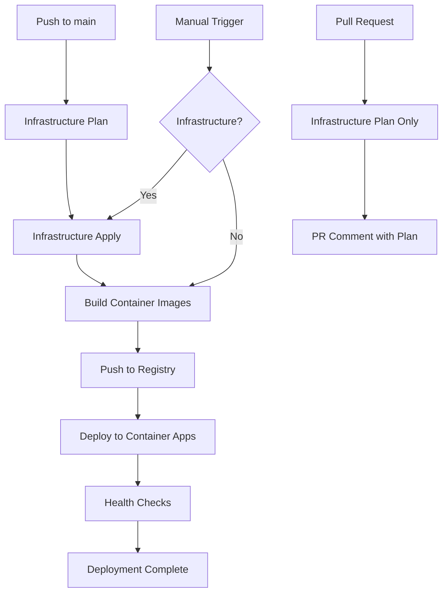

# 🚀 GitHub Actions Deployment Automation

This directory contains GitHub Actions workflows for automated deployment of your Real-Time Audio Agent application to Azure.

## 🎯 Deployment Options

### Azure Developer CLI (Recommended) 🌟
**Files:** [`deploy-azd.yml`](./deploy-azd.yml), [`deploy-azd-complete.yml`](./deploy-azd-complete.yml)

**Benefits:**
- ✅ **Simplified**: Single command deployment (`azd up`)
- ✅ **Integrated**: Built-in lifecycle management
- ✅ **Reliable**: Better error handling and retry logic
- ✅ **Developer-Friendly**: Rich progress reporting and status

**See:** [Azure Developer CLI Deployment Guide](../AZD-DEPLOYMENT.md)


## 📁 Workflow Files

### 🏗️ Infrastructure Deployment
**File:** [`deploy-infrastructure.yml`](./deploy-infrastructure.yml)

Handles Terraform-based infrastructure provisioning including:
- Azure Resource Group
- Container Apps Environment
- Azure Communication Services
- Azure Speech Services
- Azure OpenAI
- Container Registry
- Key Vault
- Redis Cache
- Application Insights

**Triggers:**
- ✅ Manual dispatch with environment selection
- ✅ Push to `main` branch (auto-deploy to dev)
- ✅ Pull requests (plan only)
- ✅ Called by other workflows

### 🚀 Application Deployment
**File:** [`deploy-application.yml`](./deploy-application.yml)

Handles container image building and deployment:
- Builds Frontend (React) and Backend (FastAPI) containers
- Pushes images to Azure Container Registry
- Deploys to Azure Container Apps
- Performs health checks

**Triggers:**
- ✅ Manual dispatch with environment selection
- ✅ Push to `main` branch (auto-deploy to dev)
- ✅ After successful infrastructure deployment
- ✅ Called by other workflows

### 🎯 Complete Pipeline
**File:** [`deploy-complete.yml`](./deploy-complete.yml)

Orchestrates full deployment pipeline:
- Optionally deploys infrastructure first
- Deploys application after infrastructure
- Provides comprehensive deployment summary

**Triggers:**
- ✅ Manual dispatch with full control options

## 🏃‍♂️ Quick Start

### 1. Configure Secrets
Follow the [Secrets Configuration Guide](./SECRETS.md) to set up:
- Azure authentication (OIDC recommended)
- Terraform remote state storage
- Application configuration

### 2. Deploy Everything
```bash
# Navigate to Actions tab in GitHub
# Run "🎯 Complete Deployment Pipeline"
# Select environment: dev/staging/prod
# Choose what to deploy: infrastructure and/or application
```

### 3. Deploy Infrastructure Only
```bash
# Run "🏗️ Deploy Infrastructure"
# Select environment
# Option to destroy instead of create
```

### 4. Deploy Application Only
```bash
# Run "🚀 Deploy Application"
# Select environment
# Option to force rebuild containers
```

## 🌍 Environment Management

### Development (`dev`)
- **Auto-deployment:** Push to `main` triggers deployment
- **Manual deployment:** Available anytime
- **Infrastructure:** Minimal resources for cost optimization

### Staging (`staging`)
- **Manual deployment:** Required approval
- **Infrastructure:** Production-like for testing
- **Testing:** Integration and performance testing

### Production (`prod`)
- **Manual deployment:** Required approval + protection rules
- **Infrastructure:** Full production specification
- **Monitoring:** Enhanced logging and alerting

## 🔄 Deployment Flow



## 🔐 Security Features

### OIDC Authentication
- **Password-less:** No client secrets stored
- **Short-lived tokens:** Enhanced security
- **Federated credentials:** GitHub-specific access

### Environment Protection
- **Staging/Prod:** Require manual approval
- **Branch protection:** Only `main` can deploy
- **Secret isolation:** Environment-specific secrets

### Least Privilege Access
- **Minimal permissions:** Only required Azure roles
- **Resource scoping:** Limited to specific subscriptions
- **Audit logging:** All actions tracked

## 📊 Monitoring & Observability

### Deployment Tracking
- **Job summaries:** Rich deployment information
- **URL generation:** Direct links to deployed services
- **Status monitoring:** Real-time deployment status

### Error Handling
- **Graceful failures:** Detailed error messages
- **Rollback capability:** Infrastructure destroy option
- **Health checks:** Automated service validation

### Logging
- **Structured logs:** JSON format for analysis
- **Correlation IDs:** Track requests across services
- **Performance metrics:** Latency and throughput monitoring

## 🛠️ Customization

### Adding New Environments
1. Update workflow `choice` options
2. Add environment-specific secrets
3. Configure protection rules if needed

### Modifying Infrastructure
1. Update Terraform files in `infra/terraform/`
2. Push changes to trigger plan/apply
3. Review plan in PR comments

### Application Configuration
1. Update container build settings in workflow
2. Modify environment variables
3. Adjust health check endpoints

## 🆘 Troubleshooting

### Common Issues

**Authentication Failures:**
```bash
# Check OIDC configuration
az ad app federated-credential list --id $APP_ID
```

**Terraform State Conflicts:**
```bash
# Manual state unlock if needed
terraform force-unlock <LOCK_ID>
```

**Container Registry Access:**
```bash
# Verify registry permissions
az role assignment list --assignee $PRINCIPAL_ID --scope /subscriptions/$SUB_ID
```

### Debugging Steps
1. Check workflow logs in GitHub Actions
2. Review Azure Activity Log
3. Validate Terraform plan output
4. Test container image builds locally
5. Verify Azure resource connectivity

### Getting Help
- 📖 Review workflow documentation
- 🔍 Check Azure portal for resource status
- 📝 Review Terraform plan output
- 🐛 Enable debug logging with `ACTIONS_STEP_DEBUG=true`

## 📈 Best Practices

### Infrastructure
- **State management:** Always use remote state
- **Resource naming:** Follow Azure naming conventions
- **Tagging strategy:** Consistent resource tagging
- **Cost optimization:** Right-size resources per environment

### Application
- **Container optimization:** Multi-stage builds
- **Health endpoints:** Implement proper health checks
- **Configuration:** Use environment variables
- **Secrets management:** Azure Key Vault integration

### CI/CD
- **Branch protection:** Protect main branch
- **PR reviews:** Require infrastructure review
- **Testing:** Automated testing in pipeline
- **Monitoring:** Set up alerts for failures

---

## 🎯 Next Steps

1. **Complete Setup:** Follow secrets configuration guide
2. **Test Deployment:** Run complete pipeline in dev
3. **Configure Monitoring:** Set up alerts and dashboards
4. **Production Readiness:** Configure protection rules
5. **Team Training:** Share workflow documentation

Happy deploying! 🚀
