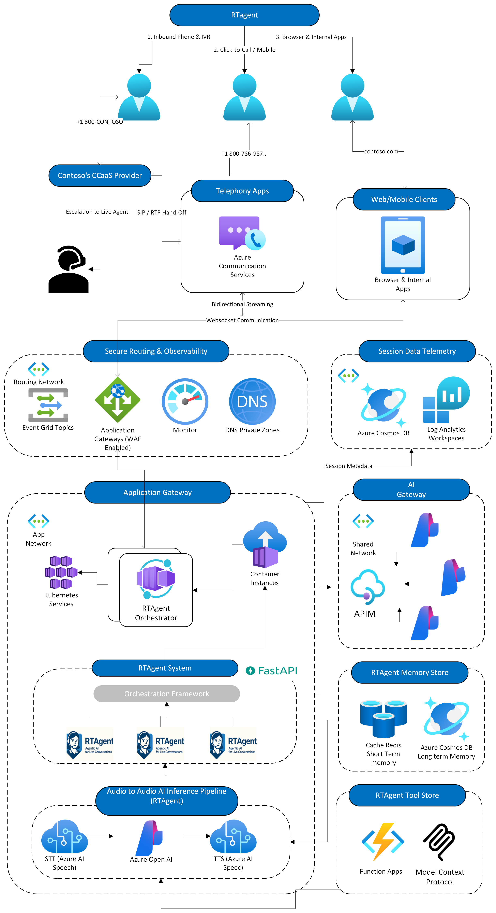

<!-- markdownlint-disable MD033 MD041 -->

# 🎙️ **RTVoice Accelerator**  
*Omni-channel, real-time voice-intelligence accelerator framework on Azure*

**RTAgent** is an accelerator that delivers a friction-free, AI-driven voice experience—whether callers dial a phone number, speak to an IVR, or click “Call Me” in a web app. Built entirely on generally available Azure services—Azure Communication Services, Azure AI, and Azure App Service—it provides a low-latency stack that scales on demand while keeping the AI layer fully under your control.

Design a single agent or orchestrate multiple specialist agents (claims intake, authorization triage, appointment scheduling—anything). The framework allows you to build your voice agent from scratch, incorporate long- and short-term memory, configure actions, and fine-tune your TTS and STT layers to give any workflow an intelligent voice.

## **Overview** 


> **88 %** of customers still make a **phone call** when they need real support  
> — yet most IVRs feel like 1999. **RTAgent** fixes that.

**RTAgent in a nutshell**

RT Agent is a plug-and-play accelerator, voice-to-voice AI pipeline that slots into any phone line, web client, or CCaaS flow. Caller audio arrives through Azure Communication Services (ACS), is transcribed by a dedicated STT component, routed through your agent chain of LLMs, tool calls, and business logic, then re-synthesised by a TTS component—all in a sub-second round-trip. Because each stage runs as an independent microservice, you can swap models, fine-tune latency budgets, or inject custom logic without touching the rest of the stack. The result is natural, real-time conversation with precision control over every hop of the call.



<br>

| What you get | How it helps |
|--------------|--------------|
| **Sub-second loop** (STT → LLM/Tools → TTS) | Conversations feel human, not robotic latency-ridden dialogs. |
| **100 % GA Azure stack** | No private previews, no hidden SKUs—easy procurement & support. |
| **Drop-in YAML agents** | Spin up FNOL claims bots, triage nurses, or legal intake in minutes. |
| **Micro-service architecture** | Swap models, tune latency, or add new business logic without redeploying the whole stack. |

## Deploy and Customize the Demo App Using the RTAgent Framework

### **🚀 One-Command Azure Deployment**

Provision the full solution—including App Gateway, Container Apps, Cosmos DB, Redis, OpenAI, and Key Vault—with a single command:

```bash
azd auth login
azd up   # ~15 min for complete infra and code deployment
```

**Key Features:**
- TLS managed by Key Vault and App Gateway
- KEDA auto-scales RT Agent workers
- All outbound calls remain within a private VNet

For a detailed deployment walkthrough, see [`docs/DeploymentGuide.md`](docs/DeploymentGuide.md).

**Project Structure Highlights:**

| Path                | Description                                 |
|---------------------|---------------------------------------------|
| apps/rtagent/backend| FastAPI + WebSocket voice pipeline          |
| apps/rtagent/frontend| Vite + React demo client                   |
| apps/rtagent/scripts| Helper launchers (backend, frontend, tunnel)|
| infra/              | Bicep/Terraform IaC                        |
| docs/               | Architecture, agents, tuning guides         |
| tests/              | Pytest suite                               |
| Makefile            | One-line dev commands                       |
| environment.yaml    | Conda environment spec (name: audioagent)   |

### *⚡ Run the app Local*

**Prerequisites:** Infra deployed (above), Conda, Node.js ≥ 18, Azure CLI with `dev-tunnel` extension.

**Backend (FastAPI + Uvicorn):**
```bash
git clone https://github.com/your-org/gbb-ai-audio-agent.git
cd gbb-ai-audio-agent/rtagents/RTAgent/backend
python -m venv .venv && source .venv/bin/activate
pip install -r requirements.txt
cp .env.sample .env   # Configure ACS, Speech, and OpenAI keys
python server.py      # Starts backend at ws://localhost:8010/realtime
```

**Frontend (Vite + React):**
```bash
cd ../../frontend
npm install
npm run dev           # Starts frontend at http://localhost:5173
```

## **Deployment on Azure**

### Standard Deployment (Recommended)

```bash
azd auth login
azd up         # full infra + code (~15 min)
```

### Alternative Deployment Methods

For environments where Azure Developer CLI cannot be used, we provide several alternative deployment approaches using Terraform and Makefile automation.

#### **Option 1: Direct Terraform + Makefile Deployment**

This approach uses Terraform directly for infrastructure provisioning and Makefile targets for environment management and application deployment:

##### 1. Set required environment variables

Before deploying, copy and edit the example variables file:

```bash
cp infra/terraform/terraform.tfvars.example infra/terraform/terraform.tfvars
# Edit infra/terraform/terraform.tfvars to set your Azure subscription, environment, and region
```

Set the following environment variables in your shell:

```bash
export ARM_SUBSCRIPTION_ID="<your-subscription-id>"
```

If you are using remote state for Terraform (recommended for team or CI/CD use), configure your backend in `infra/terraform/backend.tf`. For example, to use Azure Storage as the backend:

```hcl
# infra/terraform/backend.tf
terraform {
   backend "azurerm" {
      resource_group_name  = "<your-tfstate-rg>"
      storage_account_name = "<your-tfstate-storage>"
      container_name       = "<your-tfstate-container>"
      key                  = "terraform.tfstate"
      use_azuread_auth     = true
   }
}
```

After editing `backend.tf`, initialize Terraform with:

```bash
cd infra/terraform
terraform init
```

See comments in `terraform.tfvars.example` and `backend.tf` for further configuration details.

##### 2. Initialize and deploy infrastructure with Terraform
```
cd infra/terraform
terraform init
terraform plan 
terraform apply 
```

##### 3. Generate local .env file from Terraform outputs
```
cd ../..  # (repository root directory)
make generate_env_from_terraform
```

##### 4. Update .env file with secrets from Azure Key Vault
```
make update_env_with_secrets
```

##### 5. Generate deployment artifacts and deploy applications
```
make deploy_backend
make deploy_frontend
```

#### **Option 2: PowerShell-Based Deployment (Windows)**

For Windows environments, use the PowerShell equivalents:

```powershell
# Set environment variables
$env:AZURE_SUBSCRIPTION_ID = "<your-subscription-id>"
$env:AZURE_ENV_NAME = "dev"

# Deploy infrastructure (same Terraform commands as above)
cd infra/terraform
terraform init
terraform plan -var="environment_name=$env:AZURE_ENV_NAME"
terraform apply -var="environment_name=$env:AZURE_ENV_NAME"

# Generate environment file and deploy (PowerShell)
cd ../..
make generate_env_from_terraform_ps
make update_env_with_secrets_ps
make generate_backend_deployment
make generate_frontend_deployment
make deploy_backend
make deploy_frontend
```

#### **Option 3: Step-by-Step Manual Deployment**

For maximum control over each deployment step:

```bash
# 1. Environment Setup
export AZURE_SUBSCRIPTION_ID="<your-subscription-id>"
export AZURE_ENV_NAME="dev"

# 2. Infrastructure Deployment
cd infra/terraform
terraform init
terraform plan -out=tfplan -var="environment_name=${AZURE_ENV_NAME}"
terraform apply tfplan

# 3. Environment File Generation
cd ../..
make generate_env_from_terraform    # Extract Terraform outputs to .env
make show_env_file                 # Verify environment file contents
make update_env_with_secrets       # Add Key Vault secrets

# 4. Application Deployment Preparation
make generate_backend_deployment   # Create backend deployment package
make generate_frontend_deployment  # Create frontend deployment package
make show_deployment_info          # Verify deployment packages

# 5. Deploy to Azure Web Apps
make deploy_backend               # Deploy backend using Terraform outputs
make deploy_frontend              # Deploy frontend using Terraform outputs

# 6. Optional: Purchase ACS Phone Number
make purchase_acs_phone_number    # Add phone number to ACS resource
```

#### **Key Environment Variables**

| Variable | Description | Example |
|----------|-------------|---------|
| `AZURE_SUBSCRIPTION_ID` | Your Azure subscription ID | `12345678-1234-1234-1234-123456789012` |
| `AZURE_ENV_NAME` | Environment name for resource naming | `dev`, `staging`, `prod` |
| `AZURE_RESOURCE_GROUP` | Resource group name (auto-extracted from Terraform) | `rg-rtvoice-dev-eastus2` |

#### **Available Make Targets**

**Infrastructure & Environment:**
- `generate_env_from_terraform` - Generate .env file from Terraform state
- `update_env_with_secrets` - Add Key Vault secrets to .env file
- `show_env_file` - Display current environment configuration

**Deployment Artifacts:**
- `generate_backend_deployment` - Create backend deployment package
- `generate_frontend_deployment` - Create frontend deployment package
- `clean_deployment_artifacts` - Clean up deployment files
- `show_deployment_info` - Display deployment package details

**Azure Web App Deployment:**
- `deploy_backend` - Deploy backend to Azure App Service
- `deploy_frontend` - Deploy frontend to Azure App Service
- `deploy_to_webapp` - Generic Web App deployment (manual usage)

**Azure Communication Services:**
- `purchase_acs_phone_number` - Purchase and configure ACS phone number

#### **Troubleshooting Alternative Deployments**

**Common Issues:**

1. **Terraform Backend Not Configured:**
   ```bash
   # Initialize with remote backend
   cd infra/terraform
   terraform init -backend-config="subscription_id=${AZURE_SUBSCRIPTION_ID}"
   ```

2. **Missing Environment Variables:**
   ```bash
   # Verify required variables are set
   echo "Subscription: ${AZURE_SUBSCRIPTION_ID}"
   echo "Environment: ${AZURE_ENV_NAME}"
   ```

3. **Azure CLI Authentication:**
   ```bash
   az login
   az account set --subscription "${AZURE_SUBSCRIPTION_ID}"
   ```

4. **Key Vault Access Issues:**
   ```bash
   # Ensure you have Key Vault access
   az keyvault list --subscription "${AZURE_SUBSCRIPTION_ID}"
   ```

**Environment File Validation:**
After running `make generate_env_from_terraform`, verify your `.env.${AZURE_ENV_NAME}` file contains:
- ACS_ENDPOINT
- AZURE_OPENAI_ENDPOINT  
- AZURE_SPEECH_KEY
- BACKEND_APP_SERVICE_URL
- FRONTEND_APP_SERVICE_URL

For detailed troubleshooting, see: [`docs/TerraformDeployment.md`](docs/TerraformDeployment.md)

#### **Benefits of the Terraform Approach**

- **Full Infrastructure Control:** Direct Terraform management with state files
- **Environment Isolation:** Separate environments using Terraform workspaces  
- **Step-by-Step Visibility:** Clear separation of infrastructure and application deployment
- **Cross-Platform Support:** Works on Windows (PowerShell), macOS, and Linux
- **No azd Dependency:** Pure Terraform + Azure CLI workflow

## **Load & Chaos Testing**
Worried about the solution’s ability to scale under your application’s load? Here’s a guide to help you with horizontal scaling tests...


Targets: **<500 ms STT→TTS • 1k+ concurrent calls • >99.5 % success** (WIP)

```bash
az load test run --test-plan tests/load/azure-load-test.yaml
```

Additional load test scripts (Locust, Artillery) are available in [`docs/LoadTesting.md`](docs/LoadTesting.md).

## **Roadmap**
- Live Agent API integration
- Multi-modal agents (documents, images)

## **Contributing**
PRs & issues welcome—see `CONTRIBUTING.md` and run `make pre-commit` before pushing.

## **License & Disclaimer**
Released under MIT. This sample is **not** an official Microsoft product—validate compliance (HIPAA, PCI, GDPR, etc.) before production use.

<br>

> [!IMPORTANT]  
> This software is provided for demonstration purposes only. It is not intended to be relied upon for any production workload. The creators of this software make no representations or warranties of any kind, express or implied, about the completeness, accuracy, reliability, suitability, or availability of the software or related content. Any reliance placed on such information is strictly at your own risk.