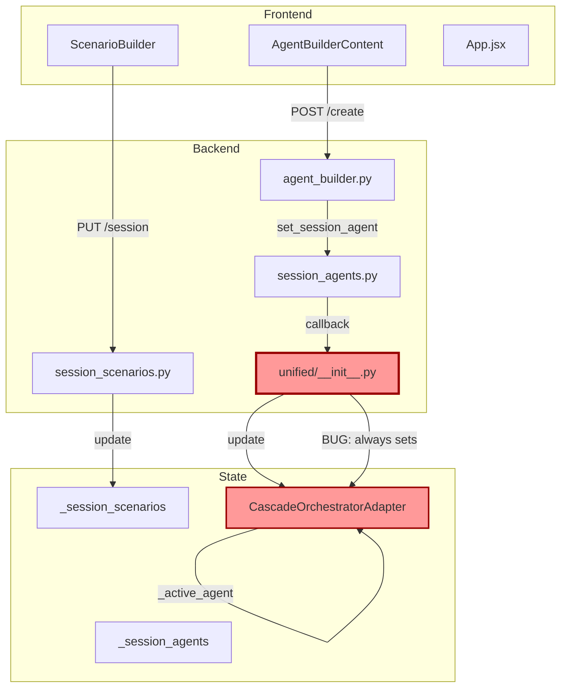

# Agent Builder → Scenario State Leak Analysis

**Issue ID**: BEAD-STATE-LEAK-001  
**Reported**: 2026-01-23  
**Status**: Investigation Complete  
**Severity**: High - Affects core scenario isolation

---

## Executive Summary

A state management issue exists where creating a new agent (e.g., "Banking Concierge2") from a template (e.g., "Banking Concierge") in the Agent Builder incorrectly updates the active scenario's `start_agent` to the new agent name, even when the user did not explicitly request this change.

---

## Observed Behavior

1. User has a scenario with `start_agent: "Banking Concierge"`
2. User opens Agent Builder with "Banking Concierge" template
3. User changes the name to "Banking Concierge2" and saves
4. The scenario's `start_agent` automatically changes to "Banking Concierge2"
5. User did NOT explicitly update the scenario

---

## Root Cause Analysis

### Architecture Overview

```
┌─────────────────────────────────────────────────────────────────────────┐
│                         Frontend (React)                                │
├─────────────────────────────────────────────────────────────────────────┤
│  AgentBuilderContent.jsx                                                │
│  ├── handleSave() → POST /api/v1/agent-builder/create                   │
│  └── onAgentCreated callback → App.jsx                                  │
│                                                                         │
│  ScenarioBuilder.jsx                                                    │
│  ├── config.start_agent (local state)                                   │
│  ├── availableAgents (fetched from backend)                             │
│  └── useEffect validation → auto-cleans invalid agents                  │
├─────────────────────────────────────────────────────────────────────────┤
│                         Backend (FastAPI)                               │
├─────────────────────────────────────────────────────────────────────────┤
│  session_agents.py                                                      │
│  ├── _session_agents: dict[session_id, dict[agent_name, UnifiedAgent]]  │
│  ├── set_session_agent() → stores by agent.name                         │
│  └── _adapter_update_callback → notifies orchestrator                   │
│                                                                         │
│  session_scenarios.py                                                   │
│  ├── _session_scenarios: dict[session_id, dict[scenario_name, Config]]  │
│  ├── ScenarioConfig.start_agent → mutable string reference              │
│  └── _scenario_update_callback → notifies orchestrator                  │
│                                                                         │
│  unified/__init__.py                                                    │
│  ├── update_session_agent() → injects into adapter.agents               │
│  └── adapter._active_agent = agent.name  ❌ BUG: Also updates active    │
├─────────────────────────────────────────────────────────────────────────┤
│                      Orchestrator Adapter                               │
├─────────────────────────────────────────────────────────────────────────┤
│  CascadeOrchestratorAdapter                                             │
│  ├── .agents: dict[name, UnifiedAgent]                                  │
│  ├── ._active_agent: str → current active agent name                    │
│  └── .config.start_agent → initial starting agent                       │
└─────────────────────────────────────────────────────────────────────────┘
```

### Issue #1: Active Agent Mutation in Orchestrator (PRIMARY BUG)

**Location**: `apps/artagent/backend/src/orchestration/unified/__init__.py:211-222`

```python
def update_session_agent(session_id: str, agent: UnifiedAgent) -> bool:
    # ...
    adapter = _adapters[session_id]

    # Inject/update the agent in the adapter's agents dict
    adapter.agents[agent.name] = agent

    # ❌ BUG: This unconditionally updates the active agent
    # Even when creating a NEW agent, not updating the CURRENT one
    adapter._active_agent = agent.name  # ← PROBLEM!
```

**Impact**: Every time ANY agent is created/updated via Agent Builder, it becomes the active agent in the orchestrator, regardless of whether the user intended to switch agents.

### Issue #2: Scenario Config Not Properly Isolated

When the adapter's `_active_agent` changes, downstream components that read the "current" scenario state may return stale or incorrect `start_agent` values because:

1. The scenario's `start_agent` is a simple string
2. There's no validation that `start_agent` still exists in the scenario's agent list
3. The orchestrator's active agent and scenario's start_agent can diverge

### Issue #3: Frontend Auto-Validation Side Effects

**Location**: `apps/artagent/frontend/src/components/ScenarioBuilder.jsx:2667-2708`

```javascript
// Validate and clean up config when availableAgents changes
useEffect(() => {
  if (availableAgents.length === 0) return;
  
  const validAgentNames = new Set(availableAgents.map(a => a.name));
  
  setConfig((prev) => {
    // Check if start_agent is valid
    if (prev.start_agent && !validAgentNames.has(prev.start_agent)) {
      // Auto-removes start_agent if not in valid list
      newConfig.start_agent = null;
      hasChanges = true;
    }
    // ...
  });
}, [availableAgents]);
```

**Impact**: When agents list changes (new agent added), this effect can trigger and potentially invalidate or modify the `start_agent` if there's any naming mismatch.

### Issue #4: Agent Name Normalization Inconsistency

**Location**: `apps/artagent/backend/api/v1/endpoints/scenario_builder.py:213-228`

Session agents appear with `" (session)"` suffix in some contexts:

```python
# If duplicate name, suffix with (session)
if display_name in existing_names:
    display_name = f"{agent.name} (session)"
```

But scenario `start_agent` stores the canonical name without suffix:

```python
normalized_start_agent = _normalize_agent_name(config.start_agent)
# Strips " (session)" suffix
```

This creates ambiguity when matching agent names between different contexts.

---

## Data Flow Trace

### Scenario 1: User Creates New Agent (Bug Triggered)

```
1. User clicks "Create Agent" in AgentBuilderContent
2. Frontend: handleSave() → POST /api/v1/agent-builder/create
3. Backend: create_dynamic_agent()
   └── set_session_agent(session_id, agent)
       └── _adapter_update_callback(session_id, agent)
           └── update_session_agent(session_id, agent)
               ├── adapter.agents[agent.name] = agent  ✓ Correct
               └── adapter._active_agent = agent.name  ❌ Bug: unconditional
4. Frontend: onAgentCreated callback
   └── setSelectedAgentName(agentConfig.name)  ❌ Also contributes
5. If ScenarioBuilder is open:
   └── availableAgents refetch triggers useEffect
       └── Validation runs but may not catch this issue
```

### Scenario 2: Expected Behavior (No Bug)

When updating an EXISTING agent that IS the current `start_agent`:

```
1. User edits "Banking Concierge" (already the start_agent)
2. Updates propagate correctly
3. No state leak because agent.name hasn't changed
```

---

## Affected Components

| Component | File | Issue |
|-----------|------|-------|
| Orchestrator Update | `unified/__init__.py:211-222` | Unconditional active agent mutation |
| Session Agent Registry | `session_agents.py:74-101` | No validation of update intent |
| Scenario Config | `session_scenarios.py` | Mutable start_agent not isolated |
| Frontend ScenarioBuilder | `ScenarioBuilder.jsx:2667-2708` | Auto-validation side effects |
| Frontend App | `App.jsx:4384-4434` | `setSelectedAgentName` on any agent create |

---

## Recommended Fixes

### Fix 1: Conditional Active Agent Update (Primary Fix)

**File**: `apps/artagent/backend/src/orchestration/unified/__init__.py`

```python
def update_session_agent(session_id: str, agent: UnifiedAgent, set_active: bool = False) -> bool:
    """
    Update or inject a dynamic agent into the session's orchestrator adapter.

    Args:
        session_id: The session to update
        agent: The UnifiedAgent with updated configuration
        set_active: If True, also set this as the active agent. Default False.

    Returns:
        True if adapter was found and updated, False if no active adapter exists
    """
    if session_id not in _adapters:
        return False

    adapter = _adapters[session_id]
    adapter.agents[agent.name] = agent

    # Only update active agent if explicitly requested
    if set_active:
        adapter._active_agent = agent.name

    logger.info(
        "🔄 Session agent updated in adapter | session=%s agent=%s set_active=%s",
        session_id,
        agent.name,
        set_active,
    )

    return True
```

### Fix 2: Add Intent Flag to Agent Builder API

**File**: `apps/artagent/backend/api/v1/endpoints/agent_builder.py`

```python
class DynamicAgentConfig(BaseModel):
    # ... existing fields ...
    set_as_active: bool = Field(
        default=False,
        description="If True, set this agent as the active agent for the session"
    )
```

### Fix 3: Frontend Should Not Auto-Select Created Agents

**File**: `apps/artagent/frontend/src/components/App.jsx`

```javascript
onAgentCreated={(agentConfig) => {
  appendLog(`✨ Dynamic agent created: ${agentConfig.name}`);
  // ... logging ...
  
  // ❌ REMOVE: Don't auto-select the agent
  // setSelectedAgentName(agentConfig.name);
  
  // ✓ Keep: Just refresh the inventory
  fetchSessionAgentConfig();
  // ...
}}
```

### Fix 4: Scenario Isolation Validation

Add explicit validation when scenario is loaded to ensure `start_agent` is still valid:

```python
def validate_scenario_agents(scenario: ScenarioConfig, available_agents: dict[str, Any]) -> ScenarioConfig:
    """Validate and fix scenario agent references."""
    if scenario.start_agent and scenario.start_agent not in available_agents:
        logger.warning(
            "Scenario start_agent '%s' not found, resetting to first available",
            scenario.start_agent
        )
        scenario.start_agent = next(iter(available_agents.keys()), None)
    return scenario
```

---

## Testing Recommendations

### Test Case 1: Create New Agent Without Scenario Impact

```python
def test_create_agent_does_not_change_scenario_start():
    # Setup: Create scenario with start_agent="BankingConcierge"
    # Action: Create new agent "BankingConcierge2"
    # Assert: scenario.start_agent == "BankingConcierge" (unchanged)
```

### Test Case 2: Update Existing Agent Preserves Identity

```python
def test_update_agent_preserves_scenario_reference():
    # Setup: Create scenario with start_agent="BankingConcierge"
    # Action: Update "BankingConcierge" (same name, different config)
    # Assert: scenario.start_agent == "BankingConcierge" (unchanged)
```

### Test Case 3: Explicit Agent Switch

```python
def test_explicit_set_active_agent():
    # Setup: Create scenario with start_agent="BankingConcierge"
    # Action: Create "BankingConcierge2" with set_as_active=True
    # Assert: adapter._active_agent == "BankingConcierge2"
    # Assert: scenario.start_agent == "BankingConcierge" (still unchanged)
```

---

## Mermaid Diagram: Data Flow



---

## Next Steps

1. **Immediate**: Apply Fix 1 to prevent unconditional active agent mutation
2. **Short-term**: Add `set_as_active` flag to API and frontend
3. **Medium-term**: Add comprehensive integration tests for agent/scenario isolation
4. **Long-term**: Consider event-driven architecture with explicit intent signals

---

## References

- [session_agents.py](../apps/artagent/backend/src/orchestration/session_agents.py)
- [session_scenarios.py](../apps/artagent/backend/src/orchestration/session_scenarios.py)
- [unified/__init__.py](../apps/artagent/backend/src/orchestration/unified/__init__.py)
- [agent_builder.py](../apps/artagent/backend/api/v1/endpoints/agent_builder.py)
- [ScenarioBuilder.jsx](../apps/artagent/frontend/src/components/ScenarioBuilder.jsx)
- [App.jsx](../apps/artagent/frontend/src/components/App.jsx)

---

## Fixes Applied (2025-01-23)

### Fix 1: Conditional Active Agent Update ✅
**File**: `unified/__init__.py`
- Added `set_active: bool = False` parameter to `update_session_agent()`
- Agent creation no longer unconditionally sets active agent

### Fix 2: Updated Callback Signature ✅
**File**: `session_agents.py`
- `_agent_update_callback` signature now includes `set_active` parameter
- `set_session_agent()` accepts and passes `set_active` flag

### Fix 3: Frontend Auto-Selection Removed ✅
**File**: `App.jsx`
- Removed `setSelectedAgentName(agentConfig.name)` from `onAgentCreated` callbacks

### Fix 4: Scenario Selection Now Updates Adapter ✅
**File**: `session_scenarios.py`
- `set_active_scenario()` now calls `_scenario_update_callback` when a scenario is selected
- Ensures the adapter's `_active_agent` is updated to the scenario's `start_agent`

## Behavior After All Fixes

| Action | Behavior |
|--------|----------|
| Create agent via Agent Builder | Agent stored in session, NOT auto-selected |
| Select agent in Agent Builder | Agent becomes active via explicit user action |
| Create/Update scenario | Scenario's start_agent becomes active |
| **Select existing scenario** | **Scenario's start_agent becomes active ✅** |
| Industry template selection | Applies template and sets start_agent as active |
