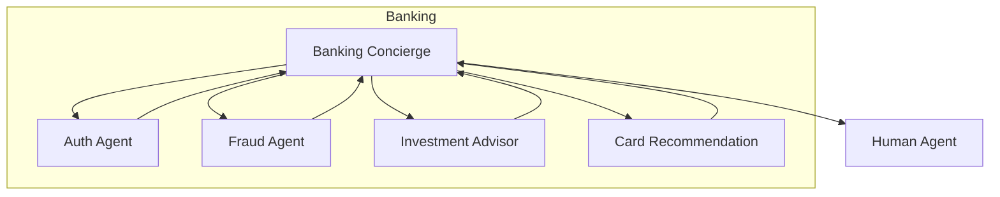
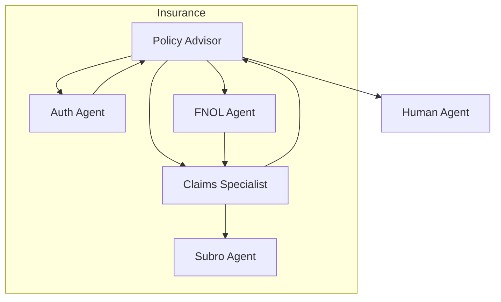

# Agent Documentation Breakdown - Per-Agent Context

**Created**: January 24, 2026  
**Companion to**: [docs_audit_plan.md](./docs_audit_plan.md)  
**Purpose**: Define focused context and documentation structure for each agent

---

## Agent Inventory (from codebase)

Current agents in `registries/agentstore/`:

| Agent | Folder | Industry | Entry Point |
|-------|--------|----------|-------------|
| AuthAgent | `auth_agent/` | All | No |
| BankingConcierge | `banking_concierge/` | Banking | Yes |
| CardRecommendation | `card_recommendation/` | Banking | No |
| ClaimsSpecialist | `claims_specialist/` | Insurance | No |
| ComplianceDesk | `compliance_desk/` | All | No |
| Concierge | `concierge/` | General | Yes |
| CustomAgent | `custom_agent/` | Template | No |
| DocumentAnalyst | `document_analyst/` | General | No |
| FNOLAgent | `fnol_agent/` | Insurance | No |
| FraudAgent | `fraud_agent/` | Banking | No |
| InvestmentAdvisor | `investment_advisor/` | Banking | No |
| PolicyAdvisor | `policy_advisor/` | Insurance | Yes |
| PriorAuthAgent | `prior_auth_agent/` | Healthcare | No |
| SubroAgent | `subro_agent/` | Insurance | No |

---

## Banking Domain Agents

### 1. BankingConcierge

**Purpose**: Entry point for banking scenarios. Routes customers to specialized agents.

**Documentation Focus:**
- First-contact interaction patterns
- Greeting customization
- Quick routing to specialized agents
- Authentication handoff patterns

**Key Configurations to Document:**
```yaml
handoff:
  trigger: "handoff_to_banking_concierge"
  is_entry_point: true
  type: announced     # Introduces itself before transferring
```

**Tool Permissions:**
- `handoff_to_auth_agent` - Security verification
- `handoff_to_fraud_agent` - Fraud concerns
- `handoff_to_investment_advisor` - Investment questions
- `handoff_to_card_recommendation` - Card products
- `handoff_to_human` - Escalation

**Handoff Graph Context:**


**Documentation Sections:**
1. Role & Purpose (concierge pattern, routing logic)
2. Greeting Templates (initial, return customer)
3. Available Handoffs (with trigger conditions)
4. Tool Access Matrix
5. Scenario Integration (Banking scenario config)

---

### 2. FraudAgent

**Purpose**: Handle fraud detection, investigation, and incident reporting.

**Documentation Focus:**
- Security-first responses
- Information gathering without alarming customer
- Escalation criteria
- Card blocking procedures

**Key Configurations to Document:**
```yaml
handoff:
  trigger: "handoff_to_fraud_agent"
  is_entry_point: false
  type: discrete     # No announcement (security)
  share_context: true
```

**Tool Permissions:**
- `get_recent_transactions` - Transaction review
- `block_card` - Immediate action
- `report_fraud_incident` - Documentation
- `handoff_to_human` - Complex cases

**Documentation Sections:**
1. Security Considerations (never reveal fraud suspicion prematurely)
2. Verification Steps (identity confirmation)
3. Action Authority (what agent can/cannot do)
4. Escalation Criteria (when to involve human)
5. Integration with ACS (call recording, compliance)

---

### 3. InvestmentAdvisor

**Purpose**: Provide investment guidance and portfolio management assistance.

**Documentation Focus:**
- Compliance disclaimers (not financial advice)
- Risk profiling questions
- Portfolio analysis capabilities
- Regulated language requirements

**Key Configurations to Document:**
```yaml
handoff:
  trigger: "handoff_to_investment_advisor"
  is_entry_point: false
  type: announced
```

**Tool Permissions:**
- `get_customer_portfolio` - Current holdings
- `get_market_data` - Market information
- `simulate_investment` - What-if scenarios
- `handoff_to_banking_concierge` - Return routing
- `handoff_to_human` - Complex advice

**Documentation Sections:**
1. Compliance Boundaries (regulatory constraints)
2. Risk Profiling Flow
3. Portfolio Tools & Data Access
4. Disclaimers (prompt template guidance)
5. Human Escalation Triggers

---

### 4. CardRecommendation

**Purpose**: Product recommendation for credit/debit cards.

**Documentation Focus:**
- Needs assessment questions
- Product matching logic
- Cross-sell/upsell boundaries
- Application initiation

**Key Configurations:**
```yaml
handoff:
  trigger: "handoff_to_card_recommendation"
  is_entry_point: false
  type: announced
```

**Tool Permissions:**
- `get_customer_profile` - Spending patterns
- `get_available_cards` - Product catalog
- `compare_cards` - Feature comparison
- `initiate_application` - Start process
- `handoff_to_banking_concierge` - Return

**Documentation Sections:**
1. Needs Assessment Framework
2. Product Catalog Integration
3. Comparison Presentation
4. Application Handoff
5. Cross-Sell Guidelines

---

## Insurance Domain Agents

### 5. PolicyAdvisor

**Purpose**: Entry point for insurance scenarios. Policy information and guidance.

**Documentation Focus:**
- Policy lookup and explanation
- Coverage questions
- Claim initiation routing
- Renewal assistance

**Key Configurations:**
```yaml
handoff:
  trigger: "handoff_to_policy_advisor"
  is_entry_point: true
  type: announced
```

**Tool Permissions:**
- `get_policy_details` - Policy lookup
- `explain_coverage` - Coverage explanation
- `handoff_to_claims_specialist` - Claims routing
- `handoff_to_fnol_agent` - New loss reporting
- `handoff_to_auth_agent` - Verification
- `handoff_to_human` - Escalation

**Handoff Graph Context:**


**Documentation Sections:**
1. Policy Lookup Flows
2. Coverage Explanation Templates
3. Claim Routing Logic
4. Authentication Requirements
5. Renewal Workflows

---

### 6. ClaimsSpecialist

**Purpose**: Handle existing claims inquiries and status updates.

**Documentation Focus:**
- Claim status lookup
- Documentation requirements
- Settlement discussions
- Dispute handling

**Key Configurations:**
```yaml
handoff:
  trigger: "handoff_to_claims_specialist"
  is_entry_point: false
  type: announced
```

**Tool Permissions:**
- `get_claim_status` - Status lookup
- `get_claim_documents` - Document list
- `submit_additional_docs` - Upload handling
- `handoff_to_subro_agent` - B2B handoff
- `handoff_to_policy_advisor` - Return
- `handoff_to_human` - Disputes

**Documentation Sections:**
1. Claim Lifecycle States
2. Document Requirements by Claim Type
3. Settlement Communication Guidelines
4. Dispute Escalation
5. Subro Handoff Criteria

---

### 7. FNOLAgent  

**Purpose**: First Notice of Loss - Capture initial incident details.

**Documentation Focus:**
- Information gathering checklist
- Urgency assessment
- Documentation initiation
- Claims routing

**Key Configurations:**
```yaml
handoff:
  trigger: "handoff_to_fnol_agent"
  is_entry_point: false
  type: announced
```

**Tool Permissions:**
- `create_claim` - Initiate claim record
- `capture_incident_details` - Structured intake
- `get_policy_for_loss` - Coverage verification
- `handoff_to_claims_specialist` - Continue claim
- `handoff_to_policy_advisor` - Return

**Documentation Sections:**
1. FNOL Information Checklist
2. Incident Type Classification
3. Urgency Indicators
4. Coverage Quick-Check
5. Handoff to Claims Workflow

---

### 8. SubroAgent

**Purpose**: B2B subrogation specialist for claim recovery.

**Documentation Focus:**
- B2B communication protocols
- Recovery procedures
- Settlement negotiations
- Compliance requirements

**Key Configurations:**
```yaml
handoff:
  trigger: "handoff_to_subro_agent"
  is_entry_point: false
  type: discrete     # B2B context
  b2b_restricted: true
```

**Tool Permissions:**
- `get_subro_case` - Case lookup
- `update_subro_status` - Status updates
- `calculate_recovery` - Amount calculations
- `handoff_to_claims_specialist` - Return
- `handoff_to_human` - Complex negotiations

**Documentation Sections:**
1. B2B Communication Protocols
2. Recovery Calculation Methods
3. Settlement Authority Limits
4. Compliance Documentation
5. Human Escalation for Disputes

---

## Cross-Domain Agents

### 9. AuthAgent

**Purpose**: Security verification across all industries.

**Documentation Focus:**
- Multi-factor verification flows
- Fraud detection integration
- Session security
- Progressive authentication

**Key Configurations:**
```yaml
handoff:
  trigger: "handoff_to_auth_agent"
  is_entry_point: false
  type: discrete     # Security - no announcement
  share_context: true
  return_caller: true  # Returns to calling agent
```

**Tool Permissions:**
- `verify_identity` - Identity check
- `send_otp` - OTP generation
- `validate_otp` - OTP verification
- `check_device_trust` - Device verification
- `flag_suspicious_activity` - Security flags
- (Return handoffs to any calling agent)

**Documentation Sections:**
1. Verification Methods (OTP, KBA, Device)
2. Security Question Flows
3. Fraud Detection Hooks
4. Session Security (timeout, lockout)
5. Return-to-Caller Pattern

---

### 10. Concierge

**Purpose**: Generic entry point for multi-industry scenarios.

**Documentation Focus:**
- Industry detection
- Routing logic
- Generic greeting patterns
- Fallback handling

**Key Configurations:**
```yaml
handoff:
  trigger: "handoff_to_concierge"
  is_entry_point: true
  type: announced
```

**Tool Permissions:**
- `detect_intent` - Intent classification
- `handoff_to_*` - All industry-specific agents
- `handoff_to_human` - Escalation

**Documentation Sections:**
1. Multi-Industry Routing
2. Intent Detection Logic
3. Greeting Customization
4. Fallback Handling
5. Escalation Criteria

---

### 11. ComplianceDesk

**Purpose**: Handle compliance-related inquiries and escalations.

**Documentation Focus:**
- Regulatory requirement explanations
- Compliance verification
- Issue escalation
- Documentation requirements

**Key Configurations:**
```yaml
handoff:
  trigger: "handoff_to_compliance_desk"
  is_entry_point: false
  type: announced
  requires_audit: true
```

**Tool Permissions:**
- `check_compliance_status` - Compliance checks
- `explain_regulation` - Regulatory info
- `log_compliance_inquiry` - Audit trail
- `handoff_to_human` - Escalation

**Documentation Sections:**
1. Compliance Query Types
2. Regulatory Reference Integration
3. Audit Trail Requirements
4. Escalation Workflows
5. Documentation Standards

---

### 12. DocumentAnalyst

**Purpose**: Document processing and analysis assistance.

**Documentation Focus:**
- Document type recognition
- Extraction capabilities
- Validation workflows
- Integration points

**Key Configurations:**
```yaml
handoff:
  trigger: "handoff_to_document_analyst"
  is_entry_point: false
  type: announced
```

**Tool Permissions:**
- `analyze_document` - Document analysis
- `extract_fields` - Field extraction
- `validate_document` - Document validation
- `summarize_document` - Document summary

**Documentation Sections:**
1. Supported Document Types
2. Analysis Capabilities
3. Integration with Other Agents
4. Error Handling
5. Quality Thresholds

---

## Healthcare Domain Agents

### 13. PriorAuthAgent

**Purpose**: Healthcare prior authorization processing.

**Documentation Focus:**
- Authorization workflow
- Medical necessity criteria
- Document requirements
- Appeal processes

**Key Configurations:**
```yaml
handoff:
  trigger: "handoff_to_prior_auth_agent"
  is_entry_point: false
  type: announced
  hipaa_compliant: true
```

**Tool Permissions:**
- `check_auth_status` - Authorization check
- `submit_prior_auth` - New authorization
- `get_medical_criteria` - Criteria lookup
- `handoff_to_human` - Complex cases

**Documentation Sections:**
1. HIPAA Compliance Considerations
2. Authorization Workflow
3. Medical Necessity Criteria
4. Document Requirements
5. Appeal Process

---

## Template Agent

### 14. CustomAgent

**Purpose**: Template for creating new agents.

**Documentation Focus:**
- Agent creation guide
- Configuration options
- Tool registration
- Testing checklist

**Documentation Sections:**
1. When to Create a Custom Agent
2. Configuration Template
3. Prompt Template Guidelines
4. Tool Registration
5. Testing & Validation

---

## Documentation Generation Plan

### Per-Agent Documentation Task Breakdown

For each agent, create documentation in this order:

1. **Extract Configuration** (15 min/agent)
   - Read `agent.yaml` for settings
   - Document handoff configuration
   - List tool permissions

2. **Map Handoff Routes** (15 min/agent)
   - Identify incoming handoffs
   - Identify outgoing handoffs
   - Create Mermaid diagram

3. **Summarize Prompt** (20 min/agent)
   - Read prompt template
   - Extract key behavioral directives
   - Identify boundary definitions

4. **Write Reference Page** (30 min/agent)
   - Use template from docs_audit_plan.md
   - Fill in all sections
   - Add cross-references

5. **Review & Link** (15 min/agent)
   - Verify accuracy against code
   - Add links to related docs
   - Update index page

**Total per agent:** ~1.5 hours  
**Total all 14 agents:** ~21 hours (3 focused days)

---

## Agent Documentation Assignable Tasks

### Task 1: Banking Agents (Day 1)
- [ ] BankingConcierge reference page
- [ ] FraudAgent reference page  
- [ ] InvestmentAdvisor reference page
- [ ] CardRecommendation reference page

### Task 2: Insurance Agents (Day 2)
- [ ] PolicyAdvisor reference page
- [ ] ClaimsSpecialist reference page
- [ ] FNOLAgent reference page
- [ ] SubroAgent reference page

### Task 3: Cross-Domain & Healthcare (Day 3)
- [ ] AuthAgent reference page
- [ ] Concierge reference page
- [ ] ComplianceDesk reference page
- [ ] DocumentAnalyst reference page
- [ ] PriorAuthAgent reference page
- [ ] CustomAgent reference page (template)

### Task 4: Integration (Day 4)
- [ ] Create reference index page
- [ ] Update industry docs with agent links
- [ ] Update architecture/agents/README.md
- [ ] Add to mkdocs.yml navigation

---

## Agent Context Isolation Principles

When documenting each agent, ensure **focused context** by:

1. **Single Responsibility**: Each agent page describes ONE agent only
2. **Clear Boundaries**: Explicitly state what the agent should NOT do
3. **Handoff Clarity**: Only document direct handoffs, not transitive routes
4. **Tool Scoping**: List only tools this agent has access to
5. **Scenario Binding**: List scenarios where this agent participates
6. **No Cross-Pollution**: Don't describe other agent behaviors in this agent's page

### Context Isolation Checklist

For each agent doc, verify:
- [ ] Does not describe other agents' internal behavior
- [ ] Does not document tools this agent doesn't have
- [ ] Does not include handoffs that skip this agent
- [ ] Does not mix prompt guidance from other agents
- [ ] Clearly states "out of scope" interactions

---

## Related Documentation Updates

When agent reference pages are complete, update:

1. **`docs/architecture/agents/README.md`**
   - Add link to reference index
   - Update agent framework overview
   - Remove any inline agent descriptions (link instead)

2. **`docs/architecture/registries/agents.md`**
   - Ensure configuration docs link to reference pages
   - Update YAML examples to match actual configs

3. **`docs/industry/*.md`**
   - Add "Agents" section with links to reference pages
   - Include industry-specific handoff graphs

4. **`docs/getting-started/quickstart.md`**
   - Add link to agent reference for customization

5. **`docs/index.md`**
   - Add prominent link to agent reference catalog

---

## Appendix: Agent Configuration Schema Reference

Document this schema in `docs/architecture/agents/configuration.md`:

```yaml
# Agent YAML Configuration Schema
name: string                    # Agent identifier
description: string             # Purpose description

model:
  deployment: string            # Azure OpenAI deployment name
  temperature: float            # 0.0-1.0
  max_tokens: int               # Response limit

handoff:
  trigger: string               # Tool name that routes TO this agent
  is_entry_point: boolean       # Can be first contact?
  type: "announced" | "discrete" # Transfer style
  share_context: boolean        # Share conversation history?
  return_caller: boolean        # Returns to calling agent?

voice:
  name: string                  # Azure TTS voice
  style: string                 # Voice style
  rate: string                  # Speech rate

tools: []                       # List of tool names
greeting: string                # Initial greeting template
return_greeting: string         # Returning customer greeting
```
