# Documentation Reorganization Plan

**Date:** January 24, 2026  
**Goal:** Reduce cognitive load in Architecture section while preserving depth

---

## Problem Analysis

### Current State (19 nav items in Architecture)

```
Architecture (19 items)
├── Overview · 1
├── Agents · 5 (Framework, Handoffs, Reference(12 agents), Registries(4))
├── Orchestration · 6 ← TOO MANY
├── Speech & Voice · 4 ← OVERLAP
├── Data · 2 ← SMALL
├── ACS · 2 ← OK
└── Telemetry · 1
```

### Issues Identified

| Section | Problem | User Impact |
|---------|---------|-------------|
| **Orchestration** | 6 separate pages with significant content overlap | Users must read multiple pages to understand one flow |
| **Speech & Voice** | Recognition/Synthesis pages 80% duplicated from README | Bloat, navigation fatigue |
| **Scenario Docs** | `industry-scenarios.md` + `scenario-system-flow.md` overlap heavily with README | Redundant reading |
| **Data** | Only 2 small pages, could be combined | Extra click for minimal content |

---

## Proposed Structure (13 nav items → 30% reduction)

```
Architecture (13 items)
├── Overview · 1
├── Agents · 5 (unchanged - Agent Reference is valuable)
│   ├── ART Agent Framework
│   ├── Handoff Strategies
│   ├── Agent Reference (catalog)
│   └── Registries
├── Orchestration · 3 ← CONSOLIDATED
│   ├── Overview (merge scenario docs into this)
│   ├── Orchestrators (cascade + voicelive combined)
│   └── Handoff Service (keep separate - important reference)
├── Speech & Voice · 2 ← CONSOLIDATED
│   ├── Streaming Modes (keep as-is)
│   └── Speech Services (STT+TTS combined)
├── Session & Data · 1 ← MERGED (was 2)
├── ACS Integration · 2 ← RENAMED
│   ├── Call Flows
│   └── Telephony Integration
└── Telemetry · 1
```

---

## Consolidation Details

### 1. Orchestration (6 → 3 pages)

#### DELETE: `industry-scenarios.md` 
**Reason:** Content already in README.md under "Scenario-Based Orchestration" section  
**Action:** Merge unique content into README, delete file

#### DELETE: `scenario-system-flow.md`
**Reason:** 90% overlap with README.md  
**Action:** Merge code examples into README "Scenario Lifecycle" section, delete file

#### MERGE: `cascade.md` + `voicelive.md` → `orchestrators.md`
**Reason:** Both follow identical structure; users comparing modes need side-by-side  
**New Structure:**
```markdown
# Orchestrators Reference

## Side-by-Side Comparison
| Feature | Cascade | VoiceLive |
|---------|---------|-----------|
...

## CascadeOrchestratorAdapter
### Quick Reference
### Configuration
### Turn Processing (condensed)

## LiveOrchestrator
### Quick Reference  
### Configuration
### Event Handling (condensed)

## Common Patterns
### Handoff Integration
### MemoManager Sync
```

#### KEEP: `handoff-service.md`
**Reason:** Important standalone reference, frequently linked

---

### 2. Speech & Voice (4 → 2 pages)

#### MERGE: `recognition.md` + `synthesis.md` → `speech-services.md`
**Reason:** Both are API references; current README covers high-level, these are details  
**New Structure:**
```markdown
# Speech Services Reference

## Speech Recognition (STT)
### Handler Integration Points
### StreamingSpeechRecognizerFromBytes (condensed)
### Configuration

## Speech Synthesis (TTS)  
### SpeechSynthesizer Class (condensed)
### Voice Configuration
### Styles & Prosody

## Common Configuration
### Authentication
### Pooling
### Tracing
```

#### DELETE: `voice/README.md` (if exists)
**Reason:** Merge into README.md or speech-services as "Voice Processing" section

---

### 3. Data (2 → 1 page)

#### MERGE: `README.md` + `flows.md` → Single `session-data.md`
**Reason:** flows.md is small, better as section in session management doc  
**New Structure:**
```markdown
# Session & Data Management

## MemoManager
### Core Memory
### Chat History
### Redis Persistence

## Data Flows
(content from flows.md)

## Session State Sync
(existing content)
```

---

## Verbosity Reduction Guidelines

### Code Example Consolidation

**Current Pattern (verbose):**
```python
# Full class definition
class MyClass:
    def __init__(self, ...):
        ...
    
    def method_one(self):
        """Full docstring."""
        ...
    
    # 50 more lines
```

**Target Pattern (reference-style):**
```python
# Key patterns only
adapter = CascadeOrchestratorAdapter.create(...)
result = await adapter.process_turn(context)
```

### Section Condensation Rules

1. **Move "how it works" details to code comments** in linked source files
2. **Replace sequential code blocks** with tabbed examples where possible
3. **Use tables** for configuration options instead of prose
4. **Link to source files** instead of duplicating implementation details

### Target Metrics

| Metric | Current | Target |
|--------|---------|--------|
| Orchestration pages | 6 | 3 |
| Speech pages | 4 | 2 |
| Data pages | 2 | 1 |
| Total Architecture items | 19 | 13 |
| Avg. page length | ~400 lines | ~250 lines |

---

## Implementation Order

```mermaid
gantt
    title Documentation Consolidation
    dateFormat X
    axisFormat %s
    
    section Phase 1 - Orchestration
    Merge scenario docs into README     :a1, 0, 1
    Create orchestrators.md             :a2, 1, 2
    Delete redundant files              :a3, 2, 3
    
    section Phase 2 - Speech
    Create speech-services.md           :b1, 3, 4
    Delete recognition.md, synthesis.md :b2, 4, 5
    
    section Phase 3 - Data
    Merge into session-data.md          :c1, 5, 6
    
    section Phase 4 - Navigation
    Update mkdocs.yml                   :d1, 6, 7
    Test all links                      :d2, 7, 8
```



---

## Files to Delete

| File | Reason |
|------|--------|
| `architecture/orchestration/industry-scenarios.md` | Merged into README |
| `architecture/orchestration/scenario-system-flow.md` | Merged into README |
| `architecture/orchestration/cascade.md` | Merged into orchestrators.md |
| `architecture/orchestration/voicelive.md` | Merged into orchestrators.md |
| `architecture/speech/recognition.md` | Merged into speech-services.md |
| `architecture/speech/synthesis.md` | Merged into speech-services.md |
| `architecture/data/flows.md` | Merged into README |

---

## New mkdocs.yml Navigation

```yaml
nav:
  - Architecture:
    - Overview: architecture/README.md
    - Agents:
      - ART Agent Framework: architecture/agents/README.md
      - Handoff Strategies: architecture/agents/handoffs.md
      - Agent Reference:
        - Catalog: architecture/agents/reference/index.md
        # ... agent pages unchanged
      - Registries:
        - Overview: architecture/registries/index.md
        - Agents: architecture/registries/agents.md
        - Tools: architecture/registries/tools.md
        - Scenarios: architecture/registries/scenarios.md
    - Orchestration:
      - Overview: architecture/orchestration/README.md  # Now includes scenarios
      - Orchestrators: architecture/orchestration/orchestrators.md  # Cascade + VoiceLive
      - Handoff Service: architecture/orchestration/handoff-service.md
    - Speech & Voice:
      - Streaming Modes: architecture/speech/README.md
      - Speech Services: architecture/speech/speech-services.md  # STT + TTS
    - Session & Data: architecture/data/README.md  # Merged with flows
    - ACS Integration:
      - Call Flows: architecture/acs/README.md
      - Telephony Integration: architecture/acs/integrations.md
    - Telemetry: architecture/telemetry.md
```

---

## Approval Checklist

- [ ] Phase 1: Orchestration consolidation
- [ ] Phase 2: Speech consolidation  
- [ ] Phase 3: Data consolidation
- [ ] Phase 4: Navigation update
- [ ] Phase 5: Link verification
