# ACS Barge-In Flow

This document describes the core event loop logic for handling barge-in interruptions in the ACS Media Handler.

## Architecture Overview

The barge-in system uses three threads to maintain low-latency interruption handling:

1. **Speech SDK Thread**: Continuous audio recognition, never blocks
2. **Route Turn Thread**: AI processing and response generation  
3. **Main Event Loop**: WebSocket handling and task coordination

```mermaid
graph TB
    subgraph SpeechSDK["Speech SDK Thread"]
        A1["Audio Recognition"]
        A2["on_partial → Barge-in"]
        A3["on_final → Queue Result"]
    end
    
    subgraph RouteLoop["Route Turn Thread"]
        B1["await queue.get()"]
        B2["AI Processing"]
        B3["TTS Generation"]
    end
    
    subgraph MainLoop["Main Event Loop"]
        C1["WebSocket Handler"]
        C2["Task Cancellation"]
        C3["Stop Audio Commands"]
    end
    
    %% Barge-in flag logic
    A2 -->|"Set barge-in flag (on_partial)"| C2
    A2 -->|"Set barge-in flag (on_partial)"| C3
    A3 -->|"Clear barge-in flag (on_final)"| B1
    A3 --> B1
    B3 --> C1
```

```mermaid
graph TB
    subgraph Physical["🖥️ Physical Thread Architecture"]
        subgraph SpeechSDKThread["🧵 Azure Speech SDK Thread"]
            direction TB
            A1["🎯 Speech SDK Core"] 
            A2["🔄 Continuous Recognition"]
            A3["⚡ on_partial callback<br/><small>🚨 IMMEDIATE - No Blocking</small>"]
            A4["✅ on_final callback<br/><small>📋 QUEUED - Non-Blocking</small>"]
            A5["❌ on_cancel callback"]
            
            A1 --> A2
            A2 --> A3
            A2 --> A4  
            A2 --> A5
        end
        
        subgraph RouteLoopThread["🧵 Route Turn Loop Thread"]
            direction TB
            B1["🔄 route_turn_loop()<br/><small>Separate Thread via threading.Thread</small>"]
            B2["await queue.get()<br/><small>🚫 BLOCKS until speech available</small>"]
            B3["🎯 Task Creation<br/><small>asyncio.create_task(route_and_playback)</small>"]

            B1 --> B2
            B2 --> B3
        end

        subgraph MainEventLoop["🧵 Main Event Loop (FastAPI/uvicorn)"]
            direction TB
            C2["📡 WebSocket Media Handler"]
            C3["🚫 _handle_barge_in_async<br/><small>⚡ Scheduled via run_coroutine_threadsafe</small>"]
            C4["📝 _handle_final_async<br/><small>📋 Scheduled via run_coroutine_threadsafe</small>"]
            C5["🎵 playback_task<br/><small>route_and_playback - Can be cancelled</small>"]
            C6["🛑 send_stop_audio"]
            
            C2 --> C5
        end
    end
    
    subgraph Logical["🔗 Cross-Thread Communication (Non-Blocking)"]
        direction LR
        D1["🎤 Speech Event"] 
        D2["🔗 run_coroutine_threadsafe<br/><small>Thread-safe async bridge</small>"]
        D3["📋 asyncio.Queue<br/><small>Thread-safe message passing</small>"]
        D4["⚡ Immediate Actions<br/><small>Barge-in detection</small>"]
        
        D1 --> D2
        D2 --> D3
        D2 --> D4
    end
    
    %% Cross-thread connections
    A3 -.->|"� IMMEDIATE<br/>run_coroutine_threadsafe"| C3
    A4 -.->|"� QUEUED<br/>run_coroutine_threadsafe"| C4
    C4 -.->|"📤 queue.put()"| B2
    C3 --> C6
    C3 -.->|"❌ playback_task.cancel()"| C5
    B3 -.->|"🎵 New Task Reference"| C5
    
    %% Styling for clarity
    classDef speechThread fill:#9B59B6,stroke:#6B3E99,stroke-width:3px,color:#FFFFFF
    classDef routeThread fill:#FF6B35,stroke:#E55100,stroke-width:3px,color:#FFFFFF  
    classDef mainThread fill:#4A90E2,stroke:#2E5C8A,stroke-width:3px,color:#FFFFFF
    classDef communication fill:#27AE60,stroke:#1E8449,stroke-width:2px,color:#FFFFFF
    classDef immediate fill:#E74C3C,stroke:#C0392B,stroke-width:2px,color:#FFFFFF
    
    class A1,A2,A3,A4,A5 speechThread
    class B1,B2,B3 routeThread
    class C1,C2,C3,C4,C5,C6 mainThread
    class D1,D2,D3 communication
    class D4 immediate
```





---

## 🔄➡️🧵 Architecture Evolution: From Parallel Overview to Thread Focus

The **Parallel Thread Architecture** diagram above provides a comprehensive view of all physical threads and their interconnections. This bird's-eye view shows how three distinct threads collaborate through non-blocking communication patterns.

### 🎯 Why Two Architectural Views?

1. **🔄 Parallel Thread Architecture (Above)**: 
   - **Purpose**: Complete system overview showing all thread interactions
   - **Focus**: Physical thread boundaries and cross-thread communication mechanisms
   - **Audience**: System architects and developers debugging complex threading issues

2. **🧵 Thread Architecture (Below)**:
   - **Purpose**: Simplified view emphasizing thread responsibilities and performance characteristics
   - **Focus**: Core design principles and operational flow
   - **Audience**: Developers implementing features or optimizing performance

### 🌉 Bridging the Views

Both diagrams represent the **same underlying system** but with different levels of detail:

- **Detailed Physical View** → Shows exact callback mechanisms (`on_partial`, `on_final`) and precise communication paths
- **Simplified Logical View** → Emphasizes thread roles, blocking behavior, and performance requirements

The transition from detailed to simplified helps you understand:
- 🔧 **How** the system works (detailed view)
- 🎯 **Why** it's designed this way (simplified view)

---

## 🧵 Thread Architecture & Non-Blocking Communication

### 🏗️ Three-Thread Architecture Design

The ACS Media Handler employs a **three-thread architecture** designed for **maximum responsiveness** and **clean separation of concerns**. Each thread has a specific role in ensuring uninterrupted voice interactions:

```mermaid
graph TB
    subgraph ThreadDesign["🖥️ Three-Thread Architecture"]
        subgraph SpeechSDK["🎤 Speech SDK Thread<br/><small>❌ Never Blocks</small>"]
            direction TB
            S1["🔄 Continuous Audio Recognition"]
            S2["⚡ on_partial → Immediate Barge-in"]
            S3["✅ on_final → Queue Speech Result"]
            
            S1 --> S2
            S1 --> S3
        end
        
        subgraph RouteLoop["🔄 Route Turn Thread<br/><small>✅ Blocks on Queue Only</small>"]
            direction TB
            R1["📥 await queue.get()"]
            R2["🤖 AI Processing (LLM + TTS)"]
            R3["🎵 Create Playback Task (TTS through ACS)"]
            
            R1 --> R2 --> R3
        end
        
        subgraph MainEvent["🌐 Main Event Loop<br/><small>❌ Never Blocks</small>"]
            direction TB
            M1["📡 WebSocket Media Handler"]
            M2["🚫 Barge-in Response"]
            M3["🛑 Task Cancellation"]
            
            M1 --> M2 --> M3
        end
    end
    
    %% Critical Communication Paths
    S2 -.->|"⚡ < 10ms<br/>run_coroutine_threadsafe"| M2
    S3 -.->|"📋 < 5ms<br/>queue.put()"| R1
    R3 -.->|"🎵 Task Reference"| M1
    M2 -.->|"❌ cancel()"| R2
    
    %% Performance indicators
    S2 -.->|"🛑 Stop Audio"| M3
    
    classDef speechStyle fill:#9B59B6,stroke:#6B3E99,stroke-width:3px,color:#FFFFFF
    classDef routeStyle fill:#FF6B35,stroke:#E55100,stroke-width:3px,color:#FFFFFF
    classDef mainStyle fill:#4A90E2,stroke:#2E5C8A,stroke-width:3px,color:#FFFFFF
    
    class S1,S2,S3 speechStyle
    class R1,R2,R3 routeStyle
    class M1,M2,M3 mainStyle
```



### 🎯 Design Principles

#### 🎤 **Speech Recognition Isolation**
- **Never blocks** on AI processing or network operations
- **Immediate response** to user voice input (< 10ms)
- **Continuous operation** regardless of system load

#### 🔄 **Dedicated AI Processing**
- **Isolated compute thread** for LLM and TTS generation
- **Safe cancellation** without affecting speech recognition
- **Controlled blocking** only on queue operations

#### 🌐 **WebSocket Responsiveness**
- **Always available** for real-time commands
- **Instant task management** for barge-in scenarios
- **Non-blocking operations** for media streaming

### 🎯 Thread Responsibility & Performance Matrix

| Thread | Primary Role | Blocking? | Barge-in Role | Response Time |
|--------|--------------|-----------|---------------|---------------|
| **🎤 Speech SDK** | Real-time audio recognition | ❌ Never | ✅ Detection | ⚡ < 10ms |
| **🔄 Route Turn** | AI processing & response | ✅ Queue only | ❌ None | 🎯 < 5s |
| **🌐 Main Event** | WebSocket & cancellation | ❌ Never | ✅ Execution | ⚡ < 50ms |

### 🚀 Key Non-Blocking Benefits

- **🎤 Speech Recognition Isolation**: Never blocked by AI processing, enables immediate barge-in detection
- **🔄 AI Processing Isolation**: Dedicated thread prevents blocking speech recognition or WebSocket handling  
- **🌐 WebSocket Responsiveness**: Always available for real-time commands and task cancellation
- **⚡ Cross-Thread Communication**: `run_coroutine_threadsafe()` and `asyncio.Queue` enable safe async bridging

## 🔄 Asynchronous Task Architecture

### 🎯 Three Core Processing Loops

#### 1. **Main Event Loop** (`route_turn_loop`)
```python
async def route_turn_loop():
    """Background task that processes finalized speech"""
    while True:
        # Blocks until final speech is available
        speech_result = await self.route_turn_queue.get()
        
        # Cancel any existing AI response
        if self.playback_task and not self.playback_task.done():
            self.playback_task.cancel()
        
        # Create new AI processing task
        self.playback_task = asyncio.create_task(
            self.route_and_playback(speech_result)
        )
```

#### 2. **Speech Recognition Thread** (Azure SDK Background)
```python
# SDK callbacks bridge to main event loop
def on_partial(text, confidence, language):
    """Immediate barge-in trigger - synchronous callback"""
    if self.playback_task:
        self.playback_task.cancel()  # Immediate cancellation
    self.send_stop_audio_command()

def on_final(text, confidence, language):
    """Queue final speech for AI processing"""
    try:
        self.route_turn_queue.put_nowait(speech_result)
    except asyncio.QueueFull:
        # Handle queue overflow gracefully
```

#### 3. **Playback Task** (`route_and_playback`)
```python
async def route_and_playback(speech_result):
    """Individual task for each AI response - can be cancelled"""
    try:
        # Process with AI agent
        response = await self.ai_agent.process(speech_result.text)
        
        # Generate and stream audio
        async for audio_chunk in self.tts_service.generate(response):
            await self.send_audio_to_acs(audio_chunk)
            
    except asyncio.CancelledError:
        # Clean cancellation from barge-in
        logger.info("🛑 Playback task cancelled by barge-in")
        raise  # Re-raise to complete cancellation
```

### ⚡ Barge-In Flow Interaction

1. **User Speaks During AI Response**
   - `on_partial()` callback fires immediately (< 10ms)
   - Synchronous cancellation of `playback_task`
   - Stop audio command sent to ACS

2. **Task Cancellation Chain**
   ```
   on_partial() → playback_task.cancel() → CancelledError raised
                                        → Clean task cleanup
                                        → ACS stops audio output
   ```

3. **New Speech Processing**
   - `on_final()` queues completed speech
   - `route_turn_loop` picks up queued speech
   - New `playback_task` created for fresh AI response

### 🔄 Queue-Based Serialization

The `route_turn_queue` ensures:
- **Sequential Processing**: Only one AI response generated at a time
- **Backpressure Handling**: Prevents memory overflow during rapid speech
- **Clean State Management**: Clear separation between speech input and AI processing

This architecture provides **sub-50ms barge-in response time** while maintaining clean async task lifecycle management.

---

## 🔄➡️⚙️ From Threading Model to Task Implementation

The **Thread Architecture** above establishes the **foundational design principles**, while the **Asynchronous Task Architecture** below dives into the **concrete implementation details**.

### 🌉 Implementation Bridge

**Threading Model** focuses on:
- 🏗️ **Structural design** → Which threads handle what responsibilities
- ⚡ **Performance requirements** → Response time guarantees for each thread
- 🔗 **Communication patterns** → How threads safely exchange data

**Task Implementation** focuses on:
- 🔧 **Code organization** → How async tasks are structured and managed
- 🔄 **Lifecycle management** → Task creation, cancellation, and cleanup
- 📋 **Queue mechanics** → How speech results flow through the system

This transition helps you understand:
- 🎯 **What** each thread should accomplish (threading model)
- 🛠️ **How** to implement those goals in Python asyncio (task implementation)

---
## 🔄 Non-Blocking Thread Communication Sequence


### 🚀 Critical Non-Blocking Characteristics

| Event | Thread Source | Target Thread | Blocking? | Communication Method | Response Time |
|-------|---------------|---------------|-----------|---------------------|---------------|
| **🚨 Barge-in Detection** | Speech SDK | Main Event Loop | ❌ NO | `run_coroutine_threadsafe` | < 10ms |
| **📋 Final Speech** | Speech SDK | Route Turn Thread | ❌ NO | `asyncio.Queue.put()` | < 5ms |
| **🎵 AI Processing** | Route Turn | Main Event Loop | ❌ NO | `asyncio.create_task` | < 1ms |
| **🛑 Task Cancellation** | Main Event Loop | Playback Task | ❌ NO | `task.cancel()` | < 1ms |

> **🎯 Key Insight**: Only the **Route Turn Thread** blocks (on `queue.get()`), ensuring Speech SDK and Main Event Loop remain responsive for real-time barge-in detection.

---

## 🔧 Key Implementation Details

### � Barge-In Detection

```mermaid
graph TB
    subgraph Isolation["� Thread Isolation Design"]
        subgraph Speech["🧵 Speech SDK Thread (Isolated)"]
            direction TB
            S1["🎯 Real-time Audio Processing"]
            S2["�🔄 Continuous Recognition Loop"]
            S3["⚡ Callback Triggers<br/><small>on_partial, on_final</small>"]
            S4["🚀 Cross-thread Scheduling<br/><small>run_coroutine_threadsafe</small>"]
            
            S1 --> S2 --> S3 --> S4
        end
        
        subgraph Route["🧵 Route Turn Thread (Isolated)"]
            direction TB
            R1["📥 Blocking Queue Operations<br/><small>await queue.get()</small>"]
            R2["🎯 AI Agent Processing<br/><small>LLM + TTS Generation</small>"]
            R3["🎵 Playback Task Creation<br/><small>asyncio.create_task</small>"]
            
            R1 --> R2 --> R3
        end
        
        subgraph Main["🧵 Main Event Loop (Isolated)"]
            direction TB
            M1["🌐 FastAPI WebSocket Server"]
            M2["📡 Real-time Message Handling"]
            M3["⚡ Barge-in Response<br/><small>Task cancellation</small>"]
            M4["🛑 ACS Stop Commands"]
            
            M1 --> M2 --> M3 --> M4
        end
    end
    
    subgraph Concurrent["🔄 Concurrent Operations (All Simultaneous)"]
        direction LR
        C1["🎤 Audio Recognition<br/><small>Never stops</small>"]
        C2["🧠 AI Processing<br/><small>Can be cancelled</small>"]  
        C3["📡 WebSocket Handling<br/><small>Always responsive</small>"]
        C4["🔄 Queue Management<br/><small>Thread-safe</small>"]
        
        C1 -.-> C2
        C1 -.-> C3
        C2 -.-> C3
        C2 -.-> C4
        C3 -.-> C4
    end
    
    %% Cross-thread communication (non-blocking)
    S4 -.->|"🚀 Non-blocking"| M3
    S4 -.->|"📋 Queue Put"| R1
    R3 -.->|"🎵 Task Reference"| M2
    M3 -.->|"❌ Task Cancel"| R2
    
    %% Performance indicators
    S1 -.->|"< 10ms"| M3
    M3 -.->|"< 1ms"| R2
    R1 -.->|"< 50ms"| M2
    
    classDef speechStyle fill:#9B59B6,stroke:#6B3E99,stroke-width:3px,color:#FFFFFF
    classDef routeStyle fill:#FF6B35,stroke:#E55100,stroke-width:3px,color:#FFFFFF
    classDef mainStyle fill:#4A90E2,stroke:#2E5C8A,stroke-width:3px,color:#FFFFFF
    classDef concurrentStyle fill:#27AE60,stroke:#1E8449,stroke-width:2px,color:#FFFFFF
    
    class S1,S2,S3,S4 speechStyle
    class R1,R2,R3 routeStyle
    class M1,M2,M3,M4 mainStyle
    class C1,C2,C3,C4 concurrentStyle
```



### 🎯 Thread Responsibility Matrix

| Thread | Primary Responsibility | Can Block? | Handles Barge-in? | Performance Critical? |
|--------|------------------------|------------|-------------------|----------------------|
| **🎤 Speech SDK** | Real-time audio recognition | ❌ Never | ✅ Detection only | ⚡ Ultra-high (< 10ms) |
| **🔄 Route Turn** | AI processing & response generation | ✅ On queue.get() | ❌ No | 🎯 Medium (< 5s) |
| **🌐 Main Event** | WebSocket & task management | ❌ Never | ✅ Action execution | ⚡ High (< 50ms) |

### 🚀 Non-Blocking Benefits

1. **🎤 Speech Recognition Isolation**
   - Runs independently of AI processing
   - Never blocked by slow LLM responses
   - Immediate barge-in detection capability

2. **🔄 AI Processing Isolation** 
   - Dedicated thread for compute-heavy operations
   - Can be safely cancelled without affecting speech
   - Queue-based serialization prevents race conditions

3. **🌐 WebSocket Responsiveness**
   - Always available for real-time commands
   - Immediate task cancellation capability
   - No blocking on network or AI operations

4. **⚡ Cross-Thread Communication**
   - `run_coroutine_threadsafe()` enables safe async bridging
   - `asyncio.Queue` provides thread-safe message passing
   - Task cancellation works across thread boundaries


## 🔧 Key Implementation Details

This section provides **concrete implementation specifics** for developers working with the ACS Media Handler threading architecture.

### 🚨 Barge-In Detection
- **Trigger**: `on_partial` callback from Speech Recognizer detects user speech
- **Immediate Action**: Synchronous cancellation of `playback_task` using `asyncio.Task.cancel()`
- **Stop Signal**: Send `{"Kind": "StopAudio", "StopAudio": {}}` JSON command to ACS via WebSocket
- **Logging**: Comprehensive logging with emojis for real-time debugging

### 🔄 Async Background Task Management
- **Route Turn Queue**: Serializes final speech processing using `asyncio.Queue()`
- **Playback Task**: Tracks current AI response generation/playback with `self.playback_task`
- **Task Lifecycle**: Clean creation, cancellation, and cleanup of background tasks
- **Cancellation Safety**: Proper `try/except asyncio.CancelledError` handling

### 🛑 Stop Audio Signal Protocol
```json
{
  "Kind": "StopAudio",
  "AudioData": null,
  "StopAudio": {}
}
```
This JSON message is sent to ACS to immediately halt any ongoing audio playback.

### ⚡ Error Handling & Resilience
- **Event Loop Detection**: Graceful handling when no event loop is available
- **WebSocket Validation**: Connection state checks before sending messages
- **Task Cancellation**: Proper cleanup with `await task` after cancellation
- **Queue Management**: Full queue detection and message dropping strategies

### 📊 Performance Optimizations
- **Immediate Cancellation**: Barge-in triggers instant playback stop (< 50ms)
- **Background Processing**: Non-blocking AI response generation
- **Memory Management**: Proper task cleanup prevents memory leaks
- **Concurrent Safety**: Thread-safe queue operations for speech processing
