# ACS Call Automation & Media Flows

> **Last Updated:** December 2025  
> **Related:** [Streaming Modes](../speech/README.md) | [Orchestration](../orchestration/README.md)

Comprehensive architecture for Azure Communication Services (ACS) media handling with real-time voice processing, barge-in detection, and event-driven call automation.

---

## Call Flow Overview

=== "Inbound Calls"

    **Inbound calls** are initiated by external callers dialing into the ART Agent. The streaming mode is determined by the `ACS_STREAMING_MODE` environment variable set at deployment.

    ```mermaid
    flowchart LR
        Caller([External Caller]) -->|Dials In| ACS[Azure Communication Services]
        
        ACS -->|1. IncomingCall Event| Events[Event Processor]
        Events -->|2. CallConnected| MemoMgr[(MemoManager)]
        
        ACS <-->|3. WebSocket Audio| Media[Media Handler]
        Media <-->|State Sync| MemoMgr
        
        Media --- Cascade[SpeechCascadeHandler]
        Media --- VoiceLive[VoiceLiveSDKHandler]
        
        Media -->|Audio Response| ACS
        ACS -->|Playback| Caller
    ```

    !!! info "Mode Selection"
        Inbound calls use the mode configured via `ACS_STREAMING_MODE` environment variable.
        All inbound calls to the same deployment use the same handler.

=== "Outbound Calls"

    **Outbound calls** are initiated from the ART Agent frontend UI. Users can select the streaming mode at runtime before placing the call.

    ```mermaid
    flowchart LR
        UI([Frontend UI]) -->|1. Place Call Request| API[ART Backend API]
        API -->|2. CreateCall| ACS[Azure Communication Services]
        
        ACS -->|3. CallConnected| Events[Event Processor]
        Events --> MemoMgr[(MemoManager)]
        
        ACS <-->|4. WebSocket Audio| Media[Media Handler]
        Media <-->|State Sync| MemoMgr
        
        Media --- Cascade[SpeechCascadeHandler]
        Media --- VoiceLive[VoiceLiveSDKHandler]
        
        Media -->|Audio Response| ACS
        ACS -->|Playback| Target([Target Phone])
    ```

    !!! tip "Runtime Mode Selection"
        Outbound calls allow **per-call mode selection** from the UI dropdown.
        This enables testing different handlers without redeploying.

---

## Event System Architecture

### V1 Event Processor

The event processor follows Azure's `CallAutomationEventProcessor` pattern for clean, performant event handling:

```python
# apps/artagent/backend/api/v1/events/

from apps.artagent.backend.api.v1.events import (
    get_call_event_processor,
    register_default_handlers,
    ACSEventTypes,
)

# Register handlers at startup
register_default_handlers()

# Process CloudEvents from ACS webhook
processor = get_call_event_processor()
result = await processor.process_events(cloud_events, request.app.state)
```

### Event Flow

```text
ACS Webhook → CloudEvent → V1 Processor → Handler Functions
     ↓              ↓            ↓              ↓
Raw JSON → Structured → Call Correlation → Business Logic
```

### Available Event Handlers

| Event Type | Handler | Purpose |
|------------|---------|---------|
| `CallConnected` | `handle_call_connected` | Initialize session, load profile |
| `CallDisconnected` | `handle_call_disconnected` | Cleanup, persist final state |
| `ParticipantsUpdated` | `handle_participants_updated` | Track call participants |
| `DtmfToneReceived` | `handle_dtmf_tone_received` | DTMF input handling |
| `PlayCompleted` | `handle_play_completed` | TTS completion tracking |
| `RecognizeCompleted` | `handle_recognize_completed` | Speech recognition results |

### Custom Handler Registration

```python
from apps.artagent.backend.api.v1.events import CallEventContext

async def my_custom_handler(context: CallEventContext) -> None:
    """Custom handler for call events."""
    event_data = context.get_event_data()
    
    if context.memo_manager:
        context.memo_manager.set_context("custom_field", "value")

processor = get_call_event_processor()
processor.register_handler(ACSEventTypes.DTMF_TONE_RECEIVED, my_custom_handler)
```

---

## Three-Thread Architecture

The SpeechCascade handler uses a three-thread architecture for optimal performance:

```mermaid
graph TB
    subgraph SpeechSDK["🎤 Speech SDK Thread"]
        A1["Continuous Audio Recognition"]
        A2["on_partial → Barge-in Detection"]
        A3["on_final → Queue Speech Result"]
        A1 --> A2
        A1 --> A3
    end
    
    subgraph RouteLoop["🔄 Route Turn Thread"]
        B1["await speech_queue.get()"]
        B2["Orchestrator Processing"]
        B3["TTS Generation & Playback"]
        B1 --> B2 --> B3
    end
    
    subgraph MainLoop["🌐 Main Event Loop"]
        C1["WebSocket Media Handler"]
        C2["Barge-in Response"]
        C3["Task Cancellation"]
        C1 --> C2 --> C3
    end
    
    A2 -.->|"run_coroutine_threadsafe"| C2
    A3 -.->|"queue.put_nowait"| B1
    C2 -.->|"cancel()"| B2
```



### Thread Responsibilities

| Thread | Role | Blocking | Barge-in | Response Time |
|--------|------|----------|----------|---------------|
| **Speech SDK** | Audio recognition | ❌ Never | Detection | < 10ms |
| **Route Turn** | AI processing | Queue only | — | Variable |
| **Main Event** | WebSocket coordination | ❌ Never | Execution | < 50ms |

---

## Barge-In Detection Flow


### Stop Audio Protocol

```json
{
  "Kind": "StopAudio",
  "AudioData": null,
  "StopAudio": {}
}
```

---

## Handler Integration

### SpeechCascadeHandler

```python
# apps/artagent/backend/voice/speech_cascade/handler.py

class SpeechCascadeHandler:
    """
    Three-Thread Architecture for low-latency voice processing.
    
    🧵 Thread 1: Speech SDK Thread
    - Continuous audio recognition
    - Barge-in detection via on_partial callbacks
    - Cross-thread communication via run_coroutine_threadsafe
    
    🧵 Thread 2: Route Turn Thread
    - AI processing through CascadeOrchestratorAdapter
    - Queue-based turn serialization
    
    🧵 Thread 3: Main Event Loop
    - WebSocket handling
    - Task cancellation coordination
    """
```

### VoiceLiveSDKHandler

```python
# apps/artagent/backend/voice/voicelive/handler.py

class VoiceLiveSDKHandler:
    """
    Event-driven handler for OpenAI Realtime API.
    
    - Direct audio streaming to VoiceLive connection
    - Server-side VAD (no separate barge-in handling)
    - Event-based response processing
    """
```

---

## Call Lifecycle

### Incoming Call Flow


### Call Disconnection

```python
async def handle_call_disconnected(context: CallEventContext) -> None:
    """Clean up resources on call end."""
    # Cancel pending persist tasks
    if context.memo_manager:
        context.memo_manager.cancel_pending_persist()
        # Final sync persist
        await context.memo_manager.persist_to_redis_async(redis_mgr)
    
    # Release pool resources
    if context.stt_client:
        await stt_pool.release(context.stt_client)
    if context.tts_client:
        await tts_pool.release(context.tts_client)
```

---

## Performance Characteristics

### Cross-Thread Communication

| Event | Source | Target | Method | Latency |
|-------|--------|--------|--------|---------|
| Barge-in | Speech SDK | Main Loop | `run_coroutine_threadsafe` | < 10ms |
| Final Speech | Speech SDK | Route Turn | `asyncio.Queue.put()` | < 5ms |
| Task Cancel | Main Loop | Playback | `task.cancel()` | < 1ms |

### Resource Pooling

| Resource | Pool Type | Acquisition | Release |
|----------|-----------|-------------|---------|
| STT Client | `AzureSpeechRecognizerPool` | Per-call | On disconnect |
| TTS Client | `AzureSpeechSynthesizerPool` | Per-call | On disconnect |
| WebSocket | Connection Manager | On connect | On disconnect |

---

## Configuration

### Environment Variables

| Variable | Default | Description |
|----------|---------|-------------|
| `ACS_STREAMING_MODE` | `media` | Handler mode selection |
| `ACS_CALLBACK_URL` | — | Webhook URL for ACS events |
| `ACS_CONNECTION_STRING` | — | ACS resource connection string |
| `STT_PROCESSING_TIMEOUT` | `30` | Speech recognition timeout (seconds) |

### Event Processor Configuration

```python
# Register handlers at app startup
from apps.artagent.backend.api.v1.events import register_default_handlers

@app.on_event("startup")
async def startup():
    register_default_handlers()
```

---

## Troubleshooting

### Common Issues

**Barge-in Not Working:**
- Check Speech SDK thread is running
- Verify `on_partial` callback is registered
- Ensure `run_coroutine_threadsafe` has valid event loop

**Audio Playback Not Stopping:**
- Verify `StopAudio` command format
- Check WebSocket connection state
- Confirm playback task reference is tracked

**Event Handler Not Called:**
- Ensure `register_default_handlers()` called at startup
- Verify CloudEvent format matches expected structure
- Check event type spelling matches `ACSEventTypes`

### Debug Logging

```bash
export LOG_LEVEL=DEBUG

# Specific component logging
python -c "
import logging
logging.getLogger('api.v1.events').setLevel(logging.DEBUG)
logging.getLogger('v1.handlers.speech_cascade_handler').setLevel(logging.DEBUG)
"
```

---

## Related Documentation

- [Streaming Modes](../speech/README.md) - Handler selection by mode
- [Cascade Orchestrator](../orchestration/cascade.md) - SpeechCascade processing
- [VoiceLive Orchestrator](../orchestration/voicelive.md) - VoiceLive processing
- [Session Management](../data/README.md) - MemoManager patterns
- [Microsoft Learn: Audio Streaming](https://learn.microsoft.com/en-us/azure/communication-services/how-tos/call-automation/audio-streaming-quickstart)
