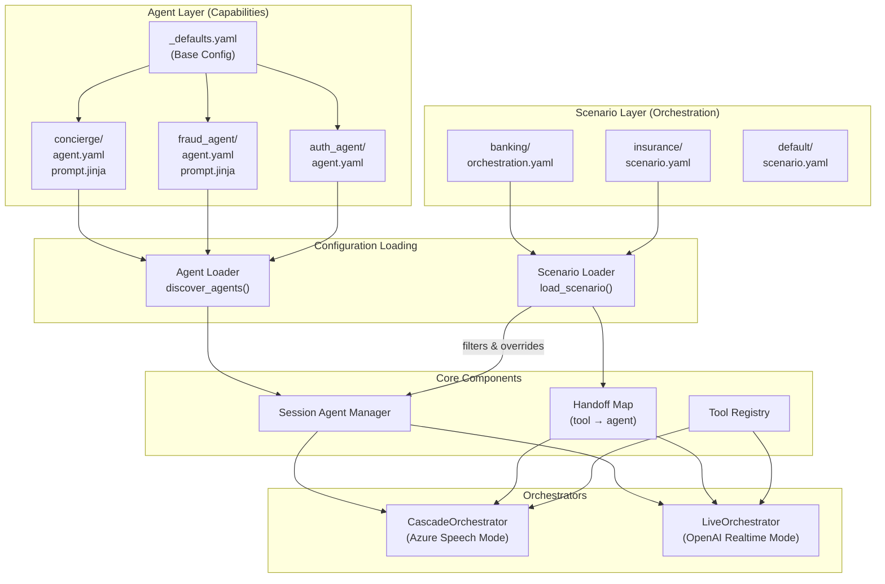
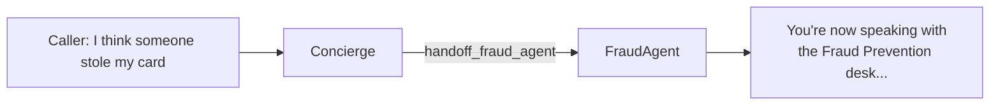

# Agent Framework

This document describes the **ART Voice Agent Accelerator's custom agent framework** — a purpose-built, YAML-driven agent configuration system designed specifically for real-time voice applications. This framework is **not** the Microsoft Semantic Kernel Agent Framework or Azure AI Agent Service; it is a specialized implementation optimized for low-latency multi-agent orchestration over voice channels.

!!! tip "Looking for Industry Examples?"
    See [Industry Solutions](../../industry/README.md) for complete scenario walkthroughs:
    
    - [Banking](../../industry/banking.md) — Concierge-led private banking
    - [Insurance](../../industry/insurance.md) — Security-first claims processing
    - [Healthcare](../../industry/healthcare.md) — Nurse triage and escalation

---

## Why a Custom Framework?

The agent framework in this accelerator was designed with specific requirements that differentiate it from general-purpose agent frameworks:

| Requirement | Our Framework | General-Purpose Frameworks |
|-------------|---------------|---------------------------|
| **Voice-First** | Native TTS/STT configuration per agent | Requires custom integration |
| **Sub-Second Handoffs** | In-memory handoff map lookups | Often requires external routing |
| **Orchestrator-Agnostic** | Works with SpeechCascade & VoiceLive | Typically bound to one runtime |
| **YAML Configuration** | Declarative, no-code agent definition | Usually code-first |
| **Session-Level Overrides** | Runtime prompt/voice/tool modification | Static configurations |
| **Centralized Tool Registry** | Shared tools across all agents | Per-agent tool duplication |
| **Scenario-Driven Handoffs** | Orchestration logic externalized to scenarios | Embedded in agent code |

### Key Design Principles

1. **Declarative Configuration** — Agents are defined in YAML files, enabling non-developers to modify agent behavior
2. **Orchestrator Independence** — The same agent definition works with both SpeechCascade (streaming Azure Speech) and VoiceLive (OpenAI Realtime API)
3. **Hot-Swap Capable** — Session-level overrides allow runtime modification without redeployment
4. **Inheritance Model** — Defaults cascade from `_defaults.yaml` to individual agents
5. **Centralized Tools** — Shared tool registry prevents duplication and ensures consistency
6. **Scenario-Based Orchestration** — Handoff routing is defined in scenarios, not agents, enabling the same agent to behave differently across use cases

---

## Architecture Overview

The framework follows a **layered architecture** separating agents, scenarios, and tools:



### Key Insight: Separation of Concerns

| Layer | Responsibility | Location |
|-------|---------------|----------|
| **Scenarios** | Define *which* agents participate and *how* handoffs behave | `registries/scenariostore/` |
| **Agents** | Define *what* an agent does (tools, prompts, voice) | `registries/agentstore/` |
| **Tools** | Define *capabilities* shared across agents | `registries/toolstore/` |

This separation means:
- **Agents are reusable** — The same `FraudAgent` can be used in banking or insurance scenarios
- **Handoff behavior is contextual** — A handoff can be "announced" in one scenario and "discrete" in another
- **Scenarios are composable** — Mix and match agents for different use cases

---

## Directory Structure

```text
apps/artagent/backend/registries/
├── agentstore/                      # Agent definitions
│   ├── __init__.py
│   ├── base.py                      # UnifiedAgent dataclass & HandoffConfig
│   ├── loader.py                    # discover_agents(), build_handoff_map()
│   ├── session_manager.py           # Per-session overrides & persistence
│   ├── _defaults.yaml               # Inherited defaults for all agents
│   │
│   ├── concierge/                   # Entry-point agent (Erica)
│   │   ├── agent.yaml               # Agent configuration
│   │   └── prompt.jinja             # Jinja2 prompt template
│   │
│   ├── fraud_agent/                 # Fraud detection specialist
│   │   ├── agent.yaml
│   │   └── prompt.jinja
│   │
│   ├── investment_advisor/          # Retirement & investment specialist
│   │   ├── agent.yaml
│   │   └── prompt.jinja
│   │
│   ├── auth_agent/                  # Authentication specialist
│   │   └── agent.yaml
│   │
│   └── ...                          # Other agents
│
├── scenariostore/                   # Scenario definitions
│   ├── loader.py                    # load_scenario(), get_handoff_config()
│   │
│   ├── banking/                     # Banking demo scenario
│   │   └── orchestration.yaml       # Agent selection & handoff routing
│   │
│   ├── insurance/                   # Insurance demo scenario
│   │   └── scenario.yaml
│   │
│   └── default/                     # Default scenario (all agents)
│       └── scenario.yaml
│
└── toolstore/                       # Centralized tool registry
    ├── __init__.py
    ├── registry.py                  # Core registration & execution
    ├── handoffs.py                  # Agent handoff tools
    ├── auth.py                      # Identity verification tools
    ├── banking.py                   # Account operations tools
    ├── fraud.py                     # Fraud detection tools
    └── ...                          # Other tool modules
```

---

## Core Components

### 1. UnifiedAgent Dataclass

The `UnifiedAgent` is the primary configuration object representing an agent. It is orchestrator-agnostic — the same agent definition works with both SpeechCascade and VoiceLive modes.

```python
@dataclass
class UnifiedAgent:
    """Orchestrator-agnostic agent configuration."""
    
    # Identity
    name: str                       # Unique agent name (e.g., "FraudAgent")
    description: str = ""           # Human-readable description
    
    # Greetings (Jinja2 templates)
    greeting: str = ""              # Initial greeting when agent takes over
    return_greeting: str = ""       # Greeting when returning to this agent
    
    # Handoff Configuration
    handoff: HandoffConfig          # How other agents route to this one
    
    # Model Settings
    model: ModelConfig              # LLM deployment, temperature, etc.
    
    # Voice Settings (TTS)
    voice: VoiceConfig              # Azure TTS voice name, style, rate
    
    # Speech Recognition (STT)
    speech: SpeechConfig            # VAD settings, languages, diarization
    
    # Session Settings (VoiceLive-specific)
    session: Dict[str, Any]         # Realtime API session configuration
    
    # Prompt
    prompt_template: str = ""       # Jinja2 prompt template (system message)
    
    # Tools
    tool_names: List[str]           # References to shared tool registry
    
    # Template Variables
    template_vars: Dict[str, Any]   # Variables for Jinja2 rendering
```

**Key Methods:**

| Method | Description |
|--------|-------------|
| `get_tools()` | Returns OpenAI-compatible tool schemas from registry |
| `execute_tool(name, args)` | Executes a tool by name asynchronously |
| `render_prompt(context)` | Renders Jinja2 prompt with runtime context |
| `render_greeting(context)` | Renders greeting template for handoffs |
| `get_handoff_tools()` | Lists handoff tools this agent can call |

### 2. HandoffConfig

Defines how agents route to each other:

```python
@dataclass
class HandoffConfig:
    trigger: str = ""           # Tool name that routes TO this agent
    is_entry_point: bool = False  # Whether this is the default starting agent
```

**Example:** The FraudAgent declares `trigger: handoff_fraud_agent`, meaning when any agent calls the `handoff_fraud_agent` tool, control transfers to FraudAgent.

### 3. Configuration Inheritance

Agents inherit from `_defaults.yaml` with per-agent overrides:

```yaml
# _defaults.yaml
model:
  deployment_id: gpt-4o
  temperature: 0.7
  max_tokens: 4096

voice:
  name: en-US-ShimmerTurboMultilingualNeural
  type: azure-standard

session:
  modalities: [TEXT, AUDIO]
  tool_choice: auto
```

```yaml
# fraud_agent/agent.yaml - overrides only what's different
model:
  temperature: 0.6    # Lower for consistent investigation

voice:
  name: en-US-OnyxTurboMultilingualNeural  # Different persona
```

---

## Agent Configuration (YAML)

Each agent is defined in an `agent.yaml` file with the following structure:

```yaml
# concierge/agent.yaml
name: Concierge
description: Primary banking assistant - handles most customer needs

# Jinja2 greeting templates
greeting: |
  Hi {{ caller_name }}, I'm {{ agent_name | default('Erica') }}.
  Hi, I'm {{ agent_name | default('Erica') }}, your banking assistant.
  

return_greeting: |
  Welcome back. Is there anything else I can help with?

# Handoff configuration
handoff:
  trigger: handoff_concierge    # Tool name other agents call
  is_entry_point: true          # This is the default starting agent

# Model overrides (inherits from _defaults.yaml)
model:
  temperature: 0.7

# Voice configuration (Azure TTS)
voice:
  name: en-US-AvaMultilingualNeural
  rate: "-4%"

# Speech recognition settings
speech:
  vad_silence_timeout_ms: 800
  candidate_languages: [en-US, es-ES]

# VoiceLive session configuration
session:
  turn_detection:
    type: azure_semantic_vad
    silence_duration_ms: 720

# Tools from shared registry
tools:
  - verify_client_identity
  - get_account_summary
  - get_recent_transactions
  - handoff_fraud_agent
  - handoff_investment_advisor
  - escalate_human

# Prompt file reference
prompts:
  path: prompt.jinja
```

### Prompt Templates

Prompts use Jinja2 templating with runtime context injection:

```jinja2
{# prompt.jinja #}
You are **{{ agent_name | default('Erica') }}**, {{ institution_name }}'s banking concierge.


## 🔐 Authenticated Session
**Customer:** {{ session_profile.full_name }}
**Account Tier:** {{ session_profile.customer_intelligence.relationship_tier }}


## Available Actions

- {{ tool.name }}: {{ tool.description }}


## Handoff Routing
When customer mentions fraud → handoff_fraud_agent
When customer asks about retirement → handoff_investment_advisor
```

---

## Scenario Configuration

Scenarios define **which agents participate** and **how handoffs behave** for a specific use case. This separation allows the same agents to be reused across different scenarios with different orchestration logic.

### Why Scenarios?

| Without Scenarios | With Scenarios |
|-------------------|----------------|
| Handoff logic embedded in agents | Handoff logic externalized |
| Same behavior everywhere | Contextual behavior per use case |
| Changing routes = edit multiple agents | Changing routes = edit one scenario |
| Tight coupling between agents | Loose coupling, reusable agents |

### Scenario YAML Structure

```yaml
# registries/scenariostore/banking/orchestration.yaml

name: banking
description: Private banking customer service

# Starting agent for this scenario
start_agent: Concierge

# Agents included (empty = include all discovered agents)
agents:
  - Concierge
  - AuthAgent
  - InvestmentAdvisor
  - CardRecommendation

# Default handoff behavior for unlisted routes
handoff_type: announced

# Handoff configurations - directed edges in the agent graph
handoffs:
  - from: Concierge
    to: AuthAgent
    tool: handoff_to_auth
    type: announced           # Auth is sensitive - always greet

  - from: Concierge
    to: InvestmentAdvisor
    tool: handoff_investment_advisor
    type: discrete            # Seamless handoff

  - from: InvestmentAdvisor
    to: Concierge
    tool: handoff_concierge
    type: discrete            # Returning - seamless

# Template variables applied to all agents
agent_defaults:
  company_name: "Private Banking"
  industry: "banking"
```

### Handoff Types

| Type | Behavior | Use Case |
|------|----------|----------|
| `announced` | Target agent greets the user | Sensitive operations, clear transitions |
| `discrete` | Target agent continues naturally | Seamless specialist routing, returning |

### Loading Scenarios

```python
from registries.scenariostore.loader import (
    load_scenario,
    build_handoff_map_from_scenario,
    get_handoff_config,
    get_scenario_agents,
)

# Load scenario configuration
scenario = load_scenario("banking")

# Build handoff routing map
handoff_map = build_handoff_map_from_scenario("banking")
# → {"handoff_fraud_agent": "FraudAgent", ...}

# Get handoff behavior for a specific route
cfg = get_handoff_config("banking", "Concierge", "handoff_investment_advisor")
# → HandoffConfig(type="discrete", greet_on_switch=False)

# Get agents with scenario overrides applied
agents = get_scenario_agents("banking")
```

For detailed handoff documentation, see [Handoff Strategies](handoffs.md).

---

## Tool Registry

Tools are defined once in the central registry and referenced by name across agents.

### Registering a Tool

```python
# registries/toolstore/fraud.py
from registries.toolstore.registry import register_tool

analyze_transactions_schema = {
    "name": "analyze_recent_transactions",
    "description": "Analyze recent transactions for suspicious patterns",
    "parameters": {
        "type": "object",
        "properties": {
            "client_id": {"type": "string"},
            "days": {"type": "integer", "default": 30}
        },
        "required": ["client_id"]
    }
}

async def analyze_recent_transactions(args: Dict[str, Any]) -> Dict[str, Any]:
    """Analyze transactions for fraud patterns."""
    client_id = args.get("client_id")
    days = args.get("days", 30)
    # ... implementation
    return {"suspicious_count": 0, "flagged_transactions": []}

# Register at module load
register_tool(
    name="analyze_recent_transactions",
    schema=analyze_transactions_schema,
    executor=analyze_recent_transactions,
    tags={"fraud", "analysis"}
)
```

### Handoff Tools

Handoff tools are special — they return a standardized payload that orchestrators recognize:

```python
async def handoff_fraud_agent(args: Dict[str, Any]) -> Dict[str, Any]:
    return {
        "handoff": True,
        "target_agent": "FraudAgent",
        "message": "Let me connect you with our fraud specialist.",
        "handoff_summary": "Fraud investigation: unauthorized charge",
        "handoff_context": {
            "client_id": args.get("client_id"),
            "fraud_type": args.get("fraud_type"),
            "handoff_timestamp": datetime.utcnow().isoformat()
        }
    }
```

---

## Agent Discovery & Handoff Mapping

### Discovering Agents

```python
from apps.artagent.backend.agents.loader import discover_agents, build_handoff_map

# Auto-discover all agents from the agents/ directory
agents: Dict[str, UnifiedAgent] = discover_agents()
# → {"Concierge": UnifiedAgent(...), "FraudAgent": UnifiedAgent(...), ...}

# Build handoff routing map
handoff_map: Dict[str, str] = build_handoff_map(agents)
# → {"handoff_concierge": "Concierge", "handoff_fraud_agent": "FraudAgent", ...}
```

### Using Agents in Orchestrators

```python
# In CascadeOrchestrator or LiveOrchestrator
agent = agents[current_agent_name]

# Get OpenAI-compatible tool schemas
tools = agent.get_tools()

# Render system prompt with runtime context
system_prompt = agent.render_prompt({
    "caller_name": "John",
    "session_profile": session_data,
    "customer_intelligence": intel_data
})

# Check if a tool call is a handoff
if handoff_map.get(tool_name):
    target_agent = handoff_map[tool_name]
    # Execute handoff...
```

---

## Session-Level Overrides

The `SessionAgentManager` enables runtime modification of agent configurations without redeployment:

```python
from apps.artagent.backend.agents.session_manager import SessionAgentManager

# Create session manager
mgr = SessionAgentManager(
    session_id="session_123",
    base_agents=discover_agents(),
    memo_manager=memo
)

# Get agent with any session overrides applied
agent = mgr.get_agent("Concierge")

# Modify prompt at runtime
mgr.update_agent_prompt("Concierge", "You are now a Spanish-speaking assistant...")

# Modify voice
mgr.update_agent_voice("Concierge", VoiceConfig(name="es-ES-AlvaroNeural"))

# Modify available tools
mgr.update_agent_tools("Concierge", ["get_account_summary", "escalate_human"])

# Persist to Redis
await mgr.persist()
```

### Use Cases for Runtime Overrides

| Scenario | Override |
|----------|----------|
| A/B Testing | Different prompts for experiment variants |
| Language Switching | Different voice and prompt after language detection |
| Feature Flags | Enable/disable tools for specific users |
| Demo Mode | Simplified prompts for demonstrations |
| Emergency | Disable certain capabilities during incidents |

---

## Multi-Agent Handoff Patterns

### Tool-Based Handoffs (VoiceLive)

In VoiceLive mode, handoffs are executed as tool calls. When the LLM calls a handoff tool:

1. Orchestrator detects `handoff: True` in tool result
2. Session state is updated with `handoff_context`
3. Active agent switches to target
4. New agent's prompt is loaded with context
5. Greeting is spoken (if configured)



### State-Based Handoffs (SpeechCascade)

In SpeechCascade mode, handoffs use the `MemoManager` to persist agent state:

1. Tool execution returns handoff payload
2. Orchestrator writes to `memo_manager.handoff_pending`
3. State synchronizes via `sync_to_memo_manager()`
4. Next turn reads from `memo_manager` and switches agents

---

## Adding a New Agent

1. **Create agent directory:**

   ```bash
   mkdir apps/artagent/backend/agents/my_agent
   ```

2. **Create agent.yaml:**

   ```yaml
   name: MyAgent
   description: Description of what this agent does
   
   handoff:
     trigger: handoff_my_agent
   
   greeting: "You're now speaking with the My Agent specialist."
   
   tools:
     - some_tool
     - handoff_concierge  # Always include a way back
   
   prompts:
     path: prompt.jinja
   ```

3. **Create prompt.jinja:**

   ```jinja2
   You are {{ agent_name }}, a specialist in [domain].
   
   ## Your Responsibilities
   - Task 1
   - Task 2
   
   ## Available Tools
   
   - {{ tool.name }}
   
   ```

4. **Register handoff tool** (if needed by other agents):

   ```python
   # In tools/handoffs.py
   register_tool(
       "handoff_my_agent",
       handoff_my_agent_schema,
       handoff_my_agent,
       is_handoff=True
   )
   ```

5. **Add to parent agents' tools:**

   ```yaml
   # In concierge/agent.yaml
   tools:
     - handoff_my_agent  # Now Concierge can route here
   ```

---

## Comparison with Other Frameworks

| Feature | ART Agent Framework | Semantic Kernel Agents | Azure AI Agent Service |
|---------|---------------------|----------------------|----------------------|
| Configuration | YAML-first | Code-first | Portal/API |
| Voice Integration | Native | Plugin required | Limited |
| Handoff Latency | ~50ms in-memory | Varies | Service call |
| Session Overrides | Built-in | Custom | Limited |
| Deployment | Self-hosted | Self-hosted | Managed |
| Tool Definition | Centralized registry | Per-agent | Per-agent |
| Multi-orchestrator | SpeechCascade + VoiceLive | Single runtime | Single runtime |

---

## Best Practices

### Agent Design

- **Single Responsibility** — Each agent should have a clear, focused purpose
- **Clear Handoff Criteria** — Document when to route to each specialist
- **Return Path** — Always include `handoff_concierge` or equivalent to return to main agent
- **Minimal Tools** — Only include tools the agent actually needs

### Prompt Engineering

- **Use Jinja2 Conditionals** — Handle missing context gracefully
- **Provide Examples** — Show expected tool call patterns
- **Define Boundaries** — Explicitly state what the agent should NOT do
- **Voice Optimization** — Write for spoken delivery (short sentences, clear numbers)

### Performance

- **Lazy Load Tools** — Tools are loaded on first access, not at startup
- **Cache Agent Configs** — `discover_agents()` result can be cached
- **Minimize Handoffs** — Each handoff adds latency; route wisely
- **Use Discrete Handoffs** — Discrete handoffs are faster (no greeting TTS)

### Scenario Design

- **Start Simple** — Begin with a default scenario, add specialized ones as needed
- **Explicit Handoffs** — Define all expected routes; don't rely on defaults
- **Test Both Directions** — Ensure agents can return to their source
- **Match UX to Type** — Use `announced` for sensitive operations, `discrete` for seamless flow

---

## Related Documentation

- [Orchestration](../orchestration/README.md) — How orchestrators use agents
- [Handoff Strategies](handoffs.md) — Scenario-driven handoff patterns
- [Session Management](../data/README.md) — State persistence and recovery
- [Streaming Modes](../speech/README.md) — SpeechCascade vs VoiceLive comparison

---

## Quick Reference

### Key Imports

```python
# Agent loading
from registries.agentstore.loader import discover_agents, build_handoff_map

# Scenario loading
from registries.scenariostore.loader import (
    load_scenario,
    build_handoff_map_from_scenario,
    get_handoff_config,
    get_scenario_agents,
)

# Tool registry
from registries.toolstore.registry import execute_tool, get_tools_for_agent
```

### Common Operations

| Task | Code |
|------|------|
| Load all agents | `agents = discover_agents()` |
| Load scenario | `scenario = load_scenario("banking")` |
| Get handoff map | `handoff_map = build_handoff_map_from_scenario("banking")` |
| Check handoff type | `cfg = get_handoff_config("banking", "Concierge", "handoff_fraud")` |
| Render agent prompt | `prompt = agent.render_prompt(context)` |
| Get agent tools | `tools = agent.get_tools()` |
