# ART Agent Framework

:material-clock-fast: **5 min read** · :material-code-braces: **15 min** to create your first agent · :material-file-document: **YAML-first** config

---

## :material-bullseye: TL;DR — What You Need to Know

!!! success "The Big Picture"
    **Agents** are AI assistants defined in YAML. **Scenarios** wire them together. **Tools** give them abilities.
    
    ```
    Caller → Concierge → [handoff] → FraudAgent → [handoff] → Concierge
    ```

=== ":material-file-code: Create an Agent"

    ```yaml title="my_agent/agent.yaml"
    name: MyAgent
    description: Does something useful
    
    handoff:
      trigger: handoff_my_agent
    
    greeting: "Hi, I'm the specialist you need!"
    
    tools:
      - my_tool
      - handoff_concierge
    
    prompts:
      path: prompt.jinja
    ```

=== ":material-link-variant: Add to Scenario"

    ```yaml title="banking/orchestration.yaml"
    handoffs:
      - from: Concierge
        to: MyAgent
        tool: handoff_my_agent
        type: announced
    ```

=== ":material-play: Use in Code"

    ```python
    from registries.agentstore.loader import discover_agents
    
    agents = discover_agents()
    my_agent = agents["MyAgent"]
    prompt = my_agent.render_prompt({"caller_name": "John"})
    ```

---

## :material-compass: Quick Navigation

<div class="grid cards" markdown>

-   :material-account-group:{ .lg .middle } **Agent Reference**

    ---

    Browse all pre-built agents
    
    [:octicons-arrow-right-24: View Catalog](reference/index.md)

-   :material-transit-connection-variant:{ .lg .middle } **Handoff Strategies**

    ---

    How agents route to each other
    
    [:octicons-arrow-right-24: Learn Handoffs](handoffs.md)

-   :material-wrench:{ .lg .middle } **Tool Development**

    ---

    Create custom agent abilities
    
    [:octicons-arrow-right-24: Build Tools](../registries/tools.md)

-   :material-map:{ .lg .middle } **Scenarios**

    ---

    Wire agents together for use cases
    
    [:octicons-arrow-right-24: Configure Scenarios](../registries/scenarios.md)

</div>

---

## :material-head-question: What is this Framework?

!!! info "Not Semantic Kernel or Azure AI Agent Service"
    This is a **custom, voice-optimized framework** built specifically for real-time phone conversations. It prioritizes sub-second latency and YAML configuration over general-purpose flexibility.

### Why Custom?

=== ":material-microphone: Voice-First"

    | Feature | This Framework | General Frameworks |
    |---------|---------------|-------------------|
    | TTS/STT config | Built-in per agent | Custom integration |
    | Handoff latency | ~50ms in-memory | External routing |
    | Voice personas | YAML-configured | Code required |

=== ":material-cog: YAML-Driven"

    | Feature | This Framework | General Frameworks |
    |---------|---------------|-------------------|
    | Agent definition | YAML files | Code-first |
    | Handoff routing | Scenario files | Embedded in agents |
    | Runtime overrides | Built-in | Custom |

=== ":material-swap-horizontal: Multi-Orchestrator"

    | Feature | This Framework | General Frameworks |
    |---------|---------------|-------------------|
    | SpeechCascade | ✅ Native | ❌ N/A |
    | VoiceLive | ✅ Native | ❌ N/A |
    | Same agent YAML | ✅ Both modes | ❌ Separate configs |

??? abstract "Key Design Principles (Advanced)"

    1. **Declarative Configuration** — Agents are defined in YAML files, enabling non-developers to modify agent behavior
    2. **Orchestrator Independence** — The same agent definition works with both SpeechCascade (streaming Azure Speech) and VoiceLive (OpenAI Realtime API)
    3. **Hot-Swap Capable** — Session-level overrides allow runtime modification without redeployment
    4. **Inheritance Model** — Defaults cascade from `_defaults.yaml` to individual agents
    5. **Centralized Tools** — Shared tool registry prevents duplication and ensures consistency
    6. **Scenario-Based Orchestration** — Handoff routing is defined in scenarios, not agents, enabling the same agent to behave differently across use cases

---

## :material-layers: How It All Fits Together

!!! tip "Think of it like a Call Center"
    - **Agents** = Specialists (fraud, investments, customer service)
    - **Scenarios** = Call routing rules (who transfers to whom)
    - **Tools** = Skills agents can use (check balance, verify identity)

```mermaid
flowchart LR
    subgraph "📞 Caller Interaction"
        caller[Caller]
    end
    
    subgraph "🎯 Scenario Layer"
        scenario["banking/orchestration.yaml<br/><small>Defines routing rules</small>"]
    end
    
    subgraph "🤖 Agent Layer"
        concierge["Concierge<br/><small>Entry point</small>"]
        fraud["FraudAgent<br/><small>Specialist</small>"]
        invest["InvestmentAdvisor<br/><small>Specialist</small>"]
    end
    
    subgraph "🔧 Tool Layer"
        tools["Tool Registry<br/><small>Shared abilities</small>"]
    end
    
    caller --> scenario
    scenario --> concierge
    concierge -->|"handoff_fraud_agent"| fraud
    concierge -->|"handoff_investment"| invest
    fraud --> tools
    invest --> tools
```



### The Three Layers

| Layer | What It Does | Where It Lives |
|-------|-------------|----------------|
| :material-map: **Scenarios** | *Which* agents work together, *how* handoffs behave | `registries/scenariostore/` |
| :material-robot: **Agents** | *What* each agent does (prompts, voice, tools) | `registries/agentstore/` |
| :material-wrench: **Tools** | *Capabilities* shared across agents | `registries/toolstore/` |

!!! success "Why This Separation Matters"
    - **Reusable agents** — Same `FraudAgent` works in banking or insurance
    - **Contextual handoffs** — "announced" in one scenario, "discrete" in another
    - **Easy customization** — Change routing without touching agent code

---

## :material-folder-outline: Directory Structure

??? example "Click to expand full structure"

    ```text
    apps/artagent/backend/registries/
    ├── agentstore/                      # Agent definitions
    │   ├── __init__.py
    │   ├── base.py                      # UnifiedAgent dataclass & HandoffConfig
    │   ├── loader.py                    # discover_agents(), build_handoff_map()
    │   ├── session_manager.py           # Per-session overrides & persistence
    │   ├── _defaults.yaml               # Inherited defaults for all agents
    │   │
    │   ├── concierge/                   # Entry-point agent (Erica)
    │   │   ├── agent.yaml               # Agent configuration
    │   │   └── prompt.jinja             # Jinja2 prompt template
    │   │
    │   ├── fraud_agent/                 # Fraud detection specialist
    │   │   ├── agent.yaml
    │   │   └── prompt.jinja
    │   │
    │   └── ...                          # Other agents
    │
    ├── scenariostore/                   # Scenario definitions
    │   ├── loader.py                    # load_scenario(), get_handoff_config()
    │   │
    │   ├── banking/                     # Banking demo scenario
    │   │   └── orchestration.yaml       # Agent selection & handoff routing
    │   │
    │   └── default/                     # Default scenario (all agents)
    │       └── scenario.yaml
    │
    └── toolstore/                       # Centralized tool registry
        ├── __init__.py
        ├── registry.py                  # Core registration & execution
        ├── handoffs.py                  # Agent handoff tools
        └── ...                          # Other tool modules
    ```

**Quick reference:**

| You want to... | Look in... |
|----------------|-----------|
| Create a new agent | `agentstore/my_agent/` |
| Change handoff routing | `scenariostore/banking/orchestration.yaml` |
| Add a new tool | `toolstore/my_tools.py` |
| Change default voice | `agentstore/_defaults.yaml` |

---

## :material-school: Tutorial: Create Your First Agent

Follow these steps to add a new agent to the system.

### Step 1: Create the Agent Folder

```bash
mkdir -p apps/artagent/backend/registries/agentstore/support_agent
```

### Step 2: Create agent.yaml

```yaml title="support_agent/agent.yaml" linenums="1"
name: SupportAgent
description: Handles technical support questions

# How other agents route to this one
handoff:
  trigger: handoff_support_agent  # (1)!

# What to say when taking over
greeting: "Hi, I'm your technical support specialist. How can I help?"

# What to say when returning
return_greeting: "I'm back. What else can I help with?"

# Voice settings (Azure TTS)
voice:
  name: en-US-GuyNeural  # (2)!
  rate: "-2%"

# Tools this agent can use
tools:
  - search_knowledge_base
  - create_support_ticket
  - handoff_concierge  # (3)!

# Prompt template file
prompts:
  path: prompt.jinja
```

1. :material-information: Other agents call this tool name to transfer here
2. :material-microphone: Browse voices at [Azure TTS Gallery](https://speech.microsoft.com/portal/voicegallery)
3. :material-swap-horizontal: Always include a way to return to the main agent!

### Step 3: Create prompt.jinja

```jinja2 title="support_agent/prompt.jinja"
You are {{ agent_name | default('Alex') }}, a technical support specialist at {{ company_name | default('TechCorp') }}.

## Your Role
- Help customers troubleshoot technical issues
- Search the knowledge base for solutions
- Create support tickets when needed
- Escalate to human support for complex issues

## Guidelines
- Be patient and clear in explanations
- Confirm understanding before proceeding
- If you can't help, use `handoff_concierge` to return


Current customer: {{ customer_name }}

```

### Step 4: Register the Handoff Tool

```python title="registries/toolstore/handoffs.py"
# Add to existing handoffs.py file

handoff_support_agent_schema = {
    "name": "handoff_support_agent",
    "description": "Transfer to technical support specialist",
    "parameters": {
        "type": "object",
        "properties": {
            "issue_summary": {
                "type": "string",
                "description": "Brief summary of the technical issue"
            }
        },
        "required": ["issue_summary"]
    }
}

async def handoff_support_agent(args: dict) -> dict:
    return {
        "handoff": True,
        "target_agent": "SupportAgent",
        "message": "Connecting you to technical support...",
        "handoff_context": {
            "issue_summary": args.get("issue_summary", "")
        }
    }

# Register the tool
register_tool(
    name="handoff_support_agent",
    schema=handoff_support_agent_schema,
    executor=handoff_support_agent,
    tags={"handoff"}
)
```

### Step 5: Wire Up in a Scenario

```yaml title="scenariostore/default/scenario.yaml"
# Add to your scenario's handoffs section
handoffs:
  - from: Concierge
    to: SupportAgent
    tool: handoff_support_agent
    type: announced  # (1)!
```

1. :material-bullhorn: `announced` = agent greets user, `discrete` = seamless transition

### Step 6: Test It!

```python
from registries.agentstore.loader import discover_agents

agents = discover_agents()
assert "SupportAgent" in agents
print(f"✅ Found {len(agents)} agents")
```

---

## :material-cog: Configuration Deep Dive

??? info "UnifiedAgent Dataclass (Advanced)"

    The `UnifiedAgent` is the primary configuration object representing an agent:

    ```python
    @dataclass
    class UnifiedAgent:
        # Identity
        name: str                       # Unique agent name
        description: str = ""           # Human-readable description
        
        # Greetings (Jinja2 templates)
        greeting: str = ""              # Initial greeting
        return_greeting: str = ""       # Greeting when returning
        
        # Handoff Configuration
        handoff: HandoffConfig          # How to route here
        
        # Model Settings
        model: ModelConfig              # LLM deployment, temperature
        
        # Voice Settings (TTS)
        voice: VoiceConfig              # Azure TTS voice name, style, rate
        
        # Speech Recognition (STT)
        speech: SpeechConfig            # VAD settings, languages
        
        # Prompt
        prompt_template: str = ""       # Jinja2 system message
        
        # Tools
        tool_names: List[str]           # References to tool registry
    ```

    **Key Methods:**

    | Method | What It Does |
    |--------|-------------|
    | `get_tools()` | Returns OpenAI-compatible tool schemas |
    | `execute_tool(name, args)` | Runs a tool asynchronously |
    | `render_prompt(context)` | Renders Jinja2 prompt with variables |
    | `render_greeting(context)` | Renders greeting for handoffs |

### Configuration Inheritance

Agents inherit from `_defaults.yaml` — you only override what's different:

=== "_defaults.yaml (Base)"

    ```yaml
    model:
      deployment_id: gpt-4o
      temperature: 0.7
    
    voice:
      name: en-US-ShimmerTurboMultilingualNeural
    
    session:
      modalities: [TEXT, AUDIO]
    ```

=== "fraud_agent/agent.yaml (Override)"

    ```yaml
    # Only specify what's different!
    model:
      temperature: 0.6  # Lower = more consistent
    
    voice:
      name: en-US-OnyxTurboMultilingualNeural
    ```

---

## :material-file-cog: Agent YAML Reference

??? example "Full agent.yaml Example (Click to Expand)"

    ```yaml title="concierge/agent.yaml"
    name: Concierge
    description: Primary banking assistant - handles most customer needs

    # Jinja2 greeting templates
    greeting: |
      Hi {{ caller_name }}, I'm {{ agent_name | default('Erica') }}.
      Hi, I'm {{ agent_name | default('Erica') }}, your banking assistant.
      

    return_greeting: |
      Welcome back. Is there anything else I can help with?

    # Handoff configuration
    handoff:
      trigger: handoff_concierge
      is_entry_point: true

    # Model overrides
    model:
      temperature: 0.7

    # Voice (Azure TTS)
    voice:
      name: en-US-AvaMultilingualNeural
      rate: "-4%"

    # Speech recognition
    speech:
      vad_silence_timeout_ms: 800
      candidate_languages: [en-US, es-ES]

    # VoiceLive session settings
    session:
      turn_detection:
        type: azure_semantic_vad
        silence_duration_ms: 720

    # Tools from registry
    tools:
      - verify_client_identity
      - get_account_summary
      - handoff_fraud_agent
      - escalate_human

    # Prompt file
    prompts:
      path: prompt.jinja
    ```

### YAML Field Quick Reference

| Field | Required | Description |
|-------|----------|-------------|
| `name` | ✅ | Unique identifier |
| `description` | ❌ | Human-readable description |
| `handoff.trigger` | ✅ | Tool name that routes here |
| `handoff.is_entry_point` | ❌ | `true` for starting agent |
| `greeting` | ❌ | Jinja2 template for first greeting |
| `return_greeting` | ❌ | Greeting when returning |
| `tools` | ❌ | List of tool names |
| `prompts.path` | ❌ | Path to prompt.jinja file |
| `voice.name` | ❌ | Azure TTS voice name |
| `model.temperature` | ❌ | LLM temperature (0-1) |

### Prompt Templates (Jinja2)

Prompts use [Jinja2](https://jinja.palletsprojects.com/) for dynamic content:

```jinja2 title="prompt.jinja"
You are **{{ agent_name | default('Erica') }}**, a banking concierge.


## 🔐 Authenticated Session
**Customer:** {{ session_profile.full_name }}
**Tier:** {{ session_profile.relationship_tier }}


## Your Tools

- `{{ tool.name }}`: {{ tool.description }}


## Routing Rules
- Fraud concerns → use `handoff_fraud_agent`
- Investment questions → use `handoff_investment_advisor`
```

!!! tip "Jinja2 Basics"
    - `{{ variable }}` — Insert a value
    - `...` — Conditional content
    - `...` — Loop over items
    - `{{ var | default('fallback') }}` — Fallback if var is missing

---

## :material-transit-connection-variant: Scenario Configuration

Scenarios define **which agents work together** and **how handoffs behave**.

```yaml title="scenariostore/banking/orchestration.yaml"
name: banking
description: Private banking customer service

# Starting agent
start_agent: Concierge

# Agents included (empty = all)
agents:
  - Concierge
  - AuthAgent
  - FraudAgent
  - InvestmentAdvisor

# Default handoff type
handoff_type: announced

# Handoff routing rules
handoffs:
  - from: Concierge
    to: FraudAgent
    tool: handoff_fraud_agent
    type: announced       # (1)!

  - from: Concierge
    to: InvestmentAdvisor
    tool: handoff_investment_advisor
    type: discrete        # (2)!
```

1. :material-bullhorn: **announced** = Target agent greets the user ("Hi, I'm from the Fraud Prevention desk...")
2. :material-ghost: **discrete** = Seamless transition, no greeting

### Handoff Types at a Glance

| Type | User Experience | Use When |
|------|-----------------|----------|
| `announced` | "You're now speaking with our fraud specialist..." | Sensitive operations, clear transitions |
| `discrete` | Conversation continues naturally | Seamless routing, returning to previous agent |

:material-arrow-right: **Learn more:** [Handoff Strategies](handoffs.md)

---

## :material-magnify: How Agents Are Discovered

The framework automatically scans for agents at startup:

```mermaid
flowchart LR
    A[📁 agentstore/] --> B[🔍 Scan folders]
    B --> C{Has agent.yaml?}
    C -->|Yes| D[📄 Parse YAML]
    C -->|No| E[⏭️ Skip]
    D --> F[📝 Merge defaults]
    F --> G[🏗️ Build UnifiedAgent]
    G --> H[(Agent Registry)]
```



### Using the Registry

=== "Get One Agent"

    ```python
    from registries.agentstore.loader import get_agent
    
    concierge = get_agent("Concierge")
    print(concierge.voice.name)  # "en-US-AvaMultilingualNeural"
    ```

=== "Get All Agents"

    ```python
    from registries.agentstore.loader import discover_agents
    
    agents = discover_agents()
    for name, agent in agents.items():
        print(f"Agent: {name}, Tools: {len(agent.tool_names)}")
    ```

=== "Scenario Agents Only"

    ```python
    from registries.scenariostore.loader import get_scenario_agents
    
    banking_agents = get_scenario_agents("banking")
    ```

---

## :material-transit-transfer: Handoff Flow

```mermaid
sequenceDiagram
    participant U as 👤 User
    participant C as 🏦 Concierge
    participant F as 🕵️ FraudAgent
    participant T as 🛠️ Tools

    U->>C: "I think someone stole my card"
    C->>T: execute(handoff_fraud_agent)
    T-->>C: {handoff: true, target: FraudAgent}
    
    Note over C,F: Orchestrator triggers switch
    
    rect rgb(255, 245, 235)
        Note right of F: announced type
        F->>U: "I'm Alex from the Fraud desk..."
    end
```



??? info "How Handoff Tools Work"

    ```python title="registries/toolstore/handoffs.py"
    async def handoff_fraud_agent(args: dict) -> dict:
        return {
            "handoff": True,                    # Signals orchestrator
            "target_agent": "FraudAgent",       # Where to go
            "message": "Connecting you now...", # TTS message
            "handoff_context": {                # Passed to next agent
                "reason": args.get("reason", "")
            }
        }
    ```

---

## :material-cogs: Advanced Topics

??? abstract "Session-Level Overrides"

    Modify agent configs at runtime without redeployment:

    ```python
    from registries.agentstore.session_manager import SessionAgentManager

    mgr = SessionAgentManager(
        session_id="session_123",
        base_agents=discover_agents()
    )

    # Change voice at runtime
    mgr.update_agent_voice("Concierge", VoiceConfig(name="es-ES-AlvaroNeural"))

    # Change available tools
    mgr.update_agent_tools("Concierge", ["get_account_summary", "escalate_human"])
    ```

    | Use Case | Override |
    |----------|----------|
    | A/B Testing | Different prompts per variant |
    | Language Switch | New voice after detection |
    | Feature Flags | Enable/disable tools |
    | Emergency | Disable capabilities |

??? abstract "Multi-Orchestrator Pattern"

    ```mermaid
    flowchart TB
        subgraph "Same Agents, Different Modes"
            A[📁 Agent YAML] --> B[🎙️ SpeechCascade<br/>Azure Speech]
            A --> C[⚡ VoiceLive<br/>Realtime API]
        end
    ```

    Agents work with both orchestrators — the YAML config is the same!

---

## :material-frequently-asked-questions: FAQ

??? question "How do I add a tool to an existing agent?"
    Add the tool name to `tools:` in `agent.yaml`:
    ```yaml
    tools:
      - existing_tool
      - my_new_tool  # ← Add here
    ```

??? question "Can multiple agents share the same tool?"
    Yes — tools are in a central registry. Add the name to any agent's `tools:` list.

??? question "What if two agents have the same name?"
    The loader raises an error. Agent names must be unique.

??? question "How do I change the default voice for all agents?"
    Edit `registries/agentstore/_defaults.yaml`:
    ```yaml
    voice:
      name: en-US-JennyNeural  # New default
    ```

---

## :material-check-all: Best Practices

<div class="grid" markdown>

!!! success "Do"
    - **Single Responsibility** — One clear focus per agent
    - **Return Path** — Always include `handoff_concierge` or equivalent
    - **Minimal Tools** — Only what the agent actually needs
    - **Write for Voice** — Short sentences, spell out numbers

!!! failure "Don't"
    - **Don't overcomplicate** — Start simple, add agents as needed
    - **Don't forget context** — Pass handoff_context between agents
    - **Don't skip testing** — Verify handoff round-trips work
    - **Don't nest too deep** — Max 2-3 handoff hops from entry

</div>

---

## :material-link-variant: Related Documentation

<div class="grid cards" markdown>

-   :material-transit-connection:{ .lg .middle } **Handoff Strategies**

    ---

    Deep dive into handoff types and graph design

    [:octicons-arrow-right-24: Learn more](handoffs.md)

-   :material-hammer-wrench:{ .lg .middle } **Tool Development**

    ---

    Build custom tools for agents

    [:octicons-arrow-right-24: Create tools](../registries/tools.md)

-   :material-pencil-ruler:{ .lg .middle } **Scenario Design**

    ---

    Configure multi-agent workflows

    [:octicons-arrow-right-24: Design scenarios](../registries/scenarios.md)

-   :material-text-box-search:{ .lg .middle } **Prompt Engineering**

    ---

    Best practices for agent prompts

    [:octicons-arrow-right-24: Write prompts](prompts.md)

</div>

---

## :material-keyboard: Quick Reference

```python
# Agent loading
from registries.agentstore.loader import discover_agents, get_agent

# Scenario loading  
from registries.scenariostore.loader import load_scenario, get_scenario_agents

# Tool registry
from registries.toolstore.registry import execute_tool, get_tools_for_agent
```

| Task | Code |
|------|------|
| Load all agents | `agents = discover_agents()` |
| Load one agent | `agent = get_agent("Concierge")` |
| Get handoff map | `build_handoff_map_from_scenario("banking")` |
| Render prompt | `agent.render_prompt(context)` |
| Get agent tools | `agent.get_tools()` |
