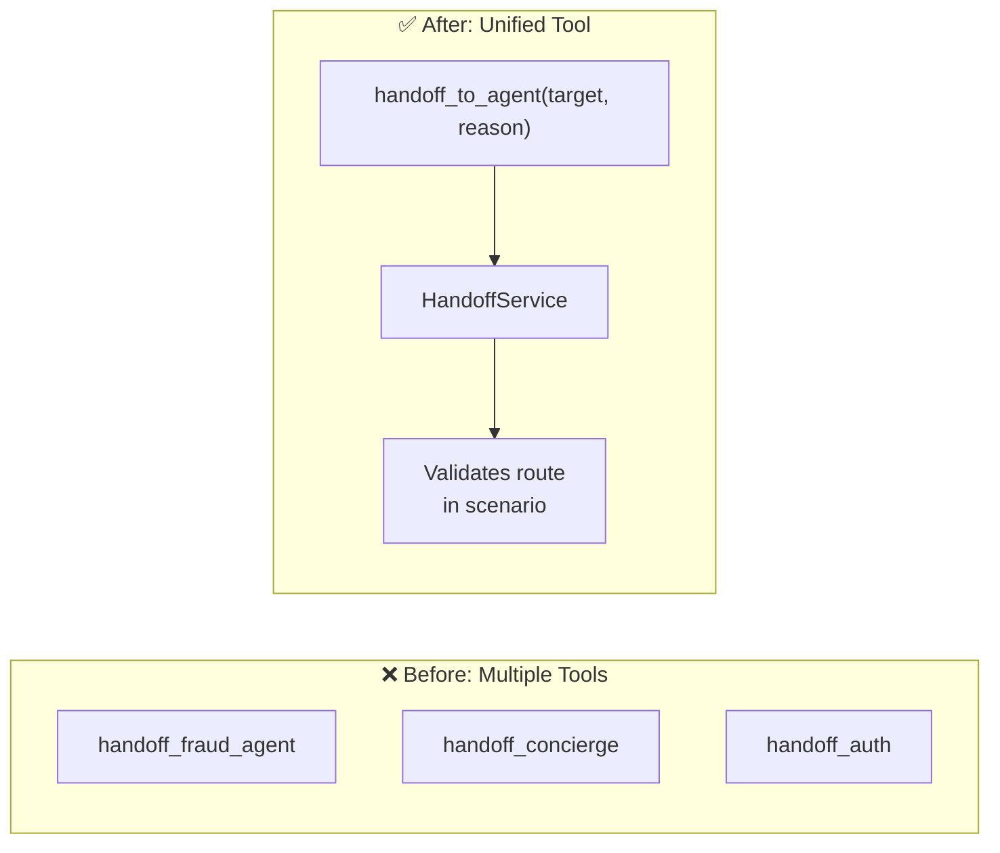
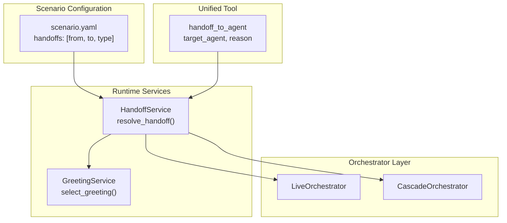
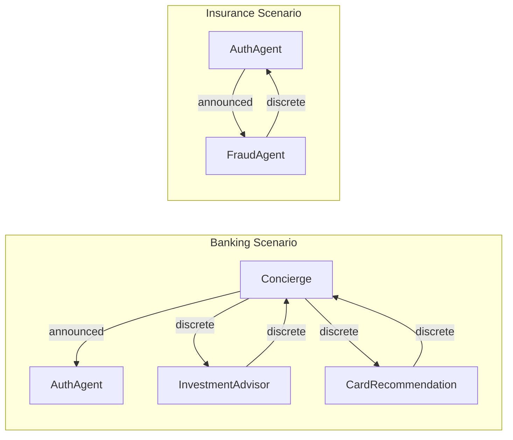
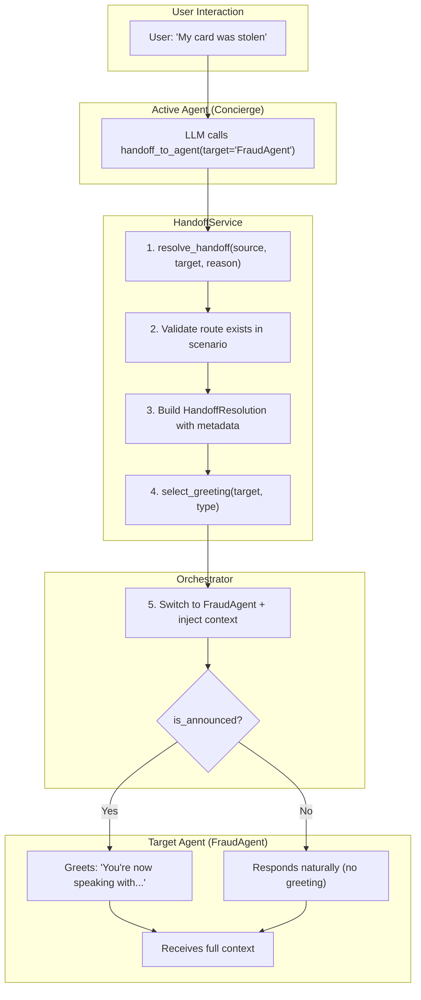
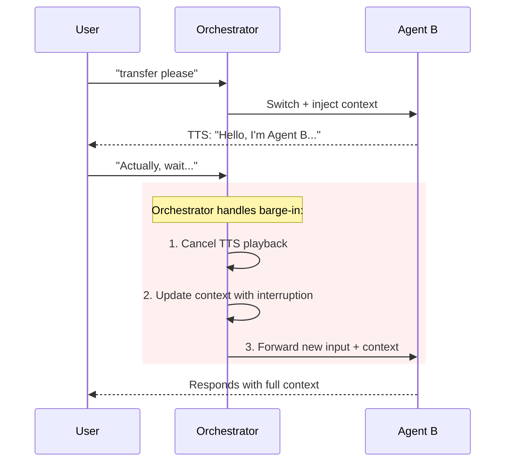

# Agent Handoff Strategies

> **Navigation**: [Architecture](../README.md) | [Orchestration](../orchestration/README.md) | [Agent Framework](README.md)

This document explains the **agent handoff system** in the ART Voice Agent Accelerator—how specialized agents transfer conversations to each other seamlessly across both orchestrator modes.
!!! example "See It In Practice"
    These concepts are demonstrated in the [Industry Solutions](../../industry/README.md):
    
    - **[Banking](../../industry/banking.md)** — Discrete handoffs for seamless specialist routing
    - **[Insurance](../../industry/insurance.md)** — Announced handoffs for security-first authentication
---

## Table of Contents

1. [Overview](#overview)
2. [Architecture: Scenario-Driven Handoffs](#architecture-scenario-driven-handoffs)
3. [How Scenarios Define Handoffs](#how-scenarios-define-handoffs)
4. [Handoff Types](#handoff-types)
5. [Advanced Features](#advanced-features) *(NEW)*
6. [Agent Configuration (Simplified)](#agent-configuration-simplified)
7. [Orchestrator Integration](#orchestrator-integration)
8. [Flow Diagrams](#flow-diagrams)
9. [Implementation Guide](#implementation-guide)
10. [Configuration Reference](#configuration-reference)

---

## Overview

In multi-agent voice systems, **handoffs** allow specialized agents to transfer conversations to each other. For example:
- A concierge agent routes to a fraud specialist when the customer reports suspicious activity
- An investment advisor escalates to compliance for regulatory questions

### The Current Model: Unified Handoffs

All handoffs use a **single `handoff_to_agent` tool** and a **unified `HandoffService`**:

| Benefit | Description |
|---------|-------------|
| **Single Tool** | One `handoff_to_agent(target_agent, reason)` for all transfers |
| **Scenario-Driven** | Routes defined in YAML, validated at runtime |
| **Auto-Prompts** | `handoff_condition` auto-generates agent instructions |
| **Context Passing** | `context_vars` with Jinja2 templating for dynamic data |
| **Unified Service** | `HandoffService` works identically for both orchestrators |



---

## Architecture: Scenario-Driven Handoffs

### Component Overview

| Component | Purpose | Location |
|-----------|---------|----------|
| **Scenario YAML** | Defines handoff routes as directed graph edges | `registries/scenariostore/<name>/` |
| **`ScenarioConfig`** | Parses scenario and builds handoff configurations | `scenariostore/loader.py` |
| **`HandoffConfig`** | Represents a single handoff route (from → to) | `scenariostore/loader.py` |
| **`HandoffService`** | **Unified handoff resolution for all orchestrators** | `voice/shared/handoff_service.py` |
| **`HandoffResolution`** | Result of handoff resolution with all metadata | `voice/shared/handoff_service.py` |
| **`GenericHandoffConfig`** | Enables dynamic `handoff_to_agent` routing | `scenariostore/loader.py` |

### Architecture Diagram



### Key Runtime Classes

```python
@dataclass
class HandoffResolution:
    """Result of HandoffService.resolve_handoff()"""
    success: bool
    target_agent: str | None
    source_agent: str | None
    tool_name: str | None
    system_vars: dict[str, Any]      # Includes handoff_context
    greet_on_switch: bool
    share_context: bool
    handoff_type: str                 # "announced" or "discrete"
    
    @property
    def is_discrete(self) -> bool: ...
    
    @property
    def is_announced(self) -> bool: ...
```

> **Key Insight**: All handoffs flow through a **unified `handoff_to_agent` tool** and **`HandoffService`**. Agents no longer need separate handoff tools—the scenario's `handoffs:` section defines valid routes.

---

## How Scenarios Define Handoffs

Scenarios define handoffs as **directed edges** in an agent graph. Each edge specifies:
- **FROM**: The source agent initiating the handoff
- **TO**: The target agent receiving the handoff
- **TOOL**: The tool name that triggers this route
- **TYPE**: How the transition should behave (announced vs discrete)

### Example: Banking Scenario

```yaml
# registries/scenariostore/banking/scenario.yaml

name: banking
description: Private banking customer service

# Starting agent
start_agent: Concierge

# Agents included in this scenario
agents:
  - Concierge
  - AuthAgent
  - InvestmentAdvisor
  - CardRecommendation

# Default handoff behavior for unlisted routes
handoff_type: announced

# Handoff configurations - directed edges in the agent graph
handoffs:
  # Concierge routes to specialists
  - from_agent: Concierge
    to_agent: AuthAgent
    type: announced           # Auth is sensitive - always greet
    handoff_condition: "User needs authentication or identity verification"
    
  - from_agent: Concierge
    to_agent: InvestmentAdvisor
    type: discrete            # Seamless handoff
    share_context: true
    handoff_condition: "User asks about investments, portfolios, or retirement"
    context_vars:
      portfolio_focus: "{{ session.profile.investment_tier }}"

  - from_agent: Concierge
    to_agent: CardRecommendation
    type: discrete            # Seamless handoff
    handoff_condition: "User interested in credit cards or card recommendations"

  # Specialists return to Concierge
  - from_agent: InvestmentAdvisor
    to_agent: Concierge
    type: discrete            # Returning - seamless
    handoff_condition: "Investment query completed or user changes topic"

  - from_agent: CardRecommendation
    to_agent: Concierge
    type: discrete            # Returning - seamless

# Template variables applied to all agents
agent_defaults:
  company_name: "Private Banking"
  industry: "banking"
```

!!! tip "The Unified Tool"
    All agents use the same **`handoff_to_agent(target_agent, reason)`** tool. The `handoffs:` section validates that the route is allowed.

### Example: Insurance Scenario

The same agents can behave differently in a different scenario:

```yaml
# registries/scenariostore/insurance/scenario.yaml

name: insurance
description: Insurance claims and policy management

start_agent: AuthAgent     # Different starting point!

agents:
  - AuthAgent
  - FraudAgent

handoffs:
  - from_agent: AuthAgent
    to_agent: FraudAgent
    type: announced           # Fraud is sensitive - announce
    handoff_condition: "User reports suspicious activity or potential fraud"

  - from_agent: FraudAgent
    to_agent: AuthAgent
    type: discrete            # Returning - seamless
    handoff_condition: "Fraud investigation complete"

agent_defaults:
  company_name: "Insurance Services"
  industry: "insurance"
```

### Handoff Graph Visualization



---

## Handoff Types

Scenarios support two handoff types that control the user experience:

### Announced Handoffs

The target agent **greets the user**, making the transition explicit:

```yaml
- from_agent: Concierge
  to_agent: AuthAgent
  type: announced
  handoff_condition: "User needs identity verification"
```

**User Experience:**
> **Concierge**: "Let me connect you with our authentication team."  
> **AuthAgent**: "I need to verify your identity before we continue. Let's get you authenticated."

**Use Cases:**
- Sensitive operations (authentication, fraud)
- Clear departmental transitions
- When user should know they're speaking to a specialist

### Discrete Handoffs

The target agent **continues naturally** without an explicit greeting:

```yaml
- from_agent: Concierge
  to_agent: InvestmentAdvisor
  type: discrete
  handoff_condition: "User asks about investments or portfolios"
```

**User Experience:**
> **Concierge**: "I'll help you with your retirement accounts."  
> **InvestmentAdvisor**: "Looking at your 401k, I see you have..."

**Use Cases:**
- Seamless specialist routing
- Returning to a previous agent
- When continuity matters more than acknowledgment

### Context Sharing

The `share_context` flag controls whether conversation context flows to the target:

```yaml
- from_agent: Concierge
  to_agent: FraudAgent
  type: announced
  share_context: true    # Default: true
```

When `true`, the target agent receives:
- `handoff_reason` — Why the handoff occurred
- `user_last_utterance` — What the user just said
- `session_profile` — Customer information
- `handoff_context` — Custom data from the source agent

---

## Advanced Features

### Automatic Prompt Injection (`handoff_condition`)

The `handoff_condition` field **auto-generates handoff instructions** in the agent's system prompt:

```yaml
handoffs:
  - from_agent: Concierge
    to_agent: InvestmentAdvisor
    type: discrete
    handoff_condition: "User asks about investments, portfolios, or retirement"
    
  - from_agent: Concierge
    to_agent: FraudAgent
    type: announced
    handoff_condition: "User reports suspicious transactions"
```

This generates instructions like:
```
When the following condition is met: "User asks about investments, portfolios, or retirement"
→ Call handoff_to_agent(target_agent="InvestmentAdvisor", reason="...")

When the following condition is met: "User reports suspicious transactions"
→ Call handoff_to_agent(target_agent="FraudAgent", reason="...")
```

!!! tip "No Manual Prompt Editing"
    With `handoff_condition`, you don't need to manually add handoff instructions to agent prompts. The `HandoffService` builds them automatically from the scenario.

### Context Variables (`context_vars`)

Pass extra context to the target agent using `context_vars` with **Jinja2 templating**:

```yaml
handoffs:
  - from_agent: Concierge
    to_agent: InvestmentAdvisor
    type: discrete
    context_vars:
      portfolio_tier: "{{ session.profile.investment_level }}"
      account_type: "{{ session.profile.account_type }}"
      priority_customer: "{{ session.profile.is_vip }}"
```

The target agent receives these as additional context variables in their prompt. Jinja2 templates are rendered at handoff time with access to:
- `session` — Current session data
- `profile` — User profile information
- `handoff_reason` — Why handoff was triggered

---

## Agent Configuration (Simplified)

With scenario-driven handoffs, **agents become simpler**. They only need to declare:
1. Their greeting/return_greeting — what to say on arrival
2. Their tools — business logic tools (handoffs are automatic)

### Example: Simplified Agent YAML

```yaml
# registries/agentstore/fraud_agent/agent.yaml

name: FraudAgent
description: Post-authentication fraud detection specialist

# Greetings - used when handoff type is "announced"
greeting: "You are now speaking with the Fraud Prevention desk. How can I help?"
return_greeting: "Welcome back to the Fraud Prevention desk."

# Tools this agent can use (business logic only)
tools:
  - analyze_recent_transactions
  - check_suspicious_activity
  - block_card_emergency
  - create_fraud_case
  - escalate_human

# Voice, model, prompt configuration...
voice:
  name: en-US-OnyxTurboMultilingualNeural

prompt: prompt.jinja
```

!!! note "Handoff Tool is Automatic"
    The `handoff_to_agent` tool is **automatically injected** based on the scenario's `handoffs:` section. You don't need to list it in the agent's tools.

### What Changed?

| Before (Old Model) | After (Current Model) |
|------------------------|------------------------|
| Agent lists specific handoff tools | Handoff tool auto-injected |
| Agent defines WHERE it can route | Scenario defines valid routes |
| Agent defines HOW handoffs behave | Scenario defines handoff behavior |
| Changing routes = edit agent YAML | Changing routes = edit scenario YAML |

### Agents Focus on Capabilities

Agents now focus on:

- ✅ What they're good at (description, prompt)
- ✅ What business tools they need (tools list)
- ✅ How they sound (voice, greetings)

Agents don't need to know:

- ❌ Which agents they'll work with
- ❌ Whether handoffs should be announced or discrete
- ❌ The overall conversation flow
- ❌ Which handoff tools to define

---

## Orchestrator Integration

Both orchestrators use the **`HandoffService`** for unified handoff resolution:

### Initialization

```python
from voice.shared.handoff_service import HandoffService

# Create handoff service (once per session)
handoff_service = HandoffService(
    scenario_config=scenario_config,  # From ScenarioStore
    session_id=session_id,
)
```

### The Unified Handoff Tool

All agents use a single `handoff_to_agent` tool:

```python
# Tool definition (auto-injected based on scenario)
def handoff_to_agent(target_agent: str, reason: str) -> str:
    """Transfer the conversation to another agent.
    
    Args:
        target_agent: Name of the agent to transfer to
        reason: Why this handoff is needed (for context)
    """
    pass  # Orchestrator intercepts this
```

### During Tool Execution

```python
async def _execute_tool_call(self, name: str, args: dict) -> None:
    # Check if this is the handoff tool
    if name == "handoff_to_agent":
        target_agent = args.get("target_agent")
        reason = args.get("reason", "")
        
        # Resolve handoff through service
        resolution = self._handoff_service.resolve_handoff(
            source_agent=self._active_agent_name,
            target_agent=target_agent,
            handoff_reason=reason,
        )
        
        if not resolution.success:
            # Invalid route - not allowed in scenario
            return {"error": f"Cannot handoff to {target_agent}"}
        
        # Select appropriate greeting
        greeting = self._handoff_service.select_greeting(
            target_agent=resolution.target_agent,
            is_return=...,  # Has user talked to this agent before?
            handoff_type=resolution.handoff_type,
        )
        
        # Execute the switch
        await self._switch_to(
            resolution.target_agent,
            resolution.system_vars,
            greet=resolution.is_announced,
            greeting_text=greeting,
        )
        return
    
    # Otherwise execute as business tool
    result = await execute_tool(name, args)
```

### VoiceLive vs Cascade

Both orchestrators share the same `HandoffService`:

| Aspect | VoiceLive | Cascade |
|--------|-----------|---------|
| Detection | Event loop intercepts `handoff_to_agent` | Tool-call loop checks tool name |
| Resolution | `handoff_service.resolve_handoff()` | Same |
| Greeting | `handoff_service.select_greeting()` | Same |
| Switch | Immediate via RealtimeAPI | State stored, applied next turn |
| TTS | Session update triggers playback | TTS queue receives greeting |

---

## Flow Diagrams

### Complete Handoff Lifecycle



**Context preserved through handoffs:**
- `session_profile` — Customer name, account info
- `handoff_reason` — Why the transfer occurred  
- `user_last_utterance` — What the user just said
- `handoff_context` — Custom data from source agent
- `context_vars` — Scenario-defined extra variables

### Barge-In During Handoff



> The orchestrator manages interruptions seamlessly—Agent B receives the updated context including the user's interruption.

---

## Implementation Guide

### Adding a New Agent to a Scenario

Adding a new agent involves **two simple steps**:

#### Step 1: Create the Agent

```yaml
# registries/agentstore/new_specialist/agent.yaml

name: NewSpecialistAgent
description: Specialist for new domain

greeting: "Hi, I'm the new specialist. How can I help?"
return_greeting: "Welcome back. What else can I help with?"

# Business tools only - handoffs are automatic
tools:
  - some_specialist_tool
  - another_business_tool

voice:
  name: en-US-ShimmerTurboMultilingualNeural

prompt: prompt.jinja
```

!!! note "No Handoff Tools Required"
    You don't need to list `handoff_to_agent` or create custom handoff tools. The scenario's `handoffs:` section handles routing automatically.

#### Step 2: Add to Scenario

```yaml
# registries/scenariostore/banking/scenario.yaml

agents:
  - Concierge
  - NewSpecialistAgent     # Add the new agent

handoffs:
  # ... existing handoffs ...
  
  # Add handoff routes for new agent
  - from_agent: Concierge
    to_agent: NewSpecialistAgent
    type: announced
    handoff_condition: "User asks about the new specialist domain"

  - from_agent: NewSpecialistAgent
    to_agent: Concierge
    type: discrete             # Returning - usually seamless
    handoff_condition: "Specialist query completed"
```

**That's it!** The `handoff_to_agent` tool is automatically available to Concierge with NewSpecialistAgent as a valid target.

### Creating a New Scenario

To create a new scenario with custom handoff behavior:

```yaml
# registries/scenariostore/healthcare/scenario.yaml

name: healthcare
description: Healthcare customer service

start_agent: ReceptionAgent

agents:
  - ReceptionAgent
  - NurseAgent
  - BillingAgent

handoff_type: announced     # Default for all handoffs

handoffs:
  # Reception routes to specialists
  - from_agent: ReceptionAgent
    to_agent: NurseAgent
    type: announced
    handoff_condition: "Patient has medical questions"
    
  - from_agent: ReceptionAgent
    to_agent: BillingAgent
  - from_agent: ReceptionAgent
    to_agent: BillingAgent
    type: discrete          # Billing is less formal
    handoff_condition: "Patient has billing or payment questions"
    
  # Specialists return to reception
  - from_agent: NurseAgent
    to_agent: ReceptionAgent
    type: discrete
    handoff_condition: "Medical questions answered"
    
  - from_agent: BillingAgent
    to_agent: ReceptionAgent
    type: discrete
    handoff_condition: "Billing questions resolved"

agent_defaults:
  company_name: "City Health Clinic"
  industry: "healthcare"
  hipaa_compliant: true
```

### Testing Handoffs

```python
# tests/test_scenario_handoffs.py
import pytest
from voice.shared.handoff_service import HandoffService
from registries.scenariostore.loader import load_scenario

def test_handoff_resolution():
    scenario_config = load_scenario("banking")
    handoff_service = HandoffService(
        scenario_config=scenario_config,
        session_id="test-session",
    )
    
    # Valid route should succeed
    resolution = handoff_service.resolve_handoff(
        source_agent="Concierge",
        target_agent="InvestmentAdvisor",
        handoff_reason="User wants investment advice",
    )
    
    assert resolution.success == True
    assert resolution.target_agent == "InvestmentAdvisor"
    assert resolution.is_discrete == True  # Type was "discrete"

def test_invalid_route():
    scenario_config = load_scenario("banking")
    handoff_service = HandoffService(
        scenario_config=scenario_config,
        session_id="test-session",
    )
    
    # Invalid route should fail
    resolution = handoff_service.resolve_handoff(
        source_agent="Concierge",
        target_agent="NonExistentAgent",
        handoff_reason="Test",
    )
    
    assert resolution.success == False

def test_announced_vs_discrete():
    scenario_config = load_scenario("banking")
    handoff_service = HandoffService(
        scenario_config=scenario_config,
        session_id="test-session",
    )
    
    # Auth should be announced
    auth_resolution = handoff_service.resolve_handoff("Concierge", "AuthAgent", "")
    assert auth_resolution.is_announced == True
    
    # Investment should be discrete
    invest_resolution = handoff_service.resolve_handoff("Concierge", "InvestmentAdvisor", "")
    assert invest_resolution.is_discrete == True
```

---

## Configuration Reference

### ScenarioConfig

The main configuration object for scenarios:

```python
@dataclass
class ScenarioConfig:
    name: str                                    # Scenario identifier
    description: str = ""                        # Human-readable description
    agents: list[str] = field(...)               # Agents included (empty = all)
    start_agent: str | None = None               # Initial agent
    handoff_type: str = "announced"              # Default: "announced" or "discrete"
    handoffs: list[HandoffConfig] = field(...)   # Handoff route definitions
    agent_defaults: AgentOverride | None = None  # Global template vars
    global_template_vars: dict[str, Any] = field(...)  # Template variables
```

### HandoffConfig

Represents a single handoff route (directed edge):

```python
@dataclass
class HandoffConfig:
    from_agent: str = ""           # Source agent initiating handoff
    to_agent: str = ""             # Target agent receiving handoff
    tool: str = ""                 # Tool name (auto-set to "handoff_to_agent")
    type: str = "announced"        # "discrete" or "announced"
    share_context: bool = True     # Pass conversation context?
    handoff_condition: str = ""    # Auto-generates prompt instructions
    context_vars: dict = field(default_factory=dict)  # Extra context (Jinja2)

    @property
    def greet_on_switch(self) -> bool:
        """Returns True if type is 'announced'."""
        return self.type == "announced"
```

| Field | Type | Default | Description |
|-------|------|---------|-------------|
| `from_agent` | `str` | `""` | Agent initiating the handoff |
| `to_agent` | `str` | `""` | Agent receiving the handoff |
| `type` | `str` | `"announced"` | Handoff behavior: `"announced"` or `"discrete"` |
| `share_context` | `bool` | `True` | Whether to pass conversation context |
| `handoff_condition` | `str` | `""` | **NEW**: Condition for auto-prompt injection |
| `context_vars` | `dict` | `{}` | **NEW**: Extra context with Jinja2 templating |

### Scenario YAML Schema

```yaml
# scenario.yaml

name: string                    # Required: unique identifier
description: string             # Optional: human-readable description

start_agent: string             # Optional: initial agent name
agents: [string]                # Optional: list of agent names (empty = all)

handoff_type: string            # Optional: default "announced" or "discrete"

handoffs:                       # List of handoff route definitions
  - from_agent: string          # Required: source agent name
    to_agent: string            # Required: target agent name
    type: string                # Optional: "announced" (default) or "discrete"
    share_context: boolean      # Optional: true (default) or false
    handoff_condition: string   # Optional: auto-generates agent instructions
    context_vars:               # Optional: extra context (Jinja2 templates)
      key: "{{ jinja_expression }}"

agent_defaults:                 # Optional: applied to all agents
  company_name: string
  industry: string
  # ... any template variables

template_vars:                  # Optional: global template variables
  key: value
```

### HandoffResolution Dataclass

The result of `HandoffService.resolve_handoff()`:

```python
@dataclass
class HandoffResolution:
    """Result from handoff resolution."""
    success: bool                           # Whether route is valid
    target_agent: str | None = None         # Agent to switch to
    source_agent: str | None = None         # Agent that initiated
    tool_name: str | None = None            # Tool that triggered
    system_vars: dict[str, Any] = field(...)  # Context for target agent
    greet_on_switch: bool = True            # Should target greet?
    share_context: bool = True              # Pass conversation history?
    handoff_type: str = "announced"         # "announced" or "discrete"
    
    @property
    def is_discrete(self) -> bool:
        return self.handoff_type == "discrete"
    
    @property
    def is_announced(self) -> bool:
        return self.handoff_type == "announced"
```

| Field | Type | Description |
|-------|------|-------------|
| `success` | `bool` | Whether the handoff route is valid |
| `target_agent` | `str \| None` | The agent to switch to |
| `source_agent` | `str \| None` | The agent that initiated the handoff |
| `system_vars` | `dict` | Context passed to target agent |
| `greet_on_switch` | `bool` | Whether target should greet |
| `share_context` | `bool` | Whether to share conversation history |
| `handoff_type` | `str` | `"announced"` or `"discrete"` |

### HandoffService

Unified service for handoff resolution:

```python
class HandoffService:
    """Unified handoff resolution for all orchestrators."""
    
    def __init__(
        self,
        scenario_config: ScenarioConfig,
        session_id: str,
    ): ...
    
    def resolve_handoff(
        self,
        source_agent: str,
        target_agent: str,
        handoff_reason: str = "",
        **kwargs,
    ) -> HandoffResolution:
        """Resolve a handoff request against the scenario config."""
        ...
    
    def select_greeting(
        self,
        target_agent: str,
        is_return: bool = False,
        handoff_type: str = "announced",
    ) -> str | None:
        """Select appropriate greeting for target agent."""
        ...
    
    def is_handoff(self, tool_name: str) -> bool:
        """Check if a tool name is the handoff tool."""
        return tool_name == "handoff_to_agent"
    
    def get_handoff_target(
        self,
        source_agent: str,
        target_agent: str,
    ) -> str | None:
        """Get valid target agent if route exists in scenario."""
        ...
```

### Helper Functions

```python title="apps/artagent/backend/voice/shared/handoff_service.py"
def build_handoff_instructions(
    scenario_config: ScenarioConfig,
    agent_name: str,
) -> str:
    """
    Build handoff instructions from scenario's handoff_condition fields.
    
    Injects into agent prompt automatically based on valid outbound routes.
    """
    tool_args: Dict[str, Any],
    current_system_vars: Dict[str, Any],
    user_last_utterance: Optional[str] = None,
) -> Dict[str, Any]:
    """
    Build system_vars dict for agent handoff from tool result and session state.
    
    This shared logic ensures consistent handoff context:
    1. Extracts and sanitizes handoff_context from tool result
    2. Builds handoff_reason from multiple fallback sources
    3. Carries forward session variables (profile, client_id, etc.)
    4. Applies session_overrides if present
    """
```

---

## Best Practices

### 1. Context Preservation

Always pass user context through handoffs. The `build_handoff_system_vars()` helper automatically carries forward:
- `session_profile` - Customer information
- `client_id` - Session identifier
- `customer_intelligence` - Personalization data
- `institution_name` - Tenant context

### 2. Graceful Greeting Selection

Let the system choose appropriate greetings:

| Scenario | Greeting Source |
|----------|-----------------|
| **First visit** | Agent's `greeting` field |
| **Return visit** | Agent's `return_greeting` field |
| **Handoff with context** | Skip automatic (agent handles naturally) |
| **Explicit override** | `session_overrides.greeting` |

### 3. Token Attribution

The orchestrator tracks token usage per agent for cost attribution, emitting a summary span on each handoff:


### 4. Sanitize Handoff Context

Use `sanitize_handoff_context()` to remove internal control flags before passing context to agent prompts:

```python
# Control flags that are automatically removed:
_HANDOFF_CONTROL_FLAGS = frozenset({
    "success",
    "handoff",
    "target_agent",
    "message",
    "handoff_summary",
    "should_interrupt_playback",
    "session_overrides",
})
```

---

## Related Documentation

- [Orchestration Overview](../orchestration/README.md) — Dual orchestrator architecture
- [Cascade Orchestrator](../orchestration/cascade.md) — SpeechCascade mode details
- [VoiceLive Orchestrator](../orchestration/voicelive.md) — VoiceLive mode details
- [Agent Framework](README.md) — YAML-driven agent configuration
- [Streaming Modes](../speech/README.md) — Audio processing modes

---

## Key Source Files

### Scenario Store (`registries/scenariostore/`)

| Component | Location | Description |
|-----------|----------|-------------|
| **Scenario Loader** | `scenariostore/loader.py` | `load_scenario()`, `build_handoff_map_from_scenario()`, `get_handoff_config()` |
| **ScenarioConfig** | `scenariostore/loader.py` | Configuration dataclass with handoff routes |
| **HandoffConfig** | `scenariostore/loader.py` | Represents a single directed edge (from → to) |
| **Banking Scenario** | `scenariostore/banking/orchestration.yaml` | Private banking handoff routes |
| **Insurance Scenario** | `scenariostore/insurance/scenario.yaml` | Insurance claims handoff routes |
| **Default Scenario** | `scenariostore/default/scenario.yaml` | All agents, default behavior |

### Agent Store (`registries/agentstore/`)

| Component | Location | Description |
|-----------|----------|-------------|
| **Agent Loader** | `agentstore/loader.py` | `discover_agents()`, `build_handoff_map()` |
| **UnifiedAgent** | `agentstore/base.py` | Agent configuration dataclass |
| **Defaults** | `agentstore/_defaults.yaml` | Inherited defaults for all agents |
| **Agent Definitions** | `agentstore/*/agent.yaml` | Individual agent configurations |

### Handoff Infrastructure

| Component | Location | Description |
|-----------|----------|-------------|
| **Handoff Context** | `voice/handoffs/context.py` | `HandoffContext`, `HandoffResult`, `build_handoff_system_vars()` |
| **Tool Registry** | `registries/toolstore/registry.py` | `is_handoff_tool()`, tool registration and execution |
| **Handoff Tools** | `registries/toolstore/handoffs.py` | Handoff tool definitions |

### Orchestrators

| Mode | File | Description |
|------|------|-------------|
| **VoiceLive** | `voice/voicelive/orchestrator.py` | `LiveOrchestrator` - handles handoffs via event loop |
| **Cascade** | `voice/speech_cascade/orchestrator.py` | `CascadeOrchestratorAdapter` - state-based handoffs |
