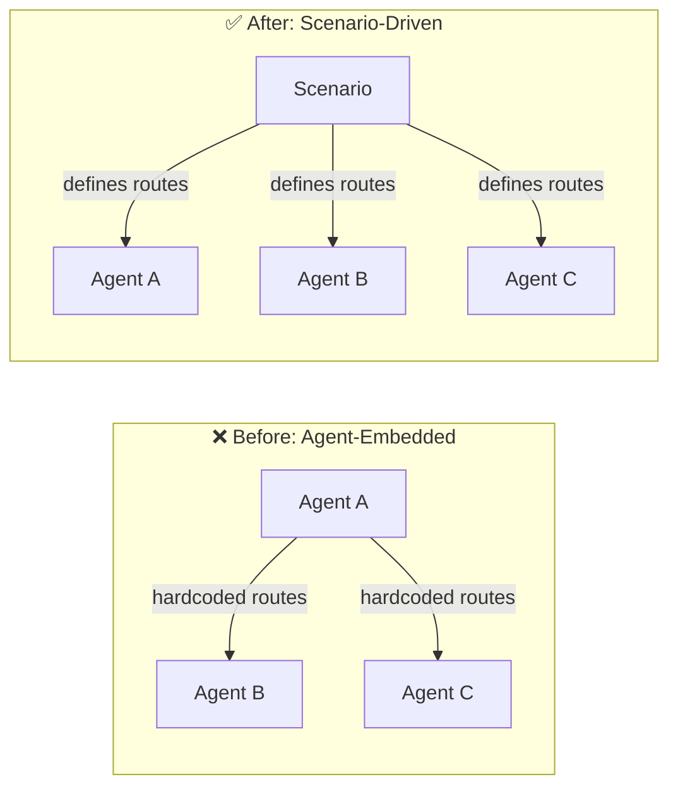
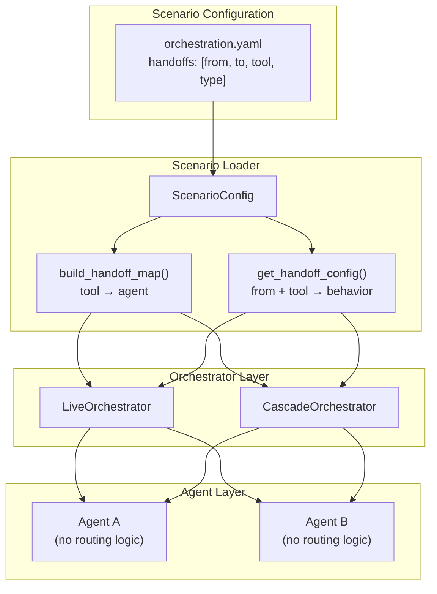
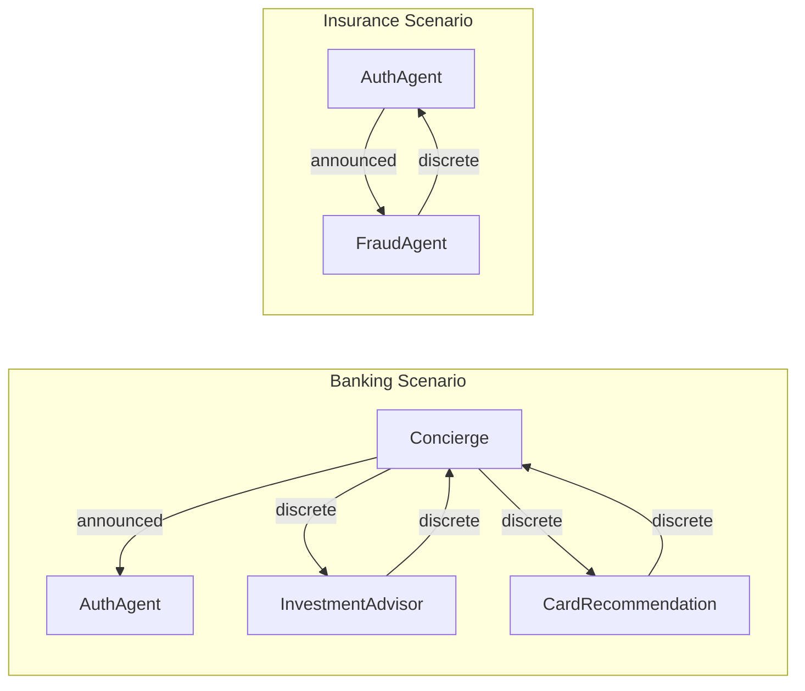
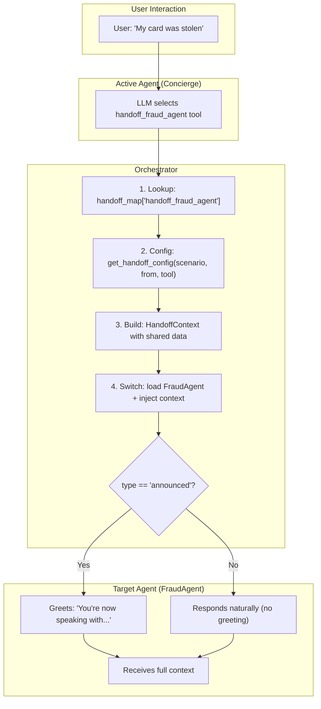
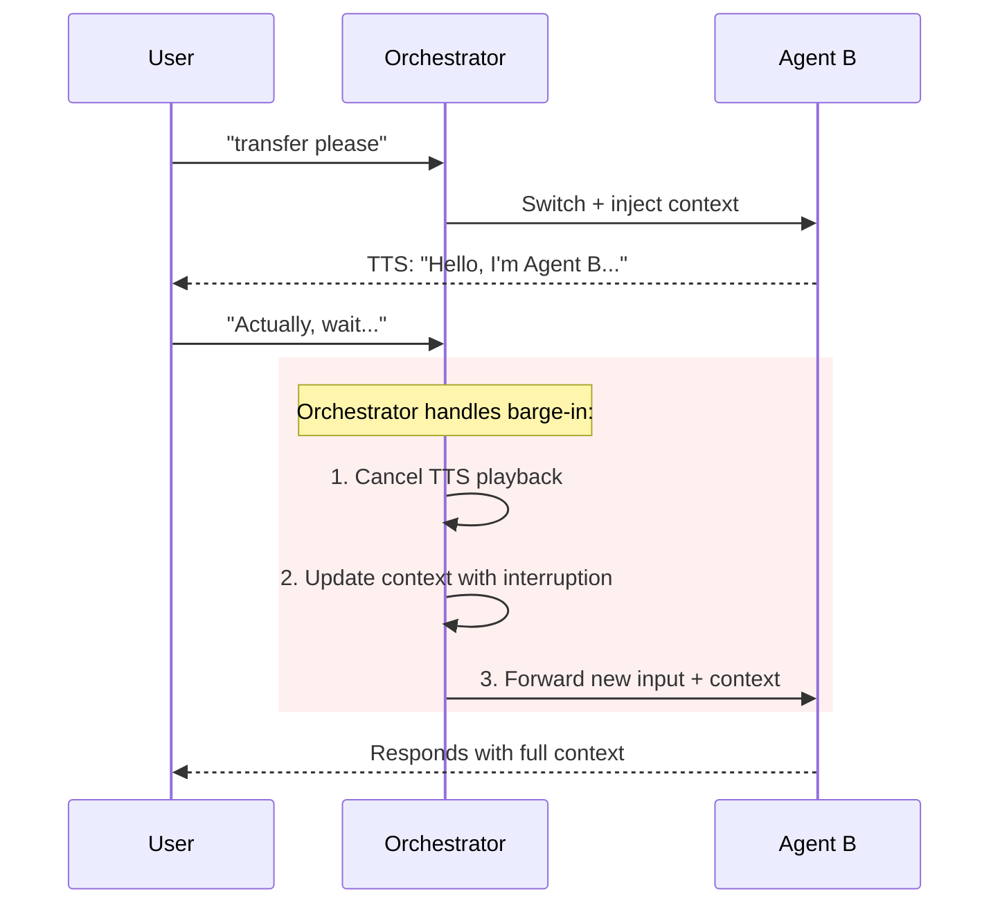
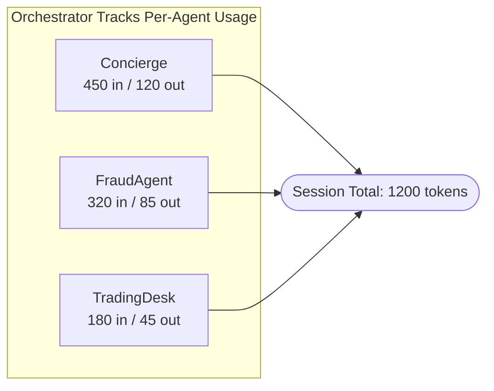

# Agent Handoff Strategies

> **Navigation**: [Architecture](../README.md) | [Orchestration](../orchestration/README.md) | [Agent Framework](README.md)

This document explains the **agent handoff system** in the ART Voice Agent Accelerator—how specialized agents transfer conversations to each other seamlessly across both orchestrator modes.
!!! example "See It In Practice"
    These concepts are demonstrated in the [Industry Solutions](../../industry/README.md):
    
    - **[Banking](../../industry/banking.md)** — Discrete handoffs for seamless specialist routing
    - **[Insurance](../../industry/insurance.md)** — Announced handoffs for security-first authentication
---

## Table of Contents

1. [Overview](#overview)
2. [Architecture: Scenario-Driven Handoffs](#architecture-scenario-driven-handoffs)
3. [How Scenarios Define Handoffs](#how-scenarios-define-handoffs)
4. [Handoff Types](#handoff-types)
5. [Agent Configuration (Simplified)](#agent-configuration-simplified)
6. [Orchestrator Integration](#orchestrator-integration)
7. [Flow Diagrams](#flow-diagrams)
8. [Implementation Guide](#implementation-guide)
9. [Configuration Reference](#configuration-reference)

---

## Overview

In multi-agent voice systems, **handoffs** allow specialized agents to transfer conversations to each other. For example:
- A concierge agent routes to a fraud specialist when the customer reports suspicious activity
- An investment advisor escalates to compliance for regulatory questions

### The New Model: Scenario-Driven Handoffs

Previously, handoff routing was embedded within each agent's configuration. This created tight coupling—changing handoff behavior required modifying multiple agent files.

**Now, handoffs are defined at the scenario level**, providing:

| Benefit | Description |
|---------|-------------|
| **Modularity** | Agents focus on capabilities; scenarios handle orchestration |
| **Reusability** | Same agent behaves differently in banking vs. insurance scenarios |
| **Contextual Behavior** | Handoff can be "announced" or "discrete" depending on scenario |
| **Single Source of Truth** | One file defines all handoff routes for a use case |



---

## Architecture: Scenario-Driven Handoffs

### Component Overview

| Component | Purpose | Location |
|-----------|---------|----------|
| **Scenario YAML** | Defines handoff routes as directed graph edges | `registries/scenariostore/<name>/` |
| **`ScenarioConfig`** | Parses scenario and builds handoff configurations | `scenariostore/loader.py` |
| **`HandoffConfig`** | Represents a single handoff route (from → to) | `scenariostore/loader.py` |
| **`build_handoff_map_from_scenario()`** | Creates tool→agent routing map from scenario | `scenariostore/loader.py` |
| **`get_handoff_config()`** | Looks up handoff behavior for a specific route | `scenariostore/loader.py` |

### Architecture Diagram



> **Key Insight**: Agents no longer contain routing logic—they simply declare their `handoff.trigger` (the tool name that activates them). The scenario defines which agents can call which handoff tools and how the transition should behave.

---

## How Scenarios Define Handoffs

Scenarios define handoffs as **directed edges** in an agent graph. Each edge specifies:
- **FROM**: The source agent initiating the handoff
- **TO**: The target agent receiving the handoff
- **TOOL**: The tool name that triggers this route
- **TYPE**: How the transition should behave (announced vs discrete)

### Example: Banking Scenario

```yaml
# registries/scenariostore/banking/orchestration.yaml

name: banking
description: Private banking customer service

# Starting agent
start_agent: Concierge

# Agents included in this scenario
agents:
  - Concierge
  - AuthAgent
  - InvestmentAdvisor
  - CardRecommendation

# Default handoff behavior for unlisted routes
handoff_type: announced

# Handoff configurations - directed edges in the agent graph
handoffs:
  # Concierge routes to specialists
  - from: Concierge
    to: AuthAgent
    tool: handoff_to_auth
    type: announced           # Auth is sensitive - always greet

  - from: Concierge
    to: InvestmentAdvisor
    tool: handoff_investment_advisor
    type: discrete            # Seamless handoff
    share_context: true

  - from: Concierge
    to: CardRecommendation
    tool: handoff_card_recommendation
    type: discrete            # Seamless handoff

  # Specialists return to Concierge
  - from: InvestmentAdvisor
    to: Concierge
    tool: handoff_concierge
    type: discrete            # Returning - seamless

  - from: CardRecommendation
    to: Concierge
    tool: handoff_concierge
    type: discrete            # Returning - seamless

# Template variables applied to all agents
agent_defaults:
  company_name: "Private Banking"
  industry: "banking"
```

### Example: Insurance Scenario

The same agents can behave differently in a different scenario:

```yaml
# registries/scenariostore/insurance/scenario.yaml

name: insurance
description: Insurance claims and policy management

start_agent: AuthAgent     # Different starting point!

agents:
  - AuthAgent
  - FraudAgent

handoffs:
  - from: AuthAgent
    to: FraudAgent
    tool: handoff_fraud_agent
    type: announced           # Fraud is sensitive - announce

  - from: FraudAgent
    to: AuthAgent
    tool: handoff_to_auth
    type: discrete            # Returning - seamless

agent_defaults:
  company_name: "Insurance Services"
  industry: "insurance"
```

### Handoff Graph Visualization



---

## Handoff Types

Scenarios support two handoff types that control the user experience:

### Announced Handoffs

The target agent **greets the user**, making the transition explicit:

```yaml
- from: Concierge
  to: AuthAgent
  tool: handoff_to_auth
  type: announced
```

**User Experience:**
> **Concierge**: "Let me connect you with our authentication team."  
> **AuthAgent**: "I need to verify your identity before we continue. Let's get you authenticated."

**Use Cases:**
- Sensitive operations (authentication, fraud)
- Clear departmental transitions
- When user should know they're speaking to a specialist

### Discrete Handoffs

The target agent **continues naturally** without an explicit greeting:

```yaml
- from: Concierge
  to: InvestmentAdvisor
  tool: handoff_investment_advisor
  type: discrete
```

**User Experience:**
> **Concierge**: "I'll help you with your retirement accounts."  
> **InvestmentAdvisor**: "Looking at your 401k, I see you have..."

**Use Cases:**
- Seamless specialist routing
- Returning to a previous agent
- When continuity matters more than acknowledgment

### Context Sharing

The `share_context` flag controls whether conversation context flows to the target:

```yaml
- from: Concierge
  to: FraudAgent
  tool: handoff_fraud_agent
  type: announced
  share_context: true    # Default: true
```

When `true`, the target agent receives:
- `handoff_reason` — Why the handoff occurred
- `user_last_utterance` — What the user just said
- `session_profile` — Customer information
- `handoff_context` — Custom data from the source agent

---

## Agent Configuration (Simplified)

With scenario-driven handoffs, **agents become simpler**. They only need to declare:
1. Their `handoff.trigger` — the tool name that activates them
2. Their greeting/return_greeting — what to say on arrival
3. Their tools — including handoff tools they can call

### Example: Simplified Agent YAML

```yaml
# registries/agentstore/fraud_agent/agent.yaml

name: FraudAgent
description: Post-authentication fraud detection specialist

# Greetings - used when handoff type is "announced"
greeting: "You are now speaking with the Fraud Prevention desk. How can I help?"
return_greeting: "Welcome back to the Fraud Prevention desk."

# Handoff trigger - how other agents route TO this agent
handoff:
  trigger: handoff_fraud_agent

# Tools this agent can use (including handoffs to other agents)
tools:
  - analyze_recent_transactions
  - check_suspicious_activity
  - block_card_emergency
  - create_fraud_case
  - handoff_concierge        # Can return to concierge
  - handoff_to_auth          # Can route to auth if needed
  - escalate_human

# Voice, model, prompt configuration...
voice:
  name: en-US-OnyxTurboMultilingualNeural

prompt: prompt.jinja
```

### What Changed?

| Before (Agent-Embedded) | After (Scenario-Driven) |
|------------------------|------------------------|
| Agent defines WHERE it can route | Agent lists tools it CAN call |
| Agent defines HOW handoffs behave | Scenario defines handoff behavior |
| Changing routes = edit agent YAML | Changing routes = edit scenario YAML |
| Same agent, same behavior everywhere | Same agent, contextual behavior |

### Agents Focus on Capabilities

Agents now focus on:

- ✅ What they're good at (description, prompt)
- ✅ What tools they need (tools list)
- ✅ How they sound (voice, greetings)
- ✅ Their identity (handoff.trigger)

Agents don't need to know:

- ❌ Which agents they'll work with
- ❌ Whether handoffs should be announced or discrete
- ❌ The overall conversation flow

---

## Orchestrator Integration

Both orchestrators use the scenario-based handoff map and configuration:

### Initialization

```python
from registries.scenariostore.loader import (
    build_handoff_map_from_scenario,
    get_handoff_config,
)

# Build handoff routing from scenario
handoff_map = build_handoff_map_from_scenario(scenario_name)
# → {"handoff_fraud_agent": "FraudAgent", "handoff_concierge": "Concierge", ...}
```

### During Tool Execution

```python
async def _execute_tool_call(self, name: str, args: Dict[str, Any]) -> None:
    # Check if this is a handoff tool
    target_agent = self._handoff_map.get(name)
    if target_agent:
        # Get handoff configuration from scenario
        handoff_cfg = get_handoff_config(
            scenario_name=self._scenario_name,
            from_agent=self._active_agent_name,
            tool_name=name,
        )
        
        # Determine greeting behavior
        should_greet = handoff_cfg.greet_on_switch  # True if "announced"
        
        # Execute the switch with appropriate behavior
        await self._switch_to(
            target_agent,
            system_vars,
            greet=should_greet,
        )
        return
    
    # Otherwise execute as business tool
    result = await execute_tool(name, args)
```

### VoiceLive vs Cascade

Both orchestrators share the same handoff infrastructure:

| Aspect | VoiceLive | Cascade |
|--------|-----------|---------|
| Detection | Event loop intercepts tool calls | Tool-call loop checks handoff_map |
| Context | `build_handoff_system_vars()` | Same helper function |
| Switch | `await self._switch_to()` | State stored, applied next turn |
| Greeting | Session update triggers TTS | TTS queue receives greeting |

---

## Flow Diagrams

### Complete Handoff Lifecycle (Scenario-Driven)



**Context preserved through handoffs:**
- `session_profile` — Customer name, account info
- `handoff_reason` — Why the transfer occurred  
- `user_last_utterance` — What the user just said
- `handoff_context` — Custom data from source agent
- `customer_intelligence` — Personalization data

### Barge-In During Handoff



> The orchestrator manages interruptions seamlessly—Agent B receives the updated context including the user's interruption.

---

## Implementation Guide

### Adding a New Agent to a Scenario

With scenario-driven handoffs, adding a new agent involves three steps:

#### Step 1: Create the Agent

```yaml
# registries/agentstore/new_specialist/agent.yaml

name: NewSpecialistAgent
description: Specialist for new domain

greeting: "Hi, I'm the new specialist. How can I help?"
return_greeting: "Welcome back. What else can I help with?"

# Define how other agents route TO this agent
handoff:
  trigger: handoff_new_specialist

# Tools this agent can use
tools:
  - some_specialist_tool
  - handoff_concierge        # Can return to main agent

voice:
  name: en-US-ShimmerTurboMultilingualNeural

prompt: prompt.jinja
```

#### Step 2: Register the Handoff Tool

```python
# registries/toolstore/handoffs.py

@register_tool(
    name="handoff_new_specialist",
    description="Transfer to the new specialist for domain expertise",
    is_handoff=True,
)
async def handoff_new_specialist(reason: str, details: str = "") -> Dict[str, Any]:
    return {
        "success": True,
        "handoff_context": {"reason": reason, "details": details},
        "handoff_summary": f"Transferring to specialist: {reason}",
    }
```

#### Step 3: Add to Scenario

```yaml
# registries/scenariostore/banking/orchestration.yaml

agents:
  - Concierge
  - NewSpecialistAgent     # Add the new agent

handoffs:
  # ... existing handoffs ...
  
  # Add handoff routes for new agent
  - from: Concierge
    to: NewSpecialistAgent
    tool: handoff_new_specialist
    type: announced            # Or "discrete" for seamless

  - from: NewSpecialistAgent
    to: Concierge
    tool: handoff_concierge
    type: discrete             # Returning - usually seamless
```

#### Step 4: Update Source Agent's Tools

```yaml
# registries/agentstore/concierge/agent.yaml

tools:
  # ... existing tools ...
  - handoff_new_specialist   # Now Concierge can route here
```

### Creating a New Scenario

To create a new scenario with custom handoff behavior:

```yaml
# registries/scenariostore/healthcare/scenario.yaml

name: healthcare
description: Healthcare customer service

start_agent: ReceptionAgent

agents:
  - ReceptionAgent
  - NurseAgent
  - BillingAgent

handoff_type: announced     # Default for all handoffs

handoffs:
  # Reception routes to specialists
  - from: ReceptionAgent
    to: NurseAgent
    tool: handoff_nurse
    type: announced
    
  - from: ReceptionAgent
    to: BillingAgent
    tool: handoff_billing
    type: discrete          # Billing is less formal
    
  # Specialists return to reception
  - from: NurseAgent
    to: ReceptionAgent
    tool: handoff_reception
    type: discrete
    
  - from: BillingAgent
    to: ReceptionAgent
    tool: handoff_reception
    type: discrete

agent_defaults:
  company_name: "City Health Clinic"
  industry: "healthcare"
  hipaa_compliant: true
```

### Testing Scenario-Based Handoffs

```python
# tests/test_scenario_handoffs.py
import pytest
from registries.scenariostore.loader import (
    load_scenario,
    build_handoff_map_from_scenario,
    get_handoff_config,
)

def test_scenario_handoff_map():
    handoff_map = build_handoff_map_from_scenario("banking")
    
    assert handoff_map["handoff_fraud_agent"] == "FraudAgent"
    assert handoff_map["handoff_concierge"] == "Concierge"

def test_handoff_config_lookup():
    cfg = get_handoff_config(
        scenario_name="banking",
        from_agent="Concierge",
        tool_name="handoff_investment_advisor",
    )
    
    assert cfg.to_agent == "InvestmentAdvisor"
    assert cfg.type == "discrete"
    assert cfg.greet_on_switch == False

def test_announced_vs_discrete():
    # Auth handoff should be announced
    auth_cfg = get_handoff_config("banking", "Concierge", "handoff_to_auth")
    assert auth_cfg.type == "announced"
    assert auth_cfg.greet_on_switch == True
    
    # Investment handoff should be discrete
    invest_cfg = get_handoff_config("banking", "Concierge", "handoff_investment_advisor")
    assert invest_cfg.type == "discrete"
    assert invest_cfg.greet_on_switch == False
```

---

## Configuration Reference

### ScenarioConfig

The main configuration object for scenarios:

```python
@dataclass
class ScenarioConfig:
    name: str                                    # Scenario identifier
    description: str = ""                        # Human-readable description
    agents: list[str] = field(...)               # Agents included (empty = all)
    start_agent: str | None = None               # Initial agent
    handoff_type: str = "announced"              # Default: "announced" or "discrete"
    handoffs: list[HandoffConfig] = field(...)   # Handoff route definitions
    agent_defaults: AgentOverride | None = None  # Global template vars
    global_template_vars: dict[str, Any] = field(...)  # Template variables
```

### HandoffConfig

Represents a single handoff route (directed edge):

```python
@dataclass
class HandoffConfig:
    from_agent: str = ""           # Source agent initiating handoff
    to_agent: str = ""             # Target agent receiving handoff
    tool: str = ""                 # Tool name that triggers this route
    type: str = "announced"        # "discrete" or "announced"
    share_context: bool = True     # Pass conversation context?

    @property
    def greet_on_switch(self) -> bool:
        """Returns True if type is 'announced'."""
        return self.type == "announced"
```

| Field | Type | Default | Description |
|-------|------|---------|-------------|
| `from_agent` | `str` | `""` | Agent initiating the handoff |
| `to_agent` | `str` | `""` | Agent receiving the handoff |
| `tool` | `str` | `""` | Tool name that triggers this route |
| `type` | `str` | `"announced"` | Handoff behavior: `"announced"` or `"discrete"` |
| `share_context` | `bool` | `True` | Whether to pass conversation context |

### Scenario YAML Schema

```yaml
# scenario.yaml or orchestration.yaml

name: string                    # Required: unique identifier
description: string             # Optional: human-readable description

start_agent: string             # Optional: initial agent name
agents: [string]                # Optional: list of agent names (empty = all)

handoff_type: string            # Optional: default "announced" or "discrete"

handoffs:                       # List of handoff route definitions
  - from: string                # Required: source agent name
    to: string                  # Required: target agent name
    tool: string                # Required: handoff tool name
    type: string                # Optional: "announced" (default) or "discrete"
    share_context: boolean      # Optional: true (default) or false

agent_defaults:                 # Optional: applied to all agents
  company_name: string
  industry: string
  # ... any template variables

template_vars:                  # Optional: global template variables
  key: value
```

### HandoffContext Dataclass

```python
@dataclass
class HandoffContext:
    """
    Context passed during agent handoffs.
    
    Captures all relevant information for smooth agent transitions.
    """
    source_agent: str                           # Agent initiating the handoff
    target_agent: str                           # Agent receiving the handoff
    reason: str = ""                            # Why the handoff is occurring
    user_last_utterance: str = ""               # User's most recent speech
    context_data: Dict[str, Any] = field(...)   # Additional context (caller info)
    session_overrides: Dict[str, Any] = field(...)  # Config for new agent
    greeting: Optional[str] = None              # Explicit greeting override
    
    def to_system_vars(self) -> Dict[str, Any]:
        """Convert to system_vars dict for agent session application."""
        ...
```

| Field | Type | Description |
|-------|------|-------------|
| `source_agent` | `str` | Name of the agent initiating the handoff |
| `target_agent` | `str` | Name of the agent receiving the handoff |
| `reason` | `str` | Why the handoff is occurring |
| `user_last_utterance` | `str` | User's most recent speech for context |
| `context_data` | `Dict[str, Any]` | Additional structured context (caller info, etc.) |
| `session_overrides` | `Dict[str, Any]` | Configuration to apply to the new agent |
| `greeting` | `Optional[str]` | Explicit greeting for the new agent |

### HandoffResult Dataclass

```python
@dataclass
class HandoffResult:
    """
    Result from a handoff operation.
    
    This is a **signal** returned by execute_handoff() that tells the
    orchestrator what to do next. The actual agent switch happens in
    the orchestrator based on this result.
    """
    success: bool                           # Whether handoff completed
    target_agent: Optional[str] = None      # Agent to switch to
    message: Optional[str] = None           # Message to speak after handoff
    error: Optional[str] = None             # Error if handoff failed
    should_interrupt: bool = True           # Cancel current TTS playback?
```

| Field | Type | Description |
|-------|------|-------------|
| `success` | `bool` | Whether the handoff completed successfully |
| `target_agent` | `Optional[str]` | The agent to switch to (if success=True) |
| `message` | `Optional[str]` | Message to speak after handoff |
| `error` | `Optional[str]` | Error message if handoff failed |
| `should_interrupt` | `bool` | Whether to cancel current TTS playback |

### Helper Functions

```python title="apps/artagent/backend/voice/handoffs/context.py"
def sanitize_handoff_context(raw: Any) -> Dict[str, Any]:
    """
    Remove control flags from raw handoff context.
    
    Control flags like 'success', 'target_agent', 'handoff_summary' are
    internal signaling mechanisms and should not appear in agent prompts.
    """

def build_handoff_system_vars(
    *,
    source_agent: str,
    target_agent: str,
    tool_result: Dict[str, Any],
    tool_args: Dict[str, Any],
    current_system_vars: Dict[str, Any],
    user_last_utterance: Optional[str] = None,
) -> Dict[str, Any]:
    """
    Build system_vars dict for agent handoff from tool result and session state.
    
    This shared logic ensures consistent handoff context:
    1. Extracts and sanitizes handoff_context from tool result
    2. Builds handoff_reason from multiple fallback sources
    3. Carries forward session variables (profile, client_id, etc.)
    4. Applies session_overrides if present
    """
```

---

## Best Practices

### 1. Context Preservation

Always pass user context through handoffs. The `build_handoff_system_vars()` helper automatically carries forward:
- `session_profile` - Customer information
- `client_id` - Session identifier
- `customer_intelligence` - Personalization data
- `institution_name` - Tenant context

### 2. Graceful Greeting Selection

Let the system choose appropriate greetings:

| Scenario | Greeting Source |
|----------|-----------------|
| **First visit** | Agent's `greeting` field |
| **Return visit** | Agent's `return_greeting` field |
| **Handoff with context** | Skip automatic (agent handles naturally) |
| **Explicit override** | `session_overrides.greeting` |

### 3. Token Attribution

The orchestrator tracks token usage per agent for cost attribution, emitting a summary span on each handoff:



### 4. Sanitize Handoff Context

Use `sanitize_handoff_context()` to remove internal control flags before passing context to agent prompts:

```python
# Control flags that are automatically removed:
_HANDOFF_CONTROL_FLAGS = frozenset({
    "success",
    "handoff",
    "target_agent",
    "message",
    "handoff_summary",
    "should_interrupt_playback",
    "session_overrides",
})
```

---

## Related Documentation

- [Orchestration Overview](../orchestration/README.md) — Dual orchestrator architecture
- [Cascade Orchestrator](../orchestration/cascade.md) — SpeechCascade mode details
- [VoiceLive Orchestrator](../orchestration/voicelive.md) — VoiceLive mode details
- [Agent Framework](README.md) — YAML-driven agent configuration
- [Streaming Modes](../speech/README.md) — Audio processing modes

---

## Key Source Files

### Scenario Store (`registries/scenariostore/`)

| Component | Location | Description |
|-----------|----------|-------------|
| **Scenario Loader** | `scenariostore/loader.py` | `load_scenario()`, `build_handoff_map_from_scenario()`, `get_handoff_config()` |
| **ScenarioConfig** | `scenariostore/loader.py` | Configuration dataclass with handoff routes |
| **HandoffConfig** | `scenariostore/loader.py` | Represents a single directed edge (from → to) |
| **Banking Scenario** | `scenariostore/banking/orchestration.yaml` | Private banking handoff routes |
| **Insurance Scenario** | `scenariostore/insurance/scenario.yaml` | Insurance claims handoff routes |
| **Default Scenario** | `scenariostore/default/scenario.yaml` | All agents, default behavior |

### Agent Store (`registries/agentstore/`)

| Component | Location | Description |
|-----------|----------|-------------|
| **Agent Loader** | `agentstore/loader.py` | `discover_agents()`, `build_handoff_map()` |
| **UnifiedAgent** | `agentstore/base.py` | Agent configuration dataclass |
| **Defaults** | `agentstore/_defaults.yaml` | Inherited defaults for all agents |
| **Agent Definitions** | `agentstore/*/agent.yaml` | Individual agent configurations |

### Handoff Infrastructure

| Component | Location | Description |
|-----------|----------|-------------|
| **Handoff Context** | `voice/handoffs/context.py` | `HandoffContext`, `HandoffResult`, `build_handoff_system_vars()` |
| **Tool Registry** | `registries/toolstore/registry.py` | `is_handoff_tool()`, tool registration and execution |
| **Handoff Tools** | `registries/toolstore/handoffs.py` | Handoff tool definitions |

### Orchestrators

| Mode | File | Description |
|------|------|-------------|
| **VoiceLive** | `voice/voicelive/orchestrator.py` | `LiveOrchestrator` - handles handoffs via event loop |
| **Cascade** | `voice/speech_cascade/orchestrator.py` | `CascadeOrchestratorAdapter` - state-based handoffs |
