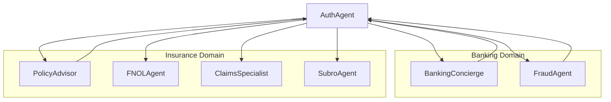
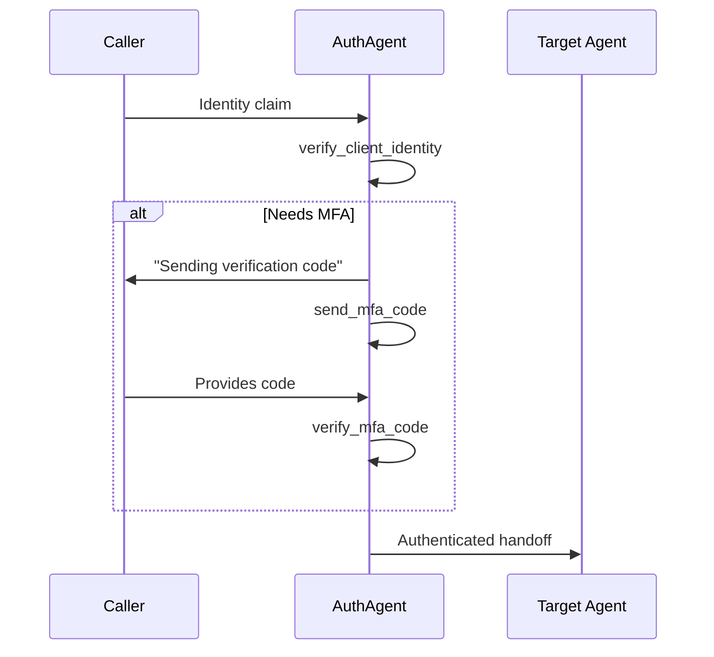

# AuthAgent

Cross-domain authentication and identity verification specialist. Provides MFA, identity verification, and secure handoffs to domain-specific agents.

---

## Configuration

| Property | Value |
|----------|-------|
| **Name** | `AuthAgent` |
| **Industry** | Cross-Domain |
| **Entry Point** | No |
| **Handoff Trigger** | `handoff_to_auth` |
| **Voice** | `en-US-OnyxTurboMultilingualNeural` |

**Source:** `apps/artagent/backend/registries/agentstore/auth_agent/agent.yaml`

---

## Capabilities

- Multi-factor authentication (MFA)
- Client identity verification
- Credit card caller verification
- Secure routing to authenticated agents

---

## Tools

### Authentication
| Tool | Purpose |
|------|---------|
| `verify_client_identity` | Initial identity validation |
| `send_mfa_code` | Send verification code |
| `verify_mfa_code` | Validate entered code |
| `resend_mfa_code` | Resend verification code |
| `verify_cc_caller` | Credit card holder verification |

### Handoffs (Post-Authentication)
| Tool | Destination Agent |
|------|-------------------|
| `handoff_concierge` | [BankingConcierge](banking-concierge.md) |
| `handoff_fraud_agent` | [FraudAgent](fraud-agent.md) |
| `handoff_policy_advisor` | [PolicyAdvisor](policy-advisor.md) |
| `handoff_fnol_agent` | [FNOLAgent](fnol-agent.md) |
| `handoff_claims_specialist` | [ClaimsSpecialist](claims-specialist.md) |
| `handoff_subro_agent` | [SubroAgent](subro-agent.md) |

### Escalation
| Tool | Purpose |
|------|---------|
| `escalate_human` | Transfer to human agent |
| `escalate_emergency` | Emergency escalation |

---

## Handoff Graph



---

## Voice Configuration

```yaml
voice:
  name: en-US-OnyxTurboMultilingualNeural
  type: azure-standard
  rate: "0%"
```

---

## Prompt Template

Located at: `apps/artagent/backend/registries/agentstore/auth_agent/prompt.jinja`

### Context Variables
| Variable | Description |
|----------|-------------|
| `caller_phone` | Incoming phone number |
| `target_agent` | Agent to route to after auth |
| `mfa_sent` | Whether MFA code was sent |
| `auth_attempts` | Number of verification attempts |
| `handoff_context` | Original request context |

---

## Authentication Flow



---

## Usage Scenarios

### Step-Up Authentication
1. Domain agent needs higher auth level
2. Hands off to AuthAgent with context
3. AuthAgent verifies identity
4. Routes back to requesting agent

### Cross-Domain Entry
1. Caller arrives with ambiguous intent
2. AuthAgent verifies identity
3. Routes to appropriate domain entry point

---

## Security Notes

- MFA codes expire after configurable timeout
- Failed attempts tracked per session
- Emergency escalation available if auth fails

---

## Related Agents

- [BankingConcierge](banking-concierge.md) - Banking entry point
- [PolicyAdvisor](policy-advisor.md) - Insurance entry point
- [FraudAgent](fraud-agent.md) - Post-auth for fraud cases
