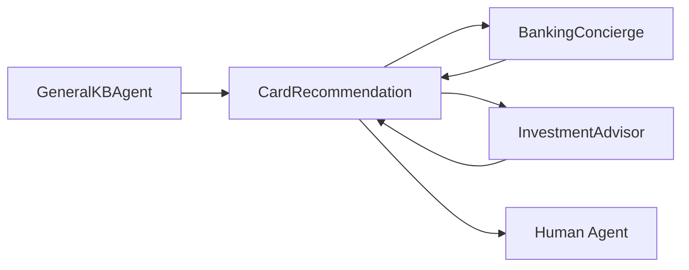

# CardRecommendation Agent

Credit card product specialist. Recommends cards based on customer needs, handles applications, and manages e-signature flows.

---

## Configuration

| Property | Value |
|----------|-------|
| **Name** | `CardRecommendation` |
| **Industry** | Banking |
| **Entry Point** | No |
| **Handoff Trigger** | `handoff_card_recommendation` |
| **Voice** | `en-US-OnyxTurboMultilingualNeural` |

**Source:** `apps/artagent/backend/registries/agentstore/card_recommendation/agent.yaml`

---

## Capabilities

- Search and recommend credit cards
- Evaluate card eligibility
- Process card applications
- Handle e-signature flows
- Card product FAQs

---

## Tools

### Product Discovery
| Tool | Purpose |
|------|---------|
| `search_card_products` | Search available cards by criteria |
| `get_card_details` | Detailed card information |
| `search_credit_card_faqs` | Card-related FAQs |
| `evaluate_card_eligibility` | Check customer eligibility |

### Application
| Tool | Purpose |
|------|---------|
| `send_card_agreement` | Email card agreement |
| `verify_esignature` | Verify signed agreement |
| `finalize_card_application` | Complete application |

### Handoffs
| Tool | Destination Agent |
|------|-------------------|
| `handoff_investment_advisor` | [InvestmentAdvisor](investment-advisor.md) |
| `handoff_concierge` | [BankingConcierge](banking-concierge.md) |

### Escalation
| Tool | Purpose |
|------|---------|
| `escalate_human` | Transfer to human specialist |
| `escalate_emergency` | Emergency escalation |

---

## Handoff Graph



---

## Voice Configuration

```yaml
voice:
  name: en-US-OnyxTurboMultilingualNeural
  type: azure-standard
  rate: "0%"
```

---

## Prompt Template

Located at: `apps/artagent/backend/registries/agentstore/card_recommendation/prompt.jinja`

### Context Variables
| Variable | Description |
|----------|-------------|
| `caller_name` | Authenticated caller name |
| `current_cards` | Customer's existing cards |
| `spending_profile` | Spending category preferences |
| `credit_score_range` | Estimated credit range |
| `application_in_progress` | Active application details |

---

## Usage Scenarios

### Product Discovery Flow
1. Customer asks about credit cards
2. Agent asks about spending habits, preferences
3. Searches products matching criteria
4. Presents top recommendations with benefits

### Application Flow
1. Customer chooses a card
2. Agent checks eligibility
3. Sends agreement via email
4. Customer signs digitally
5. Agent finalizes application

### Cross-Sell Flow
After card discussion, may hand off to InvestmentAdvisor if customer mentions retirement, or return to BankingConcierge for other needs.

---

## Compliance Notes

- Must disclose APR and fees
- Cannot guarantee approval
- Application requires identity verification

---

## Related Agents

- [BankingConcierge](banking-concierge.md) - Entry point and return
- [InvestmentAdvisor](investment-advisor.md) - Cross-domain routing
- [GeneralKBAgent](general-kb-agent.md) - Pre-auth product questions
