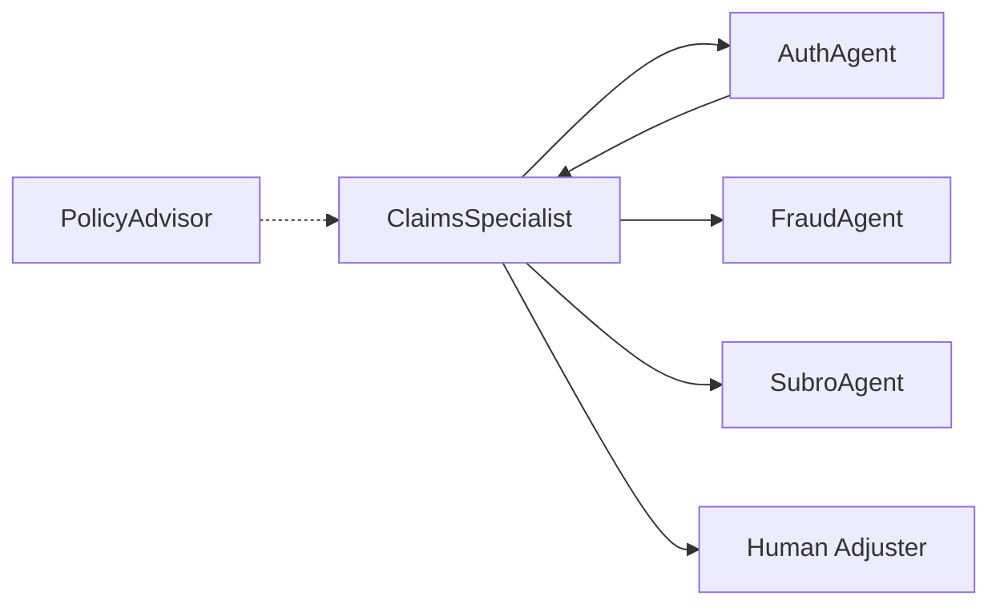

# ClaimsSpecialist Agent

Insurance claims processing specialist. Handles claim status, documentation, and fraud detection routing.

---

## Configuration

| Property | Value |
|----------|-------|
| **Name** | `ClaimsSpecialist` |
| **Industry** | Insurance |
| **Entry Point** | No |
| **Handoff Trigger** | `handoff_claims_specialist` |
| **Voice** | `en-US-OnyxTurboMultilingualNeural` |

**Source:** `apps/artagent/backend/registries/agentstore/claims_specialist/agent.yaml`

---

## Capabilities

- Claim status inquiries
- Claims documentation guidance
- Fraud detection routing
- Knowledge base search for claims procedures

---

## Tools

### Knowledge
| Tool | Purpose |
|------|---------|
| `search_knowledge_base` | Search claims procedures and policies |

### Handoffs
| Tool | Destination Agent |
|------|-------------------|
| `handoff_to_auth` | [AuthAgent](auth-agent.md) |
| `handoff_fraud_agent` | [FraudAgent](fraud-agent.md) |

### Escalation
| Tool | Purpose |
|------|---------|
| `escalate_human` | Transfer to human claims adjuster |

---

## Handoff Graph



---

## Voice Configuration

```yaml
voice:
  name: en-US-OnyxTurboMultilingualNeural
  type: azure-standard
  rate: "0%"
```

---

## Prompt Template

Located at: `apps/artagent/backend/registries/agentstore/claims_specialist/prompt.jinja`

### Context Variables
| Variable | Description |
|----------|-------------|
| `caller_name` | Authenticated caller name |
| `claim_number` | Active claim being discussed |
| `claim_status` | Current claim status |
| `required_documents` | Pending documentation |
| `handoff_context` | Context from routing agent |

---

## Usage Scenarios

### Claim Status Flow
1. Caller asks about claim status
2. Agent retrieves claim details
3. Explains current status and next steps
4. Provides documentation requirements

### Fraud Detection Flow
1. During claim review, agent detects anomalies
2. Hands off to FraudAgent for investigation
3. FraudAgent returns findings
4. ClaimsSpecialist continues processing

### Subrogation Flow
1. Claim involves third-party liability
2. Hands off to SubroAgent for recovery
3. SubroAgent handles recovery process

---

## Related Agents

- [PolicyAdvisor](policy-advisor.md) - Policy information
- [FNOLAgent](fnol-agent.md) - Initial claim recording
- [SubroAgent](subro-agent.md) - Recovery process
- [FraudAgent](fraud-agent.md) - Fraud investigation
- [AuthAgent](auth-agent.md) - Identity verification
