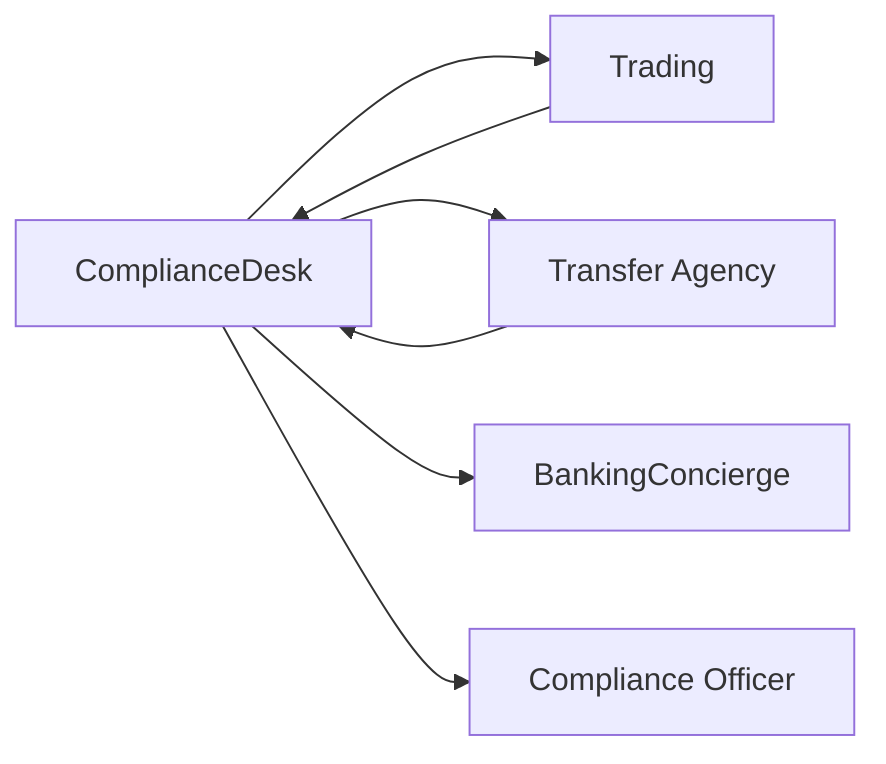

# ComplianceDesk Agent

AML, FATCA, sanctions screening, and regulatory compliance verification specialist.

---

## Configuration

| Property | Value |
|----------|-------|
| **Name** | `ComplianceDesk` |
| **Industry** | Cross-Domain (Financial Services) |
| **Entry Point** | No |
| **Handoff Trigger** | `handoff_compliance_desk` |
| **Voice** | `en-US-EchoTurboMultilingualNeural` |

**Source:** `apps/artagent/backend/registries/agentstore/compliance_desk/agent.yaml`

---

## Capabilities

- AML (Anti-Money Laundering) verification
- FATCA compliance checks
- Sanctions screening
- Regulatory requirement review
- Transaction compliance clearance

---

## Tools

### Compliance Verification
| Tool | Purpose |
|------|---------|
| `get_client_data` | Retrieve client information for compliance |
| `check_compliance_status` | Check AML/FATCA status |
| `search_knowledge_base` | Compliance regulations lookup |

### Handoffs
| Tool | Destination Agent |
|------|-------------------|
| `handoff_to_trading` | Trading desk for execution |
| `handoff_transfer_agency_agent` | Transfer agency specialist |
| `handoff_concierge` | [BankingConcierge](banking-concierge.md) |

### Escalation
| Tool | Purpose |
|------|---------|
| `escalate_human` | Transfer to compliance officer |
| `escalate_emergency` | Urgent compliance issue |

---

## Handoff Graph



---

## Voice Configuration

```yaml
voice:
  name: en-US-EchoTurboMultilingualNeural
  type: azure-standard
  rate: "-4%"
```

Note: Uses a slightly slower rate for clarity on regulatory matters.

---

## Prompt Template

Located at: `apps/artagent/backend/registries/agentstore/compliance_desk/prompt.jinja`

### Context Variables
| Variable | Description |
|----------|-------------|
| `caller_name` | Authenticated caller name |
| `client_id` | Client identifier |
| `transaction_type` | Type of transaction being reviewed |
| `transaction_amount` | Amount for threshold checks |
| `jurisdiction` | Relevant regulatory jurisdiction |

---

## Usage Scenarios

### Transaction Compliance Flow
1. Trading desk needs compliance clearance
2. Hands off to ComplianceDesk with transaction details
3. Agent runs AML/sanctions checks
4. Clears or flags transaction
5. Returns to trading desk

### FATCA Review Flow
1. Transfer agency flags FATCA question
2. Hands off to ComplianceDesk
3. Agent reviews foreign tax compliance
4. Provides guidance or escalates to officer

### Sanctions Screening
1. High-value transaction initiated
2. ComplianceDesk screens against sanctions lists
3. Clears or holds for manual review

---

## Compliance Context

This agent operates in sensitive regulatory space:

- **AML** - Anti-Money Laundering (Bank Secrecy Act)
- **FATCA** - Foreign Account Tax Compliance Act
- **OFAC** - Office of Foreign Assets Control sanctions
- **KYC** - Know Your Customer requirements

---

## Regulatory Notes

- All compliance decisions are logged
- Escalate ambiguous cases to human officers
- Never override sanctions hits programmatically

---

## Related Agents

- [BankingConcierge](banking-concierge.md) - Return for non-compliance matters
- Trading desk (custom) - Transaction execution
- Transfer agency (custom) - Account transfers
