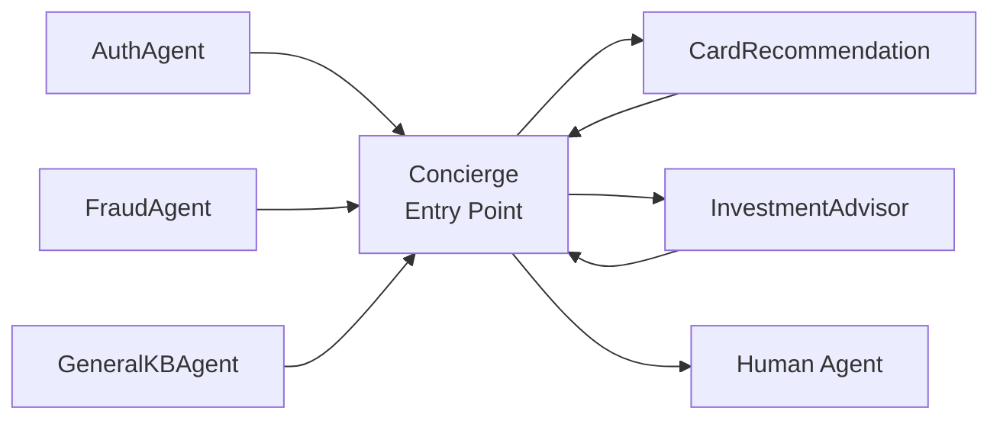

# Concierge Agent

Generic entry point agent. Provides flexible routing to specialists based on customer needs.

---

## Configuration

| Property | Value |
|----------|-------|
| **Name** | `Concierge` |
| **Industry** | Cross-Domain |
| **Entry Point** | ✅ Yes |
| **Handoff Trigger** | `handoff_concierge` |
| **Voice** | `en-US-OnyxTurboMultilingualNeural` |

**Source:** `apps/artagent/backend/registries/agentstore/concierge/agent.yaml`

---

## Capabilities

- Account summary retrieval
- Recent transaction lookup
- Fee refund processing
- Client identity verification
- Route to specialists based on needs

---

## Tools

### Account Operations
| Tool | Purpose |
|------|---------|
| `get_user_profile` | Retrieve caller's profile information |
| `get_account_summary` | Retrieve account balances and status |
| `get_recent_transactions` | List recent account transactions |
| `refund_fee` | Process fee refunds |

### Identity
| Tool | Purpose |
|------|---------|
| `verify_client_identity` | Verify caller identity |

### Handoffs
| Tool | Destination Agent |
|------|-------------------|
| `handoff_card_recommendation` | [CardRecommendation](card-recommendation.md) |
| `handoff_investment_advisor` | [InvestmentAdvisor](investment-advisor.md) |

### Escalation
| Tool | Purpose |
|------|---------|
| `escalate_human` | Transfer to human agent |
| `escalate_emergency` | Emergency escalation |
| `transfer_call_to_call_center` | Direct call center transfer |

---

## Handoff Graph



---

## Voice Configuration

```yaml
voice:
  name: en-US-OnyxTurboMultilingualNeural
  type: azure-standard
  rate: "0%"
```

---

## Prompt Template

Located at: `apps/artagent/backend/registries/agentstore/concierge/prompt.jinja`

### Context Variables
| Variable | Description |
|----------|-------------|
| `caller_name` | Authenticated caller name |
| `phone_number` | Caller's phone number |
| `accounts` | List of user accounts |
| `handoff_context` | Context from previous agent |
| `collected_information` | Data gathered during call |

---

## Comparison with BankingConcierge

| Feature | Concierge | BankingConcierge |
|---------|-----------|------------------|
| Industry | Generic | Banking-specific |
| Prompt | Generic greeting | Banking-focused |
| Use Case | Custom implementations | Banking scenarios |
| Tools | Same | Same |

Both agents share the same tool set but have different prompt templates. Use **BankingConcierge** for banking scenarios and **Concierge** for custom industry implementations.

---

## Usage Scenarios

### Entry Flow
1. Caller arrives at Concierge
2. Agent greets and verifies identity
3. Identifies need (account, card, investment)
4. Handles directly or routes to specialist

### Return Flow
1. Specialist completes task
2. Hands back to Concierge
3. Concierge asks if anything else needed
4. Closes call or continues

---

## Related Agents

- [BankingConcierge](banking-concierge.md) - Banking-specific variant
- [CardRecommendation](card-recommendation.md) - Card specialist
- [InvestmentAdvisor](investment-advisor.md) - Retirement specialist
- [AuthAgent](auth-agent.md) - Step-up authentication
