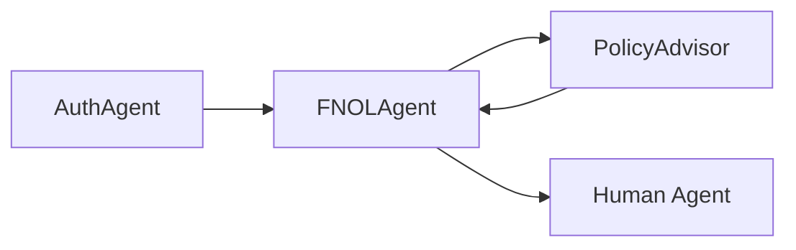
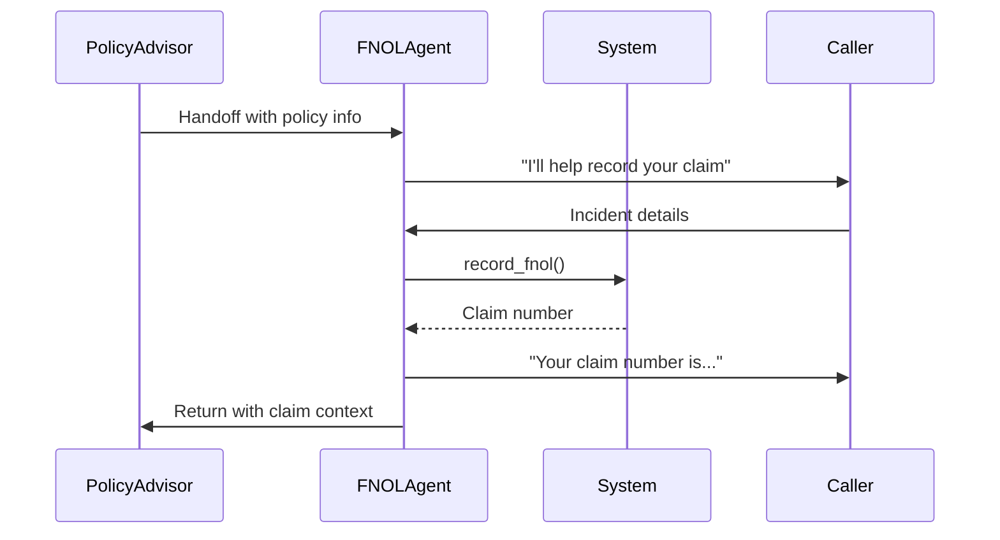

# FNOLAgent

First Notice of Loss specialist for insurance claims. Records incident details and initiates the claims process.

---

## Configuration

| Property | Value |
|----------|-------|
| **Name** | `FNOLAgent` |
| **Industry** | Insurance |
| **Entry Point** | No |
| **Handoff Trigger** | `handoff_fnol_agent` |
| **Voice** | `en-US-OnyxTurboMultilingualNeural` |

**Source:** `apps/artagent/backend/registries/agentstore/fnol_agent/agent.yaml`

---

## Capabilities

- Record First Notice of Loss
- Capture incident details (date, location, description)
- Initiate claims process
- Hand off to PolicyAdvisor for follow-up

---

## Tools

### FNOL Recording
| Tool | Purpose |
|------|---------|
| `record_fnol` | Record complete FNOL with all details |

### Handoffs
| Tool | Destination Agent |
|------|-------------------|
| `handoff_policy_advisor` | [PolicyAdvisor](policy-advisor.md) |

### Escalation
| Tool | Purpose |
|------|---------|
| `escalate_human` | Transfer to human agent |
| `escalate_emergency` | Emergency escalation |

---

## Handoff Graph



---

## Voice Configuration

```yaml
voice:
  name: en-US-OnyxTurboMultilingualNeural
  type: azure-standard
  rate: "0%"
```

---

## Prompt Template

Located at: `apps/artagent/backend/registries/agentstore/fnol_agent/prompt.jinja`

### Context Variables
| Variable | Description |
|----------|-------------|
| `caller_name` | Authenticated caller name |
| `policy_number` | Relevant policy number |
| `incident_type` | Type of loss (auto, property, etc.) |
| `handoff_context` | Context from PolicyAdvisor |

### FNOL Data Model
| Field | Description |
|-------|-------------|
| `incident_date` | When the incident occurred |
| `incident_location` | Where it happened |
| `incident_description` | What happened |
| `parties_involved` | Other parties/witnesses |
| `police_report` | Report number if applicable |
| `damage_description` | Description of damages |

---

## Usage Scenarios

### Standard FNOL Flow
1. PolicyAdvisor identifies need for FNOL
2. Hands off to FNOLAgent with policy context
3. FNOLAgent gathers incident details:
   - Date and time of incident
   - Location
   - Description of what happened
   - Parties involved
4. Records FNOL in system
5. Provides claim number
6. Hands back to PolicyAdvisor

### Emergency Flow
For severe incidents, FNOLAgent can escalate directly to human agents for immediate assistance.

---

## FNOL Workflow



---

## Related Agents

- [PolicyAdvisor](policy-advisor.md) - Primary router and return point
- [ClaimsSpecialist](claims-specialist.md) - Claims processing
- [AuthAgent](auth-agent.md) - Identity verification
