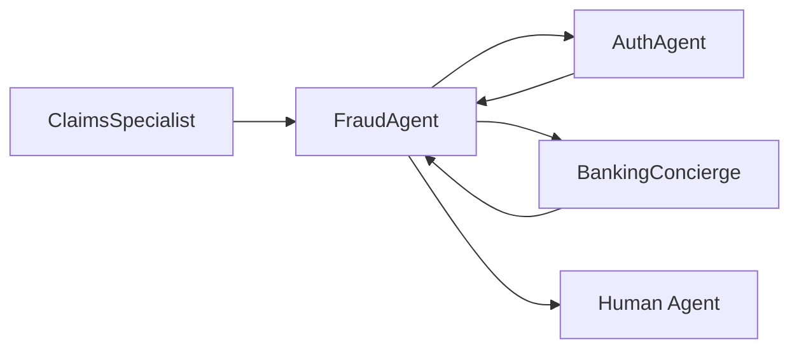

# FraudAgent

Post-authentication fraud detection and investigation specialist. Handles suspicious activity reports, card blocking, and dispute creation.

---

## Configuration

| Property | Value |
|----------|-------|
| **Name** | `FraudAgent` |
| **Industry** | Banking |
| **Entry Point** | No |
| **Handoff Trigger** | `handoff_fraud_agent` |
| **Voice** | `en-US-OnyxTurboMultilingualNeural` |

**Source:** `apps/artagent/backend/registries/agentstore/fraud_agent/agent.yaml`

---

## Capabilities

- Analyze recent transactions for fraud patterns
- Emergency card blocking
- Create fraud cases and disputes
- Ship replacement cards
- Fraud education and prevention tips

---

## Tools

### Investigation
| Tool | Purpose |
|------|---------|
| `analyze_recent_transactions` | Scan transactions for suspicious patterns |
| `check_suspicious_activity` | Check for known fraud indicators |

### Response Actions
| Tool | Purpose |
|------|---------|
| `block_card_emergency` | Immediately block compromised card |
| `create_fraud_case` | Open fraud investigation case |
| `create_transaction_dispute` | Dispute specific transactions |
| `ship_replacement_card` | Order replacement card |
| `send_fraud_case_email` | Email case details to customer |

### Education
| Tool | Purpose |
|------|---------|
| `provide_fraud_education` | Share fraud prevention tips |
| `search_knowledge_base` | Look up fraud-related information |

### Handoffs
| Tool | Destination Agent |
|------|-------------------|
| `handoff_to_auth` | [AuthAgent](auth-agent.md) |
| `handoff_concierge` | [BankingConcierge](banking-concierge.md) |

### Escalation
| Tool | Purpose |
|------|---------|
| `escalate_human` | Transfer to human fraud specialist |
| `escalate_emergency` | Critical emergency escalation |
| `transfer_call_to_call_center` | Direct call center transfer |

---

## Handoff Graph



---

## Voice Configuration

```yaml
voice:
  name: en-US-OnyxTurboMultilingualNeural
  type: azure-standard
  rate: "1%"
```

---

## Prompt Template

Located at: `apps/artagent/backend/registries/agentstore/fraud_agent/prompt.jinja`

### Context Variables
| Variable | Description |
|----------|-------------|
| `caller_name` | Authenticated caller name |
| `accounts` | User's accounts |
| `suspicious_transactions` | Flagged transactions |
| `fraud_case_id` | Open case ID if exists |
| `handoff_context` | Context from routing agent |

---

## Usage Scenarios

### Fraud Report Flow
1. Customer reports suspicious transaction
2. FraudAgent analyzes recent activity
3. If fraud confirmed: block card, create case, ship replacement
4. Provide fraud education

### Cross-Domain Flow
Insurance ClaimsSpecialist may hand off to FraudAgent when detecting potential insurance fraud patterns.

---

## Related Agents

- [BankingConcierge](banking-concierge.md) - Returns after investigation
- [AuthAgent](auth-agent.md) - Step-up authentication
- [ClaimsSpecialist](claims-specialist.md) - Insurance fraud detection
