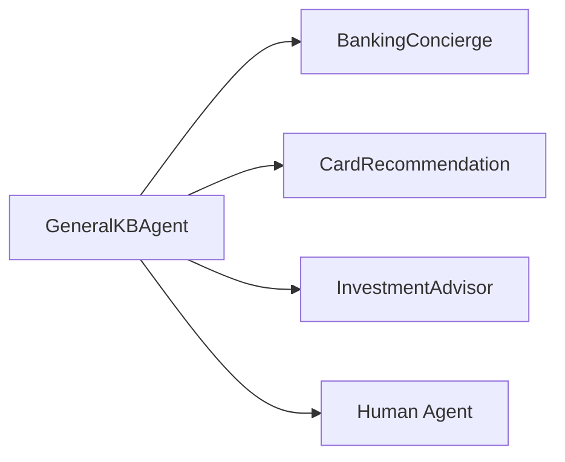

# GeneralKBAgent

Knowledge base assistant for general inquiries. Provides product information, FAQs, and policy information without authentication.

---

## Configuration

| Property | Value |
|----------|-------|
| **Name** | `GeneralKBAgent` |
| **Industry** | Cross-Domain |
| **Entry Point** | No |
| **Handoff Trigger** | `handoff_general_kb` |
| **Voice** | `en-US-OnyxTurboMultilingualNeural` |

**Source:** `apps/artagent/backend/registries/agentstore/custom_agent/agent.yaml`

---

## Capabilities

- Answer general product/service questions
- Search knowledge base for information
- Route to specialists when account access needed
- No authentication required for basic info

---

## Tools

### Knowledge Base
| Tool | Purpose |
|------|---------|
| `search_knowledge_base` | Search general information |

### Handoffs
| Tool | Destination Agent |
|------|-------------------|
| `handoff_concierge` | [BankingConcierge](banking-concierge.md) |
| `handoff_card_recommendation` | [CardRecommendation](card-recommendation.md) |
| `handoff_investment_advisor` | [InvestmentAdvisor](investment-advisor.md) |

### Escalation
| Tool | Purpose |
|------|---------|
| `escalate_human` | Transfer to human agent |

---

## Handoff Graph



---

## Voice Configuration

```yaml
voice:
  name: en-US-OnyxTurboMultilingualNeural
  type: azure-standard
  rate: "0%"
```

---

## Inline Prompt

This agent uses an inline prompt rather than a Jinja template file:

```yaml
prompt: |
  You are a friendly and knowledgeable assistant for {{ institution_name | default('Contoso Bank') }}.
  
  # YOUR ROLE
  - Answer general questions about products, services, and policies
  - Search the knowledge base to find accurate information
  - Guide users to specialists when they need account-specific help
  ...
```

### Context Variables
| Variable | Description |
|----------|-------------|
| `institution_name` | Bank/company name |
| `caller_name` | Caller name if available |
| `handoff_context` | Topic of interest |

---

## Usage Scenarios

### General Inquiry Flow
1. Caller asks about products or policies
2. Agent searches knowledge base
3. Provides answer from knowledge base
4. Offers to search for more details

### Account-Needed Flow
1. Caller asks about their specific account
2. Agent recognizes need for authentication
3. Explains and hands off to BankingConcierge
4. BankingConcierge handles verification

### Product Interest Flow
1. Caller shows interest in specific product
2. Agent provides general info
3. Offers handoff to specialist (CardRecommendation, InvestmentAdvisor)

---

## Knowledge Base Collections

| Collection | Content |
|------------|---------|
| `general` | General info, security tips, contact info |
| `products` | Credit cards, accounts, loans, services |
| `policies` | Fee policies, fraud protection, terms |
| `faq` | Common questions and how-to guides |

---

## No-Auth Context

This agent operates in a pre-authentication context:
- Provides publicly available information only
- Cannot access account-specific data
- Must hand off for balance, transactions, etc.

---

## Related Agents

- [BankingConcierge](banking-concierge.md) - Authenticated account access
- [CardRecommendation](card-recommendation.md) - Card product specialist
- [InvestmentAdvisor](investment-advisor.md) - Retirement specialist
