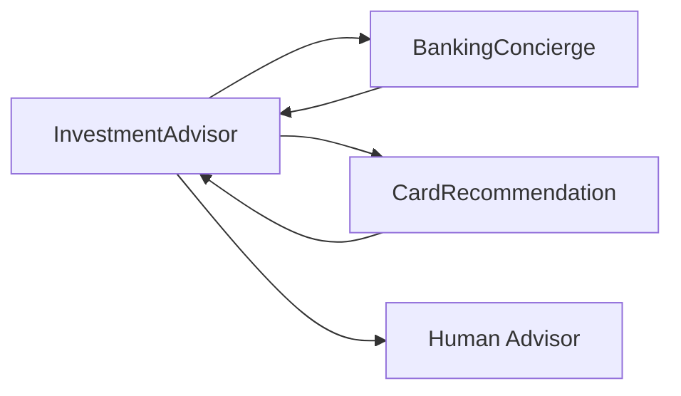

# InvestmentAdvisor Agent

Retirement accounts specialist. Handles 401(k) inquiries, IRA management, rollover guidance, and tax impact calculations.

---

## Configuration

| Property | Value |
|----------|-------|
| **Name** | `InvestmentAdvisor` |
| **Industry** | Banking |
| **Entry Point** | No |
| **Handoff Trigger** | `handoff_investment_advisor` |
| **Voice** | `en-US-OnyxTurboMultilingualNeural` |

**Source:** `apps/artagent/backend/registries/agentstore/investment_advisor/agent.yaml`

---

## Capabilities

- Retirement account information (401k, IRA)
- Rollover options and guidance
- Tax impact calculations
- Account routing information
- Investment knowledge base search

---

## Tools

### Retirement Accounts
| Tool | Purpose |
|------|---------|
| `get_retirement_accounts` | List all retirement accounts |
| `get_401k_details` | Detailed 401(k) information |
| `get_rollover_options` | Available rollover paths |
| `calculate_tax_impact` | Tax implications of decisions |
| `search_rollover_guidance` | Rollover rules and regulations |

### Account Operations
| Tool | Purpose |
|------|---------|
| `get_account_routing_info` | Bank routing details |
| `get_account_summary` | General account summary |

### Handoffs
| Tool | Destination Agent |
|------|-------------------|
| `handoff_bank_advisor` | Bank advisor specialist |
| `handoff_card_recommendation` | [CardRecommendation](card-recommendation.md) |
| `handoff_concierge` | [BankingConcierge](banking-concierge.md) |

### Escalation
| Tool | Purpose |
|------|---------|
| `escalate_human` | Transfer to human advisor |
| `escalate_emergency` | Emergency escalation |

---

## Handoff Graph



---

## Voice Configuration

```yaml
voice:
  name: en-US-OnyxTurboMultilingualNeural
  type: azure-standard
  rate: "0%"
```

---

## Prompt Template

Located at: `apps/artagent/backend/registries/agentstore/investment_advisor/prompt.jinja`

### Context Variables
| Variable | Description |
|----------|-------------|
| `caller_name` | Authenticated caller name |
| `retirement_accounts` | List of retirement accounts |
| `current_employer` | Current 401(k) employer |
| `rollover_in_progress` | Active rollover details |
| `handoff_context` | Context from routing agent |

---

## Usage Scenarios

### 401(k) Inquiry Flow
1. Customer asks about 401(k) balance
2. Agent retrieves account details
3. Explains vesting, contributions, matches

### Rollover Flow
1. Customer wants to rollover old 401(k)
2. Agent explains options (Traditional IRA, Roth, new 401k)
3. Calculates tax impact
4. Provides routing information for transfer

### Cross-Sell Flow
After handling retirement question, may hand off to CardRecommendation if customer shows interest in banking products.

---

## Compliance Notes

- Investment advice must include appropriate disclosures
- Tax calculations are estimates, not tax advice
- Complex situations escalate to human advisor

---

## Related Agents

- [BankingConcierge](banking-concierge.md) - Entry point and return
- [CardRecommendation](card-recommendation.md) - Cross-sell opportunities
