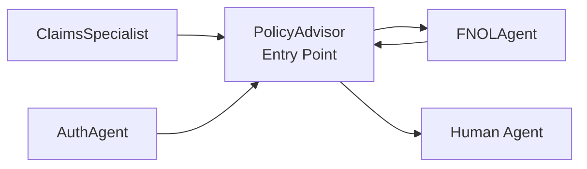

# PolicyAdvisor Agent

Entry point for insurance customers. Provides policy information, coverage details, and routes to Claims or FNOL specialists.

---

## Configuration

| Property | Value |
|----------|-------|
| **Name** | `PolicyAdvisor` |
| **Industry** | Insurance |
| **Entry Point** | ✅ Yes |
| **Handoff Trigger** | `handoff_policy_advisor` |
| **Voice** | `en-US-OnyxTurboMultilingualNeural` |

**Source:** `apps/artagent/backend/registries/agentstore/policy_advisor/agent.yaml`

---

## Capabilities

- List user's insurance policies
- Retrieve policy details and documentation
- Check coverage for specific scenarios
- Provide claims summary
- Route to FNOL or Claims specialists

---

## Tools

### Policy Information
| Tool | Purpose |
|------|---------|
| `list_user_policies` | List all policies for the caller |
| `get_policy_details` | Retrieve specific policy details |
| `search_policy_info` | Search policy documentation |
| `check_coverage` | Verify coverage for a scenario |
| `get_claims_summary` | Summarize claim history |
| `search_knowledge_base` | General insurance knowledge |

### Handoffs
| Tool | Destination Agent |
|------|-------------------|
| `handoff_fnol_agent` | [FNOLAgent](fnol-agent.md) |

### Escalation
| Tool | Purpose |
|------|---------|
| `escalate_human` | Transfer to human agent |
| `escalate_emergency` | Emergency escalation |

---

## Handoff Graph



---

## Voice Configuration

```yaml
voice:
  name: en-US-OnyxTurboMultilingualNeural
  type: azure-standard
  rate: "5%"
```

---

## Prompt Template

Located at: `apps/artagent/backend/registries/agentstore/policy_advisor/prompt.jinja`

### Context Variables
| Variable | Description |
|----------|-------------|
| `caller_name` | Authenticated caller name |
| `customer_id` | Customer identifier |
| `policies` | List of user's policies |
| `current_policy` | Selected policy in focus |
| `handoff_context` | Context from previous agent |

---

## Usage Scenarios

### Policy Inquiry Flow
1. Caller asks about their policy
2. PolicyAdvisor retrieves and explains coverage
3. Answers follow-up questions

### New Claim Flow
1. Caller reports an incident
2. PolicyAdvisor identifies need for FNOL
3. Hands off to FNOLAgent with context
4. FNOLAgent records claim, returns to PolicyAdvisor

### Return Flow
After FNOL or Claims processing, caller returns to PolicyAdvisor for additional questions.

---

## Related Agents

- [FNOLAgent](fnol-agent.md) - First Notice of Loss
- [ClaimsSpecialist](claims-specialist.md) - Claims processing
- [AuthAgent](auth-agent.md) - Identity verification
