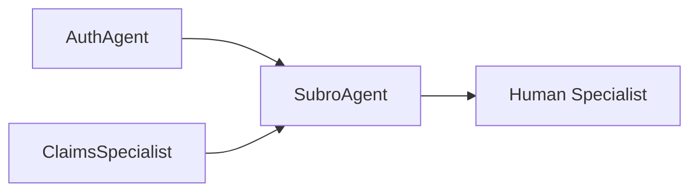

# SubroAgent

B2B subrogation specialist for insurance recovery. Handles inter-company claim recovery, liability decisions, and demand management.

---

## Configuration

| Property | Value |
|----------|-------|
| **Name** | `SubroAgent` |
| **Industry** | Insurance |
| **Entry Point** | No |
| **Handoff Trigger** | `handoff_subro_agent` |
| **Voice** | `en-US-OnyxTurboMultilingualNeural` |

**Source:** `apps/artagent/backend/registries/agentstore/subro_agent/agent.yaml`

---

## Capabilities

- Claim summary retrieval
- Subrogation demand status tracking
- Coverage and liability decisions
- Policy limits and payments
- Multi-claim management
- Rush criteria evaluation

---

## Tools

### Claim Information
| Tool | Purpose |
|------|---------|
| `get_claim_summary` | Overview of claim details |
| `get_subro_demand_status` | Subrogation demand tracking |
| `get_coverage_status` | Coverage verification |
| `get_liability_decision` | Liability determination |
| `get_pd_policy_limits` | Property damage limits |
| `get_pd_payments` | Payment history |

### Operations
| Tool | Purpose |
|------|---------|
| `resolve_feature_owner` | Identify responsible adjuster |
| `get_subro_contact_info` | Contact information lookup |
| `switch_claim` | Change active claim |
| `evaluate_rush_criteria` | Emergency processing check |
| `create_isrush_diary` | Flag for rush processing |
| `append_claim_note` | Add notes to claim file |
| `close_and_document_call` | Finalize call documentation |

### Escalation
| Tool | Purpose |
|------|---------|
| `escalate_human` | Transfer to human specialist |

---

## Handoff Graph



---

## Voice Configuration

```yaml
voice:
  name: en-US-OnyxTurboMultilingualNeural
  type: azure-standard
  rate: "0%"
```

---

## Prompt Template

Located at: `apps/artagent/backend/registries/agentstore/subro_agent/prompt.jinja`

### Context Variables
| Variable | Description |
|----------|-------------|
| `caller_name` | B2B representative name |
| `caller_company` | Calling insurance company |
| `claim_number` | Claim in discussion |
| `demand_amount` | Recovery demand amount |
| `liability_split` | Agreed liability percentage |

---

## Usage Scenarios

### Demand Status Flow (B2B)
1. Other carrier calls for demand status
2. Agent retrieves claim and demand details
3. Provides status, payments, remaining balance
4. Documents call

### Liability Decision Flow
1. Caller requests liability decision
2. Agent retrieves decision and rationale
3. Explains policy limits
4. Handles disputes or confirms agreement

### Rush Processing Flow
1. Caller requests expedited processing
2. Agent evaluates rush criteria
3. If qualified, creates rush diary entry
4. If not, explains standard timeline

---

## B2B Context

This agent primarily handles Business-to-Business interactions with other insurance carriers for subrogation recovery. Key differences from consumer-facing agents:

- Professional terminology expected
- Claim numbers from both parties
- Demand letter references
- Arbitration process knowledge

---

## Related Agents

- [ClaimsSpecialist](claims-specialist.md) - Claims processing
- [AuthAgent](auth-agent.md) - Identity verification
