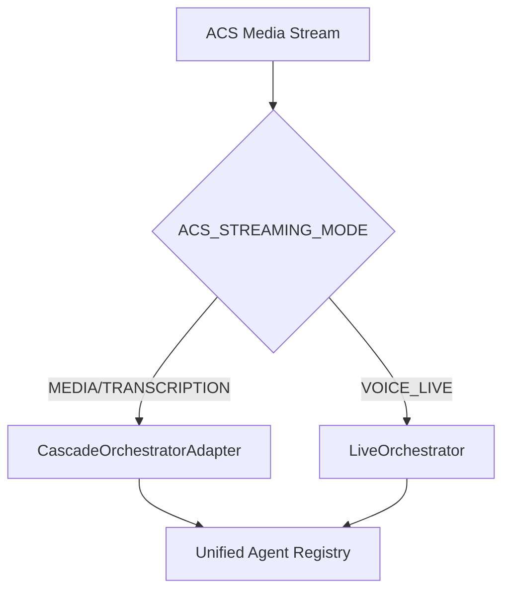

# :material-brain: LLM Orchestration Architecture

!!! warning "Documentation Reorganized"
    This page has been superseded by the new **Orchestration documentation**. Please refer to the updated documentation for the latest architecture details.

## :material-arrow-right: Quick Navigation

The LLM orchestration architecture documentation has been reorganized into a dedicated section:

| Document | Description |
|----------|-------------|
| **[Orchestration Overview](orchestration/README.md)** | Dual orchestration architecture, mode selection, shared components |
| **[Cascade Orchestrator](orchestration/cascade.md)** | SpeechCascade mode with Azure Speech SDK |
| **[VoiceLive Orchestrator](orchestration/voicelive.md)** | VoiceLive mode with OpenAI Realtime API |
| **[Agent Framework](agent-framework.md)** | YAML-driven agent configuration system |
| **[Handoff Strategies](handoff-strategies.md)** | Multi-agent routing patterns |

---

## :material-sitemap: Architecture Summary

The accelerator provides two orchestrator implementations:



### Mode Selection

```bash
# SpeechCascade mode (Azure Speech SDK)
export ACS_STREAMING_MODE=MEDIA

# VoiceLive mode (OpenAI Realtime API)
export ACS_STREAMING_MODE=VOICE_LIVE
```

### Key Files

| Component | Location |
|-----------|----------|
| **Cascade Orchestrator** | `apps/artagent/backend/voice/speech_cascade/orchestrator.py` |
| **VoiceLive Orchestrator** | `apps/artagent/backend/voice/voicelive/orchestrator.py` |
| **Agent Framework** | `apps/artagent/backend/agents/` |
| **Tool Registry** | `apps/artagent/backend/agents/tools/registry.py` |

---

## :material-update: Migration from Legacy Architecture

!!! info "What Changed"
    The following legacy paths referenced in older documentation are no longer used:
    
    - ~~`apps/artagent/backend/src/agents/artagent/`~~ → Use `apps/artagent/backend/agents/`
    - ~~`apps/artagent/backend/src/orchestration/artagent/`~~ → Use orchestrators in `voice/`
    - ~~`apps/artagent/backend/src/agents/Lvagent/`~~ → Use `voice/voicelive/`
    
    The new **Unified Agent Framework** consolidates agent definitions in YAML and provides a single agent registry used by both orchestrators.

---

## :material-book-open-variant: Further Reading

- [Orchestration Overview](orchestration/README.md) — Complete architecture documentation
- [Agent Framework](agent-framework.md) — How agents are configured
- [Streaming Modes](streaming-modes.md) — Audio processing comparison
