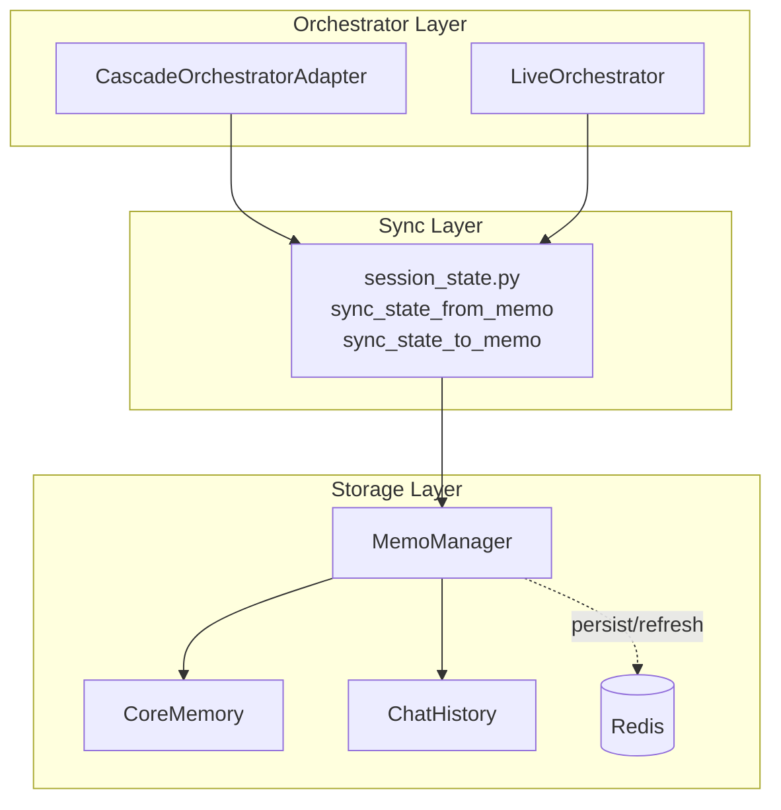

# Session State Management

> **Technical reference for MemoManager, session state sync, and Redis persistence patterns.**

---

## Overview

Session management in the real-time voice agent architecture is handled by three key components:

| Component | Location | Purpose |
|-----------|----------|---------|
| **MemoManager** | `src/stateful/state_managment.py` | Core session state container with Redis persistence |
| **session_state.py** | `apps/artagent/backend/voice/shared/session_state.py` | Orchestrator ↔ MemoManager sync utilities |
| **session_loader.py** | `apps/artagent/backend/src/services/session_loader.py` | User profile resolution (Cosmos DB / mock) |



---

## MemoManager Deep Dive

### Purpose

`MemoManager` is the central state container for a voice agent session. It manages:

- **Core Memory** - Key-value store for session context (user profile, slots, tool outputs)
- **Chat History** - Per-agent conversation threads
- **Message Queue** - TTS playback queue with interrupt handling
- **Latency Tracking** - Performance metrics per processing stage
- **Redis Sync** - Async persistence and live refresh

### Redis Key Pattern

```python
# Key format: session:{session_id}
key = f"session:{session_id}"

# Stored as Redis hash with two fields:
{
    "corememory": "{...JSON...}",  # CoreMemory state
    "chat_history": "{...JSON...}"  # ChatHistory per agent
}
```

### Core Memory Structure

```python
# Example corememory contents after a session
{
    # Orchestration state (synced by session_state.py)
    "active_agent": "EricaConcierge",
    "visited_agents": ["Concierge", "FraudAgent"],
    "session_profile": {
        "full_name": "John Smith",
        "client_id": "CLT-001-JS",
        "institution_name": "Contoso Bank",
        "customer_intelligence": {...}
    },
    "client_id": "CLT-001-JS",
    "caller_name": "John Smith",
    
    # Slots (dynamic config)
    "slots": {
        "preferred_language": "en-US",
        "conversation_mode": "formal"
    },
    
    # Tool outputs (persisted for context)
    "tool_outputs": {
        "check_balance": {"balance": 45230.50, "currency": "USD"},
        "recent_transactions": [...]
    },
    
    # Latency tracking
    "latency": {
        "runs": {...},
        "order": [...]
    },
    
    # TTS state
    "tts_interrupted": false
}
```

### Chat History Structure

```python
# Per-agent conversation threads
{
    "EricaConcierge": [
        {"role": "system", "content": "You are a helpful concierge..."},
        {"role": "user", "content": "What's my balance?"},
        {"role": "assistant", "content": "Your balance is $45,230.50"}
    ],
    "FraudAgent": [
        {"role": "system", "content": "You are a fraud specialist..."},
        {"role": "user", "content": "I see a suspicious charge"},
        {"role": "assistant", "content": "I'll help investigate..."}
    ]
}
```

---

## Session State Sync (session_state.py)

### Overview

Provides a **single source of truth** for syncing orchestrator state with MemoManager. Both `CascadeOrchestratorAdapter` and `LiveOrchestrator` use these utilities.

### Key Constants

```python
class SessionStateKeys:
    """Standard keys used in MemoManager for session state."""
    
    ACTIVE_AGENT = "active_agent"       # Currently active agent name
    VISITED_AGENTS = "visited_agents"   # Set of visited agents
    SESSION_PROFILE = "session_profile" # User profile dict
    CLIENT_ID = "client_id"             # Unique client identifier
    CALLER_NAME = "caller_name"         # Display name for personalization
    PENDING_HANDOFF = "pending_handoff" # Queued state-based handoff
```

### Sync Functions

#### `sync_state_from_memo()` - Load State

```python
from apps.artagent.backend.voice.shared.session_state import sync_state_from_memo

# In orchestrator initialization
state = sync_state_from_memo(
    memo_manager,
    available_agents=set(self.agents.keys())  # Validates agent exists
)

# Returns SessionState dataclass:
# state.active_agent     → "EricaConcierge" or None
# state.visited_agents   → {"Concierge", "FraudAgent"}
# state.system_vars      → {"session_profile": {...}, "client_id": "..."}
# state.pending_handoff  → {"target_agent": "...", "reason": "..."}
```

#### `sync_state_to_memo()` - Persist State

```python
from apps.artagent.backend.voice.shared.session_state import sync_state_to_memo

# At end of each turn or after handoff
sync_state_to_memo(
    memo_manager,
    active_agent=self.active,
    visited_agents=self.visited_agents,
    system_vars=self._system_vars,
    clear_pending_handoff=True  # After processing handoff
)
```

---

## User Profile Loading

### Profile Sources

1. **Cosmos DB** - Production user database (`demo_users` collection)
2. **Mock Data** - Fallback for development/testing

### API

```python
from apps.artagent.backend.src.services.session_loader import (
    load_user_profile_by_client_id,
    load_user_profile_by_email,
)

# Lookup by client_id (primary method)
profile = await load_user_profile_by_client_id("CLT-001-JS")

# Returns:
{
    "full_name": "John Smith",
    "client_id": "CLT-001-JS",
    "institution_name": "Contoso Bank",
    "contact_info": {"email": "...", "phone_last_4": "5678"},
    "customer_intelligence": {
        "relationship_context": {"relationship_tier": "Platinum"},
        "bank_profile": {...},
        "spending_patterns": {...}
    }
}
```

---

## Redis Persistence Patterns

### Sync vs Async

| Method | Use Case | Blocking? |
|--------|----------|-----------|
| `persist_to_redis()` | Cleanup/shutdown | Yes |
| `persist_to_redis_async()` | End of turn | No (awaitable) |
| `persist_background()` | Hot path | No (fire-and-forget) |

### Example: Hot Path Optimization

```python
# ❌ Bad - blocks the turn completion
await memo_manager.persist_to_redis_async(redis_mgr)

# ✅ Better - non-blocking background task
await memo_manager.persist_background(redis_mgr)
```

### TTL for Session Cleanup

```python
# Auto-expire sessions after 2 hours
await memo_manager.persist_to_redis_async(redis_mgr, ttl_seconds=7200)
```

---

## Latency Tracking

### Recording Latency

```python
import time

start = time.time()
result = await speech_to_text(audio)
memo_manager.note_latency("stt", start, time.time())

start = time.time()
response = await llm.complete(messages)
memo_manager.note_latency("llm", start, time.time())
```

### Getting Summary

```python
stats = memo_manager.latency_summary()
# {
#     'stt': {'avg': 0.245, 'min': 0.180, 'max': 0.350, 'count': 12},
#     'llm': {'avg': 1.450, 'min': 0.800, 'max': 2.100, 'count': 10}
# }
```

---

## TTS Interrupt Handling

### Local State

```python
# Check if interrupted
if memo_manager.is_tts_interrupted():
    return  # Skip TTS

# Set interrupted
memo_manager.set_tts_interrupted(True)
```

### Distributed State (via Redis)

```python
# Set across all processes
await memo_manager.set_tts_interrupted_live(redis_mgr, session_id, True)

# Check with Redis sync
is_interrupted = await memo_manager.is_tts_interrupted_live(redis_mgr, session_id)
```

---

## Message Queue

For sequential TTS playback with interrupt support:

```python
# Enqueue message for playback
await memo_manager.enqueue_message(
    response_text="Hello, how can I help?",
    voice_name="en-US-JennyNeural",
    locale="en-US"
)

# Process queue
while message := await memo_manager.get_next_message():
    if memo_manager.is_media_cancelled():
        break
    await play_tts(message)

# Handle interrupt
await memo_manager.reset_queue_on_interrupt()
```

---

## SessionAgentManager (Advanced)

For per-session agent configuration overrides:

```python
from apps.artagent.backend.agents.session_manager import SessionAgentManager

mgr = SessionAgentManager(
    session_id="session_123",
    base_agents=discover_agents(),
    memo_manager=memo,
)

# Get agent with session overrides applied
agent = mgr.get_agent("EricaConcierge")

# Modify at runtime
mgr.update_agent_prompt("EricaConcierge", "New instructions...")
await mgr.persist()
```

!!! note "Future Use"
    `SessionAgentManager` is not yet integrated into production orchestrators.
    It's designed for A/B testing and admin UI prompt tuning.

---

## Quick Reference: Common Operations

| Task | Code |
|------|------|
| Get active agent | `mm.get_value_from_corememory("active_agent")` |
| Set active agent | `mm.set_corememory("active_agent", "EricaConcierge")` |
| Get session profile | `mm.get_context("session_profile")` |
| Get agent history | `mm.get_history("EricaConcierge")` |
| Add to history | `mm.append_to_history("EricaConcierge", "user", "Hello")` |
| Store tool output | `mm.persist_tool_output("check_balance", {"balance": 123.45})` |
| Get slot value | `mm.get_slot("preferred_language", "en-US")` |
| Persist to Redis | `await mm.persist_to_redis_async(redis_mgr)` |
| Refresh from Redis | `await mm.refresh_from_redis_async(redis_mgr)` |

---

## Related Documentation

- [Orchestration Overview](../orchestration/README.md) - How orchestrators use session state
- [Agent Framework](../agents/README.md) - Agent configuration and loading
- [Handoff Strategies](../agents/handoffs.md) - Context preservation during handoffs
