# :material-brain: Agent Memory Management

!!! abstract "Per-Agent Memory Architecture"
    This document describes how **conversation history, slots, and context** are managed across agents in the multi-agent voice orchestration system. Each agent maintains isolated memory threads while sharing session-level state.

## :material-table: Quick Reference

!!! tip "Orchestrator Comparison"
    The two orchestrators handle memory differently based on their architecture patterns.

| Feature | Cascade Orchestrator | VoiceLive Orchestrator |
|---------|:--------------------:|:----------------------:|
| **Chat History Storage** | MemoManager per-agent threads | Model-managed (SDK) |
| **History Retrieval** | `cm.get_history(agent_name)` | N/A - model internal |
| **History Persistence** | `cm.append_to_history()` | Transcriptions stored separately |
| **Slots/Context** | `cm.get_context("slots")` | `cm.get_context("slots")` |
| **State Sync** | Shared utilities | Shared utilities |
| **Agent Switching** | Re-queries history | Session reconfiguration |

---

## :material-arrow-decision: Cascade Orchestrator

!!! success "Per-Agent History Management"
    The Cascade orchestrator maintains **isolated conversation threads** per agent in MemoManager.

### History Retrieval

Each turn retrieves the active agent's history:

```python
# In process_user_input()
history = cm.get_history(self._active_agent)  # Per-agent history
```

### History Persistence

Messages are appended to the agent's thread after each turn:

```python
# User message
cm.append_to_history(self._active_agent, "user", transcript)

# Assistant response  
cm.append_to_history(self._active_agent, "assistant", result.response_text)
```

### :material-tools: Tool Call History Persistence

!!! success "Tool Calls Preserved Across Turns"
    Tool calls and their results are persisted to MemoManager as JSON-encoded messages, ensuring conversation continuity across turns.

When a tool is executed during a turn:

1. **Assistant message with tool_calls** is persisted as JSON
2. **Tool result messages** are persisted as JSON
3. **`_build_messages()`** decodes these JSON messages when building the next request

```python
# In _process_llm() - persist assistant message with tool calls
cm.append_to_history(
    self._active_agent, 
    "assistant", 
    json.dumps(assistant_msg)  # Includes tool_calls structure
)

# Persist each tool result
cm.append_to_history(
    self._active_agent,
    "tool",
    json.dumps(tool_result_msg)  # Includes tool_call_id, name, content
)
```

When building messages for the next turn, `_build_messages()` automatically decodes JSON-encoded messages:

```python
# In _build_messages() - decode JSON messages
for msg in context.conversation_history:
    if role in ("assistant", "tool") and content.startswith("{"):
        try:
            decoded = json.loads(content)
            if isinstance(decoded, dict) and "role" in decoded:
                messages.append(decoded)  # Full message structure restored
                continue
        except json.JSONDecodeError:
            pass
    messages.append(msg)  # Regular message
```

### :material-swap-horizontal: Handoff Behavior

When switching agents, the new agent receives:

1. **Its own history** from MemoManager (if returning to a previously visited agent)
2. **User's original request** added as context if first visit
3. **Handoff context** via metadata for prompt rendering

```python
# Get the new agent's existing history
new_agent_history = list(cm.get_history(handoff_target) or [])

# If first visit, add user's request for context
if not new_agent_history and context.user_text:
    new_agent_history.append({"role": "user", "content": context.user_text})
```

---

## :material-lightning-bolt: VoiceLive Orchestrator

!!! info "Model-Managed Conversation"
    VoiceLive uses the **Azure VoiceLive SDK's internal conversation management**. The model maintains conversation state, not MemoManager.

### How It Works

- Conversation is maintained at the **model level** via the SDK
- Agent switching reconfigures the session with new prompts/tools
- Slots and context are passed via `system_vars` during handoff

### State Synchronization

Uses the same shared utilities as Cascade for session-level state:

```python
state = sync_state_from_memo(
    self._memo_manager,
    available_agents=set(self.agents.keys()),
)
```

### Agent Switching

Slots and tool outputs are included during agent switch:

```python
if self._memo_manager:
    slots = self._memo_manager.get_context("slots", {})
    system_vars.setdefault("slots", slots)
    system_vars.setdefault("collected_information", slots)
```

!!! warning "Design Limitation"
    VoiceLive does **not** persist per-agent chat history to MemoManager. This is by design—the SDK manages conversation internally for real-time performance.

---

## :material-database: MemoManager Architecture

### Memory Structure

```mermaid
flowchart TD
    subgraph MemoManager ["📦 MemoManager (Session-Scoped)"]
        subgraph CoreMemory ["🔑 CoreMemory (Key-Value)"]
            A["slots"]
            B["session_profile"]
            C["active_agent"]
            D["visited_agents"]
            E["tool_outputs"]
        end
        
        subgraph ChatHistory ["💬 ChatHistory (Per-Agent Threads)"]
            F["Concierge Thread"]
            G["FraudAgent Thread"]
            H["PayPalAgent Thread"]
        end
        
        subgraph MessageTypes ["📝 Message Types"]
            I["user: plain text"]
            J["assistant: text or JSON"]
            K["tool: JSON encoded"]
        end
    end
    
    subgraph Orchestrators ["🎭 Orchestrators"]
        L["CascadeOrchestrator"]
        M["LiveOrchestrator"]
    end
    
    L --> F
    L --> G
    L --> H
    L --> A
    M --> A
    M --> B
    F --> I
    F --> J
    F --> K
    
    classDef coreNode fill:#2196F3,stroke:#1565C0,stroke-width:2px,color:#fff
    classDef historyNode fill:#4CAF50,stroke:#2E7D32,stroke-width:2px,color:#fff
    classDef orchNode fill:#FF9800,stroke:#EF6C00,stroke-width:2px,color:#fff
    classDef msgNode fill:#9C27B0,stroke:#7B1FA2,stroke-width:2px,color:#fff
    
    class A,B,C,D,E coreNode
    class F,G,H historyNode
    class L,M orchNode
    class I,J,K msgNode
```



### ChatHistory Structure

```python
class ChatHistory:
    _threads: Dict[str, List[Dict[str, str]]]  # agent_name → messages
```

!!! note "Complex Message Storage"
    While ChatHistory stores `{"role": ..., "content": ...}` format, **tool-related messages** are stored with JSON-encoded content to preserve the full OpenAI message structure (including `tool_calls`, `tool_call_id`, etc.). The orchestrator decodes these when building messages.

### API Reference

| Method | Description |
|--------|-------------|
| `append_to_history(agent, role, content)` | Add message to agent's thread |
| `get_history(agent_name)` | Get all messages for agent |
| `clear_history(agent_name)` | Clear one or all agents |

### Usage Example

```python
# Write to agent's history
cm.append_to_history("FraudAgent", "user", "My SSN is 123-45-6789")
cm.append_to_history("FraudAgent", "assistant", "Thank you for verifying...")

# Tool call message (JSON-encoded for complex structure)
assistant_with_tools = {
    "role": "assistant",
    "content": None,
    "tool_calls": [{"id": "call_123", "type": "function", "function": {...}}]
}
cm.append_to_history("FraudAgent", "assistant", json.dumps(assistant_with_tools))

# Tool result message (JSON-encoded)
tool_result = {
    "role": "tool",
    "tool_call_id": "call_123",
    "name": "analyze_transactions",
    "content": '{"suspicious": true, "transactions": [...]}'
}
cm.append_to_history("FraudAgent", "tool", json.dumps(tool_result))

# Read agent's history
history = cm.get_history("FraudAgent")
# Returns mix of simple and JSON-encoded messages
```

---

## :material-sync: Shared State Sync

!!! note "Consistent State Management"
    Both orchestrators use shared utilities from `session_state.py` for session-level state.

### sync_state_from_memo()

Loads from MemoManager:

- `active_agent` - Currently active agent
- `visited_agents` - Set of previously visited agents
- `session_profile` - User profile data
- `pending_handoff` - Queued handoff if any

### sync_state_to_memo()

Persists to MemoManager:

- `active_agent`
- `visited_agents`  
- `session_profile`, `client_id`, `caller_name`, etc.

!!! tip "Chat History Handled Separately"
    Chat history is NOT synced via these utilities—it uses `append_to_history()` / `get_history()` directly.

---

## :material-lightbulb-on: Best Practices

### For Cascade Orchestrator

1. **Always retrieve per-agent history** at the start of each turn
2. **Persist both user and assistant messages** to maintain continuity
3. **Persist tool calls and results as JSON** to preserve the full message structure
4. **Include handoff context** when switching agents
5. **Decode JSON messages in `_build_messages()`** to restore tool call structures

### For VoiceLive Orchestrator

1. **Pass slots via system_vars** during agent switching
2. **Trust the SDK** for conversation management
3. **Log to MemoManager** for analytics if needed (optional)

---

## :material-rocket: Future: Structured Memory Agents

!!! abstract "Planned Enhancement"
    Building on the three-tier data architecture, we plan to introduce **structured memory agents** with intelligent caching and cross-session persistence.

### Architecture Vision

```mermaid
flowchart TD
    subgraph Memory ["🔥 Application Memory (Active Call)"]
        A["Active Agent State"]
        B["Working Memory Buffer"]
        C["Real-time Slots"]
    end
    
    subgraph Redis ["⚡ Redis (Session-Scoped)"]
        D["Agent Memory Threads"]
        E["Semantic Memory Index"]
        F["Cross-Agent Context"]
        G["Memory Embeddings Cache"]
    end
    
    subgraph Cosmos ["💾 Cosmos DB (Persistent)"]
        H["Long-term Agent Memory"]
        I["User Relationship History"]
        J["Learned Preferences"]
        K["Conversation Summaries"]
    end
    
    A --> D
    B --> E
    C --> F
    D --> H
    E --> I
    F --> J
    
    classDef memoryNode fill:#FF5722,stroke:#D84315,stroke-width:2px,color:#fff
    classDef redisNode fill:#FF9800,stroke:#F57C00,stroke-width:2px,color:#fff
    classDef cosmosNode fill:#4CAF50,stroke:#388E3C,stroke-width:2px,color:#fff
    
    class A,B,C memoryNode
    class D,E,F,G redisNode
    class H,I,J,K cosmosNode
```



### Planned Features

#### 1. Semantic Memory Layer

!!! tip "Intelligent Context Retrieval"
    Agents will retrieve relevant past interactions based on **semantic similarity**, not just recency.

```python
# Future API
class SemanticMemory:
    async def recall(self, query: str, agent: str, top_k: int = 5) -> List[MemoryChunk]:
        """Retrieve semantically relevant memories for the current context."""
        embeddings = await self.embed(query)
        return await self.vector_search(embeddings, agent_filter=agent, limit=top_k)
```

#### 2. Cross-Agent Memory Sharing

!!! info "Controlled Context Propagation"
    Agents can access shared memory with **permission-based visibility**.

| Memory Type | Visibility | Use Case |
|-------------|------------|----------|
| **Private** | Single agent only | Agent-specific learned behaviors |
| **Shared** | All agents in session | Collected user info (name, account) |
| **Global** | All sessions for user | User preferences, history |

#### 3. Memory Lifecycle Management

Aligns with the three-tier TTL strategy:

```python
MEMORY_TTL_POLICIES = {
    "working_memory": 30 * 60,           # 30 min (active call)
    "session_memory": 2 * 60 * 60,       # 2 hours (session context)
    "episodic_memory": 7 * 24 * 60 * 60, # 7 days (recent interactions)
    "semantic_memory": None,              # Permanent (learned knowledge)
}
```

#### 4. Memory Consolidation

!!! note "Nightly Processing"
    Background jobs will consolidate short-term memories into long-term storage.

```python
async def consolidate_memories(user_id: str):
    """
    Nightly job to:
    1. Summarize recent conversations
    2. Extract key facts and preferences
    3. Update user relationship model
    4. Prune redundant memories
    """
    recent = await redis.get_session_memories(user_id, days=1)
    summary = await llm.summarize(recent)
    await cosmos.upsert_user_memory(user_id, summary)
    await redis.prune_consolidated(user_id)
```

### Implementation Roadmap

| Phase | Feature | Status |
|-------|---------|--------|
| **Phase 1** | Per-agent chat history (MemoManager) | ✅ Complete |
| **Phase 2** | Cross-agent slot sharing | ✅ Complete |
| **Phase 3** | Redis-backed session persistence | ✅ Complete |
| **Phase 4** | Cosmos DB long-term storage | 🔄 In Progress |
| **Phase 5** | Semantic memory with embeddings | 📋 Planned |
| **Phase 6** | Memory consolidation jobs | 📋 Planned |

---

## :material-check-all: Summary

| Orchestrator | Per-Agent History | Status |
|--------------|-------------------|:------:|
| **Cascade** | Uses `get_history()` / `append_to_history()` | ✅ |
| **VoiceLive** | Model-managed (SDK) | ✅ |

Both orchestrators correctly manage per-agent memory for their respective architectures, with a clear path toward structured memory agents for enhanced personalization and context retention.
