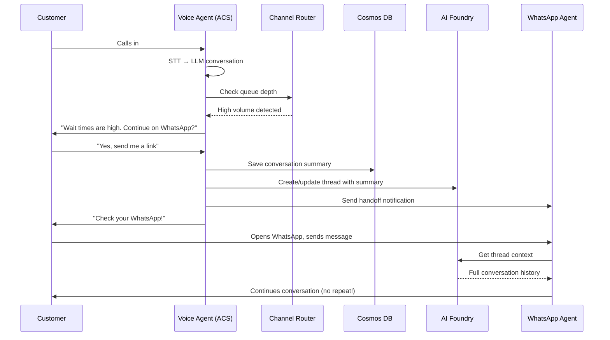

# Omnichannel Handoff Architecture

> **Status:** Proposed  
> **Author:** Architecture Team  
> **Date:** January 2026

## Overview

This document describes an architecture for **multi-channel handoff with conversation continuity** — enabling customers to seamlessly move between voice calls, WhatsApp, and web chat without repeating themselves.

## Problem Statement

When call volumes are high, customers face long wait times. We want to:
1. **Detect high volume** and proactively offer alternative channels
2. **Preserve conversation context** across voice → WhatsApp → web chat
3. **Use a unified multi-agent architecture** via Azure AI Foundry
4. **Ensure consistent data recording** so customers never repeat themselves

---

## Customer Journey

```
┌─────────────────────────────────────────────────────────────────────────────┐
│                         CUSTOMER JOURNEY                                     │
├─────────────────────────────────────────────────────────────────────────────┤
│                                                                              │
│   📞 PHONE CALL                                                              │
│   ┌─────────────┐     ┌──────────────────┐     ┌───────────────────┐        │
│   │  Customer   │────▶│ ACS Voice Agent  │────▶│  High Volume?     │        │
│   │   Calls     │     │  (STT → LLM)     │     │  Check Queue      │        │
│   └─────────────┘     └──────────────────┘     └─────────┬─────────┘        │
│                                                          │                   │
│                              ┌───────────────────────────┴─────┐             │
│                              ▼                                 ▼             │
│                    ┌─────────────────┐              ┌─────────────────┐      │
│                    │  LOW VOLUME     │              │  HIGH VOLUME    │      │
│                    │  Continue Call  │              │  Offer Handoff  │      │
│                    └─────────────────┘              └────────┬────────┘      │
│                                                              │               │
│   📱 CHANNEL HANDOFF                                         ▼               │
│   ┌─────────────────────────────────────────────────────────────────┐       │
│   │              Azure AI Foundry Multi-Agent Hub                    │       │
│   │   ┌─────────────┐   ┌─────────────┐   ┌─────────────┐           │       │
│   │   │  WhatsApp   │   │  Web Chat   │   │  Voice Bot  │           │       │
│   │   │   Agent     │   │   Agent     │   │   Agent     │           │       │
│   │   └──────┬──────┘   └──────┬──────┘   └──────┬──────┘           │       │
│   │          │                 │                 │                   │       │
│   │          └─────────────────┼─────────────────┘                   │       │
│   │                            ▼                                     │       │
│   │              ┌─────────────────────────┐                         │       │
│   │              │   SHARED THREAD STATE   │ ← Customer doesn't      │       │
│   │              │   (Cosmos DB / Redis)   │   repeat themselves     │       │
│   │              └─────────────────────────┘                         │       │
│   └─────────────────────────────────────────────────────────────────┘       │
│                                                                              │
└─────────────────────────────────────────────────────────────────────────────┘
```

---

## Existing Capabilities (What We Have)

| Capability | Status | Location |
|------------|--------|----------|
| **Voice → STT** | ✅ Ready | `src/speech/`, Azure Speech SDK |
| **Multi-agent orchestration** | ✅ Ready | `registries/agentstore/`, handoffs |
| **Session state (Redis)** | ✅ Ready | `src/redis/manager.py` - `MemoManager` |
| **Persistent storage (Cosmos)** | ✅ Ready | `src/cosmosdb/manager.py` |
| **Foundry agent integration** | ✅ Prototype | `agents/foundryagents/agent_builder.py` |
| **Conversation history** | ✅ Ready | Redis + Cosmos tiered storage |
| **Foundry SDK** | ✅ Installed | `azure-ai-projects==1.0.0` |

---

## Required Components (What to Build)

### 1. Channel Router (Queue Monitor)

Logic to detect high call volume and offer channel alternatives:

```python
async def check_volume_and_offer_handoff(session_id: str) -> HandoffDecision:
    """
    Check queue depth and offer channel alternatives if volume is high.
    """
    queue_metrics = await get_queue_metrics()
    
    if queue_metrics.wait_time_seconds > THRESHOLD_SECONDS:
        # Capture current conversation summary
        transcript_summary = await get_conversation_summary(session_id)
        
        return HandoffDecision(
            should_offer=True,
            available_channels=["whatsapp", "web_chat"],
            context_to_transfer=transcript_summary,
            reason="high_volume"
        )
    
    return HandoffDecision(should_offer=False)
```

### 2. Unified Customer ID

All channels share the same customer identity:

```
customer_id: "cust_12345"
├── voice_session: "call_abc"
├── whatsapp_session: "wa_xyz"  
└── web_session: "web_789"
      ↓
All share same conversation thread
```

**Cosmos DB Schema:**

```json
{
    "id": "cust_12345",
    "partitionKey": "cust_12345",
    "phone_number": "+1234567890",
    "foundry_thread_id": "thread_abc123",
    "sessions": [
        {
            "channel": "voice",
            "session_id": "call_abc",
            "started_at": "2026-01-29T10:00:00Z",
            "status": "transferred"
        },
        {
            "channel": "whatsapp", 
            "session_id": "wa_xyz",
            "started_at": "2026-01-29T10:05:00Z",
            "status": "active"
        }
    ],
    "conversation_summary": "Customer inquiring about account balance...",
    "collected_data": {
        "account_verified": true,
        "issue_type": "billing_inquiry",
        "priority": "normal"
    }
}
```

### 3. Azure AI Foundry Agent Hub

Using `azure-ai-projects` SDK for shared thread state:

```python
from azure.ai.projects import AIProjectClient
from azure.identity import DefaultAzureCredential

# Initialize Foundry client
client = AIProjectClient(
    endpoint=os.environ["AZURE_AI_FOUNDRY_PROJECT_ENDPOINT"],
    credential=DefaultAzureCredential()
)

# Create or retrieve shared thread for customer
async def get_or_create_customer_thread(customer_id: str) -> str:
    """Get existing thread or create new one for customer."""
    
    # Check Cosmos for existing thread
    customer = await cosmos_manager.get_customer(customer_id)
    
    if customer and customer.get("foundry_thread_id"):
        return customer["foundry_thread_id"]
    
    # Create new thread
    thread = client.agents.create_thread()
    
    # Store in Cosmos
    await cosmos_manager.update_customer(customer_id, {
        "foundry_thread_id": thread.id
    })
    
    return thread.id


async def handoff_voice_to_channel(
    customer_id: str,
    target_channel: str,
    voice_transcript: str
):
    """
    Transfer conversation context from voice to another channel.
    """
    thread_id = await get_or_create_customer_thread(customer_id)
    
    # Add voice summary to shared thread
    client.agents.create_message(
        thread_id=thread_id,
        role="assistant",
        content=f"""[VOICE CALL SUMMARY]
The customer called in and discussed the following:
{voice_transcript}

Key information collected:
- Account verified: Yes
- Issue: {extracted_issue}
- Preferred resolution: {preferred_resolution}

The customer has been transferred to {target_channel} to continue.
Please pick up where the voice call left off - do NOT ask them to repeat information."""
    )
    
    # Notify target channel agent
    await notify_channel_agent(target_channel, customer_id, thread_id)
```

### 4. Channel Adapters

| Channel | Azure Service | Integration Pattern |
|---------|---------------|---------------------|
| **Voice** | ACS (existing) | Current implementation |
| **WhatsApp** | ACS + WhatsApp Business API | Webhook → Foundry Agent |
| **Web Chat** | Azure Bot Service / Direct Line | WebSocket → Foundry Agent |

**WhatsApp Adapter Example:**

```python
from azure.communication.messages import NotificationMessagesClient

class WhatsAppChannelAdapter:
    """Adapter for WhatsApp via ACS."""
    
    def __init__(self, connection_string: str):
        self.client = NotificationMessagesClient.from_connection_string(connection_string)
        self.foundry_client = AIProjectClient(...)
    
    async def handle_incoming_message(
        self,
        phone_number: str,
        message: str
    ):
        # Get or create customer context
        customer_id = await self.resolve_customer_id(phone_number)
        thread_id = await get_or_create_customer_thread(customer_id)
        
        # Add message to Foundry thread
        self.foundry_client.agents.create_message(
            thread_id=thread_id,
            role="user",
            content=message
        )
        
        # Run WhatsApp agent
        run = self.foundry_client.agents.create_run(
            thread_id=thread_id,
            agent_id=WHATSAPP_AGENT_ID
        )
        
        # Get response and send via WhatsApp
        response = await self.wait_for_response(run)
        await self.send_whatsapp_message(phone_number, response)
```

---

## Architecture with Microsoft Agent Framework

```
┌─────────────────────────────────────────────────────────────────┐
│                 Azure AI Foundry Project                         │
├─────────────────────────────────────────────────────────────────┤
│                                                                  │
│   ┌─────────────────┐  ┌─────────────────┐  ┌─────────────────┐ │
│   │  Voice Agent    │  │ WhatsApp Agent  │  │  Web Agent      │ │
│   │  (STT optimized)│  │ (async, links)  │  │ (rich UI)       │ │
│   └────────┬────────┘  └────────┬────────┘  └────────┬────────┘ │
│            │                    │                    │          │
│            └────────────────────┼────────────────────┘          │
│                                 ▼                               │
│                    ┌────────────────────────┐                   │
│                    │    SHARED THREAD       │                   │
│                    │  (Managed by Foundry)  │                   │
│                    └───────────┬────────────┘                   │
│                                │                                │
│            ┌───────────────────┼───────────────────┐            │
│            ▼                   ▼                   ▼            │
│   ┌─────────────────┐  ┌─────────────────┐  ┌─────────────────┐ │
│   │  Lookup Tool    │  │  Transfer Tool  │  │  CRM Tool       │ │
│   │  (customer DB)  │  │ (channel switch)│  │  (Salesforce)   │ │
│   └─────────────────┘  └─────────────────┘  └─────────────────┘ │
│                                                                  │
└─────────────────────────────────────────────────────────────────┘
                                 │
                                 ▼
                    ┌────────────────────────┐
                    │     Cosmos DB          │
                    │  ─────────────────────│
                    │  customer_id: cust_123 │
                    │  thread_id: thread_abc │
                    │  channels: [voice,wa]  │
                    │  transcript: [...]     │
                    └────────────────────────┘
```

---

## Implementation Phases

### Phase 1: Hybrid Architecture (Recommended Start)

**Risk:** Low  
**Effort:** Medium  
**Timeline:** 4-6 weeks

1. **Keep existing voice stack** — Already optimized for real-time
2. **Add Foundry agents for WhatsApp/Web** — New channels only
3. **Share state via Cosmos DB** — `customer_id` as partition key
4. **Voice summarizes on handoff** — Push transcript to Foundry thread

```
Voice (Current Stack) ──┐
                        │
                        ▼
              ┌─────────────────┐
              │   Cosmos DB     │ ← Shared customer context
              │  (customer_id)  │
              └────────┬────────┘
                       │
        ┌──────────────┼──────────────┐
        ▼              ▼              ▼
   ┌─────────┐   ┌─────────┐   ┌─────────┐
   │WhatsApp │   │Web Chat │   │ Email   │
   │ Foundry │   │ Foundry │   │ Foundry │
   └─────────┘   └─────────┘   └─────────┘
```

### Phase 2: Unified Foundry Architecture (If Phase 1 Succeeds)

**Risk:** Medium  
**Effort:** High  
**Timeline:** 8-12 weeks

1. **Migrate voice to Foundry agents**
2. **Single agent framework** across all channels
3. **Foundry Threads as source of truth**
4. **Unified analytics and telemetry**

---

## Key Technical Decisions

| Decision | Recommendation | Rationale |
|----------|----------------|-----------|
| **Customer ID** | Phone number or authenticated user ID | Universal across channels |
| **State sharing** | Cosmos DB + Foundry Threads | Cosmos for custom data, Threads for agent memory |
| **Channel switch trigger** | Tool call: `offer_channel_switch()` | Consistent with agent tool pattern |
| **WhatsApp integration** | ACS WhatsApp (or Twilio) | ACS already in use |
| **Web chat** | Azure Bot Service + DirectLine | Enterprise standard |
| **Queue metrics** | Azure Service Bus / custom Redis | Real-time queue depth |

---

## Data Flow: Voice to WhatsApp Handoff



---

## Environment Configuration

Add to `.env`:

```bash
# Azure AI Foundry
AZURE_AI_FOUNDRY_PROJECT_ENDPOINT=https://<project>.api.azureml.ms
AZURE_AI_FOUNDRY_VOICE_AGENT_ID=asst_voice_xxx
AZURE_AI_FOUNDRY_WHATSAPP_AGENT_ID=asst_whatsapp_xxx
AZURE_AI_FOUNDRY_WEB_AGENT_ID=asst_web_xxx

# WhatsApp via ACS
ACS_WHATSAPP_CHANNEL_ID=<channel-id>
WHATSAPP_BUSINESS_NUMBER=+1234567890

# Queue Thresholds
HANDOFF_WAIT_TIME_THRESHOLD_SECONDS=120
HANDOFF_QUEUE_DEPTH_THRESHOLD=50
```

---

## Success Metrics

| Metric | Target | Measurement |
|--------|--------|-------------|
| **Context preservation** | 95%+ | Customer doesn't repeat info |
| **Handoff success rate** | 90%+ | Customer completes on new channel |
| **Time to resolution** | -20% | Faster than waiting on hold |
| **Customer satisfaction** | +15% | Post-interaction survey |
| **Channel switch latency** | <30s | Time from offer to active on new channel |

---

## Deployment Workflow

This project uses **Azure Developer CLI (azd)** for all infrastructure operations.

### Prerequisites

```bash
# Install Azure Developer CLI
curl -fsSL https://aka.ms/install-azd.sh | bash

# Login to Azure
azd auth login

# Login to Azure CLI (for additional commands)
az login
```

### Deployment Lifecycle

```
┌─────────────────────────────────────────────────────────────────────────────┐
│                         DEPLOYMENT LIFECYCLE                                 │
├─────────────────────────────────────────────────────────────────────────────┤
│                                                                              │
│   1️⃣  TEARDOWN EXISTING (if applicable)                                      │
│   ┌─────────────────────────────────────────────────────────────────┐       │
│   │  azd down --force --purge                                        │       │
│   │  • Destroys all Azure resources                                  │       │
│   │  • Purges soft-deleted resources (Key Vault, Cognitive, etc.)   │       │
│   │  • Cleans up local state                                         │       │
│   └─────────────────────────────────────────────────────────────────┘       │
│                                    ↓                                         │
│   2️⃣  MAKE CHANGES                                                           │
│   ┌─────────────────────────────────────────────────────────────────┐       │
│   │  • Update Terraform in infra/terraform/                          │       │
│   │  • Add WhatsApp/Web channel adapters                             │       │
│   │  • Create Foundry agent definitions                              │       │
│   │  • Update application code                                       │       │
│   └─────────────────────────────────────────────────────────────────┘       │
│                                    ↓                                         │
│   3️⃣  DEPLOY TO AZURE                                                        │
│   ┌─────────────────────────────────────────────────────────────────┐       │
│   │  azd up                                                          │       │
│   │  • Provisions all infrastructure (Terraform)                     │       │
│   │  • Builds and deploys containers                                 │       │
│   │  • Configures App Configuration                                  │       │
│   │  • Outputs environment variables                                 │       │
│   └─────────────────────────────────────────────────────────────────┘       │
│                                    ↓                                         │
│   4️⃣  VALIDATE & REMEDIATE                                                   │
│   ┌─────────────────────────────────────────────────────────────────┐       │
│   │  • Run health checks: make test_redis_connection                 │       │
│   │  • Test endpoints: devops/backend_apis.rest                      │       │
│   │  • Run integration tests: pytest tests/                          │       │
│   │  • Fix any issues and redeploy: azd deploy                       │       │
│   └─────────────────────────────────────────────────────────────────┘       │
│                                    ↓                                         │
│   5️⃣  TEARDOWN (when done)                                                   │
│   ┌─────────────────────────────────────────────────────────────────┐       │
│   │  azd down --force --purge                                        │       │
│   │  • Clean up all resources to avoid charges                       │       │
│   └─────────────────────────────────────────────────────────────────┘       │
│                                                                              │
└─────────────────────────────────────────────────────────────────────────────┘
```

### Quick Commands

| Action | Command | Description |
|--------|---------|-------------|
| **Full deploy** | `azd up` | Provision infra + deploy apps |
| **Infra only** | `azd provision` | Just Terraform (no app deploy) |
| **Apps only** | `azd deploy` | Just containers (infra exists) |
| **Teardown** | `azd down --force --purge` | Destroy everything |
| **Switch env** | `azd env select <name>` | Switch between dev/prod |
| **View config** | `azd env get-values` | Show all environment values |

### Step-by-Step: Implementing Omnichannel

#### Step 1: Teardown Current Environment (if exists)

```bash
# Check current environment
azd env list

# Teardown existing deployment
azd down --force --purge

# Wait for soft-delete purge to complete (Key Vault, Cognitive Services)
# This can take 1-2 minutes
```

#### Step 2: Make Architecture Changes

```bash
# Create feature branch
git checkout -b feature/omnichannel-handoff

# 1. Update Terraform for new resources
#    - Add WhatsApp channel configuration
#    - Add additional Foundry agents
#    - Update App Configuration keys

# 2. Add channel adapters
#    apps/artagent/backend/channels/
#    ├── whatsapp/
#    │   ├── __init__.py
#    │   ├── adapter.py
#    │   └── webhook.py
#    └── webchat/
#        ├── __init__.py
#        ├── adapter.py
#        └── websocket.py

# 3. Add handoff tool
#    apps/artagent/backend/registries/toolstore/channel_handoff.py

# 4. Update agent configurations
#    apps/artagent/backend/registries/agentstore/concierge/agent.yaml
```

#### Step 3: Deploy to Azure

```bash
# Create new environment (or reuse existing)
azd env new omnichannel-dev

# Set required variables
azd env set AZURE_LOCATION "eastus2"
azd env set ENABLE_VOICE_LIVE "true"

# Deploy everything
azd up

# This will:
# 1. Run preprovision.sh (setup Terraform state)
# 2. Run terraform apply (create Azure resources)
# 3. Build Docker containers
# 4. Deploy to Container Apps
# 5. Run postprovision.sh (generate .env.local)
```

#### Step 4: Validate & Remediate

```bash
# Check deployment outputs
azd env get-values

# Test Redis connection
make test_redis_connection ENV_FILE=.env.local

# Test backend health
curl https://<your-backend-url>/health

# Run integration tests
pytest tests/ -v --tb=short

# If issues found, fix and redeploy (faster than full azd up)
azd deploy
```

#### Step 5: Purchase Phone Number (if needed)

```bash
# Purchase ACS phone number
make purchase_acs_phone_number ENV_FILE=.env.local

# Or set manually in App Configuration
make set_phone_number PHONE=+18001234567
```

#### Step 6: Teardown When Done

```bash
# Destroy all resources (avoids ongoing charges)
azd down --force --purge

# Verify cleanup
az group list --query "[?starts_with(name, 'rg-omnichannel')]" -o table
```

### Environment Files

After `azd up`, these files are generated:

| File | Purpose | Git Status |
|------|---------|------------|
| `.env.local` | Local dev with Azure resources | `.gitignore` |
| `.azure/<env>/.env` | azd environment state | `.gitignore` |
| `.azure/<env>/config.json` | azd environment config | `.gitignore` |

### Troubleshooting Deployment

```bash
# View deployment logs
azd deploy --debug

# Check Terraform state
cd infra/terraform && terraform show

# View Container Apps logs
az containerapp logs show \
  --name <app-name> \
  --resource-group <rg-name> \
  --follow

# Check App Configuration
make show_appconfig
```

---

## Reference Implementation: Utilities Scenario

The **Utilities scenario** (electric & natural gas) serves as the reference implementation for omnichannel handoff:

### Architecture

```
┌─────────────────────────────────────────────────────────────────────────────┐
│                UTILITIES OMNICHANNEL ARCHITECTURE                            │
├─────────────────────────────────────────────────────────────────────────────┤
│                                                                              │
│   📞 VOICE (Primary)                                                         │
│   ┌──────────────────────────────────────────────────────────────────┐      │
│   │                   UtilitiesConcierge                              │      │
│   │   • Handles inquiries                                             │      │
│   │   • Routes to specialists (Billing, Outage, Service, Usage)      │      │
│   │   • Monitors queue depth via check_queue_status()                │      │
│   └───────────────────────────┬──────────────────────────────────────┘      │
│                               │                                              │
│   ⚡ HIGH VOLUME TRIGGER       │                                              │
│   (Storm outages, rate changes)                                              │
│   ┌───────────────────────────▼──────────────────────────────────────┐      │
│   │              ChannelRouter (Supervisor Agent)                     │      │
│   │   • Workload distribution across channels                         │      │
│   │   • Context preservation via CustomerContextManager               │      │
│   │   • Tool: offer_channel_switch()                                  │      │
│   └──────────────────┬───────────────────┬───────────────────────────┘      │
│                      │                   │                                   │
│   📱 WHATSAPP        │    💻 WEBCHAT     │                                   │
│   ┌──────────────────▼───┐  ┌────────────▼───────────┐                      │
│   │  • Outage map links  │  │  • Rich bill details   │                      │
│   │  • Crew GPS updates  │  │  • Payment UI          │                      │
│   │  • Push notifications│  │  • Usage charts        │                      │
│   └──────────────────────┘  └────────────────────────┘                      │
│                                                                              │
│   🗄️ SHARED CONTEXT (CustomerContextManager)                                │
│   ┌──────────────────────────────────────────────────────────────────┐      │
│   │   customer_id: "cust_12345"                                       │      │
│   │   account_number: "7890123456"                                    │      │
│   │   account_verified: true                                          │      │
│   │   service_address: "123 Oak St, Springfield"                      │      │
│   │   active_outage: { eta: "4 PM", affected: 2400 }                 │      │
│   │   conversation_summary: "Customer reported power outage..."       │      │
│   └──────────────────────────────────────────────────────────────────┘      │
│                                                                              │
└─────────────────────────────────────────────────────────────────────────────┘
```

### Scenario Configuration

```yaml
# registries/scenariostore/utilities/orchestration.yaml
name: utilities
industry: utilities

start_agent: UtilitiesConcierge

agents:
  - UtilitiesConcierge  # Primary router
  - BillingAgent        # Payments, disputes
  - OutageAgent         # Emergencies (DISCRETE handoff)
  - ServiceAgent        # Start/stop/transfer
  - UsageAgent          # Consumption analysis

omnichannel:
  enabled: true
  primary_channel: voice
  alternate_channels: [whatsapp, webchat]
  triggers:
    queue_wait_threshold_seconds: 120
    outage_event_threshold: 1000  # Mass outage triggers

foundry:
  project_name: powergas-voice-agent
  unified_project: true
```

### Files

| Component | Path |
|-----------|------|
| Scenario | `registries/scenariostore/utilities/orchestration.yaml` |
| Foundry Config | `registries/scenariostore/utilities/foundry-project.yaml` |
| Concierge | `registries/agentstore/utilities_concierge/` |
| Billing | `registries/agentstore/billing_agent/` |
| Outage | `registries/agentstore/outage_agent/` |
| Service | `registries/agentstore/service_agent/` |
| Usage | `registries/agentstore/usage_agent/` |
| Tools | `registries/toolstore/utilities/` |
| Channel Adapters | `apps/artagent/backend/channels/` |

### Documentation

For full utilities scenario details, see:
- [Industry: Utilities](../../industry/utilities.md)

---

## Related Documentation

- [Microsoft Agent Framework Evaluation](../archive/architecture/microsoft-agent-framework-evaluation.md)
- [Agent Framework](../agents/README.md)
- [Data Flows](../data/flows.md)
- [Foundry Agents Sample](../../../samples/hello_world/03-create-your-first-foundry-agents.ipynb)
- [Infrastructure Guide](../../../infra/README.md)
- [Quickstart](../../getting-started/quickstart.md)

---

## Next Steps

1. [ ] Review and approve architecture
2. [ ] `azd down --force --purge` — Teardown existing environment
3. [ ] Implement channel adapters (WhatsApp, Web)
4. [ ] Add `offer_channel_switch` tool to voice agent
5. [ ] Update Terraform for new Foundry agents
6. [ ] `azd up` — Deploy to Azure
7. [ ] Validate endpoints and run integration tests
8. [ ] Remediate any issues, `azd deploy` to update
9. [ ] Load test with simulated high volume
10. [ ] Pilot with limited customer group
11. [ ] `azd down --force --purge` — Teardown when done
