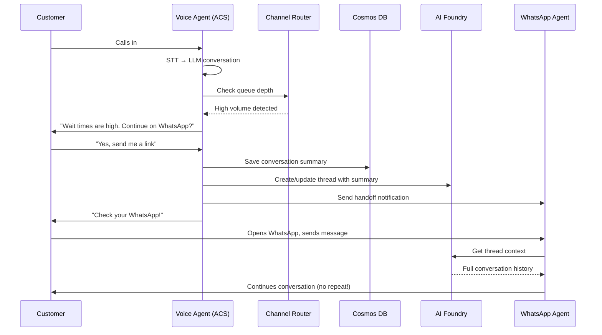

# Omnichannel Handoff Architecture

> **Status:** ✅ Utilities Scenario Implemented | Omnichannel WIP  
> **Author:** Architecture Team  
> **Date:** January 2026 (Updated)

## Table of Contents

1. [Overview](#overview) — What this is and why
2. [Customer Journey](#customer-journey) — End-to-end user experience
3. [Implementation Status](#implementation-status) — What's done vs WIP
4. [Azure Infrastructure](#azure-infrastructure) — 68 deployed resources
5. [How It Works](#how-it-works-technical-walkthrough) — Technical deep dive
6. [Existing Capabilities](#existing-capabilities) — Current features
7. [Phase 2: Components to Build](#phase-2-components-to-build) — What's next
8. [Reference Implementation](#reference-implementation-utilities-scenario-) — Utilities scenario
9. [Related Documentation](#related-documentation) — Links

---

## Overview

This document describes an architecture for **multi-channel handoff with conversation continuity** — enabling customers to seamlessly move between voice calls, WhatsApp, and web chat without repeating themselves.

### Problem Statement

When call volumes are high, customers face long wait times. We want to:
1. **Detect high volume** and proactively offer alternative channels
2. **Preserve conversation context** across voice → WhatsApp → web chat
3. **Use a unified multi-agent architecture** via Azure AI Foundry
4. **Ensure consistent data recording** so customers never repeat themselves

---

## Customer Journey

```
┌─────────────────────────────────────────────────────────────────────────────┐
│                         CUSTOMER JOURNEY                                     │
├─────────────────────────────────────────────────────────────────────────────┤
│                                                                              │
│   📞 PHONE CALL                                                              │
│   ┌─────────────┐     ┌──────────────────┐     ┌───────────────────┐        │
│   │  Customer   │────▶│ ACS Voice Agent  │────▶│  High Volume?     │        │
│   │   Calls     │     │  (STT → LLM)     │     │  Check Queue      │        │
│   └─────────────┘     └──────────────────┘     └─────────┬─────────┘        │
│                                                          │                   │
│                              ┌───────────────────────────┴─────┐             │
│                              ▼                                 ▼             │
│                    ┌─────────────────┐              ┌─────────────────┐      │
│                    │  LOW VOLUME     │              │  HIGH VOLUME    │      │
│                    │  Continue Call  │              │  Offer Handoff  │      │
│                    └─────────────────┘              └────────┬────────┘      │
│                                                              │               │
│   📱 CHANNEL HANDOFF                                         ▼               │
│   ┌─────────────────────────────────────────────────────────────────┐       │
│   │              Azure AI Foundry Multi-Agent Hub                    │       │
│   │   ┌─────────────┐   ┌─────────────┐   ┌─────────────┐           │       │
│   │   │  WhatsApp   │   │  Web Chat   │   │  Voice Bot  │           │       │
│   │   │   Agent     │   │   Agent     │   │   Agent     │           │       │
│   │   └──────┬──────┘   └──────┬──────┘   └──────┬──────┘           │       │
│   │          │                 │                 │                   │       │
│   │          └─────────────────┼─────────────────┘                   │       │
│   │                            ▼                                     │       │
│   │              ┌─────────────────────────┐                         │       │
│   │              │   SHARED THREAD STATE   │ ← Customer doesn't      │       │
│   │              │   (Cosmos DB / Redis)   │   repeat themselves     │       │
│   │              └─────────────────────────┘                         │       │
│   └─────────────────────────────────────────────────────────────────┘       │
│                                                                              │
└─────────────────────────────────────────────────────────────────────────────┘
```

---

## Implementation Status

| Component | Status | Location |
|-----------|--------|----------|
| **Voice Orchestration** | ✅ Complete | `apps/artagent/backend/voice/` |
| **Multi-Agent Framework** | ✅ Complete | `apps/artagent/backend/registries/` |
| **Utilities Scenario** | ✅ Implemented | `registries/scenariostore/utilities/` |
| **5 Utilities Agents** | ✅ Deployed | `registries/agentstore/utilities_*/` |
| **98 Utilities Tools** | ✅ Working | `registries/toolstore/utilities/` |
| **Handoff Service** | ✅ Complete | `apps/artagent/backend/voice/handoffs/` |
| **Redis State (MemoManager)** | ✅ Complete | `src/redis/manager.py` |
| **Cosmos Persistence** | ✅ Complete | `src/cosmosdb/manager.py` |
| **Channel Adapters** | ✅ Implemented | `apps/artagent/backend/channels/` |
| **WebChat Demo App** | ✅ Complete | `apps/webchat-demo/` |
| **WebChat WebSocket API** | ✅ Complete | `api/v1/endpoints/channels.py` |
| **CustomerContextManager** | ✅ Complete | `channels/context.py` |
| **WhatsApp Adapter** | 🔧 Scaffolded | `channels/whatsapp.py` |
| **WhatsApp Event Grid** | 🔧 Terraform Ready | `infra/terraform/whatsapp.tf` |
| **Foundry Thread Sync** | ⏳ Phase 2 | Planned |

---

## Azure Infrastructure

When you run `azd up`, the following Azure resources are deployed:

```
┌─────────────────────────────────────────────────────────────────────────────────────────┐
│                        AZURE RESOURCE GROUP: rg-artagent-{env}                           │
├─────────────────────────────────────────────────────────────────────────────────────────┤
│                                                                                          │
│   ┌─────────────────────────────────────────────────────────────────────────────────┐   │
│   │                    CONTAINER APPS ENVIRONMENT                                     │   │
│   │   ┌─────────────────────────┐       ┌─────────────────────────┐                  │   │
│   │   │   🖥️ FRONTEND            │       │   ⚙️ BACKEND              │                  │   │
│   │   │   Container App         │       │   Container App         │                  │   │
│   │   │   ─────────────────────│       │   ─────────────────────│                  │   │
│   │   │   • React UI            │ ───▶  │   • FastAPI            │                  │   │
│   │   │   • Agent Dashboard     │ REST  │   • Voice Orchestrator │                  │   │
│   │   │   • Call Monitoring     │       │   • Multi-Agent System │                  │   │
│   │   └─────────────────────────┘       └───────────┬─────────────┘                  │   │
│   │                                                  │                                │   │
│   │                    Managed Identities (UAI) ◀────┘                                │   │
│   └─────────────────────────────────────────────────────────────────────────────────┘   │
│                                           │                                              │
│   ┌───────────────────────────────────────┼───────────────────────────────────────────┐ │
│   │                                       ▼                                            │ │
│   │   ┌─────────────────────┐   ┌─────────────────────┐   ┌─────────────────────┐     │ │
│   │   │  📡 AZURE COMM SVCS  │   │  🧠 AI FOUNDRY       │   │  🎙️ SPEECH SERVICES  │     │ │
│   │   │  ─────────────────── │   │  ─────────────────── │   │  ─────────────────── │     │ │
│   │   │  • PSTN Telephony   │   │  • Cognitive Svcs   │   │  • Speech-to-Text   │     │ │
│   │   │  • WebSocket Audio  │   │  • Model Hosting    │   │  • Text-to-Speech   │     │ │
│   │   │  • Call Automation  │   │  • Agent Framework  │   │  • Custom Voice     │     │ │
│   │   │  • WhatsApp (WIP)   │   │                     │   │                     │     │ │
│   │   └─────────────────────┘   └─────────────────────┘   └─────────────────────┘     │ │
│   │                                       │                                            │ │
│   │   ┌─────────────────────────────────────────────────────────────────────────────┐ │ │
│   │   │                         💬 AZURE OPENAI                                       │ │ │
│   │   │   ┌───────────────┐   ┌───────────────┐   ┌───────────────┐                  │ │ │
│   │   │   │   gpt-4o      │   │  gpt-4o-mini  │   │gpt-4o-realtime│                  │ │ │
│   │   │   │   (Chat)      │   │  (Fast/Cheap) │   │  (VoiceLive)  │                  │ │ │
│   │   │   └───────────────┘   └───────────────┘   └───────────────┘                  │ │ │
│   │   └─────────────────────────────────────────────────────────────────────────────┘ │ │
│   │                         AI & COMMUNICATION LAYER                                   │ │
│   └────────────────────────────────────────────────────────────────────────────────────┘ │
│                                           │                                              │
│   ┌────────────────────────────────────────┼──────────────────────────────────────────┐  │
│   │                                        ▼                                           │  │
│   │   ┌─────────────────────┐   ┌─────────────────────┐   ┌─────────────────────┐     │  │
│   │   │  ⚡ REDIS ENTERPRISE  │   │  🗄️ COSMOS DB        │   │  📦 STORAGE ACCOUNT  │     │  │
│   │   │  ─────────────────── │   │  ─────────────────── │   │  ─────────────────── │     │  │
│   │   │  • Session Cache    │   │  • MongoDB API      │   │  • Audio Files      │     │  │
│   │   │  • MemoManager      │   │  • Conversations    │   │  • Prompt Storage   │     │  │
│   │   │  • Real-time State  │   │  • Customer Context │   │  • Transcripts      │     │  │
│   │   │  • Sub-ms Latency   │   │  • Thread History   │   │                     │     │  │
│   │   └─────────────────────┘   └─────────────────────┘   └─────────────────────┘     │  │
│   │                              DATA & STATE LAYER                                    │  │
│   └────────────────────────────────────────────────────────────────────────────────────┘  │
│                                           │                                              │
│   ┌────────────────────────────────────────┼──────────────────────────────────────────┐  │
│   │                                        ▼                                           │  │
│   │   ┌─────────────────────┐   ┌─────────────────────┐   ┌─────────────────────┐     │  │
│   │   │  ⚙️ APP CONFIG       │   │  🔐 KEY VAULT        │   │  📦 CONTAINER REG   │     │  │
│   │   │  ─────────────────── │   │  ─────────────────── │   │  ─────────────────── │     │  │
│   │   │  • Feature Flags    │   │  • Connection Strs  │   │  • Docker Images    │     │  │
│   │   │  • Phone Numbers    │   │  • API Keys         │   │  • Backend Image    │     │  │
│   │   │  • Runtime Config   │   │  • Managed Identity │   │  • Frontend Image   │     │  │
│   │   └─────────────────────┘   └─────────────────────┘   └─────────────────────┘     │  │
│   │                           CONFIGURATION & SECURITY                                 │  │
│   └────────────────────────────────────────────────────────────────────────────────────┘  │
│                                           │                                              │
│   ┌────────────────────────────────────────┼──────────────────────────────────────────┐  │
│   │                                        ▼                                           │  │
│   │   ┌─────────────────────────────────────────────────────────────────────────────┐ │  │
│   │   │  📊 APPLICATION INSIGHTS  ◀────────────────▶  📈 LOG ANALYTICS WORKSPACE     │ │  │
│   │   │  ─────────────────────────────────────────────────────────────────────────── │ │  │
│   │   │  • OpenTelemetry Traces  •  Latency Metrics  •  Error Rates  •  SLO Alerts  │ │  │
│   │   └─────────────────────────────────────────────────────────────────────────────┘ │  │
│   │                                   OBSERVABILITY                                    │  │
│   └────────────────────────────────────────────────────────────────────────────────────┘  │
│                                                                                          │
└─────────────────────────────────────────────────────────────────────────────────────────┘

                                    EXTERNAL CONNECTIONS
    ┌───────────────────────────────────────────────────────────────────────────────────┐
    │                                                                                    │
    │    📞 PHONE (PSTN)           🌐 WEB BROWSER           📱 WHATSAPP (WIP)            │
    │    ─────────────────         ─────────────────        ─────────────────            │
    │    Inbound calls via         React UI for agents      WhatsApp Business API        │
    │    ACS telephony             and monitoring           via ACS (Phase 2)            │
    │                                                                                    │
    └───────────────────────────────────────────────────────────────────────────────────┘
```

### Resource Count (68 Terraform Resources)

| Layer | Resources | Count |
|-------|-----------|-------|
| **Compute** | Container Apps Environment, Frontend App, Backend App, Container Registry | 4 |
| **Communication** | Azure Communication Services, Event Grid Subscriptions | 2 |
| **AI Services** | AI Foundry (Cognitive Services), Azure OpenAI (3 models), Speech Services | 5 |
| **Data** | Redis Enterprise (Cluster + DB), Cosmos DB (MongoDB), Storage Account | 4 |
| **Config/Security** | App Configuration, Key Vault, Managed Identities, Role Assignments | 6+ |
| **Observability** | Application Insights, Log Analytics Workspace | 2 |

---

## Why These Azure Services?

Each Azure service in this architecture was chosen for specific technical and business reasons. This section explains the **rationale** behind each selection and the **alternatives considered**.

### Communication Layer

#### Azure Communication Services (ACS)

| Aspect | Details |
|--------|---------|
| **Why Chosen** | Native Azure telephony with real-time WebSocket audio streaming, PSTN connectivity, and unified APIs for voice, SMS, and WhatsApp in a single service. |
| **Key Benefits** | • Sub-100ms audio latency via WebSocket streaming<br>• Built-in Call Automation SDK for event-driven call handling<br>• Single service for voice, SMS, email, and WhatsApp (future)<br>• Managed phone number provisioning<br>• Seamless integration with Azure AI services |
| **Alternatives Considered** | • **Twilio**: More mature but requires separate integration per channel, no native Azure identity support<br>• **Vonage**: Good APIs but higher latency for real-time audio<br>• **Custom SIP trunking**: Higher complexity, no managed WebSocket layer |
| **Trade-offs** | ACS has fewer regions than Twilio; WhatsApp integration requires Meta Business verification |

### AI Services Layer

#### Azure AI Foundry (Cognitive Services Account)

| Aspect | Details |
|--------|---------|
| **Why Chosen** | Unified platform for hosting Azure OpenAI models with enterprise security, managed identity support, and project-based organization for multi-agent architectures. |
| **Key Benefits** | • Single control plane for all AI models<br>• Native RBAC with Azure AD/Entra ID<br>• Built-in content safety and responsible AI filters<br>• Shared thread state across agents (Assistants API)<br>• Regional deployment for data residency compliance |
| **Alternatives Considered** | • **Direct OpenAI API**: Lower latency but no Azure identity, less enterprise controls<br>• **AWS Bedrock**: Multi-model but weaker real-time voice support<br>• **Self-hosted LLMs**: Full control but massive operational overhead |
| **Trade-offs** | Model availability varies by region; some models have quota limits that require planning |

#### Azure OpenAI Models

| Model | Why Chosen | Use Case |
|-------|------------|----------|
| **gpt-4o** | Best balance of reasoning, speed, and cost for complex agent conversations | Primary chat model for SpeechCascade mode |
| **gpt-4o-mini** | 10x cheaper, faster responses for simple routing/classification | Tool selection, intent classification |
| **gpt-4o-realtime** | Only model supporting native real-time audio streaming with <300ms latency | VoiceLive mode for lowest latency |

#### Azure Speech Services

| Aspect | Details |
|--------|---------|
| **Why Chosen** | Industry-leading neural TTS with 400+ voices, real-time STT with phrase lists, and custom voice/speech model support. |
| **Key Benefits** | • 400+ neural voices across 140+ languages<br>• Phrase list biasing for domain vocabulary (account numbers, product names)<br>• Custom neural voice for brand consistency<br>• Real-time streaming recognition (interim results)<br>• Pronunciation customization via SSML |
| **Alternatives Considered** | • **Google Cloud Speech**: Strong STT but weaker neural TTS voice quality<br>• **Amazon Polly/Transcribe**: Good but requires cross-cloud networking<br>• **Deepgram**: Lower latency STT but limited TTS options<br>• **ElevenLabs**: Superior voice quality but higher cost and latency |
| **Trade-offs** | Custom neural voice requires 300+ audio samples and approval process; some voices only available in specific regions |

### Data Layer

#### Azure Cache for Redis Enterprise

| Aspect | Details |
|--------|---------|
| **Why Chosen** | Sub-millisecond latency required for real-time voice session state; Redis Enterprise provides RBAC authentication (no access keys), high availability, and clustering. |
| **Key Benefits** | • <1ms read/write latency (critical for voice turns)<br>• RBAC with Managed Identity (no secrets to rotate)<br>• Active-active geo-replication (Enterprise tier)<br>• Volatile LRU eviction for session data<br>• OSS Cluster mode for horizontal scaling |
| **Alternatives Considered** | • **Azure Cache for Redis (Standard)**: Cheaper but requires access keys, no RBAC<br>• **Cosmos DB only**: 5-10ms latency too slow for real-time state<br>• **In-memory (app-level)**: No persistence across container restarts, breaks scaling |
| **Trade-offs** | Enterprise tier is more expensive; requires cluster-aware client configuration |

**Why Two Data Stores?**
```
┌─────────────────────────────────────────────────────────────────────────┐
│  Redis (HOT)                        Cosmos DB (WARM/COLD)               │
│  ────────────────────────────────   ────────────────────────────────── │
│  • Active call state                 • Conversation history            │
│  • Current agent context             • Customer profiles                │
│  • Audio buffer pointers             • Cross-session analytics          │
│  • Handoff in-flight data            • Audit logs                       │
│                                                                          │
│  Access: <1ms                        Access: 5-10ms                      │
│  TTL: Session duration               TTL: Months/years                   │
│  Purpose: Real-time operations       Purpose: Durable persistence        │
└─────────────────────────────────────────────────────────────────────────┘
```

#### Azure Cosmos DB (MongoDB API)

| Aspect | Details |
|--------|---------|
| **Why Chosen** | Global distribution for multi-region deployments, flexible schema for evolving conversation data, and MongoDB API for developer familiarity. |
| **Key Benefits** | • Single-digit millisecond reads at 99th percentile<br>• Automatic indexing and TTL for conversation cleanup<br>• MongoDB API = familiar query syntax<br>• Serverless tier available for dev/test cost savings<br>• Partition key on `customer_id` for omnichannel context |
| **Alternatives Considered** | • **Azure SQL**: Stronger consistency but schema rigidity for evolving transcript formats<br>• **PostgreSQL Flexible**: Good but no native global distribution<br>• **MongoDB Atlas**: Excellent but requires cross-service networking, separate billing |
| **Trade-offs** | Request Unit (RU) pricing requires capacity planning; complex queries can consume high RUs |

#### Azure Blob Storage

| Aspect | Details |
|--------|---------|
| **Why Chosen** | Cost-effective storage for audio recordings, transcripts, and prompt templates with lifecycle management. |
| **Key Benefits** | • $0.018/GB for hot tier (audio recordings)<br>• Lifecycle policies for automatic archival<br>• Native integration with Speech Services batch transcription<br>• Immutable storage option for compliance |
| **Alternatives Considered** | • **Azure Files**: Higher cost, unnecessary POSIX features<br>• **Cosmos DB attachments**: Limited to 2MB, expensive at scale |
| **Trade-offs** | Requires separate CDN for low-latency audio playback |

### Compute Layer

#### Azure Container Apps

| Aspect | Details |
|--------|---------|
| **Why Chosen** | Serverless containers with built-in autoscaling, WebSocket support, and zero Kubernetes management overhead. |
| **Key Benefits** | • Scale to zero (cost savings in dev/test)<br>• Native WebSocket support for ACS media streaming<br>• Built-in revision management and traffic splitting<br>• Managed identity injection<br>• Dapr integration available for microservices patterns |
| **Alternatives Considered** | • **Azure Kubernetes Service (AKS)**: Full control but significant operational overhead<br>• **Azure App Service**: Limited WebSocket connection scaling<br>• **Azure Functions**: Cold start latency unacceptable for real-time voice |
| **Trade-offs** | Less control than AKS; some advanced networking scenarios require workarounds |

#### Azure Container Registry

| Aspect | Details |
|--------|---------|
| **Why Chosen** | Native integration with Container Apps, geo-replication for multi-region, and vulnerability scanning. |
| **Key Benefits** | • Zero-config integration with Container Apps (managed identity pull)<br>• Image signing and vulnerability scanning<br>• Retention policies for image cleanup |
| **Alternatives Considered** | • **Docker Hub**: Public by default, rate limiting<br>• **GitHub Container Registry**: Good but requires separate Azure auth setup |
| **Trade-offs** | Basic tier sufficient for most deployments; Premium required for geo-replication |

### Configuration & Security Layer

#### Azure App Configuration

| Aspect | Details |
|--------|---------|
| **Why Chosen** | Centralized configuration management with feature flags, eliminating environment variable sprawl across containers. |
| **Key Benefits** | • Dynamic configuration updates without redeployment<br>• Feature flags for gradual rollouts (e.g., enable WhatsApp)<br>• Key Vault references for secret management<br>• Configuration snapshots for point-in-time recovery |
| **Alternatives Considered** | • **Environment variables only**: No dynamic updates, hard to manage at scale<br>• **Consul/etcd**: Additional infrastructure to manage<br>• **LaunchDarkly**: Excellent feature flags but separate service and cost |
| **Trade-offs** | Requires SDK integration; adds ~10ms latency for config reads (mitigated by caching) |

#### Azure Key Vault

| Aspect | Details |
|--------|---------|
| **Why Chosen** | HSM-backed secret storage with automatic rotation, audit logging, and native integration with all Azure services. |
| **Key Benefits** | • FIPS 140-2 Level 2 validated HSMs<br>• Automatic certificate rotation<br>• Complete audit trail for compliance<br>• Managed Identity access (no secrets to access secrets) |
| **Alternatives Considered** | • **HashiCorp Vault**: More features but separate infrastructure<br>• **AWS Secrets Manager**: Good but cross-cloud complexity |
| **Trade-offs** | Soft-delete recovery period can complicate rapid redeployments |

#### User-Assigned Managed Identities

| Aspect | Details |
|--------|---------|
| **Why Chosen** | Zero-secret architecture for service-to-service authentication, surviving container recreation. |
| **Key Benefits** | • No connection strings or API keys in configuration<br>• Survives container restarts (unlike system-assigned)<br>• Single identity can access multiple resources<br>• Native RBAC across all Azure services |
| **Alternatives Considered** | • **System-assigned identities**: Simpler but tied to resource lifecycle<br>• **Service principals with secrets**: Requires rotation management |
| **Trade-offs** | Requires explicit RBAC role assignments during provisioning |

### Observability Layer

#### Azure Application Insights

| Aspect | Details |
|--------|---------|
| **Why Chosen** | End-to-end distributed tracing with OpenTelemetry, custom metrics for voice latency, and native alerting. |
| **Key Benefits** | • OpenTelemetry collector support (vendor-neutral instrumentation)<br>• Custom metrics for STT/TTS/LLM latency tracking<br>• Live metrics stream for real-time debugging<br>• Smart detection for anomaly alerting<br>• Application Map for dependency visualization |
| **Alternatives Considered** | • **Datadog**: Superior UI but significant cost<br>• **New Relic**: Good APM but separate billing<br>• **Jaeger/Grafana**: Requires self-hosting |
| **Trade-offs** | Query language (KQL) has learning curve; sampling can miss rare errors |

#### Log Analytics Workspace

| Aspect | Details |
|--------|---------|
| **Why Chosen** | Unified log aggregation for all Azure services, required for Container Apps and Application Insights. |
| **Key Benefits** | • Single query surface for all logs<br>• Retention policies for cost management<br>• Cross-resource queries for debugging<br>• Export to storage for long-term retention |
| **Alternatives Considered** | • **Splunk**: Powerful but expensive and separate infrastructure<br>• **ELK Stack**: Flexible but operational overhead |
| **Trade-offs** | Ingestion costs can grow with verbose logging; requires careful log level management |

### Decision Summary

| Service | Primary Driver | Cost Tier Used |
|---------|----------------|----------------|
| **Azure Communication Services** | Native telephony + WebSocket audio | Pay-per-use |
| **Azure AI Foundry** | Unified AI model management | Standard |
| **Azure OpenAI** | Best-in-class LLM with Azure security | gpt-4o Standard |
| **Azure Speech Services** | Real-time STT/TTS with phrase biasing | Standard S0 |
| **Redis Enterprise** | Sub-ms latency + RBAC | Enterprise E10 |
| **Cosmos DB** | Global distribution + MongoDB API | Serverless (dev) |
| **Container Apps** | Serverless containers + WebSocket | Consumption |
| **App Configuration** | Centralized config + feature flags | Standard |
| **Key Vault** | HSM-backed secrets | Standard |
| **Application Insights** | OpenTelemetry + voice metrics | Pay-per-use |

> **Architecture Principle:** Every service was selected to optimize for **real-time voice latency** while maintaining **enterprise security** (managed identity, RBAC) and **operational simplicity** (serverless, managed services).

---

## How It Works: Technical Walkthrough

### Step 1: Phone Call Arrives

```
📞 Customer dials phone number
         │
         ▼
┌─────────────────────────────────────────────────────────────────────────┐
│                 AZURE COMMUNICATION SERVICES                             │
│  ───────────────────────────────────────────────────────────────────────│
│  1. PSTN Gateway receives call                                           │
│  2. IncomingCall event triggered                                         │
│  3. HTTP POST to Backend: /api/v1/calls/events                          │
│  4. Backend answers call with ACS Call Automation SDK                    │
│  5. WebSocket connection established for audio streaming                 │
└─────────────────────────────────────────────────────────────────────────┘
```

### Step 2: Voice Orchestration

```
┌─────────────────────────────────────────────────────────────────────────┐
│                    BACKEND CONTAINER APP                                 │
├─────────────────────────────────────────────────────────────────────────┤
│                                                                          │
│   ┌───────────────────────────────────────────────────────────────┐     │
│   │                    VOICE ORCHESTRATOR                          │     │
│   │                                                                │     │
│   │   Mode: SpeechCascade (STT → LLM → TTS)                       │     │
│   │   ─────────────────────────────────────────────────────────── │     │
│   │                                                                │     │
│   │   1. Receive PCM audio from ACS WebSocket (16kHz, mono)       │     │
│   │   2. Stream to Azure Speech STT (real-time recognition)       │     │
│   │   3. Transcript → Session Agent Manager                        │     │
│   │   4. Agent processes with Azure OpenAI (gpt-4o)               │     │
│   │   5. Response → Azure Speech TTS (neural voice)               │     │
│   │   6. Audio → ACS WebSocket → Customer hears response          │     │
│   └───────────────────────────────────────────────────────────────┘     │
│                               │                                          │
│                               ▼                                          │
│   ┌───────────────────────────────────────────────────────────────┐     │
│   │                  MULTI-AGENT FRAMEWORK                         │     │
│   │                                                                │     │
│   │   ScenarioLoader → AgentStore → ToolStore → HandoffService    │     │
│   │                                                                │     │
│   │   Active Scenario: utilities                                   │     │
│   │   ┌─────────────────────────────────────────────────────────┐ │     │
│   │   │  UtilitiesConcierge (start_agent)                       │ │     │
│   │   │       │                                                  │ │     │
│   │   │       ├──▶ BillingAgent (20 tools)                      │ │     │
│   │   │       ├──▶ OutageAgent (18 tools) ← DISCRETE handoff    │ │     │
│   │   │       ├──▶ ServiceAgent (22 tools)                      │ │     │
│   │   │       └──▶ UsageAgent (23 tools)                        │ │     │
│   │   └─────────────────────────────────────────────────────────┘ │     │
│   └───────────────────────────────────────────────────────────────┘     │
│                                                                          │
└─────────────────────────────────────────────────────────────────────────┘
```

### Step 3: State Management

```
┌─────────────────────────────────────────────────────────────────────────┐
│                       STATE MANAGEMENT                                   │
├─────────────────────────────────────────────────────────────────────────┤
│                                                                          │
│   ⚡ REDIS (MemoManager)           🗄️ COSMOS DB                          │
│   ───────────────────────         ───────────────────────                │
│   HOT STATE (real-time)           WARM/COLD STATE (persist)              │
│                                                                          │
│   ┌────────────────────┐          ┌────────────────────┐                 │
│   │ session:{call_id}  │          │ conversations      │                 │
│   │ ──────────────────│ ───────▶ │ ──────────────────│                 │
│   │ current_agent      │  (flush) │ customer_id        │                 │
│   │ conversation[]     │          │ thread_history[]   │                 │
│   │ collected_data{}   │          │ collected_data{}   │                 │
│   │ handoff_context    │          │ channel_sessions[] │                 │
│   └────────────────────┘          └────────────────────┘                 │
│                                                                          │
│   WHY TWO STORES?                                                        │
│   • Redis: Sub-millisecond access for real-time voice (latency critical)│
│   • Cosmos: Durable storage for cross-session context (omnichannel)     │
│                                                                          │
└─────────────────────────────────────────────────────────────────────────┘
```

### Step 4: Agent Handoffs

```
┌─────────────────────────────────────────────────────────────────────────┐
│                       HANDOFF SERVICE                                    │
├─────────────────────────────────────────────────────────────────────────┤
│                                                                          │
│   Customer: "I need to report a power outage"                            │
│                                                                          │
│   ┌─────────────────────────────────────────────────────────────────┐   │
│   │  UtilitiesConcierge                                              │   │
│   │  ────────────────────                                            │   │
│   │  1. Detects intent: outage_report                                │   │
│   │  2. Selects tool: handoff_outage_agent                           │   │
│   │  3. Calls HandoffService.execute_handoff()                       │   │
│   │                                                                  │   │
│   │       handoff_type: DISCRETE (fresh context for safety)          │   │
│   │       target_agent: OutageAgent                                  │   │
│   │       preserved: customer_id, account_verified                   │   │
│   └───────────────────────────────────┬─────────────────────────────┘   │
│                                       │                                  │
│                                       ▼                                  │
│   ┌─────────────────────────────────────────────────────────────────┐   │
│   │  OutageAgent (now active)                                        │   │
│   │  ────────────────────────                                        │   │
│   │  • 18 specialized tools (report_outage, check_eta, crew_status)  │   │
│   │  • DISCRETE handoff = no conversation history (safety protocol)  │   │
│   │  • Customer context preserved in Redis                           │   │
│   │  • Can handoff back to UtilitiesConcierge when resolved          │   │
│   └─────────────────────────────────────────────────────────────────┘   │
│                                                                          │
└─────────────────────────────────────────────────────────────────────────┘
```

### Step 5: Omnichannel Handoff (When Volume is High)

```
┌─────────────────────────────────────────────────────────────────────────┐
│               OMNICHANNEL HANDOFF (Phase 2 - WIP)                        │
├─────────────────────────────────────────────────────────────────────────┤
│                                                                          │
│   TRIGGER: Storm causes mass outage, 5000+ calls in queue               │
│                                                                          │
│   ┌─────────────────────────────────────────────────────────────────┐   │
│   │  ChannelRouter (monitors queue_depth)                            │   │
│   │  ───────────────────────────────────────                         │   │
│   │  queue_wait_time > 120s  →  OFFER CHANNEL SWITCH                 │   │
│   └───────────────────────────────────┬─────────────────────────────┘   │
│                                       │                                  │
│   Voice Agent: "Wait times are currently high.                          │
│                 Would you like to continue on WhatsApp                  │
│                 and get crew updates there?"                            │
│                                                                          │
│   Customer: "Yes"                                                        │
│                                       │                                  │
│                                       ▼                                  │
│   ┌─────────────────────────────────────────────────────────────────┐   │
│   │  1. Summarize conversation → Cosmos DB                           │   │
│   │  2. Create/update Foundry Thread with summary                    │   │
│   │  3. Send WhatsApp message with context                           │   │
│   │  4. Customer opens WhatsApp → Agent has FULL context             │   │
│   │  5. Customer doesn't repeat themselves ✓                         │   │
│   └─────────────────────────────────────────────────────────────────┘   │
│                                                                          │
│   CONTEXT PRESERVED:                                                     │
│   ┌─────────────────────────────────────────────────────────────────┐   │
│   │  customer_id: cust_12345                                         │   │
│   │  account_verified: true                                          │   │
│   │  service_address: "123 Oak St, Springfield"                      │   │
│   │  outage_reported: true                                           │   │
│   │  eta: "Crew dispatched, ETA 4:00 PM"                            │   │
│   │  conversation_summary: "Customer reported power outage at..."    │   │
│   └─────────────────────────────────────────────────────────────────┘   │
│                                                                          │
└─────────────────────────────────────────────────────────────────────────┘
```

---

The multi-agent framework is fully operational with handoffs working between specialized agents.

### Current Capabilities

| Capability | Status | Location |
|------------|--------|----------|
| **Voice → STT** | ✅ Ready | `src/speech/`, Azure Speech SDK |
| **Multi-agent orchestration** | ✅ Ready | `registries/agentstore/`, handoffs |
| **Session state (Redis)** | ✅ Ready | `src/redis/manager.py` - `MemoManager` |
| **Persistent storage (Cosmos)** | ✅ Ready | `src/cosmosdb/manager.py` |
| **Foundry agent integration** | ✅ Prototype | `agents/foundryagents/agent_builder.py` |
| **Conversation history** | ✅ Ready | Redis + Cosmos tiered storage |
| **Foundry SDK** | ✅ Installed | `azure-ai-projects==1.0.0` |

---

## Phase 2: Components to Build

The following components are needed to complete the omnichannel vision.

### Channel Router (Queue Monitor)

Logic to detect high call volume and offer channel alternatives:

```python
async def check_volume_and_offer_handoff(session_id: str) -> HandoffDecision:
    """
    Check queue depth and offer channel alternatives if volume is high.
    """
    queue_metrics = await get_queue_metrics()
    
    if queue_metrics.wait_time_seconds > THRESHOLD_SECONDS:
        # Capture current conversation summary
        transcript_summary = await get_conversation_summary(session_id)
        
        return HandoffDecision(
            should_offer=True,
            available_channels=["whatsapp", "web_chat"],
            context_to_transfer=transcript_summary,
            reason="high_volume"
        )
    
    return HandoffDecision(should_offer=False)
```

### Unified Customer ID

All channels share the same customer identity:

```
customer_id: "cust_12345"
├── voice_session: "call_abc"
├── whatsapp_session: "wa_xyz"  
└── web_session: "web_789"
      ↓
All share same conversation thread
```

**Cosmos DB Schema:**

```json
{
    "id": "cust_12345",
    "partitionKey": "cust_12345",
    "phone_number": "+1234567890",
    "foundry_thread_id": "thread_abc123",
    "sessions": [
        {
            "channel": "voice",
            "session_id": "call_abc",
            "started_at": "2026-01-29T10:00:00Z",
            "status": "transferred"
        },
        {
            "channel": "whatsapp", 
            "session_id": "wa_xyz",
            "started_at": "2026-01-29T10:05:00Z",
            "status": "active"
        }
    ],
    "conversation_summary": "Customer inquiring about account balance...",
    "collected_data": {
        "account_verified": true,
        "issue_type": "billing_inquiry",
        "priority": "normal"
    }
}
```

### Azure AI Foundry Agent Hub

Using `azure-ai-projects` SDK for shared thread state:

```python
from azure.ai.projects import AIProjectClient
from azure.identity import DefaultAzureCredential

# Initialize Foundry client
client = AIProjectClient(
    endpoint=os.environ["AZURE_AI_FOUNDRY_PROJECT_ENDPOINT"],
    credential=DefaultAzureCredential()
)

# Create or retrieve shared thread for customer
async def get_or_create_customer_thread(customer_id: str) -> str:
    """Get existing thread or create new one for customer."""
    
    # Check Cosmos for existing thread
    customer = await cosmos_manager.get_customer(customer_id)
    
    if customer and customer.get("foundry_thread_id"):
        return customer["foundry_thread_id"]
    
    # Create new thread
    thread = client.agents.create_thread()
    
    # Store in Cosmos
    await cosmos_manager.update_customer(customer_id, {
        "foundry_thread_id": thread.id
    })
    
    return thread.id


async def handoff_voice_to_channel(
    customer_id: str,
    target_channel: str,
    voice_transcript: str
):
    """
    Transfer conversation context from voice to another channel.
    """
    thread_id = await get_or_create_customer_thread(customer_id)
    
    # Add voice summary to shared thread
    client.agents.create_message(
        thread_id=thread_id,
        role="assistant",
        content=f"""[VOICE CALL SUMMARY]
The customer called in and discussed the following:
{voice_transcript}

Key information collected:
- Account verified: Yes
- Issue: {extracted_issue}
- Preferred resolution: {preferred_resolution}

The customer has been transferred to {target_channel} to continue.
Please pick up where the voice call left off - do NOT ask them to repeat information."""
    )
    
    # Notify target channel agent
    await notify_channel_agent(target_channel, customer_id, thread_id)
```

### Channel Adapters

| Channel | Azure Service | Integration Pattern |
|---------|---------------|---------------------|
| **Voice** | ACS (existing) | Current implementation |
| **WhatsApp** | ACS + WhatsApp Business API | Webhook → Foundry Agent |
| **Web Chat** | Azure Bot Service / Direct Line | WebSocket → Foundry Agent |

**WhatsApp Adapter Example:**

```python
from azure.communication.messages import NotificationMessagesClient

class WhatsAppChannelAdapter:
    """Adapter for WhatsApp via ACS."""
    
    def __init__(self, connection_string: str):
        self.client = NotificationMessagesClient.from_connection_string(connection_string)
        self.foundry_client = AIProjectClient(...)
    
    async def handle_incoming_message(
        self,
        phone_number: str,
        message: str
    ):
        # Get or create customer context
        customer_id = await self.resolve_customer_id(phone_number)
        thread_id = await get_or_create_customer_thread(customer_id)
        
        # Add message to Foundry thread
        self.foundry_client.agents.create_message(
            thread_id=thread_id,
            role="user",
            content=message
        )
        
        # Run WhatsApp agent
        run = self.foundry_client.agents.create_run(
            thread_id=thread_id,
            agent_id=WHATSAPP_AGENT_ID
        )
        
        # Get response and send via WhatsApp
        response = await self.wait_for_response(run)
        await self.send_whatsapp_message(phone_number, response)
```

---

## Architecture with Microsoft Agent Framework

```
┌─────────────────────────────────────────────────────────────────┐
│                 Azure AI Foundry Project                         │
├─────────────────────────────────────────────────────────────────┤
│                                                                  │
│   ┌─────────────────┐  ┌─────────────────┐  ┌─────────────────┐ │
│   │  Voice Agent    │  │ WhatsApp Agent  │  │  Web Agent      │ │
│   │  (STT optimized)│  │ (async, links)  │  │ (rich UI)       │ │
│   └────────┬────────┘  └────────┬────────┘  └────────┬────────┘ │
│            │                    │                    │          │
│            └────────────────────┼────────────────────┘          │
│                                 ▼                               │
│                    ┌────────────────────────┐                   │
│                    │    SHARED THREAD       │                   │
│                    │  (Managed by Foundry)  │                   │
│                    └───────────┬────────────┘                   │
│                                │                                │
│            ┌───────────────────┼───────────────────┐            │
│            ▼                   ▼                   ▼            │
│   ┌─────────────────┐  ┌─────────────────┐  ┌─────────────────┐ │
│   │  Lookup Tool    │  │  Transfer Tool  │  │  CRM Tool       │ │
│   │  (customer DB)  │  │ (channel switch)│  │  (Salesforce)   │ │
│   └─────────────────┘  └─────────────────┘  └─────────────────┘ │
│                                                                  │
└─────────────────────────────────────────────────────────────────┘
                                 │
                                 ▼
                    ┌────────────────────────┐
                    │     Cosmos DB          │
                    │  ─────────────────────│
                    │  customer_id: cust_123 │
                    │  thread_id: thread_abc │
                    │  channels: [voice,wa]  │
                    │  transcript: [...]     │
                    └────────────────────────┘
```

---

## Implementation Phases

### Phase 1: Hybrid Architecture (Recommended Start)

**Risk:** Low  
**Effort:** Medium  
**Timeline:** 4-6 weeks

1. **Keep existing voice stack** — Already optimized for real-time
2. **Add Foundry agents for WhatsApp/Web** — New channels only
3. **Share state via Cosmos DB** — `customer_id` as partition key
4. **Voice summarizes on handoff** — Push transcript to Foundry thread

```
Voice (Current Stack) ──┐
                        │
                        ▼
              ┌─────────────────┐
              │   Cosmos DB     │ ← Shared customer context
              │  (customer_id)  │
              └────────┬────────┘
                       │
        ┌──────────────┼──────────────┐
        ▼              ▼              ▼
   ┌─────────┐   ┌─────────┐   ┌─────────┐
   │WhatsApp │   │Web Chat │   │ Email   │
   │ Foundry │   │ Foundry │   │ Foundry │
   └─────────┘   └─────────┘   └─────────┘
```

### Phase 2: Unified Foundry Architecture (If Phase 1 Succeeds)

**Risk:** Medium  
**Effort:** High  
**Timeline:** 8-12 weeks

1. **Migrate voice to Foundry agents**
2. **Single agent framework** across all channels
3. **Foundry Threads as source of truth**
4. **Unified analytics and telemetry**

---

## Key Technical Decisions

| Decision | Recommendation | Rationale |
|----------|----------------|-----------|
| **Customer ID** | Phone number or authenticated user ID | Universal across channels |
| **State sharing** | Cosmos DB + Foundry Threads | Cosmos for custom data, Threads for agent memory |
| **Channel switch trigger** | Tool call: `offer_channel_switch()` | Consistent with agent tool pattern |
| **WhatsApp integration** | ACS WhatsApp (or Twilio) | ACS already in use |
| **Web chat** | Azure Bot Service + DirectLine | Enterprise standard |
| **Queue metrics** | Azure Service Bus / custom Redis | Real-time queue depth |

---

## Data Flow: Voice to WhatsApp Handoff



---

## Environment Configuration

Add to `.env`:

```bash
# Azure AI Foundry
AZURE_AI_FOUNDRY_PROJECT_ENDPOINT=https://<project>.api.azureml.ms
AZURE_AI_FOUNDRY_VOICE_AGENT_ID=asst_voice_xxx
AZURE_AI_FOUNDRY_WHATSAPP_AGENT_ID=asst_whatsapp_xxx
AZURE_AI_FOUNDRY_WEB_AGENT_ID=asst_web_xxx

# WhatsApp via ACS
ACS_WHATSAPP_CHANNEL_ID=<channel-id>
WHATSAPP_BUSINESS_NUMBER=+1234567890

# Queue Thresholds
HANDOFF_WAIT_TIME_THRESHOLD_SECONDS=120
HANDOFF_QUEUE_DEPTH_THRESHOLD=50
```

---

## Success Metrics

| Metric | Target | Measurement |
|--------|--------|-------------|
| **Context preservation** | 95%+ | Customer doesn't repeat info |
| **Handoff success rate** | 90%+ | Customer completes on new channel |
| **Time to resolution** | -20% | Faster than waiting on hold |
| **Customer satisfaction** | +15% | Post-interaction survey |
| **Channel switch latency** | <30s | Time from offer to active on new channel |

---

## Deployment Workflow

This project uses **Azure Developer CLI (azd)** for all infrastructure operations.

### Prerequisites

```bash
# Install Azure Developer CLI
curl -fsSL https://aka.ms/install-azd.sh | bash

# Login to Azure
azd auth login

# Login to Azure CLI (for additional commands)
az login
```

### Deployment Lifecycle

```
┌─────────────────────────────────────────────────────────────────────────────┐
│                         DEPLOYMENT LIFECYCLE                                 │
├─────────────────────────────────────────────────────────────────────────────┤
│                                                                              │
│   1️⃣  TEARDOWN EXISTING (if applicable)                                      │
│   ┌─────────────────────────────────────────────────────────────────┐       │
│   │  azd down --force --purge                                        │       │
│   │  • Destroys all Azure resources                                  │       │
│   │  • Purges soft-deleted resources (Key Vault, Cognitive, etc.)   │       │
│   │  • Cleans up local state                                         │       │
│   └─────────────────────────────────────────────────────────────────┘       │
│                                    ↓                                         │
│   2️⃣  MAKE CHANGES                                                           │
│   ┌─────────────────────────────────────────────────────────────────┐       │
│   │  • Update Terraform in infra/terraform/                          │       │
│   │  • Add WhatsApp/Web channel adapters                             │       │
│   │  • Create Foundry agent definitions                              │       │
│   │  • Update application code                                       │       │
│   └─────────────────────────────────────────────────────────────────┘       │
│                                    ↓                                         │
│   3️⃣  DEPLOY TO AZURE                                                        │
│   ┌─────────────────────────────────────────────────────────────────┐       │
│   │  azd up                                                          │       │
│   │  • Provisions all infrastructure (Terraform)                     │       │
│   │  • Builds and deploys containers                                 │       │
│   │  • Configures App Configuration                                  │       │
│   │  • Outputs environment variables                                 │       │
│   └─────────────────────────────────────────────────────────────────┘       │
│                                    ↓                                         │
│   4️⃣  VALIDATE & REMEDIATE                                                   │
│   ┌─────────────────────────────────────────────────────────────────┐       │
│   │  • Run health checks: make test_redis_connection                 │       │
│   │  • Test endpoints: devops/backend_apis.rest                      │       │
│   │  • Run integration tests: pytest tests/                          │       │
│   │  • Fix any issues and redeploy: azd deploy                       │       │
│   └─────────────────────────────────────────────────────────────────┘       │
│                                    ↓                                         │
│   5️⃣  TEARDOWN (when done)                                                   │
│   ┌─────────────────────────────────────────────────────────────────┐       │
│   │  azd down --force --purge                                        │       │
│   │  • Clean up all resources to avoid charges                       │       │
│   └─────────────────────────────────────────────────────────────────┘       │
│                                                                              │
└─────────────────────────────────────────────────────────────────────────────┘
```

### Quick Commands

| Action | Command | Description |
|--------|---------|-------------|
| **Full deploy** | `azd up` | Provision infra + deploy apps |
| **Infra only** | `azd provision` | Just Terraform (no app deploy) |
| **Apps only** | `azd deploy` | Just containers (infra exists) |
| **Teardown** | `azd down --force --purge` | Destroy everything |
| **Switch env** | `azd env select <name>` | Switch between dev/prod |
| **View config** | `azd env get-values` | Show all environment values |

### Step-by-Step: Implementing Omnichannel

#### Step 1: Teardown Current Environment (if exists)

```bash
# Check current environment
azd env list

# Teardown existing deployment
azd down --force --purge

# Wait for soft-delete purge to complete (Key Vault, Cognitive Services)
# This can take 1-2 minutes
```

#### Step 2: Make Architecture Changes

```bash
# Create feature branch
git checkout -b feature/omnichannel-handoff

# 1. Update Terraform for new resources
#    - Add WhatsApp channel configuration
#    - Add additional Foundry agents
#    - Update App Configuration keys

# 2. Add channel adapters
#    apps/artagent/backend/channels/
#    ├── whatsapp/
#    │   ├── __init__.py
#    │   ├── adapter.py
#    │   └── webhook.py
#    └── webchat/
#        ├── __init__.py
#        ├── adapter.py
#        └── websocket.py

# 3. Add handoff tool
#    apps/artagent/backend/registries/toolstore/channel_handoff.py

# 4. Update agent configurations
#    apps/artagent/backend/registries/agentstore/concierge/agent.yaml
```

#### Step 3: Deploy to Azure

```bash
# Create new environment (or reuse existing)
azd env new omnichannel-dev

# Set required variables
azd env set AZURE_LOCATION "eastus2"
azd env set ENABLE_VOICE_LIVE "true"

# Deploy everything
azd up

# This will:
# 1. Run preprovision.sh (setup Terraform state)
# 2. Run terraform apply (create Azure resources)
# 3. Build Docker containers
# 4. Deploy to Container Apps
# 5. Run postprovision.sh (generate .env.local)
```

#### Step 4: Validate & Remediate

```bash
# Check deployment outputs
azd env get-values

# Test Redis connection
make test_redis_connection ENV_FILE=.env.local

# Test backend health
curl https://<your-backend-url>/health

# Run integration tests
pytest tests/ -v --tb=short

# If issues found, fix and redeploy (faster than full azd up)
azd deploy
```

#### Step 5: Purchase Phone Number (if needed)

```bash
# Purchase ACS phone number
make purchase_acs_phone_number ENV_FILE=.env.local

# Or set manually in App Configuration
make set_phone_number PHONE=+18001234567
```

#### Step 6: Teardown When Done

```bash
# Destroy all resources (avoids ongoing charges)
azd down --force --purge

# Verify cleanup
az group list --query "[?starts_with(name, 'rg-omnichannel')]" -o table
```

### Environment Files

After `azd up`, these files are generated:

| File | Purpose | Git Status |
|------|---------|------------|
| `.env.local` | Local dev with Azure resources | `.gitignore` |
| `.azure/<env>/.env` | azd environment state | `.gitignore` |
| `.azure/<env>/config.json` | azd environment config | `.gitignore` |

### Troubleshooting Deployment

```bash
# View deployment logs
azd deploy --debug

# Check Terraform state
cd infra/terraform && terraform show

# View Container Apps logs
az containerapp logs show \
  --name <app-name> \
  --resource-group <rg-name> \
  --follow

# Check App Configuration
make show_appconfig
```

---

## Reference Implementation: Utilities Scenario ✅

The **Utilities scenario** (electric & natural gas) is the **working reference implementation** for the omnichannel architecture. This scenario was deployed and verified on January 30, 2026.

### Verified Deployment Results

| Metric | Result |
|--------|--------|
| **Total Agents** | 18 (5 utilities + 13 other scenarios) |
| **Utilities Tools** | 98 tools across 5 agents |
| **Deployment Time** | 4m 38s |
| **Teardown Time** | 17m 15s (68 resources) |
| **Scenarios Available** | default, omnichannel, insurance, utilities, banking |

### Architecture

```
┌─────────────────────────────────────────────────────────────────────────────┐
│                UTILITIES OMNICHANNEL ARCHITECTURE                            │
├─────────────────────────────────────────────────────────────────────────────┤
│                                                                              │
│   📞 VOICE (Primary)                                                         │
│   ┌──────────────────────────────────────────────────────────────────┐      │
│   │                   UtilitiesConcierge                              │      │
│   │   • Handles inquiries                                             │      │
│   │   • Routes to specialists (Billing, Outage, Service, Usage)      │      │
│   │   • Monitors queue depth via check_queue_status()                │      │
│   └───────────────────────────┬──────────────────────────────────────┘      │
│                               │                                              │
│   ⚡ HIGH VOLUME TRIGGER       │                                              │
│   (Storm outages, rate changes)                                              │
│   ┌───────────────────────────▼──────────────────────────────────────┐      │
│   │              ChannelRouter (Supervisor Agent)                     │      │
│   │   • Workload distribution across channels                         │      │
│   │   • Context preservation via CustomerContextManager               │      │
│   │   • Tool: offer_channel_switch()                                  │      │
│   └──────────────────┬───────────────────┬───────────────────────────┘      │
│                      │                   │                                   │
│   📱 WHATSAPP        │    💻 WEBCHAT     │                                   │
│   ┌──────────────────▼───┐  ┌────────────▼───────────┐                      │
│   │  • Outage map links  │  │  • Rich bill details   │                      │
│   │  • Crew GPS updates  │  │  • Payment UI          │                      │
│   │  • Push notifications│  │  • Usage charts        │                      │
│   └──────────────────────┘  └────────────────────────┘                      │
│                                                                              │
│   🗄️ SHARED CONTEXT (CustomerContextManager)                                │
│   ┌──────────────────────────────────────────────────────────────────┐      │
│   │   customer_id: "cust_12345"                                       │      │
│   │   account_number: "7890123456"                                    │      │
│   │   account_verified: true                                          │      │
│   │   service_address: "123 Oak St, Springfield"                      │      │
│   │   active_outage: { eta: "4 PM", affected: 2400 }                 │      │
│   │   conversation_summary: "Customer reported power outage..."       │      │
│   └──────────────────────────────────────────────────────────────────┘      │
│                                                                              │
└─────────────────────────────────────────────────────────────────────────────┘
```

### Scenario Configuration

```yaml
# registries/scenariostore/utilities/orchestration.yaml
name: utilities
industry: utilities

start_agent: UtilitiesConcierge

agents:
  - UtilitiesConcierge  # Primary router
  - BillingAgent        # Payments, disputes
  - OutageAgent         # Emergencies (DISCRETE handoff)
  - ServiceAgent        # Start/stop/transfer
  - UsageAgent          # Consumption analysis

omnichannel:
  enabled: true
  primary_channel: voice
  alternate_channels: [whatsapp, webchat]
  triggers:
    queue_wait_threshold_seconds: 120
    outage_event_threshold: 1000  # Mass outage triggers

foundry:
  project_name: powergas-voice-agent
  unified_project: true
```

### Files

| Component | Path |
|-----------|------|
| Scenario | `registries/scenariostore/utilities/orchestration.yaml` |
| Foundry Config | `registries/scenariostore/utilities/foundry-project.yaml` |
| Concierge | `registries/agentstore/utilities_concierge/` |
| Billing | `registries/agentstore/billing_agent/` |
| Outage | `registries/agentstore/outage_agent/` |
| Service | `registries/agentstore/service_agent/` |
| Usage | `registries/agentstore/usage_agent/` |
| Tools | `registries/toolstore/utilities/` |
| Channel Adapters | `apps/artagent/backend/channels/` |

### Documentation

For full utilities scenario details, see:
- [Industry: Utilities](../../industry/utilities.md)

---

## Related Documentation

- **[WhatsApp Integration Guide](../../guides/whatsapp-integration.md)** — Step-by-step WhatsApp setup
- [Deployment Verification Guide](../../testing/deployment-verification.md) — E2E testing procedures and results
- [Microsoft Agent Framework Evaluation](../archive/architecture/microsoft-agent-framework-evaluation.md)
- [Agent Framework](../agents/README.md)
- [Data Flows](../data/flows.md)
- [Foundry Agents Sample](../../../samples/hello_world/03-create-your-first-foundry-agents.ipynb)
- [Infrastructure Guide](../../../infra/README.md)
- [Quickstart](../../getting-started/quickstart.md)
- [Utilities Industry Guide](../../industry/utilities.md)

---

## Next Steps

### Completed ✅

- [x] Review and approve architecture
- [x] Implement utilities scenario with 5 agents
- [x] Deploy to Azure with `azd up`
- [x] Verify all 18 agents loaded correctly
- [x] Test handoff routing between agents
- [x] Validate 98 tools functional
- [x] Document deployment verification process
- [x] Teardown with `azd down --force --purge`
- [x] Create WhatsApp channel scaffolding (adapters, endpoints)
- [x] Add Terraform configuration for WhatsApp Event Grid
- [x] Document WhatsApp integration prerequisites

### Phase 2: Omnichannel Integration ⏳

1. [ ] Complete Meta Business verification
2. [ ] Connect WhatsApp Business Account to ACS (Azure Portal)
3. [ ] Create and approve message templates
4. [ ] Set `ACS_WHATSAPP_CHANNEL_ID` in App Configuration
5. [ ] Enable WhatsApp in deployment: `azd env set ENABLE_WHATSAPP true`
6. [ ] Add `offer_channel_switch` tool to UtilitiesConcierge
7. [ ] Test with WhatsApp Sandbox
8. [ ] `azd up` — Deploy omnichannel features
9. [ ] Load test with simulated high volume (storm scenario)
10. [ ] Pilot with limited customer group
11. [ ] Production rollout
