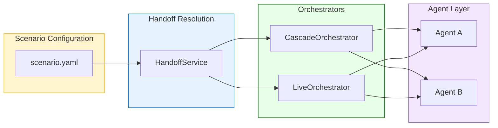
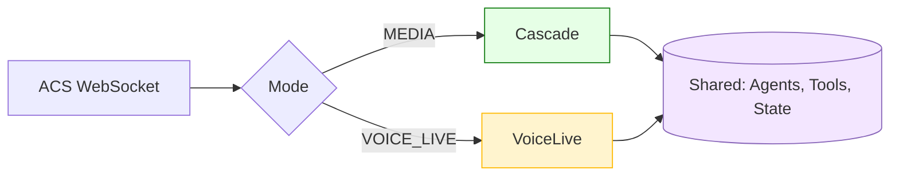
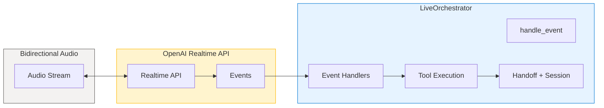
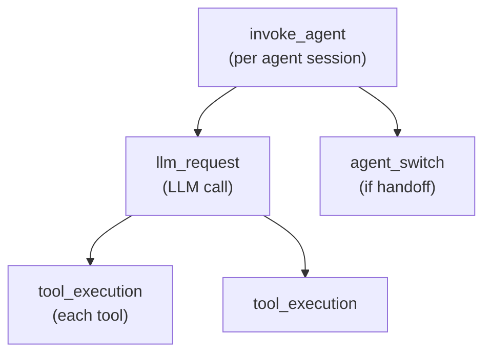

# Orchestration Architecture

This section describes the **dual orchestration architecture** that powers the ART Voice Agent Accelerator. The system supports two distinct orchestration modes, each optimized for different use cases and performance characteristics.

---

## Overview

The accelerator provides two orchestrator implementations that share the same [Unified Agent Framework](../agents/README.md) but differ in how they process audio, execute tools, and manage agent handoffs:

| Mode | Orchestrator | Audio Processing | Best For |
|------|--------------|------------------|----------|
| **SpeechCascade** | `CascadeOrchestratorAdapter` | Azure Speech SDK (STT/TTS) + Any LLM | Full control, component swapping |
| **VoiceLive** | `LiveOrchestrator` | Managed pipeline (OpenAI Realtime + Azure Speech customization) | Lowest latency, managed ops |

Both orchestrators:

- Use the same `UnifiedAgent` configurations from `apps/artagent/backend/agents/`
- Share the centralized tool registry
- Support multi-agent handoffs via **scenario-driven routing**
- Use the unified **HandoffService** for consistent handoff behavior
- Integrate with `MemoManager` for session state
- Emit OpenTelemetry spans for observability

---

## Scenario-Based Orchestration

Handoff routing is defined at the **scenario level**, not embedded in agents. This enables the same agents to behave differently in different use cases.



### Key Benefits

| Benefit | Description |
|---------|-------------|
| **Modularity** | Agents focus on capabilities; scenarios handle orchestration |
| **Reusability** | Same agent behaves differently in banking vs. insurance |
| **Contextual Behavior** | Handoff can be "announced" or "discrete" per scenario |
| **Session Scenarios** | Scenario Builder creates session-scoped scenarios at runtime |

For full details, see [Scenario-Based Orchestration](industry-scenarios.md).

---

## Architecture Diagram



### Cascade: Full Control

You orchestrate each component separately:

| Component | Options |
|-----------|---------|
| **STT** | Azure Speech, Whisper, Custom Speech models |
| **LLM** | Any Azure OpenAI model (GPT-4o, GPT-4, etc.) |
| **TTS** | 400+ Azure Neural Voices, Custom Neural Voice |

Best for: Per-component debugging, LLM flexibility, on-premises deployment.

### VoiceLive: Managed Pipeline

Azure manages the real-time conversation pipeline with extensive customization:

| Voice Type | Description |
|------------|-------------|
| **OpenAI voices** | `alloy`, `echo`, `fable`, `onyx`, `nova`, `shimmer` |
| **Azure Standard** | 400+ Neural voices (`en-US-AvaNeural`, etc.) |
| **Azure HD** | High-definition voices with temperature control |
| **Azure Custom** | Your trained Custom Neural Voice |

| Customization | Description |
|---------------|-------------|
| **Phrase lists** | Improve recognition for domain terms |
| **Custom Speech** | Your trained STT model per locale |
| **Custom lexicon** | Pronunciation tuning for TTS |
| **Custom Avatar** | Video output with talking avatar |

Best for: Lowest latency (200-400ms), turnkey setup, managed operations.

!!! info "Same Customization, Different Architecture"
    Both modes support Azure Speech customization (phrase lists, custom STT, custom TTS). VoiceLive wraps them in a managed pipeline; Cascade lets you swap components entirely.

See [VoiceLive customization docs](https://learn.microsoft.com/azure/ai-services/speech-service/voice-live-how-to-customize) for configuration details.

---

## Mode Selection

The orchestration mode is selected via the `ACS_STREAMING_MODE` environment variable:

```bash
# SpeechCascade modes (Azure Speech SDK)
export ACS_STREAMING_MODE=MEDIA          # Raw audio with local VAD
export ACS_STREAMING_MODE=TRANSCRIPTION  # ACS-provided transcriptions

# VoiceLive mode (OpenAI Realtime API)
export ACS_STREAMING_MODE=VOICE_LIVE
```
!!! info "On-Premises Deployment"
    **Cascade** supports hosting [Azure Speech containers](https://learn.microsoft.com/azure/ai-services/speech-service/speech-container-overview) on your own infrastructure for STT and TTS. This enables air-gapped deployments, data sovereignty requirements, and reduced network latency. **VoiceLive** does not currently support on-premises containers—it requires connectivity to Azure's managed VoiceLive service.

!!! note "Same Customization, Different Control"
    Both modes support identical Azure Speech customizations (phrase lists, custom STT, custom TTS). The difference is **how you configure them**: Cascade lets you swap components entirely; VoiceLive applies customizations within its managed pipeline.

---

## Shared Abstractions

Both orchestrators use common data structures defined in `apps/artagent/backend/voice/shared/base.py`:

### OrchestratorContext

Input context for turn processing:

```python
@dataclass
class OrchestratorContext:
    """Context for orchestrator turn processing."""
    user_text: str                    # Transcribed user input
    conversation_history: List[Dict]  # Prior messages
    metadata: Dict[str, Any]          # Session metadata
    memo_manager: Optional[MemoManager] = None
```

### OrchestratorResult

Output from turn processing:

```python
@dataclass
class OrchestratorResult:
    """Result from orchestrator turn processing."""
    response_text: str               # Agent response
    tool_calls: List[Dict]           # Tools executed
    handoff_occurred: bool           # Whether agent switched
    new_agent: Optional[str]         # Target agent if handoff
    metadata: Dict[str, Any]         # Telemetry data
```

---

## Turn Processing Patterns

### SpeechCascade: Synchronous Turns

SpeechCascade processes turns synchronously — one complete user utterance triggers one agent response:

```
User Speech → STT → Transcript → LLM (streaming) → Sentences → TTS → Audio
                                      ↓
                              Tool Execution
                                      ↓
                              Handoff Check
```

The `CascadeOrchestratorAdapter.process_turn()` method:

1. Receives complete transcript
2. Renders agent prompt with context
3. Calls Azure OpenAI with tools
4. Streams response sentence-by-sentence to TTS
5. Executes any tool calls
6. Handles handoffs via state update

### VoiceLive: Event-Driven

VoiceLive is event-driven — the orchestrator reacts to events from the OpenAI Realtime API:



The `LiveOrchestrator.handle_event()` method routes events:

- `SESSION_UPDATED` → Apply agent configuration
- `INPUT_AUDIO_BUFFER_SPEECH_STARTED` → Barge-in handling
- `RESPONSE_AUDIO_DELTA` → Queue audio for playback
- `RESPONSE_FUNCTION_CALL_ARGUMENTS_DONE` → Execute tool
- `RESPONSE_DONE` → Finalize turn

---

## Handoff Strategies

Both orchestrators now use the unified **HandoffService** for consistent handoff behavior. The service:

- Resolves handoff targets from scenario configuration
- Applies scenario-defined handoff types (`announced` vs `discrete`)
- Builds consistent `system_vars` for agent context
- Selects appropriate greetings based on handoff mode

### Unified Resolution Flow

```python
# Both orchestrators use the same pattern
resolution = handoff_service.resolve_handoff(
    tool_name="handoff_fraud_agent",
    tool_args=args,
    source_agent=current_agent,
    current_system_vars=system_vars,
)

if resolution.success:
    await self._switch_to(resolution.target_agent, resolution.system_vars)
    
    if resolution.greet_on_switch:
        greeting = handoff_service.select_greeting(agent, ...)
```

### Handoff Types

| Type | Behavior | Scenario Config |
|------|----------|-----------------|
| `announced` | Target agent greets the user | `type: announced` |
| `discrete` | Target agent continues naturally | `type: discrete` |

For detailed HandoffService documentation, see [Handoff Service](handoff-service.md).

### State-Based (SpeechCascade)

Handoffs are executed by updating `MemoManager` state:

```python
# In tool execution
if handoff_service.is_handoff(tool_name):
    resolution = handoff_service.resolve_handoff(...)
    if resolution.success:
        self._pending_handoff = resolution
        memo_manager.set_corememory("pending_handoff", resolution.target_agent)

# End of turn
if self._pending_handoff:
    await self._execute_handoff()
```

### Tool-Based (VoiceLive)

Handoffs are immediate upon tool call completion:

```python
async def _execute_tool_call(self, call_id, name, args_json):
    if handoff_service.is_handoff(name):
        resolution = handoff_service.resolve_handoff(
            tool_name=name,
            tool_args=json.loads(args_json),
            source_agent=self._active_agent_name,
            current_system_vars=self._system_vars,
        )
        
        if resolution.success:
            await self._switch_to(
                resolution.target_agent,
                resolution.system_vars,
            )
            return
    
    # Execute non-handoff tool
    result = await execute_tool(name, json.loads(args_json))
```

---

## MemoManager Integration

Both orchestrators sync state with `MemoManager` for session continuity:

### State Keys

```python
class StateKeys:
    ACTIVE_AGENT = "active_agent"
    PENDING_HANDOFF = "pending_handoff"
    HANDOFF_CONTEXT = "handoff_context"
    PREVIOUS_AGENT = "previous_agent"
    VISITED_AGENTS = "visited_agents"
```

### Sync Patterns

```python
# Restore state at turn start
def _sync_from_memo_manager(self):
    self.active = memo.get_corememory("active_agent")
    self.visited_agents = set(memo.get_corememory("visited_agents"))
    self._system_vars["session_profile"] = memo.get_corememory("session_profile")

# Persist state at turn end
def _sync_to_memo_manager(self):
    memo.set_corememory("active_agent", self.active)
    memo.set_corememory("visited_agents", list(self.visited_agents))
```

---

## Telemetry

Both orchestrators emit OpenTelemetry spans following GenAI semantic conventions:

### Span Hierarchy



### Key Attributes

| Attribute | Description |
|-----------|-------------|
| `gen_ai.operation.name` | `invoke_agent` |
| `gen_ai.agent.name` | Current agent name |
| `gen_ai.usage.input_tokens` | Tokens consumed |
| `gen_ai.usage.output_tokens` | Tokens generated |
| `voicelive.llm_ttft_ms` | Time to first token |

---

## Deep Dive Documentation

- **[Scenario-Based Orchestration](industry-scenarios.md)** — Industry scenario architecture and selection
- **[Handoff Service](handoff-service.md)** — Unified handoff resolution layer
- **[Cascade Orchestrator](cascade.md)** — Detailed guide to `CascadeOrchestratorAdapter`
- **[VoiceLive Orchestrator](voicelive.md)** — Detailed guide to `LiveOrchestrator`
- **[Scenario System Flow](scenario-system-flow.md)** — End-to-end scenario selection flow

---

## Related Documentation

- [Agent Framework](../agents/README.md) — Unified agent configuration
- [Handoff Strategies](../agents/handoffs.md) — Multi-agent routing patterns
- [Streaming Modes](../speech/README.md) — Audio processing comparison
- [Session Management](../data/README.md) — State persistence
