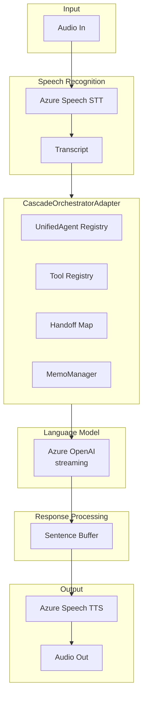
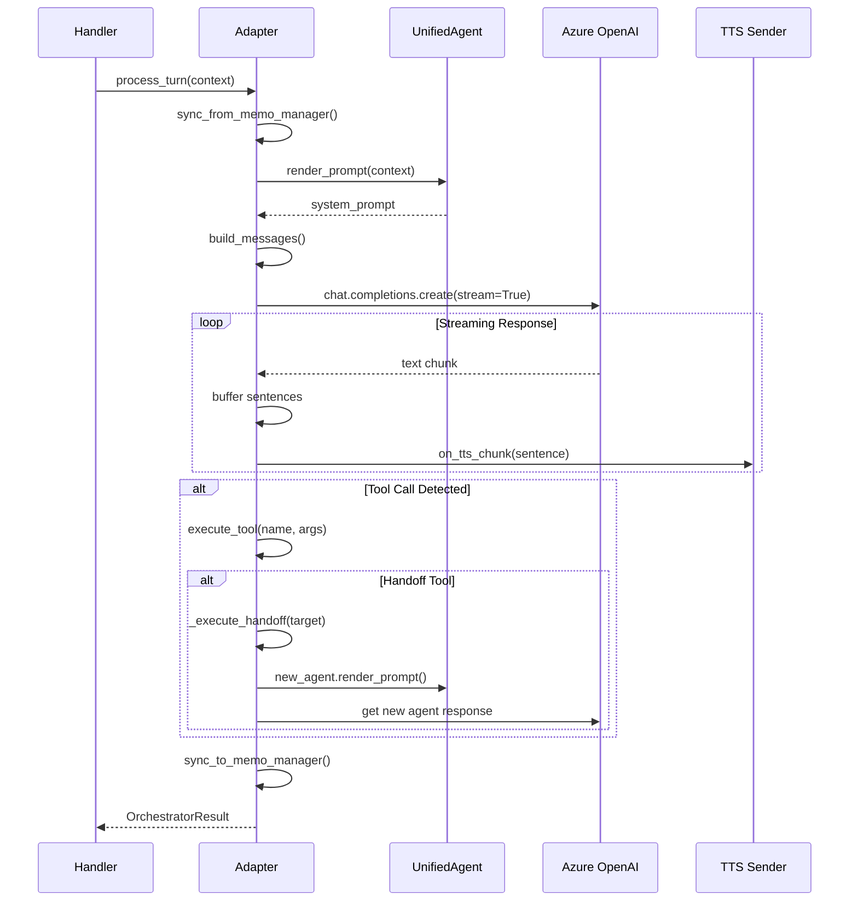

# Cascade Orchestrator

The **CascadeOrchestratorAdapter** is the orchestration engine for SpeechCascade mode, providing multi-agent voice orchestration with sentence-level TTS streaming and state-based handoffs.

---

## Overview

The Cascade Orchestrator is designed for scenarios requiring:

- **Fine-grained audio control** — Sentence-level TTS dispatch for natural pacing
- **Custom VAD/segmentation** — Integration with Azure Speech SDK
- **Azure Speech voices** — Full access to neural TTS voices and styles
- **Phrase list customization** — Speech recognition enhancement



---

## Source Files

| File | Purpose |
|------|---------|
| [orchestrator.py](https://github.com/Azure-Samples/art-voice-agent-accelerator/blob/main/apps/artagent/backend/voice/speech_cascade/orchestrator.py) | Main adapter implementation |
| [handler.py](https://github.com/Azure-Samples/art-voice-agent-accelerator/blob/main/apps/artagent/backend/voice/speech_cascade/handler.py) | WebSocket handler integration |
| [shared/base.py](https://github.com/Azure-Samples/art-voice-agent-accelerator/blob/main/apps/artagent/backend/voice/shared/base.py) | Shared data structures |

---

## Configuration

### CascadeConfig

```python
@dataclass
class CascadeConfig:
    """Configuration for CascadeOrchestratorAdapter."""
    
    start_agent: str = "Concierge"    # Initial agent name
    model_name: str = "gpt-4o"        # LLM deployment (from AZURE_OPENAI_DEPLOYMENT)
    call_connection_id: str = None    # ACS call ID for tracing
    session_id: str = None            # Session ID for tracing
    enable_rag: bool = True           # Enable RAG search
    streaming: bool = False           # Sentence-level streaming (default)
```

### Factory Method

```python
from apps.artagent.backend.voice.speech_cascade import CascadeOrchestratorAdapter

adapter = CascadeOrchestratorAdapter.create(
    start_agent="Concierge",
    model_name="gpt-4o",
    call_connection_id="call_abc123",
    session_id="session_xyz789",
    enable_rag=True,
)
```

---

## State Management

### StateKeys

The adapter uses specific keys in `MemoManager` for state-based handoffs:

```python
class StateKeys:
    ACTIVE_AGENT = "active_agent"       # Current agent name
    PENDING_HANDOFF = "pending_handoff" # Handoff waiting to execute
    HANDOFF_CONTEXT = "handoff_context" # Context passed to target agent
    PREVIOUS_AGENT = "previous_agent"   # Agent that handed off
    VISITED_AGENTS = "visited_agents"   # Set of visited agent names
```

### CascadeSessionScope

Preserves context across thread boundaries (LLM streaming runs in a thread):

```python
@dataclass
class CascadeSessionScope:
    """Session scope for cross-thread context preservation."""
    session_id: str
    call_connection_id: str
    memo_manager: Optional[MemoManager] = None
    active_agent: str = ""
    turn_id: str = ""

# Usage in process_turn
with CascadeSessionScope.activate(
    session_id=session_id,
    call_connection_id=call_id,
    memo_manager=memo,
    active_agent="FraudAgent",
):
    # MemoManager accessible via CascadeSessionScope.get_current()
    await process_llm(...)
```

---

## Turn Processing

### process_turn() Method

The main entry point for processing a conversation turn:

```python
async def process_turn(
    self,
    context: OrchestratorContext,
    *,
    on_tts_chunk: Callable[[str], Awaitable[None]] = None,
    on_tool_start: Callable[[str, Dict], Awaitable[None]] = None,
    on_tool_end: Callable[[str, Any], Awaitable[None]] = None,
) -> OrchestratorResult:
```

### Processing Flow



### Sentence-Level TTS Streaming

The adapter buffers LLM output and dispatches complete sentences to TTS:

```python
# In _process_llm threading code
sentence_buffer = ""
sentence_terms = ".!?"
min_chunk = 20

# Dispatch on sentence boundaries
while len(sentence_buffer) >= min_chunk:
    term_idx = -1
    for t in sentence_terms:
        idx = sentence_buffer.rfind(t)
        if idx > term_idx:
            term_idx = idx
    
    if term_idx >= min_chunk - 10:
        dispatch = sentence_buffer[:term_idx + 1]
        sentence_buffer = sentence_buffer[term_idx + 1:]
        _put_chunk(dispatch)  # Send to TTS
    else:
        break
```

---

## Handoff Execution

### State-Based Pattern

Unlike VoiceLive's immediate tool-based handoffs, Cascade uses a state-based approach:

1. **Tool Detection** — `is_handoff_tool(name)` checks registry
2. **Target Resolution** — `get_handoff_target(tool_name)` looks up agent
3. **State Update** — Active agent switches in adapter state
4. **New Agent Response** — Target agent generates immediate response
5. **State Sync** — `sync_to_memo_manager()` persists state

```python
async def _execute_handoff(
    self,
    target_agent: str,
    tool_name: str,
    args: Dict[str, Any],
) -> None:
    """Execute agent handoff."""
    previous_agent = self._active_agent
    
    # Update state
    self._active_agent = target_agent
    self._visited_agents.add(target_agent)
    
    # Notify handler
    if self._on_agent_switch:
        await self._on_agent_switch(previous_agent, target_agent)
    
    logger.info(
        "Handoff executed | from=%s to=%s tool=%s",
        previous_agent, target_agent, tool_name,
    )
```

### Immediate New Agent Response

After handoff, the new agent responds in the same turn:

```python
# After handoff execution
new_agent = self.agents.get(handoff_target)
if new_agent:
    new_messages = self._build_messages(new_context, new_agent)
    new_response, new_tools = await self._process_llm(
        messages=new_messages,
        tools=new_agent.get_tools(),
        on_tts_chunk=on_tts_chunk,
    )
```

---

## MemoManager Sync

### sync_from_memo_manager()

Called at turn start to restore state:

```python
def sync_from_memo_manager(self, memo: MemoManager) -> None:
    """Sync orchestrator state from MemoManager."""
    # Restore active agent
    active = memo.get_corememory(StateKeys.ACTIVE_AGENT)
    if active and active in self.agents:
        self._active_agent = active
    
    # Restore visited agents
    visited = memo.get_corememory(StateKeys.VISITED_AGENTS)
    if visited:
        self._visited_agents = set(visited)
    
    # Restore session context
    session_profile = memo.get_corememory("session_profile")
    if session_profile:
        self._session_vars["session_profile"] = session_profile
        self._session_vars["client_id"] = session_profile.get("client_id")
```

### sync_to_memo_manager()

Called at turn end to persist state:

```python
def sync_to_memo_manager(self, memo: MemoManager) -> None:
    """Sync orchestrator state back to MemoManager."""
    memo.set_corememory(StateKeys.ACTIVE_AGENT, self._active_agent)
    memo.set_corememory(StateKeys.VISITED_AGENTS, list(self._visited_agents))
    
    # Persist session profile
    if "session_profile" in self._session_vars:
        memo.set_corememory("session_profile", self._session_vars["session_profile"])
```

---

## Tool Execution

### Tool Loop Pattern

The adapter supports multi-step tool execution with iteration limits:

```python
async def _process_llm(
    self,
    messages: List[Dict],
    tools: List[Dict],
    *,
    _iteration: int = 0,
    _max_iterations: int = 5,
) -> Tuple[str, List[Dict]]:
    """Process with tool-call loop."""
    
    if _iteration >= _max_iterations:
        logger.warning("Tool loop max iterations reached")
        return ("", [])
    
    # Stream LLM response
    response_text, tool_calls = await self._stream_completion(...)
    
    # Execute non-handoff tools
    for tool_call in tool_calls:
        if not is_handoff_tool(tool_call["name"]):
            result = await execute_tool(tool_call["name"], tool_call["arguments"])
            messages.append({"role": "tool", "content": json.dumps(result)})
    
    # If tools were called, recurse for follow-up
    if tool_calls and not any(is_handoff_tool(t["name"]) for t in tool_calls):
        return await self._process_llm(
            messages, tools, _iteration=_iteration + 1
        )
    
    return response_text, tool_calls
```

---

## Telemetry

### OpenTelemetry Spans

The adapter emits spans following GenAI semantic conventions:

```python
with tracer.start_as_current_span(
    f"invoke_agent {self._active_agent}",
    kind=SpanKind.CLIENT,
    attributes={
        "gen_ai.operation.name": "invoke_agent",
        "gen_ai.agent.name": self._active_agent,
        "gen_ai.provider.name": "azure.ai.openai",
        "gen_ai.request.model": model_name,
        "gen_ai.request.temperature": temperature,
        "session.id": session_id,
        "rt.call.connection_id": call_connection_id,
    },
) as span:
    # Process turn...
    span.set_attribute("gen_ai.usage.input_tokens", input_tokens)
    span.set_attribute("gen_ai.usage.output_tokens", output_tokens)
```

### Token Tracking

Tokens are tracked per agent session:

```python
# Track across turn
self._agent_input_tokens += usage.prompt_tokens
self._agent_output_tokens += usage.completion_tokens

# Return in result
return OrchestratorResult(
    response_text=text,
    input_tokens=self._agent_input_tokens,
    output_tokens=self._agent_output_tokens,
)
```

---

## Integration with SpeechCascadeHandler

### Creating the Adapter

```python
from apps.artagent.backend.voice.speech_cascade import (
    CascadeOrchestratorAdapter,
    get_cascade_orchestrator,
)

# Via factory function (recommended)
adapter = get_cascade_orchestrator(
    call_connection_id=call_id,
    session_id=session_id,
    websocket=ws,
)

# Or via create() method
adapter = CascadeOrchestratorAdapter.create(
    start_agent="Concierge",
    call_connection_id=call_id,
)
```

### Handler Integration

```python
# In SpeechCascadeHandler
async def on_transcript(self, transcript: str, memo: MemoManager):
    context = OrchestratorContext(
        user_text=transcript,
        conversation_history=memo.conversation_history,
        metadata={"memo_manager": memo, "run_id": str(uuid4())},
    )
    
    result = await self.adapter.process_turn(
        context,
        on_tts_chunk=self._send_tts_chunk,
        on_tool_start=self._emit_tool_start,
        on_tool_end=self._emit_tool_end,
    )
    
    # Handle result
    if result.error:
        logger.error("Turn failed: %s", result.error)
```

---

## Best Practices

### Agent Configuration

- Use lower temperature (0.6) for consistent, focused responses
- Configure voice settings per agent for persona differentiation
- Keep tool lists focused — only include needed tools

### Performance

- Sentence buffering adds ~100ms latency but improves TTS quality
- Set `min_chunk=20` characters minimum before dispatching
- Use `streaming=True` only if you need raw token streaming

### Handoffs

- Always include `handoff_concierge` for return path
- Pass relevant context in handoff arguments
- New agent responds immediately — no "transferring you" message needed

---

## Related Documentation

- [Orchestration Overview](README.md) — Dual orchestration architecture
- [VoiceLive Orchestrator](voicelive.md) — Alternative orchestration mode
- [Agent Framework](../agents/README.md) — Agent configuration
- [Handoff Strategies](../agents/handoffs.md) — Multi-agent patterns
