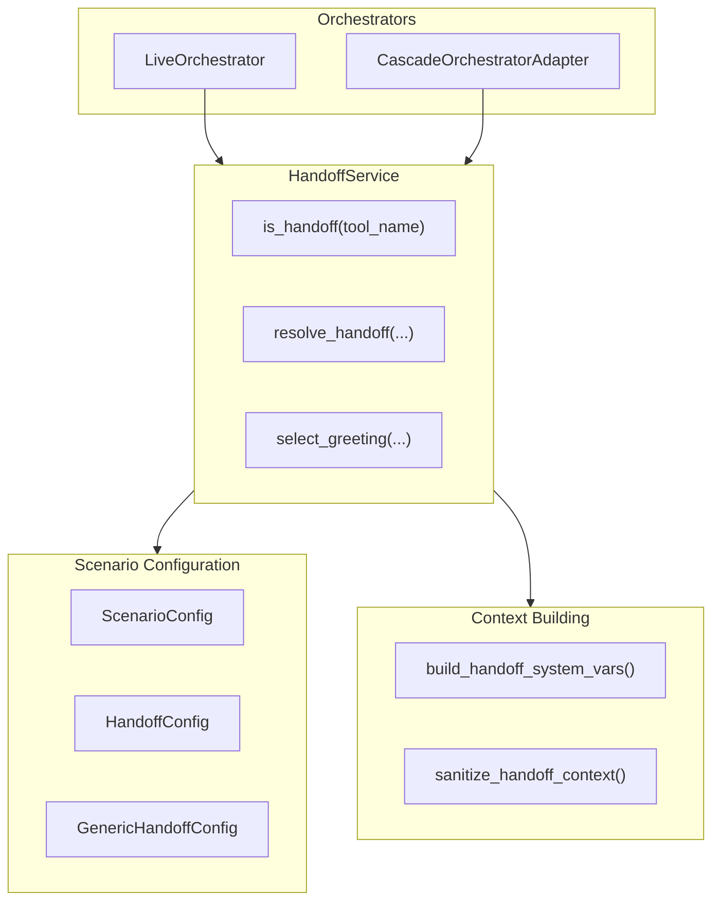
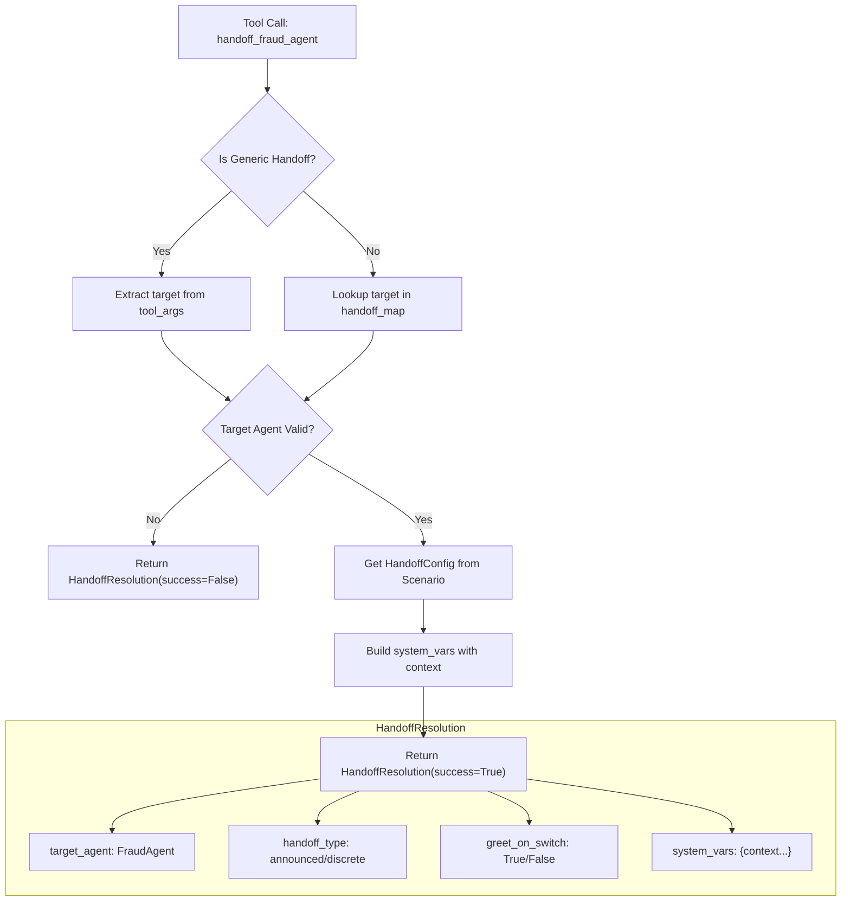
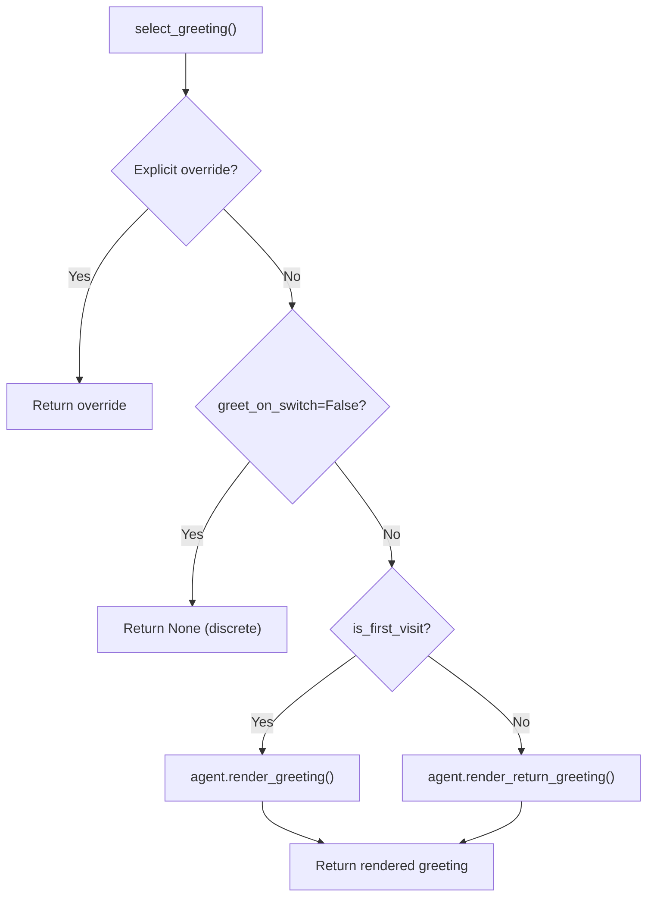

# Handoff Service

The **HandoffService** is the unified handoff resolution layer for both Cascade and VoiceLive orchestrators. It provides a single source of truth for handoff detection, target resolution, greeting selection, and context building.

---

## Overview

Prior to consolidation, handoff logic was duplicated across orchestrators with inconsistent behavior. The `HandoffService` centralizes all handoff concerns:

| Responsibility | Before | After |
|----------------|--------|-------|
| Handoff detection | 4 different paths | `is_handoff()` |
| Target resolution | Per-orchestrator | `resolve_handoff()` |
| Greeting selection | 2 implementations | `select_greeting()` |
| Context building | Duplicated | `build_handoff_system_vars()` |
| Scenario config | Partial | Always respected |

### Key Benefits

- **Consistent behavior** — Both orchestrators respect scenario-level handoff configurations
- **Discrete/Announced support** — Proper handling of handoff types from scenarios
- **Single source of truth** — All handoff logic in one testable module
- **Session-scoped scenarios** — Full support for Scenario Builder-created scenarios

---

## Architecture



---

## Source Files

| File | Purpose |
|------|---------|
| [handoff_service.py](https://github.com/Azure-Samples/art-voice-agent-accelerator/blob/main/apps/artagent/backend/voice/shared/handoff_service.py) | Main service implementation |
| [context.py](https://github.com/Azure-Samples/art-voice-agent-accelerator/blob/main/apps/artagent/backend/voice/handoffs/context.py) | Context building helpers |
| [loader.py](https://github.com/Azure-Samples/art-voice-agent-accelerator/blob/main/apps/artagent/backend/registries/scenariostore/loader.py) | Scenario and handoff config loading |

---

## HandoffResolution Dataclass

The result of resolving a handoff tool call:

```python
@dataclass
class HandoffResolution:
    """Result of resolving a handoff tool call."""
    
    success: bool                    # Whether handoff resolution succeeded
    target_agent: str = ""           # Name of the agent to switch to
    source_agent: str = ""           # Name of the agent initiating the handoff
    tool_name: str = ""              # The handoff tool that triggered this
    system_vars: dict = field(...)   # Pre-built system_vars for target agent
    greet_on_switch: bool = True     # Whether target agent should greet
    share_context: bool = True       # Whether to pass conversation context
    handoff_type: str = "announced"  # "discrete" or "announced"
    error: str | None = None         # Error message if success=False
    
    @property
    def is_discrete(self) -> bool:
        """Check if this is a discrete (silent) handoff."""
        return self.handoff_type == "discrete"
    
    @property
    def is_announced(self) -> bool:
        """Check if this is an announced (greeting) handoff."""
        return self.handoff_type == "announced"
```

---

## HandoffService Class

### Initialization

```python
from apps.artagent.backend.voice.shared.handoff_service import (
    HandoffService,
    create_handoff_service,
)

# Option 1: Use factory function
service = create_handoff_service(
    scenario_name="banking",           # For YAML file-based scenarios
    agents=agent_registry,             # UnifiedAgent registry
    handoff_map=handoff_map,           # tool → agent mapping
)

# Option 2: With session-scoped scenario (Scenario Builder)
service = create_handoff_service(
    scenario=my_scenario_config,       # ScenarioConfig object
    agents=agent_registry,
)

# Option 3: Direct instantiation
service = HandoffService(
    scenario_name="banking",
    handoff_map={"handoff_fraud": "FraudAgent"},
    agents=agents,
    scenario=scenario_config,          # Optional: session-scoped scenario
)
```

### Key Methods

#### `is_handoff(tool_name: str) -> bool`

Check if a tool triggers an agent handoff:

```python
if service.is_handoff("handoff_fraud_agent"):
    # This is a handoff tool
    ...
```

#### `resolve_handoff(...) -> HandoffResolution`

Resolve a handoff tool call into a complete resolution:

```python
resolution = service.resolve_handoff(
    tool_name="handoff_fraud_agent",
    tool_args={"reason": "suspicious activity"},
    source_agent="Concierge",
    current_system_vars={"session_profile": {...}},
    user_last_utterance="I think someone stole my card",
    tool_result={"success": True, "handoff_context": {...}},
)

if resolution.success:
    await orchestrator.switch_to(
        resolution.target_agent,
        resolution.system_vars,
    )
    
    if resolution.greet_on_switch:
        greeting = service.select_greeting(
            agent=agents[resolution.target_agent],
            is_first_visit=True,
            greet_on_switch=True,
            system_vars=resolution.system_vars,
        )
```

#### `select_greeting(...) -> str | None`

Select the appropriate greeting for agent activation:

```python
greeting = service.select_greeting(
    agent=agents["FraudAgent"],
    is_first_visit=True,               # First time visiting this agent?
    greet_on_switch=resolution.greet_on_switch,  # From scenario config
    system_vars=resolution.system_vars,
)

if greeting:
    await tts.speak(greeting)
```

---

## Handoff Resolution Flow



---

## Generic Handoffs

The service supports **generic handoffs** where the target is specified at runtime (via `handoff_to_agent` tool):

```python
# Generic handoff with dynamic target
resolution = service.resolve_handoff(
    tool_name="handoff_to_agent",
    tool_args={"target_agent": "FraudAgent", "reason": "fraud inquiry"},
    source_agent="Concierge",
    current_system_vars=current_vars,
)
```

Generic handoffs are validated against the scenario's `generic_handoff` configuration:

```yaml
# In scenario.yaml
generic_handoff:
  enabled: true
  allowed_targets:           # Empty = all scenario agents allowed
    - FraudAgent
    - InvestmentAdvisor
  default_type: announced
  share_context: true
```

---

## Orchestrator Integration

### VoiceLive Orchestrator

```python
class LiveOrchestrator:
    @property
    def handoff_service(self) -> HandoffService:
        """Lazy-initialized handoff service."""
        if self._handoff_service is None:
            self._handoff_service = create_handoff_service(
                scenario_name=self._scenario_name,
                handoff_map=self._handoff_map,
                agents=self.agents,
                scenario=self._orchestrator_config.scenario,
            )
        return self._handoff_service
    
    async def _execute_tool_call(self, call_id, name, args):
        if self.handoff_service.is_handoff(name):
            resolution = self.handoff_service.resolve_handoff(
                tool_name=name,
                tool_args=args,
                source_agent=self._active_agent_name,
                current_system_vars=self._system_vars,
            )
            
            if resolution.success:
                await self._switch_to(
                    resolution.target_agent,
                    resolution.system_vars,
                )
```

### Cascade Orchestrator

```python
class CascadeOrchestratorAdapter:
    @property
    def handoff_service(self) -> HandoffService:
        """Lazy-initialized handoff service."""
        if self._handoff_service is None:
            self._handoff_service = create_handoff_service(
                scenario_name=self._scenario_name,
                handoff_map=self._handoff_map,
                agents=self._agents,
                scenario=self._orchestrator_config.scenario,
            )
        return self._handoff_service
```

---

## Greeting Selection Logic

The `select_greeting()` method follows a priority order:



| Priority | Condition | Result |
|----------|-----------|--------|
| 1 | Explicit `greeting` in system_vars | Use override |
| 2 | `greet_on_switch=False` (discrete) | Return `None` |
| 3 | `is_first_visit=True` | Render `greeting` template |
| 4 | `is_first_visit=False` | Render `return_greeting` template |

---

## Context Building

The service uses shared helpers from `voice/handoffs/context.py`:

### `build_handoff_system_vars()`

Builds the `system_vars` dict for the target agent:

```python
system_vars = build_handoff_system_vars(
    source_agent="Concierge",
    target_agent="FraudAgent",
    tool_result={"handoff_context": {...}},
    tool_args={"reason": "fraud inquiry"},
    current_system_vars={"session_profile": {...}},
    user_last_utterance="I think my card was stolen",
    share_context=True,
    greet_on_switch=True,
)
```

Result includes:
- `session_profile` — Carried forward from source
- `handoff_context` — Sanitized context from tool result
- `handoff_reason` — Why the handoff occurred
- `user_last_utterance` — User's most recent speech
- `previous_agent` — Source agent name
- `active_agent` — Target agent name

### `sanitize_handoff_context()`

Removes internal control flags from context before passing to agent prompts:

```python
# Removed flags:
_HANDOFF_CONTROL_FLAGS = {
    "success",
    "handoff",
    "target_agent",
    "message",
    "handoff_summary",
    "should_interrupt_playback",
    "session_overrides",
}
```

---

## Testing

The HandoffService has comprehensive unit tests:

```python
# tests/test_handoff_service.py

def test_is_handoff():
    service = create_handoff_service(scenario_name="banking")
    assert service.is_handoff("handoff_fraud_agent") == True
    assert service.is_handoff("get_account_balance") == False

def test_resolve_handoff_announced():
    resolution = service.resolve_handoff(
        tool_name="handoff_to_auth",
        tool_args={},
        source_agent="Concierge",
        current_system_vars={},
    )
    assert resolution.success
    assert resolution.handoff_type == "announced"
    assert resolution.greet_on_switch == True

def test_resolve_handoff_discrete():
    resolution = service.resolve_handoff(
        tool_name="handoff_investment_advisor",
        tool_args={},
        source_agent="Concierge",
        current_system_vars={},
    )
    assert resolution.success
    assert resolution.handoff_type == "discrete"
    assert resolution.greet_on_switch == False
```

---

## Related Documentation

- [Handoff Strategies](../agents/handoffs.md) — Scenario-level handoff configuration
- [Scenario-Based Orchestration](industry-scenarios.md) — Industry scenario architecture
- [Orchestration Overview](README.md) — Dual orchestrator architecture
- [Agent Framework](../agents/README.md) — Unified agent configuration

---

## Quick Reference

### Key Imports

```python
from apps.artagent.backend.voice.shared.handoff_service import (
    HandoffService,
    HandoffResolution,
    create_handoff_service,
)

from apps.artagent.backend.voice.handoffs.context import (
    build_handoff_system_vars,
    sanitize_handoff_context,
)
```

### Common Operations

| Task | Code |
|------|------|
| Create service | `service = create_handoff_service(scenario_name="banking")` |
| Check if handoff | `service.is_handoff(tool_name)` |
| Resolve handoff | `resolution = service.resolve_handoff(...)` |
| Select greeting | `greeting = service.select_greeting(agent, ...)` |
| Get handoff type | `resolution.handoff_type` |
| Check if discrete | `resolution.is_discrete` |
