# Industry Scenario Selection Architecture

## Overview

This document describes the architecture for **industry-specific scenario selection** with a tabbed UI that allows users to switch between different industry use cases (Banking, Insurance, Healthcare, etc.) while pointing to different orchestration configurations.

---

## Current State

### Frontend
- **Component**: `IndustryTag.jsx` (hardcoded, branch-based)
- **Logic**: Reads `VITE_BRANCH_NAME` to determine industry
- **Display**: Single static badge showing "Banking Edition" or "Insurance Edition"
- **Issue**: No user selection, tied to Git branch

### Backend
- **Component**: `scenarios/loader.py`
- **Structure**: Scenario-based configuration system
- **Current**: `banking/` directory (empty, no `scenario.yaml`)
- **Capability**: Can load multiple scenarios and apply agent overrides

---

## Proposed Architecture

### Design Goals

1. **User-Driven Selection**: Users select industry from UI tabs (not Git branches)
2. **Multi-Industry Support**: Banking, Insurance, Healthcare, Retail, etc.
3. **Scenario-Specific Agents**: Each industry loads tailored agents and tools
4. **Dynamic Orchestration**: Backend loads the right scenario configuration
5. **Maintainable**: Add new industries without code changes

---

## Architecture Diagram

```mermaid
flowchart TB
    subgraph Frontend["FRONTEND (UI)"]
        direction TB
        Tabs["🏦 Banking | 📊 Insurance | 🏥 Healthcare | 🛒 Retail"]
        Tabs --> Selector["IndustrySelector.jsx<br/>Fetches scenarios from backend<br/>Sends selection via WebSocket"]
    end
    
    Selector -->|"WebSocket: { scenario: 'banking' }"| Backend
    
    subgraph Backend["BACKEND (API)"]
        direction TB
        API["GET /api/v1/scenarios<br/>Returns: ['banking', 'insurance', 'healthcare']"]
        WS["WebSocket Handler<br/>Receives scenario selection<br/>Calls load_scenario()"]
        Loader["scenarios/loader.py<br/>• _discover_scenarios()<br/>• load_scenario(name)<br/>• get_scenario_agents()"]
        API --> WS --> Loader
    end
    
    Loader -->|"Loads scenario config"| Configs
    
    subgraph Configs["SCENARIO CONFIGURATIONS (YAML)"]
        direction LR
        B["scenarios/banking/<br/>scenario.yaml"]
        I["scenarios/insurance/<br/>scenario.yaml"]
        H["scenarios/healthcare/<br/>scenario.yaml"]
        R["scenarios/retail/<br/>scenario.yaml"]
    end
    
    style Frontend fill:#e3f2fd,stroke:#1976d2
    style Backend fill:#e8f5e9,stroke:#4caf50
    style Configs fill:#fff3e0,stroke:#ff9800
```



---

## Implementation Plan

### Phase 1: Backend - Scenario System

#### 1.1 Create Scenario Configurations

**File**: `apps/artagent/backend/agents/scenarios/banking/scenario.yaml`

```yaml
description: Banking and financial services scenario

# Agents to include (if empty, include all)
agents:
  - ConciergeAgent
  - AuthAgent
  - FraudAgent
  - InvestmentAdvisorAgent
  - CardRecommendationAgent
  - ComplianceDeskAgent

# Global template variables for all agents
template_vars:
  industry: "banking"
  compliance_regulations: "SEC, FINRA, AML"
  
# Agent-specific overrides
agent_overrides:
  ConciergeAgent:
    greeting: "Welcome to SecureBank's AI assistant. I can help with fraud alerts, investments, card recommendations, or compliance questions. How can I assist you today?"
    template_vars:
      company_name: "SecureBank"
  
  FraudAgent:
    add_tools:
      - check_transaction_fraud
      - freeze_card
    template_vars:
      fraud_threshold: 500

# Starting agent
start_agent: ConciergeAgent
```

**File**: `apps/artagent/backend/agents/scenarios/insurance/scenario.yaml`

```yaml
description: Insurance and claims processing scenario

agents:
  - ConciergeAgent
  - ClaimsAgent
  - PolicyAgent
  - UnderwritingAgent

template_vars:
  industry: "insurance"
  compliance_regulations: "HIPAA, State Insurance Codes"

agent_overrides:
  ConciergeAgent:
    greeting: "Welcome to SafeGuard Insurance. I can help with claims, policies, or underwriting questions. What brings you here today?"
    template_vars:
      company_name: "SafeGuard Insurance"
  
  ClaimsAgent:
    add_tools:
      - submit_claim
      - check_claim_status
    voice:
      name: en-US-JennyNeural

start_agent: ConciergeAgent
```

**File**: `apps/artagent/backend/agents/scenarios/healthcare/scenario.yaml`

```yaml
description: Healthcare patient support scenario

agents:
  - ConciergeAgent
  - AppointmentAgent
  - PrescriptionAgent
  - BillingAgent

template_vars:
  industry: "healthcare"
  compliance_regulations: "HIPAA, HITECH"

agent_overrides:
  ConciergeAgent:
    greeting: "Hello, this is MediCare AI assistant. I can help schedule appointments, refill prescriptions, or answer billing questions. How may I help you?"
    template_vars:
      company_name: "MediCare"

start_agent: ConciergeAgent
```

#### 1.2 Add API Endpoint

**File**: `apps/artagent/backend/api/v1/endpoints/scenarios.py` (new file)

```python
"""
Scenarios API
=============

Endpoints for listing and managing industry scenarios.
"""

from fastapi import APIRouter
from apps.artagent.backend.agents.scenarios.loader import list_scenarios, load_scenario

router = APIRouter(prefix="/scenarios", tags=["scenarios"])


@router.get("/")
async def get_scenarios():
    """
    List all available scenarios.
    
    Returns:
        List of scenario names with metadata
    """
    scenarios = list_scenarios()
    return {
        "scenarios": [
            {
                "name": name,
                "display_name": name.replace("_", " ").title(),
                "description": (load_scenario(name).description if load_scenario(name) else ""),
            }
            for name in scenarios
        ]
    }


@router.get("/{scenario_name}")
async def get_scenario_details(scenario_name: str):
    """
    Get details for a specific scenario.
    
    Args:
        scenario_name: Scenario identifier
        
    Returns:
        Scenario configuration details
    """
    scenario = load_scenario(scenario_name)
    if not scenario:
        return {"error": "Scenario not found"}, 404
    
    return {
        "name": scenario.name,
        "description": scenario.description,
        "agents": scenario.agents,
        "start_agent": scenario.start_agent,
    }
```

**Add to**: `apps/artagent/backend/api/v1/__init__.py`

```python
from .endpoints import scenarios

app.include_router(scenarios.router, prefix="/api/v1")
```

#### 1.3 Update WebSocket Handler

**File**: `apps/artagent/backend/api/v1/endpoints/realtime.py`

```python
@app.websocket("/ws/realtime")
async def realtime_endpoint(websocket: WebSocket):
    await websocket.accept()
    
    # Receive initial message with scenario selection
    init_message = await websocket.receive_json()
    scenario_name = init_message.get("scenario", "banking")  # default to banking
    
    # Load scenario
    from apps.artagent.backend.agents.scenarios.loader import (
        load_scenario,
        get_scenario_agents,
        get_scenario_start_agent,
    )
    
    scenario = load_scenario(scenario_name)
    if not scenario:
        await websocket.send_json({"error": f"Scenario '{scenario_name}' not found"})
        await websocket.close()
        return
    
    # Get agents with scenario overrides
    agents = get_scenario_agents(scenario_name)
    start_agent = get_scenario_start_agent(scenario_name)
    
    # Continue with orchestration setup using scenario-specific agents
    # ...
```

---

### Phase 2: Frontend - Tabbed Scenario Selector

#### 2.1 Create IndustrySelector Component

**File**: `apps/artagent/frontend/src/components/IndustrySelector.jsx` (new)

```jsx
import React, { useState, useEffect } from 'react';
import { styles } from '../styles/voiceAppStyles.js';

const IndustrySelector = ({ onScenarioSelect, selectedScenario }) => {
  const [scenarios, setScenarios] = useState([]);
  const [loading, setLoading] = useState(true);

  useEffect(() => {
    // Fetch available scenarios from backend
    fetch('/api/v1/scenarios')
      .then((res) => res.json())
      .then((data) => {
        setScenarios(data.scenarios || []);
        setLoading(false);
        
        // Auto-select first scenario if none selected
        if (!selectedScenario && data.scenarios.length > 0) {
          onScenarioSelect(data.scenarios[0].name);
        }
      })
      .catch((err) => {
        console.error('Failed to load scenarios:', err);
        setLoading(false);
      });
  }, []);

  const getScenarioPalette = (scenarioName) => {
    const palettes = {
      banking: {
        background: 'linear-gradient(135deg, #4338ca, #6366f1)',
        color: '#f8fafc',
        borderColor: 'rgba(99,102,241,0.45)',
        shadow: '0 12px 28px rgba(99,102,241,0.25)',
      },
      insurance: {
        background: 'linear-gradient(135deg, #0ea5e9, #10b981)',
        color: '#0f172a',
        borderColor: 'rgba(14,165,233,0.35)',
        shadow: '0 12px 28px rgba(14,165,233,0.24)',
      },
      healthcare: {
        background: 'linear-gradient(135deg, #ec4899, #f43f5e)',
        color: '#fff',
        borderColor: 'rgba(236,72,153,0.45)',
        shadow: '0 12px 28px rgba(236,72,153,0.25)',
      },
      retail: {
        background: 'linear-gradient(135deg, #f59e0b, #eab308)',
        color: '#78350f',
        borderColor: 'rgba(245,158,11,0.45)',
        shadow: '0 12px 28px rgba(245,158,11,0.25)',
      },
    };

    return palettes[scenarioName] || palettes.banking;
  };

  if (loading) {
    return (
      <div style={styles.topTabsContainer}>
        <div style={{ padding: '10px', color: '#64748b' }}>Loading scenarios...</div>
      </div>
    );
  }

  return (
    <div style={styles.topTabsContainer}>
      {scenarios.map((scenario) => {
        const isActive = scenario.name === selectedScenario;
        const palette = getScenarioPalette(scenario.name);

        return (
          <div
            key={scenario.name}
            style={styles.topTab(isActive, palette)}
            onClick={() => onScenarioSelect(scenario.name)}
          >
            {scenario.display_name}
          </div>
        );
      })}
    </div>
  );
};

export default IndustrySelector;
```

#### 2.2 Update App.jsx

**File**: `apps/artagent/frontend/src/components/App.jsx`

```jsx
import IndustrySelector from './IndustrySelector.jsx';

function App() {
  const [selectedScenario, setSelectedScenario] = useState('banking');
  const [sessionStarted, setSessionStarted] = useState(false);

  const handleScenarioChange = (scenarioName) => {
    if (sessionStarted) {
      // Show confirmation dialog
      if (confirm('Changing scenario will end the current session. Continue?')) {
        setSelectedScenario(scenarioName);
        // Reset session
        handleEndSession();
      }
    } else {
      setSelectedScenario(scenarioName);
    }
  };

  const handleStartSession = () => {
    // Pass scenario to WebSocket
    const wsPayload = {
      scenario: selectedScenario,
      // ... other payload
    };
    
    // Connect WebSocket with scenario info
    connectWebSocket(wsPayload);
    setSessionStarted(true);
  };

  return (
    <div className="app">
      {/* Replace IndustryTag with IndustrySelector */}
      <IndustrySelector
        onScenarioSelect={handleScenarioChange}
        selectedScenario={selectedScenario}
      />
      
      {/* Rest of the app */}
      {/* ... */}
    </div>
  );
}
```

#### 2.3 Update Styles

**File**: `apps/artagent/frontend/src/styles/voiceAppStyles.js`

```javascript
export const styles = {
  // ... existing styles

  topTabsContainer: {
    display: 'flex',
    gap: '8px',
    marginBottom: '16px',
    flexWrap: 'wrap',
  },

  topTab: (active, palette = {}) => ({
    padding: '10px 20px',
    borderRadius: '8px',
    background: active ? (palette.background || '#4338ca') : '#e2e8f0',
    color: active ? (palette.color || '#fff') : '#475569',
    border: active ? `2px solid ${palette.borderColor || '#6366f1'}` : '2px solid transparent',
    boxShadow: active ? (palette.shadow || '0 4px 12px rgba(99,102,241,0.25)') : 'none',
    cursor: 'pointer',
    fontWeight: active ? '600' : '500',
    fontSize: '14px',
    transition: 'all 0.2s ease',
    userSelect: 'none',
    ':hover': {
      transform: active ? 'scale(1.02)' : 'scale(1.0)',
      opacity: active ? 1 : 0.8,
    },
  }),
};
```

---

## Usage Flow

### User Perspective

1. **Open UI** → See tabs: Banking | Insurance | Healthcare | Retail
2. **Click "Healthcare" tab** → Tab becomes active, badge updates
3. **Click "Start Call"** → Backend loads healthcare scenario
4. **Agent Greeting** → "Hello, this is MediCare AI assistant..."
5. **Switch to "Banking"** → Prompted to confirm (session restart)
6. **Confirm** → New session with banking agents

### Developer Perspective (Adding New Industry)

**To add "Retail" scenario:**

1. **Create directory**: `scenarios/retail/`
2. **Create config**: `scenarios/retail/scenario.yaml`
3. **Define agents and overrides** (see examples above)
4. **No code changes needed** - system auto-discovers
5. **Restart backend** → "Retail" tab appears in UI

---

## Benefits

✅ **User-Friendly**: Click tabs to switch industries (no Git branch changes)  
✅ **Scalable**: Add new industries without touching frontend code  
✅ **Maintainable**: YAML-based configuration  
✅ **Flexible**: Per-industry agent selection, tool overrides, prompts  
✅ **Type-Safe**: Backend validates scenario configs  
✅ **DRY**: Reuse base agents across scenarios with overrides  

---

## Migration Path

### Step 1: Backend Setup
1. Create `scenarios/banking/scenario.yaml` with current banking config
2. Add `/api/v1/scenarios` endpoint
3. Update WebSocket handler to accept `scenario` parameter

### Step 2: Frontend Refactor
1. Create `IndustrySelector.jsx` component
2. Replace `IndustryTag.jsx` in `App.jsx`
3. Update state management to pass scenario to WebSocket

### Step 3: Add More Industries
1. Create `scenarios/insurance/scenario.yaml`
2. Create `scenarios/healthcare/scenario.yaml`
3. Test scenario switching

### Step 4: Cleanup
1. Remove `VITE_BRANCH_NAME` logic
2. Remove hardcoded "Banking Edition" references
3. Update documentation

---

## Future Enhancements

- **Scenario Metadata**: Icons, colors, descriptions from YAML
- **Custom Branding**: Per-scenario logos, themes
- **A/B Testing**: Compare scenarios for same user
- **Analytics**: Track which scenarios are most popular
- **Scenario Marketplace**: Community-contributed scenarios

---

## File Structure

```
apps/artagent/
├── backend/
│   ├── agents/
│   │   └── scenarios/
│   │       ├── loader.py (existing - already supports this!)
│   │       ├── banking/
│   │       │   └── scenario.yaml (NEW)
│   │       ├── insurance/
│   │       │   └── scenario.yaml (NEW)
│   │       ├── healthcare/
│   │       │   └── scenario.yaml (NEW)
│   │       └── retail/
│   │           └── scenario.yaml (NEW)
│   └── api/
│       └── v1/
│           └── endpoints/
│               └── scenarios.py (NEW)
├── frontend/
│   └── src/
│       └── components/
│           ├── IndustrySelector.jsx (NEW - replaces IndustryTag.jsx)
│           └── App.jsx (UPDATED)
```

---

## Conclusion

This architecture provides a **scalable, user-friendly, and maintainable** system for industry-specific voice agent scenarios. The backend scenario loader already exists and supports this design—we just need to:

1. **Create scenario YAML configs** for each industry
2. **Add API endpoint** to list scenarios
3. **Build tabbed UI** to let users select scenarios
4. **Pass scenario name** to WebSocket handler

**No major refactoring needed** - the foundation is already there! 🎉
