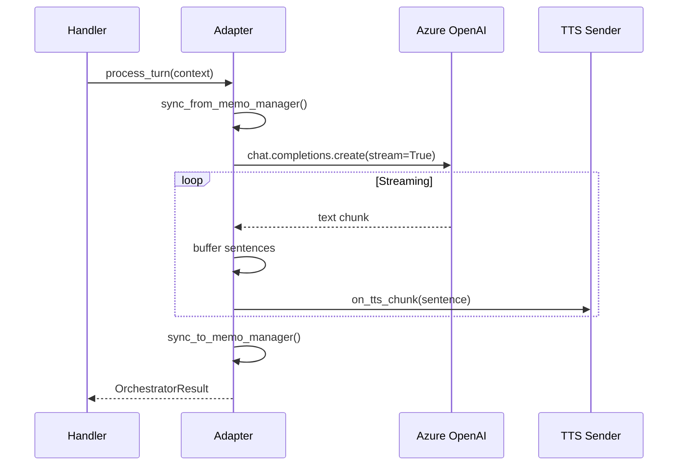

# Orchestrators Reference

> **Quick Reference:** Implementation details for CascadeOrchestratorAdapter and LiveOrchestrator

---

## Side-by-Side Comparison

| Feature | CascadeOrchestratorAdapter | LiveOrchestrator |
|---------|---------------------------|------------------|
| **Audio Processing** | Azure Speech STT → LLM → TTS | OpenAI Realtime API (all-in-one) |
| **Turn Model** | Synchronous (transcript → response) | Event-driven (continuous) |
| **Barge-in** | Thread-based detection | Server-side VAD |
| **Latency** | 100-300ms | 200-400ms typical |
| **Phrase Lists** | ✅ Supported | ❌ Not supported |
| **Azure Voices** | ✅ Full neural voice library | ❌ OpenAI voices only |
| **Sentence Streaming** | ✅ Sentence-level TTS | ❌ Continuous audio |
| **Handoff Pattern** | State-based (end of turn) | Immediate (tool call) |

---

## CascadeOrchestratorAdapter

**Source:** [orchestrator.py](https://github.com/Azure-Samples/art-voice-agent-accelerator/blob/main/apps/artagent/backend/voice/speech_cascade/orchestrator.py)

### Quick Start

```python
from apps.artagent.backend.voice.speech_cascade import get_cascade_orchestrator

adapter = get_cascade_orchestrator(
    call_connection_id=call_id,
    session_id=session_id,
    scenario_name="banking",
)

result = await adapter.process_turn(
    context,
    on_tts_chunk=send_tts_chunk,
)
```

### Configuration

```python
@dataclass
class CascadeConfig:
    start_agent: str = "Concierge"
    model_name: str = "gpt-4o"
    call_connection_id: str = None
    session_id: str = None
    enable_rag: bool = True
```

### Turn Processing Flow



### Sentence-Level Streaming

Cascade buffers LLM output and dispatches complete sentences:

```python
# Dispatch on sentence boundaries (.!?)
sentence_buffer = ""
while len(sentence_buffer) >= min_chunk:
    term_idx = max(sentence_buffer.rfind(t) for t in ".!?")
    if term_idx >= min_chunk - 10:
        dispatch = sentence_buffer[:term_idx + 1]
        _put_chunk(dispatch)  # Send to TTS
```

### Handoff Execution

State-based pattern—handoffs execute at turn boundaries:

```python
# During tool execution
if handoff_service.is_handoff(tool_name):
    self._pending_handoff = resolution
    memo_manager.set_corememory("pending_handoff", target_agent)

# End of turn
if self._pending_handoff:
    await self._execute_handoff()
```

---

## LiveOrchestrator

**Source:** [orchestrator.py](https://github.com/Azure-Samples/art-voice-agent-accelerator/blob/main/apps/artagent/backend/voice/voicelive/orchestrator.py)

### Quick Start

```python
from apps.artagent.backend.voice.voicelive import LiveOrchestrator

orchestrator = LiveOrchestrator(
    conn=voicelive_connection,
    agents=adapted_agents,
    handoff_map=handoff_map,
    start_agent="Concierge",
    memo_manager=memo,
)

await orchestrator.start(system_vars={"caller_name": "John"})
```

### Event Loop

VoiceLive is event-driven—routes events from OpenAI Realtime API:

```python
async def handle_event(self, event):
    match event.type:
        case ServerEventType.SESSION_UPDATED:
            await self._handle_session_updated(event)
        case ServerEventType.INPUT_AUDIO_BUFFER_SPEECH_STARTED:
            await self._handle_speech_started()  # Barge-in
        case ServerEventType.RESPONSE_AUDIO_DELTA:
            await self.audio.queue_audio(event.delta)
        case ServerEventType.RESPONSE_FUNCTION_CALL_ARGUMENTS_DONE:
            await self._execute_tool_call(event.call_id, event.name, event.arguments)
```

### Agent Switching

Switches are immediate upon handoff tool completion:

```python
async def _switch_to(self, agent_name: str, system_vars: dict):
    # Emit summary span for outgoing agent
    self._emit_agent_summary_span(previous_agent)
    
    # Select greeting
    greeting = self._select_pending_greeting(agent, system_vars, is_first_visit)
    
    self.active = agent_name
    
    # Apply new agent's session config
    await agent.apply_session(self.conn, system_vars=system_vars)
```

### Barge-In Handling

Automatic via `SPEECH_STARTED` events:

```python
async def _handle_speech_started(self):
    if self.audio:
        await self.audio.stop_playback()
    await self.conn.response.cancel()
```

---

## Shared Abstractions

Both orchestrators share context structures from `voice/shared/base.py`:

### OrchestratorContext

```python
@dataclass
class OrchestratorContext:
    user_text: str
    conversation_history: List[Dict]
    metadata: Dict[str, Any]
    memo_manager: Optional[MemoManager] = None
```

### OrchestratorResult

```python
@dataclass
class OrchestratorResult:
    response_text: str
    tool_calls: List[Dict]
    handoff_occurred: bool
    new_agent: Optional[str]
    metadata: Dict[str, Any]
```

---

## MemoManager Integration

Both orchestrators sync state at turn boundaries:

```python
# Restore at turn start
def sync_from_memo_manager(self, memo: MemoManager):
    self._active_agent = memo.get_corememory("active_agent")
    self._visited_agents = set(memo.get_corememory("visited_agents"))

# Persist at turn end
def sync_to_memo_manager(self, memo: MemoManager):
    memo.set_corememory("active_agent", self._active_agent)
    memo.set_corememory("visited_agents", list(self._visited_agents))
```

---

## Telemetry

Both emit OpenTelemetry spans following GenAI semantic conventions:

```python
with tracer.start_as_current_span(
    f"invoke_agent {self._active_agent}",
    kind=SpanKind.CLIENT,
    attributes={
        "gen_ai.operation.name": "invoke_agent",
        "gen_ai.agent.name": self._active_agent,
        "gen_ai.usage.input_tokens": input_tokens,
        "gen_ai.usage.output_tokens": output_tokens,
    },
) as span:
    ...
```

Token tracking enables cost attribution per agent session.

---

## Related Documentation

- [Orchestration Overview](README.md) — Architecture and mode selection
- [Handoff Service](handoff-service.md) — Unified handoff resolution
- [Agent Framework](../agents/README.md) — Agent configuration
- [Streaming Modes](../speech/README.md) — Audio processing comparison
