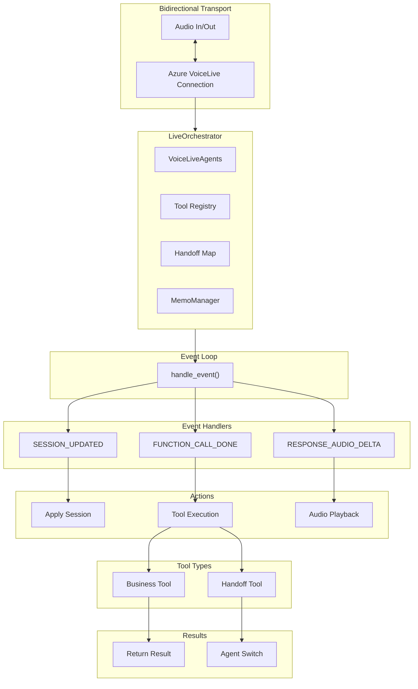

# VoiceLive Orchestrator

The **LiveOrchestrator** is the event-driven orchestration engine for VoiceLive mode, providing ultra-low-latency multi-agent voice orchestration using the OpenAI Realtime API.

---

## Overview

The VoiceLive Orchestrator is designed for scenarios requiring:

- **Lowest possible latency** — Direct audio streaming to OpenAI Realtime API
- **Managed audio processing** — Server-side VAD and turn detection
- **Simplified architecture** — No separate STT/TTS services
- **Native function calling** — Built-in tool execution



---

## Source Files

| File | Purpose |
|------|---------|
| [orchestrator.py](https://github.com/Azure-Samples/art-voice-agent-accelerator/blob/main/apps/artagent/backend/voice/voicelive/orchestrator.py) | Main orchestrator implementation |
| [handler.py](https://github.com/Azure-Samples/art-voice-agent-accelerator/blob/main/apps/artagent/backend/voice/voicelive/handler.py) | WebSocket handler integration |
| [agent_adapter.py](https://github.com/Azure-Samples/art-voice-agent-accelerator/blob/main/apps/artagent/backend/voice/voicelive/agent_adapter.py) | VoiceLive agent adapter |

---

## Constructor

```python
class LiveOrchestrator:
    def __init__(
        self,
        conn,                                    # VoiceLive connection
        agents: Dict[str, VoiceLiveAgentAdapter],  # Agent registry
        handoff_map: Optional[Dict[str, str]] = None,  # tool → agent
        start_agent: str = "Concierge",          # Initial agent
        audio_processor=None,                    # Audio queue manager
        messenger=None,                          # UI message sender
        call_connection_id: Optional[str] = None,  # ACS call ID
        *,
        transport: str = "acs",                  # Transport type
        model_name: Optional[str] = None,        # Model for telemetry
        memo_manager: Optional[MemoManager] = None,  # Session state
        handoff_provider: Optional[HandoffProvider] = None,  # Dynamic handoffs
    ):
```

---

## Event Handling

The orchestrator is event-driven, routing events from the OpenAI Realtime API:

### handle_event() Method

```python
async def handle_event(self, event):
    """Route VoiceLive events to handlers."""
    et = event.type
    
    if et == ServerEventType.SESSION_UPDATED:
        await self._handle_session_updated(event)
    elif et == ServerEventType.INPUT_AUDIO_BUFFER_SPEECH_STARTED:
        await self._handle_speech_started()
    elif et == ServerEventType.INPUT_AUDIO_BUFFER_SPEECH_STOPPED:
        await self._handle_speech_stopped()
    elif et == ServerEventType.RESPONSE_AUDIO_DELTA:
        await self.audio.queue_audio(event.delta)
    elif et == ServerEventType.RESPONSE_FUNCTION_CALL_ARGUMENTS_DONE:
        await self._execute_tool_call(event.call_id, event.name, event.arguments)
    elif et == ServerEventType.RESPONSE_DONE:
        await self._handle_response_done(event)
    # ... more events
```

### Event Types Handled

| Event Type | Handler | Description |
|------------|---------|-------------|
| `SESSION_UPDATED` | `_handle_session_updated` | Agent session configured |
| `INPUT_AUDIO_BUFFER_SPEECH_STARTED` | `_handle_speech_started` | User started speaking (barge-in) |
| `INPUT_AUDIO_BUFFER_SPEECH_STOPPED` | `_handle_speech_stopped` | User stopped speaking |
| `TRANSCRIPTION_COMPLETED` | `_handle_transcription_completed` | User utterance transcribed |
| `RESPONSE_AUDIO_DELTA` | Queue to audio processor | Audio chunk from model |
| `RESPONSE_AUDIO_TRANSCRIPT_DELTA` | `_handle_transcript_delta` | Streaming transcript |
| `RESPONSE_FUNCTION_CALL_ARGUMENTS_DONE` | `_execute_tool_call` | Tool call ready |
| `RESPONSE_DONE` | `_handle_response_done` | Response complete |

---

## Agent Switching

### _switch_to() Method

Switches to a different agent and applies its session configuration:

```python
async def _switch_to(self, agent_name: str, system_vars: dict):
    """Switch to a different agent."""
    previous_agent = self.active
    agent = self.agents[agent_name]
    
    # Emit summary span for outgoing agent
    if previous_agent != agent_name:
        self._emit_agent_summary_span(previous_agent)
    
    # Update context
    system_vars["previous_agent"] = previous_agent
    system_vars["active_agent"] = agent_name
    
    # Select greeting
    is_first_visit = agent_name not in self.visited_agents
    self.visited_agents.add(agent_name)
    greeting = self._select_pending_greeting(agent, system_vars, is_first_visit)
    
    # Auto-load user profile if needed
    await _auto_load_user_context(system_vars)
    
    self.active = agent_name
    
    # Apply new agent's session config
    await agent.apply_session(
        self.conn,
        system_vars=system_vars,
        session_id=session_id,
    )
    
    # Reset token counters
    self._agent_input_tokens = 0
    self._agent_output_tokens = 0
```

### Greeting Selection

The orchestrator selects appropriate greetings based on context:

```python
def _select_pending_greeting(
    self,
    agent: VoiceLiveAgentAdapter,
    system_vars: Dict,
    is_first_visit: bool,
) -> Optional[str]:
    """Select greeting for agent switch."""
    if is_first_visit:
        # First time visiting this agent
        return agent.render_greeting(system_vars)
    else:
        # Returning to this agent
        return agent.render_return_greeting(system_vars)
```

---

## Tool Execution

### _execute_tool_call() Method

Executes tools via the shared registry and handles handoffs:

```python
async def _execute_tool_call(
    self,
    call_id: str,
    name: str,
    args_json: str,
) -> bool:
    """Execute tool and return result to model."""
    args = json.loads(args_json) if args_json else {}
    
    # Execute via shared registry
    result = await execute_tool(name, args)
    
    # Handle handoff tools
    if is_handoff_tool(name):
        target = self.get_handoff_target(name)
        if target:
            # Build handoff context
            system_vars = {
                **self._system_vars,
                "handoff_context": result.get("handoff_context", {}),
            }
            await self._switch_to(target, system_vars)
            return True  # Handoff executed
    
    # Return result to model
    await self.conn.conversation.item.create(
        FunctionCallOutputItem(
            call_id=call_id,
            output=json.dumps(result),
        )
    )
    await self.conn.response.create()
    
    return False  # Not a handoff
```

### Tool Types

| Tool Type | Handling | Example |
|-----------|----------|---------|
| **Business Tools** | Execute and return result to model | `get_account_summary` |
| **Handoff Tools** | Execute, switch agent, apply new session | `handoff_fraud_agent` |
| **Transfer Tools** | Execute and initiate call transfer | `transfer_call_to_call_center` |

---

## Barge-In Handling

When the user starts speaking, the orchestrator cancels the current response:

```python
async def _handle_speech_started(self) -> None:
    """Handle user speech started (barge-in)."""
    logger.debug("User speech started → cancel current response")
    
    # Stop audio playback
    if self.audio:
        await self.audio.stop_playback()
    
    # Cancel model response
    await self.conn.response.cancel()
    
    # Notify UI
    if self.messenger and self._active_response_id:
        await self.messenger.send_assistant_cancelled(
            response_id=self._active_response_id,
            reason="user_barge_in",
        )
```

---

## MemoManager Integration

### Sync Patterns

```python
def _sync_from_memo_manager(self) -> None:
    """Restore state at initialization."""
    if not self._memo_manager:
        return
    
    mm = self._memo_manager
    
    # Restore active agent
    active = mm.get_value_from_corememory("active_agent")
    if active and active in self.agents:
        self.active = active
    
    # Restore visited agents
    visited = mm.get_value_from_corememory("visited_agents")
    if visited:
        self.visited_agents = set(visited)
    
    # Restore session profile
    session_profile = mm.get_value_from_corememory("session_profile")
    if session_profile:
        self._system_vars["session_profile"] = session_profile
        self._system_vars["client_id"] = session_profile.get("client_id")

def _sync_to_memo_manager(self) -> None:
    """Persist state at turn boundaries."""
    if not self._memo_manager:
        return
    
    mm = self._memo_manager
    mm.set_corememory("active_agent", self.active)
    mm.set_corememory("visited_agents", list(self.visited_agents))
```

---

## Telemetry

### LLM Time-to-First-Token (TTFT)

The orchestrator tracks TTFT for each turn:

```python
async def _handle_speech_stopped(self) -> None:
    """Track turn start for TTFT measurement."""
    self._llm_turn_number += 1
    self._llm_turn_start_time = time.perf_counter()
    self._llm_first_token_time = None

async def _handle_transcript_delta(self, event) -> None:
    """Record TTFT on first token."""
    if self._llm_turn_start_time and self._llm_first_token_time is None:
        self._llm_first_token_time = time.perf_counter()
        ttft_ms = (self._llm_first_token_time - self._llm_turn_start_time) * 1000
        
        with tracer.start_as_current_span("voicelive.llm.ttft") as span:
            span.add_event("llm.first_token", {"ttft_ms": ttft_ms})
```

### invoke_agent Spans

Per-agent session metrics:

```python
def _emit_agent_summary_span(self, agent_name: str) -> None:
    """Emit summary span for App Insights Agents blade."""
    with tracer.start_as_current_span(
        f"invoke_agent {agent_name}",
        kind=trace.SpanKind.CLIENT,
        attributes={
            "gen_ai.operation.name": "invoke_agent",
            "gen_ai.agent.name": agent_name,
            "gen_ai.provider.name": "azure.ai.openai",
            "gen_ai.request.model": self._model_name,
            "gen_ai.usage.input_tokens": self._agent_input_tokens,
            "gen_ai.usage.output_tokens": self._agent_output_tokens,
        },
    ) as span:
        span.set_status(trace.StatusCode.OK)
```

### Token Tracking

```python
# Per response_done event
def _emit_model_metrics(self, event) -> None:
    """Extract and record token usage."""
    response = getattr(event, "response", None)
    if response:
        usage = getattr(response, "usage", None)
        if usage:
            self._agent_input_tokens += getattr(usage, "input_tokens", 0)
            self._agent_output_tokens += getattr(usage, "output_tokens", 0)
            self._agent_response_count += 1
```

---

## Constants

```python
# Tools that trigger ACS call transfer
TRANSFER_TOOL_NAMES = {
    "transfer_call_to_destination",
    "transfer_call_to_call_center",
}

# Phrases that trigger call center transfer
CALL_CENTER_TRIGGER_PHRASES = {
    "transfer to call center",
    "transfer me to the call center",
}
```

---

## Integration with VoiceLiveHandler

### Creating the Orchestrator

```python
from apps.artagent.backend.voice.voicelive import LiveOrchestrator

# Create with adapted agents
orchestrator = LiveOrchestrator(
    conn=voicelive_connection,
    agents=adapted_agents,  # Dict[str, VoiceLiveAgentAdapter]
    handoff_map=handoff_map,
    start_agent="Concierge",
    audio_processor=audio_processor,
    messenger=messenger,
    call_connection_id=call_id,
    memo_manager=memo,
)

# Start with initial system vars
await orchestrator.start(system_vars={
    "caller_name": "John",
    "institution_name": "Contoso Bank",
})
```

### Event Loop Integration

```python
# In VoiceLiveHandler
async def _event_loop(self):
    """Process events from VoiceLive connection."""
    async for event in self.conn:
        await self.orchestrator.handle_event(event)
```

---

## Auto User Context Loading

When a handoff includes `client_id`, the orchestrator auto-loads the user profile:

```python
async def _auto_load_user_context(system_vars: Dict) -> None:
    """Auto-load user profile if client_id present."""
    if system_vars.get("session_profile"):
        return  # Already have profile
    
    client_id = system_vars.get("client_id")
    if not client_id:
        # Check handoff_context
        handoff_ctx = system_vars.get("handoff_context", {})
        client_id = handoff_ctx.get("client_id")
    
    if client_id:
        profile = await load_user_profile_by_client_id(client_id)
        if profile:
            system_vars["session_profile"] = profile
            system_vars["caller_name"] = profile.get("full_name")
```

---

## Best Practices

### Agent Configuration

- Use `VoiceLiveAgentAdapter` to wrap `UnifiedAgent` for VoiceLive-specific features
- Configure `turn_detection` settings per agent for optimal VAD
- Set appropriate `silence_duration_ms` for conversation pacing

### Performance

- VoiceLive has lowest latency (~200ms end-to-end)
- Barge-in handling is automatic via `SPEECH_STARTED` events
- Token tracking enables cost attribution per agent

### Handoffs

- Use `handoff_context` to pass relevant information to target agent
- Include `client_id` to enable auto profile loading
- Target agent's greeting is spoken automatically after session update

---

## Related Documentation

- [Orchestration Overview](README.md) — Dual orchestration architecture
- [Cascade Orchestrator](cascade.md) — Alternative orchestration mode
- [Agent Framework](../agents/README.md) — Agent configuration
- [Handoff Strategies](../agents/handoffs.md) — Multi-agent patterns
