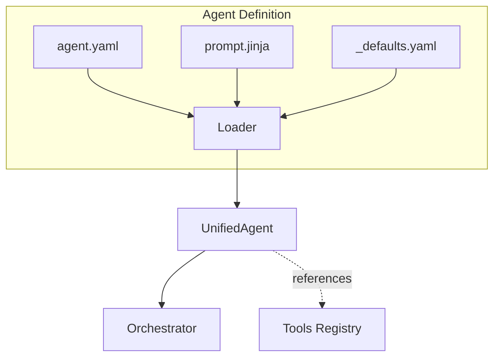

# Agents Guide

Agents are the conversational personas that interact with customers. Each agent has a specific role, personality, and set of tools. This guide explains how to define and configure agents.

---

<div class="grid cards" markdown>

-   :material-fast-forward:{ .lg .middle } **Quick Start**

    ---

    Jump to [Creating a New Agent](#creating-a-new-agent)

-   :material-cog:{ .lg .middle } **Configuration**

    ---

    See [Configuration Reference](#configuration-reference)

-   :material-file-document:{ .lg .middle } **Prompts**

    ---

    Learn [Prompt Templates](#prompt-templates)

-   :material-help-circle:{ .lg .middle } **Troubleshooting**

    ---

    Common issues in [Troubleshooting](#troubleshooting)

</div>

---

## Overview

Agents are defined in YAML configuration files with an optional Jinja2 prompt template:

```
agentstore/
├── concierge/
│   ├── agent.yaml      # Configuration
│   └── prompt.jinja    # System prompt template
├── fraud_agent/
│   ├── agent.yaml
│   └── prompt.jinja
└── _defaults.yaml      # Shared defaults
```



## Agent Configuration

### Minimal Configuration

The simplest agent definition:

```yaml
# agents/my_agent/agent.yaml
name: MyAgent
description: Handles customer inquiries

greeting: "Hello, how can I help you today?"

tools:
  - verify_client_identity
  - handoff_concierge

prompts:
  path: prompt.jinja
```

### Full Configuration

A complete agent with all options:

```yaml
# ═══════════════════════════════════════════════════════════════════════════════
# Concierge Agent
# ═══════════════════════════════════════════════════════════════════════════════

name: Concierge
description: Primary assistant that routes to specialists

# ─────────────────────────────────────────────────────────────────────────────
# Greetings (support Jinja2 templates)
# ─────────────────────────────────────────────────────────────────────────────
greeting: |
  Hi {{ caller_name | default('there') }}, welcome to {{ institution_name }}.
  How can I help you today?

return_greeting: |
  Welcome back! Is there anything else I can help with?

# ─────────────────────────────────────────────────────────────────────────────
# Handoff Configuration
# ─────────────────────────────────────────────────────────────────────────────
handoff:
  trigger: handoff_concierge    # Tool name that routes TO this agent
  is_entry_point: false         # Set true for the default starting agent

# ─────────────────────────────────────────────────────────────────────────────
# Model Configuration
# ─────────────────────────────────────────────────────────────────────────────
model:
  deployment_id: gpt-4o         # Azure OpenAI deployment
  temperature: 0.7              # Creativity (0-1)
  max_tokens: 2048              # Max response length

# Mode-specific models (optional)
voicelive_model:
  deployment_id: gpt-realtime   # For VoiceLive mode
  temperature: 0.7

cascade_model:
  deployment_id: gpt-4o         # For Cascade mode
  temperature: 0.8

# ─────────────────────────────────────────────────────────────────────────────
# Voice Configuration (Azure TTS)
# ─────────────────────────────────────────────────────────────────────────────
voice:
  name: en-US-AriaNeural        # Azure TTS voice
  rate: "-5%"                   # Slow down for clarity
  style: chat                   # Voice style

# ─────────────────────────────────────────────────────────────────────────────
# Tools (referenced by name from shared registry)
# ─────────────────────────────────────────────────────────────────────────────
tools:
  - verify_client_identity
  - get_user_profile
  - get_account_summary
  - handoff_fraud_agent
  - handoff_investment_advisor
  - escalate_human

# ─────────────────────────────────────────────────────────────────────────────
# Prompt Template
# ─────────────────────────────────────────────────────────────────────────────
prompts:
  path: prompt.jinja

# ─────────────────────────────────────────────────────────────────────────────
# Template Variables (available in prompt rendering)
# ─────────────────────────────────────────────────────────────────────────────
template_vars:
  institution_name: "Contoso Bank"
  support_phone: "1-800-555-0123"
```

## Configuration Reference

| Field | Type | Default | Description |
|-------|------|---------|-------------|
| `name` | string | *required* | Unique agent identifier |
| `description` | string | `""` | Human-readable description |
| `greeting` | string | `""` | Initial greeting (supports Jinja2) |
| `return_greeting` | string | `""` | Greeting when returning to this agent |
| `handoff.trigger` | string | `""` | Tool name that routes TO this agent |
| `handoff.is_entry_point` | bool | `false` | Is this the default starting agent? |
| `model.deployment_id` | string | `gpt-4o` | Azure OpenAI deployment |
| `model.temperature` | float | `0.7` | Response creativity (0-1) |
| `voice.name` | string | `en-US-ShimmerTurboMultilingualNeural` | Azure TTS voice |
| `tools` | list | `[]` | Tool names from registry |
| `prompts.path` | string | `""` | Path to prompt file |
| `prompts.content` | string | `""` | Inline prompt (alternative to path) |
| `template_vars` | dict | `{}` | Custom variables for prompts |

## Prompt Templates

Prompts use Jinja2 templating for dynamic content:

```jinja
{# agents/concierge/prompt.jinja #}
You are **{{ agent_name }}** at {{ institution_name }}.

# YOUR ROLE
You are the primary customer service representative. Help customers with:
- Account inquiries
- Transaction questions
- Routing to specialists

# CUSTOMER CONTEXT

## Authenticated Customer
- **Name:** {{ session_profile.full_name }}
- **Client ID:** {{ session_profile.client_id }}
- **Tier:** {{ session_profile.relationship_tier | default('Standard') }}

## New Customer
No profile loaded. Verify identity before account access.


# AVAILABLE TOOLS

- `{{ tool }}`


# HANDOFF RULES
- Fraud concerns → `handoff_fraud_agent`
- Investment questions → `handoff_investment_advisor`
- Always handoff silently (don't announce the transfer)

# GUIDELINES
- Keep responses brief (1-3 sentences for voice)
- Spell out numbers for clarity
- Ask one question at a time
```

### Available Template Variables

| Variable | Source | Description |
|----------|--------|-------------|
| `agent_name` | Config or env | Display name of the agent |
| `institution_name` | Env or defaults | Bank/company name |
| `caller_name` | Runtime | Customer's name (if known) |
| `client_id` | Runtime | Customer identifier |
| `session_profile` | Runtime | Full customer profile |
| `tools` | Config | List of tool names |
| `previous_agent` | Runtime | Agent that handed off |
| `handoff_context` | Runtime | Context passed during handoff |

### Inline vs External Prompts

**Inline prompt** (for shorter prompts):
```yaml
prompts:
  content: |
    You are {{ agent_name }} at {{ institution_name }}.
    Help customers with their banking needs.
```

**External file** (recommended for complex prompts):
```yaml
prompts:
  path: prompt.jinja
```

## Defaults and Inheritance

The `_defaults.yaml` file defines shared settings:

```yaml
# agentstore/_defaults.yaml

model:
  deployment_id: gpt-4o
  temperature: 0.7
  max_tokens: 4096

voice:
  name: en-US-ShimmerTurboMultilingualNeural
  rate: "+0%"

template_vars:
  institution_name: "Contoso Bank"
```

Agent-specific configs override these defaults:

```yaml
# agents/fraud_agent/agent.yaml

name: FraudAgent

# Override voice for this agent
voice:
  name: en-US-JennyNeural
  rate: "-10%"  # Slower for sensitive topics

# Model inherits from defaults
# template_vars merge with defaults
```

## Agent Discovery and Loading

The framework auto-discovers agents at startup:

```python
from apps.artagent.backend.registries.agentstore import (
    discover_agents,
    build_handoff_map,
)

# Load all agents from agentstore/
agents = discover_agents()
# Returns: {"Concierge": UnifiedAgent, "FraudAgent": UnifiedAgent, ...}

# Build routing map (tool_name → agent_name)
handoff_map = build_handoff_map(agents)
# Returns: {"handoff_fraud_agent": "FraudAgent", ...}
```

## Using Agents

### Get Tools for an Agent

```python
agent = agents["Concierge"]

# Get OpenAI-compatible tool schemas
tools = agent.get_tools()
# Returns: [{"type": "function", "function": {...}}, ...]
```

### Render Prompt with Context

```python
prompt = agent.render_prompt({
    "caller_name": "John Smith",
    "client_id": "CLT-001",
    "session_profile": {
        "full_name": "John Smith",
        "relationship_tier": "Platinum",
    },
})
```

### Execute a Tool

```python
result = await agent.execute_tool("get_account_summary", {
    "client_id": "CLT-001"
})
```

## Creating a New Agent

### Step 1: Create Directory

```bash
mkdir -p apps/artagent/backend/registries/agentstore/my_agent
```

### Step 2: Create agent.yaml

```yaml
# apps/artagent/backend/registries/agentstore/my_agent/agent.yaml

name: MyAgent
description: Specialist for handling specific requests

greeting: "Hello, I'm here to help with your request."
return_greeting: "Welcome back! What else can I help with?"

handoff:
  trigger: handoff_my_agent

tools:
  - verify_client_identity
  - get_user_profile
  - handoff_concierge  # Return to main agent

prompts:
  path: prompt.jinja
```

### Step 3: Create prompt.jinja

```jinja
{# apps/artagent/backend/registries/agentstore/my_agent/prompt.jinja #}

You are **{{ agent_name | default('Specialist') }}** at {{ institution_name | default('Contoso Bank') }}.

# YOUR ROLE
[Describe what this agent specializes in]

# CUSTOMER CONTEXT

- **Name:** {{ session_profile.full_name }}
- **Client ID:** {{ session_profile.client_id }}


# GUIDELINES
- Keep responses brief (1-3 sentences)
- For general questions → `handoff_concierge`
```

### Step 4: Add Handoff Tool (if needed)

If other agents need to route to your agent, add a handoff tool in `toolstore/handoffs.py`:

```python
# In toolstore/handoffs.py

handoff_my_agent_schema: dict[str, Any] = {
    "name": "handoff_my_agent",
    "description": "Transfer to MyAgent for specialized help.",
    "parameters": {
        "type": "object",
        "properties": {
            "client_id": {"type": "string", "description": "Customer ID"},
            "reason": {"type": "string", "description": "Why transferring"},
        },
        "required": ["client_id"],
    },
}

async def handoff_my_agent(args: dict[str, Any]) -> dict[str, Any]:
    return _build_handoff_payload(
        target_agent="MyAgent",
        message="",
        summary=f"Transfer: {args.get('reason', 'specialist request')}",
        context={"client_id": args.get("client_id")},
    )

register_tool(
    "handoff_my_agent",
    handoff_my_agent_schema,
    handoff_my_agent,
    is_handoff=True,
)
```

### Step 5: Add to Other Agents' Tools

```yaml
# agents/concierge/agent.yaml
tools:
  # ... existing tools ...
  - handoff_my_agent  # Add the new handoff
```

---

## Voice Mode Configuration

Agents can be configured differently for each voice transport mode:

### VoiceLive Mode

Uses Azure OpenAI Realtime API for ultra-low latency:

```yaml
voicelive_model:
  deployment_id: gpt-4o-realtime-preview
  temperature: 0.8
  voice: shimmer  # OpenAI native voice
```

### Cascade Mode

Uses separate STT → LLM → TTS pipeline for more control:

```yaml
cascade_model:
  deployment_id: gpt-4o
  temperature: 0.7

voice:  # Azure TTS voice
  name: en-US-AriaNeural
  rate: "-5%"
  style: chat
```

### Mode Selection

The mode is selected at runtime based on the API endpoint or WebSocket path:

| Endpoint | Mode | Model Used |
|----------|------|------------|
| `/voice/voicelive/ws` | VoiceLive | `voicelive_model` |
| `/voice/cascade/ws` | Cascade | `cascade_model` |
| Default | Cascade | `model` |

---

## Troubleshooting

### Common Issues

| Problem | Cause | Solution |
|---------|-------|----------|
| "Agent not found" | Folder name doesn't match | Ensure folder name under `agentstore/` matches the `name` field |
| Prompt not rendering | Missing template variables | Check `template_vars` in agent.yaml or scenario |
| Tools not available | Tool not in `tools` list | Add tool name to agent's `tools` array |
| Wrong voice | Voice config not loaded | Check `voice.name` is a valid Azure TTS voice |
| Handoff fails | Missing `handoff.trigger` | Add `handoff.trigger: handoff_<agent>` to agent.yaml |
| Greeting not playing | Empty or missing greeting | Add `greeting` field to agent.yaml |

### Debug Agent Loading

```python
from apps.artagent.backend.registries.agentstore import discover_agents, get_agent

# List all discovered agents
agents = discover_agents()
print([a.id for a in agents.values()])

# Debug specific agent
agent = get_agent("Concierge")
print(f"Tools: {agent.tool_names}")
print(f"Voice: {agent.voice}")
print(f"Greeting: {agent.greeting}")
```

### Validate Prompt Rendering

```python
agent = get_agent("Concierge")

# Test render with context
prompt = agent.render_prompt({
    "caller_name": "Test User",
    "session_profile": {"full_name": "Test User"},
})
print(prompt)
```

---

## Next Steps

- [Tool Development](tools.md) - Learn how to create tools
- [Scenarios Guide](scenarios.md) - Configure agent availability per scenario
- [Overview](index.md) - Understand how agents, tools, and scenarios connect
