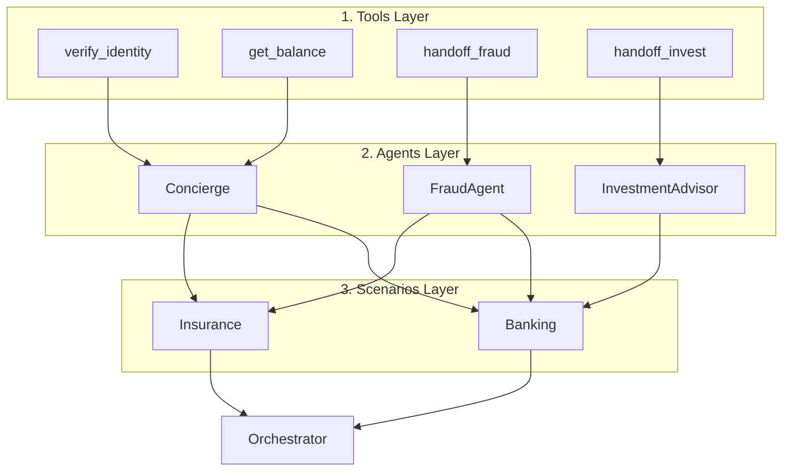
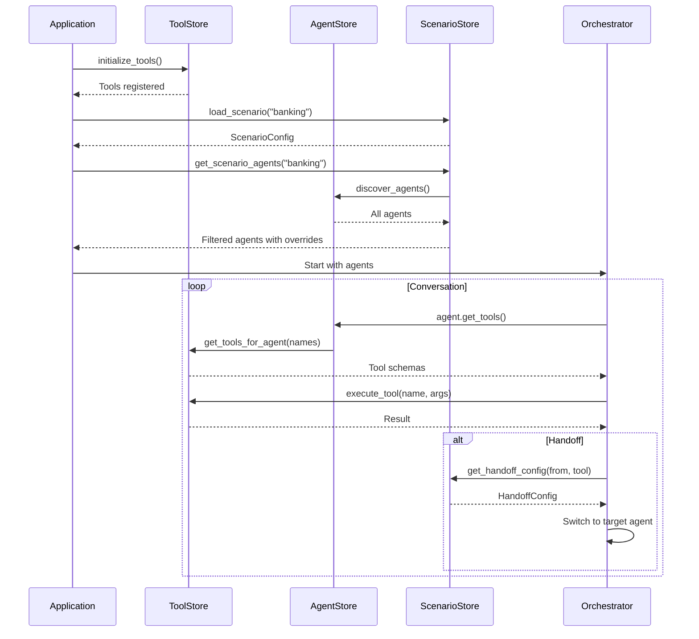
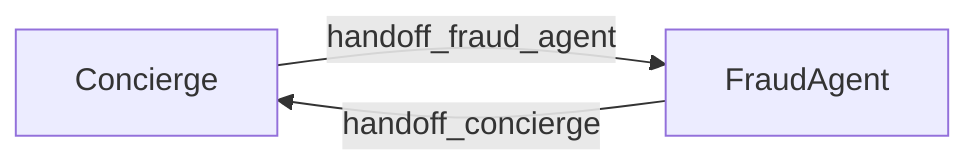

# Registries Overview

The registries system is the heart of agent configuration in the ART Voice Agent Accelerator. It provides a modular, YAML-driven approach to defining agents, tools, and scenarios.

---

## Quick Navigation

<div class="grid cards" markdown>

-   :material-wrench:{ .lg .middle } **Tools**

    ---

    Functions agents can call (verification, account lookups, handoffs)

    [:octicons-arrow-right-24: Tool Development](tools.md) · [:octicons-arrow-right-24: Tool Reference](tool-catalog.md)

-   :material-robot:{ .lg .middle } **Agents**

    ---

    Conversational personas with prompts, voices, and personalities

    [:octicons-arrow-right-24: Agents Guide](agents.md)

-   :material-sitemap:{ .lg .middle } **Scenarios**

    ---

    Deployment configurations that wire agents together

    [:octicons-arrow-right-24: Scenarios Guide](scenarios.md)

</div>

---

## The Three Layers



| Layer | Purpose | Configuration |
|-------|---------|---------------|
| **Tools** | Functions agents can call | Python schemas + executors |
| **Agents** | Conversational personas | YAML + Jinja2 prompts |
| **Scenarios** | Deployment configurations | YAML handoff graphs |

## How They Connect

### Tools → Agents

Agents reference tools by name in their `agent.yaml`:

```yaml
# Agent references tools by name
tools:
  - verify_client_identity
  - get_account_balance
  - handoff_fraud_agent
```

At runtime, the framework resolves these names to actual tool definitions.

### Agents → Scenarios

Scenarios select which agents are active and define their routing:

```yaml
# Scenario selects agents
agents:
  - Concierge
  - FraudAgent
  - InvestmentAdvisor

# Scenario defines handoff routes
handoffs:
  - from: Concierge
    to: FraudAgent
    tool: handoff_fraud_agent
```

## Directory Structure

```
apps/artagent/backend/registries/
├── toolstore/              # Tool definitions
│   ├── registry.py         # Core registration logic
│   ├── auth.py             # Authentication tools
│   ├── handoffs.py         # Handoff tools
│   └── banking/            # Domain tools
│       ├── banking.py
│       └── investments.py
│
├── agentstore/             # Agent definitions
│   ├── _defaults.yaml      # Shared defaults
│   ├── base.py             # UnifiedAgent class
│   ├── loader.py           # Agent discovery
│   ├── concierge/          # Agent folder
│   │   ├── agent.yaml
│   │   └── prompt.jinja
│   └── fraud_agent/
│       ├── agent.yaml
│       └── prompt.jinja
│
└── scenariostore/          # Scenario configs
    ├── loader.py           # Scenario loading
    ├── banking/
    │   └── orchestration.yaml
    └── insurance/
        └── orchestration.yaml
```

## Quick Start

### 1. Use Existing Tools, Agents, and Scenarios

```python
from apps.artagent.backend.registries.agentstore import discover_agents
from apps.artagent.backend.registries.toolstore import initialize_tools
from apps.artagent.backend.registries.scenariostore import (
    load_scenario,
    get_scenario_agents,
)

# Initialize tools
initialize_tools()

# Load scenario
scenario = load_scenario("banking")

# Get agents with scenario overrides
agents = get_scenario_agents("banking")

# Use an agent
concierge = agents["BankingConcierge"]
tools = concierge.get_tools()
prompt = concierge.render_prompt({"caller_name": "John"})
```

### 2. Add a New Tool

Create a file in `toolstore/`:

```python
# toolstore/my_tools.py
from apps.artagent.backend.registries.toolstore.registry import register_tool

schema = {
    "name": "my_tool",
    "description": "Does something useful",
    "parameters": {"type": "object", "properties": {}}
}

async def my_tool(args):
    return {"success": True, "result": "done"}

register_tool("my_tool", schema, my_tool)
```

### 3. Add a New Agent

Create a folder in `agentstore/`:

```
agentstore/my_agent/
├── agent.yaml
└── prompt.jinja
```

```yaml
# agent.yaml
name: MyAgent
tools:
  - my_tool
prompts:
  path: prompt.jinja
```

### 4. Add a New Scenario

Create a folder in `scenariostore/`:

```yaml
# scenariostore/my_scenario/orchestration.yaml
name: my_scenario
agents:
  - MyAgent
  - Concierge
handoffs:
  - from: Concierge
    to: MyAgent
    tool: handoff_my_agent
```

## Runtime Flow



## Key Concepts

### Handoffs

Handoffs transfer the conversation between agents:



- **Announced**: Target agent greets customer
- **Discrete**: Silent transition, conversation continues naturally

#### Generic vs Custom Handoff Tools

The framework provides a **generic handoff tool** that works for basic routing between agents. However, defining **custom handoff tools** like `handoff_fraud` or `handoff_invest` gives you better control over the agent context during transitions:

| Approach               | Use Case                                                                                          |
|------------------------|---------------------------------------------------------------------------------------------------|
| **Generic handoff**    | Simple routing where no special context is needed                                                 |
| **Custom handoff tool** | When you need to pass specific context, validate conditions, or customize the transition behavior |

Custom handoff tools allow you to:

- **Control context transfer**: Specify exactly what information passes to the target agent
- **Add validation logic**: Check preconditions before allowing the handoff
- **Customize parameters**: Define tool-specific arguments the LLM must provide (e.g., reason for transfer, urgency level)

```python
# Example: Custom handoff with context control
schema = {
    "name": "handoff_fraud_agent",
    "description": "Transfer to fraud specialist with case details",
    "parameters": {
        "type": "object",
        "properties": {
            "fraud_type": {"type": "string", "description": "Type of suspected fraud"},
            "urgency": {"type": "string", "enum": ["low", "medium", "high"]}
        },
        "required": ["fraud_type"]
    }
}
```

### Tool Registration

Tools self-register when imported:

```python
# This runs at import time
register_tool("my_tool", schema, executor)
```

The loader imports all tool modules, triggering registration.

### Agent Discovery

Agents are discovered by scanning for `agent.yaml` files:

```python
agents = discover_agents()
# Scans agentstore/ for */agent.yaml
```

### Scenario Overrides

Scenarios can customize agents without editing their files:

```yaml
agent_defaults:
  greeting: "Custom greeting!"
  template_vars:
    institution_name: "Custom Bank"
```

## Guides

<div class="grid cards" markdown>

-   :material-wrench:{ .lg .middle } **Tools**

    ---

    Define functions that agents can call

    [:octicons-arrow-right-24: Tools Guide](tools.md)

-   :material-robot:{ .lg .middle } **Agents**

    ---

    Create conversational personas with prompts

    [:octicons-arrow-right-24: Agents Guide](agents.md)

-   :material-sitemap:{ .lg .middle } **Scenarios**

    ---

    Configure agent graphs for deployments

    [:octicons-arrow-right-24: Scenarios Guide](scenarios.md)

</div>

## Common Tasks

| Task | Where | Guide |
|------|-------|-------|
| Add a function for agents to call | `toolstore/` | [Tools](tools.md#complete-example) |
| Create a new agent persona | `agentstore/` | [Agents](agents.md#creating-a-new-agent) |
| Enable agent routing | `toolstore/handoffs.py` | [Handoff Tools](tools.md#handoff-tools) |
| Configure a deployment | `scenariostore/` | [Scenarios](scenarios.md#creating-a-new-scenario) |
| Customize prompts per deployment | Scenario `template_vars` | [Agent Defaults](scenarios.md#agent-defaults) |

## API Reference

### ToolStore

```python
from apps.artagent.backend.registries.toolstore import (
    register_tool,        # Register a new tool
    initialize_tools,     # Load all tools
    execute_tool,         # Execute a tool
    get_tools_for_agent,  # Get schemas for agent
    list_tools,           # List tool names
    is_handoff_tool,      # Check if handoff
)
```

### AgentStore

```python
from apps.artagent.backend.registries.agentstore import (
    discover_agents,      # Load all agents
    build_handoff_map,    # Build routing map
    get_agent,            # Get single agent
    UnifiedAgent,         # Agent class
)
```

### ScenarioStore

```python
from apps.artagent.backend.registries.scenariostore import (
    load_scenario,                    # Load scenario config
    list_scenarios,                   # List available scenarios
    get_scenario_agents,              # Get agents with overrides
    get_scenario_start_agent,         # Get entry agent
    get_handoff_config,               # Get handoff settings
    get_handoff_instructions,         # Get prompt instructions
    build_handoff_map_from_scenario,  # Build routing map
)
```

---

## Troubleshooting

### Common Issues

| Problem | Cause | Solution |
|---------|-------|----------|
| "Agent not found" | Agent folder missing or misspelled | Check `agentstore/` folder name matches `id` in agent.yaml |
| "Tool not found" | Tool not imported during init | Add import to `toolstore/__init__.py` |
| "Handoff failed" | Route not defined in scenario | Add `handoffs` entry in `orchestration.yaml` |
| Template rendering error | Missing variable in context | Add variable to `template_vars` or `agent_defaults` |
| Agent using wrong voice | Voice config not loaded | Check `voice` section in agent.yaml |

### Debug Commands

```bash
# List all registered tools
python -c "from apps.artagent.backend.registries.toolstore import list_tools; print(list_tools())"

# List all discovered agents  
python -c "from apps.artagent.backend.registries.agentstore import discover_agents; print([a.id for a in discover_agents()])"

# List available scenarios
python -c "from apps.artagent.backend.registries.scenariostore import list_scenarios; print(list_scenarios())"
```

### Validation

Run the test suite to validate your registries:

```bash
# Test all registries
pytest tests/test_registries*.py -v

# Test specific registry
pytest tests/test_agentstore.py -v
```
