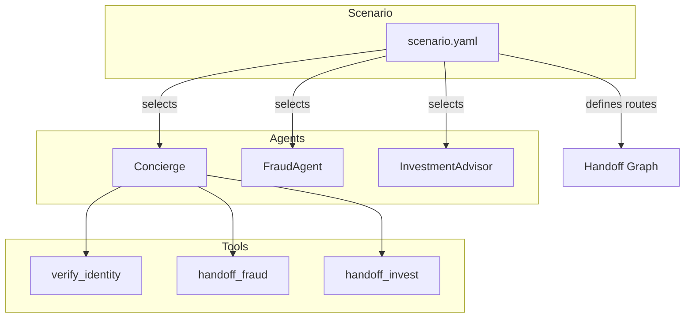

# Scenarios Guide

Scenarios define which agents are active and how they route to each other for a specific use case. They enable the same agents to behave differently depending on the industry or context.

---

<div class="grid cards" markdown>

-   :material-fast-forward:{ .lg .middle } **Quick Start**

    ---

    Jump to [Creating a New Scenario](#creating-a-new-scenario)

-   :material-transit-connection-variant:{ .lg .middle } **Handoffs**

    ---

    Configure [Handoff Routes](#handoff-configuration)

-   :material-cog:{ .lg .middle } **Agent Overrides**

    ---

    Customize [Agent Defaults](#agent-defaults)

-   :material-help-circle:{ .lg .middle } **Troubleshooting**

    ---

    Common issues in [Troubleshooting](#troubleshooting)

</div>

---

## Overview

Scenarios are YAML configuration files that:

1. **Select agents** - Which agents are available
2. **Define handoffs** - How agents route to each other
3. **Override settings** - Customize greetings, variables, etc.

```
scenariostore/
├── banking/
│   └── orchestration.yaml
├── insurance/
│   └── orchestration.yaml
└── default/
    └── orchestration.yaml
```



## Why Scenarios?

Without scenarios, you'd need separate agent definitions for each use case. Scenarios let you:

- **Reuse agents** across different deployments
- **Customize routing** per industry
- **Override settings** without editing agent files
- **Control handoff behavior** (announced vs discrete)

## Scenario Configuration

### Basic Structure

```yaml
# scenariostore/banking/orchestration.yaml

name: banking
description: Private banking customer service
icon: "🏦"

# Starting agent
start_agent: BankingConcierge

# Agents to include
agents:
  - BankingConcierge
  - CardRecommendation
  - InvestmentAdvisor

# Default handoff behavior
handoff_type: announced  # or "discrete"

# Handoff routes (agent graph)
handoffs:
  - from: BankingConcierge
    to: CardRecommendation
    tool: handoff_card_recommendation
    type: discrete
    
  - from: BankingConcierge
    to: InvestmentAdvisor
    tool: handoff_investment_advisor
    type: discrete

  - from: CardRecommendation
    to: BankingConcierge
    tool: handoff_concierge
    type: discrete

# Global template variables
template_vars:
  institution_name: "Contoso Bank"
  region: "US"

# Agent defaults
agent_defaults:
  company_name: "{{ institution_name }}"
  compliance_required: true
```

## Configuration Reference

| Field | Type | Default | Description |
|-------|------|---------|-------------|
| `name` | string | *required* | Scenario identifier |
| `description` | string | `""` | Human-readable description |
| `icon` | string | `"🎭"` | Emoji for UI |
| `start_agent` | string | First in list | Default starting agent |
| `agents` | list | All agents | Agents to include |
| `handoff_type` | string | `"announced"` | Default: `"announced"` or `"discrete"` |
| `handoffs` | list | `[]` | Handoff route definitions |
| `template_vars` | dict | `{}` | Global variables for prompts |
| `agent_defaults` | object | `{}` | Overrides applied to all agents |
| `generic_handoff` | object | disabled | Dynamic handoff configuration |

## Handoff Configuration

### Handoff Types

| Type | Behavior |
|------|----------|
| `announced` | Target agent greets the customer on switch |
| `discrete` | Silent handoff, conversation continues naturally |

### Defining Handoffs

Each handoff is a directed edge in the agent graph:

```yaml
handoffs:
  - from: Concierge          # Source agent
    to: FraudAgent           # Target agent
    tool: handoff_fraud      # Tool name that triggers this route
    type: discrete           # Silent handoff
    share_context: true      # Pass conversation context
    handoff_condition: |     # When to trigger (injected into prompt)
      Transfer when customer reports:
      - Unauthorized transactions
      - Suspicious activity
      - Potential fraud
```

### Handoff Graph Example

```yaml
# Banking scenario handoff graph:
#
#              ┌─────────────────────────────────────┐
#              │                                     │
#              ▼                                     │
#        ┌───────────────┐                           │
#        │BankingConcierge│ (Entry Point)            │
#        └───────┬───────┘                           │
#                │                                   │
#      ┌─────────┴─────────┐                         │
#      │                   │                         │
#      ▼                   ▼                         │
# ┌──────────────┐   ┌────────────────┐              │
# │    Card      │   │   Investment   │              │
# │Recommendation│◄─►│    Advisor     │              │
# └──────┬───────┘   └───────┬────────┘              │
#        │                   │                       │
#        └─────────┬─────────┘                       │
#                  │                                 │
#                  └─────────────────────────────────┘
#                    (All return to BankingConcierge)

handoffs:
  # Concierge → Specialists
  - from: BankingConcierge
    to: CardRecommendation
    tool: handoff_card_recommendation
    type: discrete
    handoff_condition: |
      Transfer when customer asks about credit cards,
      card benefits, or wants card recommendations.

  - from: BankingConcierge
    to: InvestmentAdvisor
    tool: handoff_investment_advisor
    type: discrete
    handoff_condition: |
      Transfer when customer asks about investments,
      retirement planning, or wealth management.

  # Cross-specialist routing
  - from: CardRecommendation
    to: InvestmentAdvisor
    tool: handoff_investment_advisor
    type: discrete
    handoff_condition: |
      Transfer when conversation shifts from cards
      to investment topics.

  - from: InvestmentAdvisor
    to: CardRecommendation
    tool: handoff_card_recommendation
    type: discrete

  # Return routes
  - from: CardRecommendation
    to: BankingConcierge
    tool: handoff_concierge
    type: discrete

  - from: InvestmentAdvisor
    to: BankingConcierge
    tool: handoff_concierge
    type: discrete
```

## Generic Handoffs

Enable dynamic agent transfers without explicit tool definitions:

```yaml
generic_handoff:
  enabled: true
  allowed_targets: []          # Empty = all scenario agents
  default_type: discrete       # Default handoff type
  share_context: true          # Pass conversation context
  require_client_id: false     # Whether client_id required

# With generic handoffs, agents can use:
# handoff_to_agent(target_agent="InvestmentAdvisor", reason="...")
```

## Agent Defaults

Apply settings to all agents in the scenario:

```yaml
agent_defaults:
  # Greeting override
  greeting: "Welcome to {{ company_name }}!"
  
  # Template variables
  company_name: "Contoso Bank"
  industry: "banking"
  compliance_required: true
  
  # Voice override
  voice:
    name: en-US-AriaNeural
    rate: "-5%"
```

## Using Scenarios

### Load a Scenario

```python
from apps.artagent.backend.registries.scenariostore import (
    load_scenario,
    get_scenario_agents,
    get_scenario_start_agent,
    build_handoff_map_from_scenario,
)

# Load scenario configuration
scenario = load_scenario("banking")

# Get agents with scenario overrides applied
agents = get_scenario_agents("banking")

# Get starting agent
start = get_scenario_start_agent("banking")
# Returns: "BankingConcierge"

# Build handoff routing map
handoff_map = build_handoff_map_from_scenario("banking")
# Returns: {"handoff_card_recommendation": "CardRecommendation", ...}
```

### Get Handoff Configuration

```python
from apps.artagent.backend.registries.scenariostore import get_handoff_config

# Get specific handoff settings
config = get_handoff_config(
    scenario_name="banking",
    from_agent="BankingConcierge",
    tool_name="handoff_card_recommendation",
)
# Returns: HandoffConfig(type="discrete", share_context=True, ...)
```

### Get Handoff Instructions

Auto-generate handoff instructions for agent prompts:

```python
from apps.artagent.backend.registries.scenariostore import get_handoff_instructions

instructions = get_handoff_instructions("banking", "BankingConcierge")
# Returns formatted prompt block describing when to handoff
```

## Creating a New Scenario

### Step 1: Create Directory

```bash
mkdir -p apps/artagent/backend/registries/scenariostore/healthcare
```

### Step 2: Create orchestration.yaml

```yaml
# scenariostore/healthcare/orchestration.yaml

name: healthcare
description: Healthcare customer service
icon: "🏥"

start_agent: HealthcareReceptionist

agents:
  - HealthcareReceptionist
  - AppointmentScheduler
  - InsuranceVerifier
  - PriorAuthAgent

handoff_type: announced

handoffs:
  - from: HealthcareReceptionist
    to: AppointmentScheduler
    tool: handoff_appointments
    type: discrete
    handoff_condition: |
      Transfer when patient wants to schedule,
      reschedule, or cancel appointments.

  - from: HealthcareReceptionist
    to: InsuranceVerifier
    tool: handoff_insurance
    type: discrete
    handoff_condition: |
      Transfer for insurance eligibility checks
      or coverage questions.

  - from: AppointmentScheduler
    to: HealthcareReceptionist
    tool: handoff_reception
    type: discrete

  - from: InsuranceVerifier
    to: HealthcareReceptionist
    tool: handoff_reception
    type: discrete

template_vars:
  institution_name: "Contoso Health"
  support_phone: "1-800-HEALTH"

agent_defaults:
  hipaa_compliant: true
  region: "US"
```

### Step 3: Ensure Agents Exist

Make sure referenced agents exist in `agentstore/`:

```
agentstore/
├── healthcare_receptionist/
│   ├── agent.yaml
│   └── prompt.jinja
├── appointment_scheduler/
│   ├── agent.yaml
│   └── prompt.jinja
└── ...
```

## Scenario vs Agent Handoffs

| Approach | Where Defined | Use Case |
|----------|---------------|----------|
| Agent `handoff.trigger` | `agent.yaml` | Single-scenario apps |
| Scenario `handoffs` | `orchestration.yaml` | Multi-scenario apps |

The scenario-based approach is recommended because:

- Routes are visible in one place
- Easy to add `handoff_condition` prompts
- Different behaviors per deployment

---

## Environment-Based Configuration

Use different scenarios per environment:

```python
import os
from apps.artagent.backend.registries.scenariostore import load_scenario

# Load scenario based on environment
env = os.getenv("DEPLOYMENT_ENV", "development")
scenario_map = {
    "development": "default",
    "staging": "banking",
    "production": "banking",
}
scenario = load_scenario(scenario_map.get(env, "default"))
```

Or use App Configuration for dynamic scenario selection:

```yaml
# appconfig/appconfig.json
{
  "azure_appconfig_endpoint": "https://myconfig.azconfig.io",
  "feature_flags": {
    "scenario": "banking"
  }
}
```

---

## Troubleshooting

### Common Issues

| Problem | Cause | Solution |
|---------|-------|----------|
| "Scenario not found" | Missing folder or file | Create `scenariostore/<name>/orchestration.yaml` |
| Agent not in scenario | Not listed in `agents` | Add agent name to `agents` list |
| Handoff not working | Missing route definition | Add entry to `handoffs` list |
| Wrong start agent | `start_agent` misconfigured | Set `start_agent` to valid agent name |
| Template vars not applied | Wrong field name | Use `template_vars` (not `variables`) |
| Silent handoff announced | `type: discrete` missing | Set `type: discrete` in handoff config |

### Debug Scenario Loading

```python
from apps.artagent.backend.registries.scenariostore import (
    load_scenario,
    list_scenarios,
    get_scenario_agents,
    build_handoff_map_from_scenario,
)

# List available scenarios
print(list_scenarios())
# ['default', 'banking', 'insurance']

# Load and inspect scenario
scenario = load_scenario("banking")
print(f"Start agent: {scenario.start_agent}")
print(f"Agents: {scenario.agents}")
print(f"Handoffs: {len(scenario.handoffs)}")

# Check handoff routing map
handoff_map = build_handoff_map_from_scenario("banking")
print(handoff_map)
# {'handoff_fraud': 'FraudAgent', 'handoff_invest': 'InvestmentAdvisor', ...}
```

### Validate Handoff Graph

Check for orphaned agents or missing return routes:

```python
def validate_handoff_graph(scenario_name: str):
    scenario = load_scenario(scenario_name)
    agents = set(scenario.agents)
    
    # Check all handoff targets exist
    for h in scenario.handoffs:
        if h.to not in agents:
            print(f"WARNING: Handoff target '{h.to}' not in agents list")
        if h.from_agent not in agents:
            print(f"WARNING: Handoff source '{h.from_agent}' not in agents list")
    
    # Check all agents have return route
    start = scenario.start_agent
    for agent in agents:
        if agent == start:
            continue
        has_return = any(h.from_agent == agent and h.to == start for h in scenario.handoffs)
        if not has_return:
            print(f"WARNING: '{agent}' has no return route to '{start}'")

validate_handoff_graph("banking")
```

---

## Next Steps

- [Tool Development](tools.md) - Learn how to create tools
- [Agents Guide](agents.md) - Learn how to create agents
- [Overview](index.md) - Understand how everything connects
