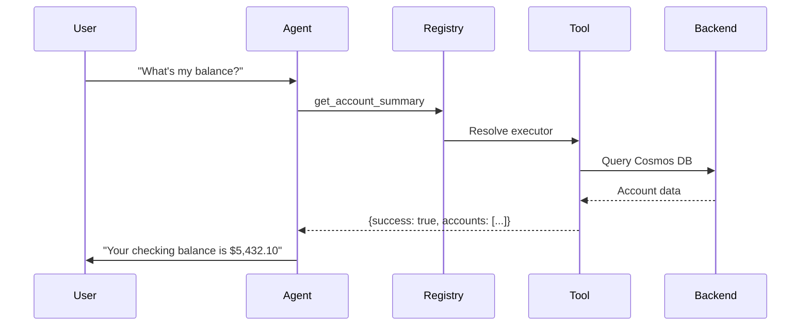

# Tool Catalog

A comprehensive reference of all tools available in the toolstore. Tools provide agents with capabilities to perform actions, retrieve data, and interact with external systems.

---

## Quick Navigation

<div class="grid cards" markdown>

-   :material-shield-account:{ .lg .middle } **Authentication**

    ---

    Identity verification, MFA, and B2B authentication

    [:octicons-arrow-right-24: Jump to Authentication](#authentication)

-   :material-bank:{ .lg .middle } **Banking**

    ---

    Account info, transactions, cards, and profiles

    [:octicons-arrow-right-24: Jump to Banking](#banking)

-   :material-alert-octagon:{ .lg .middle } **Fraud Detection**

    ---

    Transaction analysis, disputes, and card blocking

    [:octicons-arrow-right-24: Jump to Fraud](#fraud-detection)

-   :material-car-emergency:{ .lg .middle } **Insurance**

    ---

    FNOL claims, policy queries, and subrogation

    [:octicons-arrow-right-24: Jump to Insurance](#insurance)

-   :material-phone-forward:{ .lg .middle } **Escalation**

    ---

    Human transfer, callbacks, and complaints

    [:octicons-arrow-right-24: Jump to Escalation](#escalation)

-   :material-swap-horizontal:{ .lg .middle } **Handoffs**

    ---

    Agent-to-agent transfers with context

    [:octicons-arrow-right-24: Jump to Handoffs](#handoffs)

</div>

---

## How Tools Work



!!! tip "Key Concepts"
    - **Tools are shared** — Any agent can use any tool by adding it to their `tools:` list
    - **Declarative binding** — Reference by name in YAML, no code changes needed
    - **Tag-based discovery** — Tools are tagged for filtering (e.g., `fraud`, `banking`, `handoff`)
    - **Async executors** — All tools use async functions for non-blocking I/O

---

## Authentication

Tools for verifying caller identity and multi-factor authentication.

**Location:** `registries/toolstore/auth.py`
**Tags:** `auth`, `mfa`, `insurance`, `b2b`

### verify_client_identity

Verify caller's identity using name and last 4 digits of SSN.

=== "Parameters"

    | Parameter | Type | Required | Description |
    |-----------|------|----------|-------------|
    | `full_name` | string | Yes | Caller's full legal name |
    | `ssn_last_4` | string | Yes | Last 4 digits of SSN |

=== "Response"

    ```python
    {
        "success": True,
        "authenticated": True,
        "client_id": "alice_brown_ab",
        "caller_name": "Alice Brown",
        "message": "Identity verified for Alice Brown",
        "data_source": "cosmos"  # or "mock"
    }
    ```

=== "Example Usage"

    ```yaml
    # In agent YAML
    tools:
      - verify_client_identity
    ```

!!! info "Data Sources"
    This tool queries Cosmos DB first, then falls back to mock data for testing. The `data_source` field indicates which was used.

---

### send_mfa_code

Send a 6-digit verification code to the customer's registered contact method.

=== "Parameters"

    | Parameter | Type | Required | Description |
    |-----------|------|----------|-------------|
    | `client_id` | string | Yes | Customer identifier |
    | `method` | string | No | Delivery method: `sms`, `voice`, or `email` (default: `sms`) |

=== "Response"

    ```python
    {
        "success": True,
        "code_sent": True,
        "method": "sms",
        "message": "Verification code sent via sms.",
        "_demo_code": "123456"  # Only in demo mode
    }
    ```

---

### verify_mfa_code

Verify the MFA code provided by the customer.

=== "Parameters"

    | Parameter | Type | Required | Description |
    |-----------|------|----------|-------------|
    | `client_id` | string | Yes | Customer identifier |
    | `code` | string | Yes | 6-digit verification code |

=== "Response"

    ```python
    {
        "success": True,
        "verified": True,
        "message": "Verification successful. You're now authenticated."
    }
    ```

---

### resend_mfa_code

Resend MFA code if the customer didn't receive it. Wrapper around `send_mfa_code`.

---

### verify_cc_caller

Verify a Claimant Carrier (CC) representative's access to claim information for B2B subrogation calls.

=== "Parameters"

    | Parameter | Type | Required | Description |
    |-----------|------|----------|-------------|
    | `claim_number` | string | Yes | Claim number (e.g., `CLM-2024-001234`) |
    | `company_name` | string | Yes | Insurance company the caller represents |
    | `caller_name` | string | Yes | Name of the CC representative |

=== "Response"

    ```python
    {
        "success": True,
        "claim_exists": True,
        "cc_verified": True,
        "claim_number": "CLM-2024-001234",
        "cc_company": "Contoso Insurance",
        "caller_name": "Jane Smith",
        "claimant_name": "John Doe",
        "loss_date": "2024-01-15",
        "message": "Verified. Jane Smith from Contoso Insurance accessing claim CLM-2024-001234."
    }
    ```

!!! warning "Retry Logic"
    Returns `retry_allowed: true` on failure. Retry up to 3 times before escalating to human.

---

## Banking

Tools for account information, transactions, cards, and customer profiles.

### Core Account Tools

**Location:** `registries/toolstore/banking/banking.py`
**Tags:** `banking`, `profile`, `account`, `transactions`

#### get_user_profile

Retrieve customer profile including account info, preferences, and relationship tier.

=== "Parameters"

    | Parameter | Type | Required | Description |
    |-----------|------|----------|-------------|
    | `client_id` | string | Yes | Customer identifier |

=== "Response"

    ```python
    {
        "success": True,
        "profile": {
            "client_id": "alice_brown_ab",
            "full_name": "Alice Brown",
            "institution_name": "Contoso Bank",
            "customer_intelligence": {
                "relationship_context": {
                    "relationship_tier": "Silver",
                    "client_since": "2022-06-01"
                },
                # ... additional profile data
            }
        },
        "data_source": "cosmos"
    }
    ```

!!! tip "Best Practice"
    Call this immediately after identity verification to personalize the conversation.

---

#### get_account_summary

Get summary of customer's accounts including balances, account numbers, and routing info.

=== "Parameters"

    | Parameter | Type | Required | Description |
    |-----------|------|----------|-------------|
    | `client_id` | string | Yes | Customer identifier |

=== "Response"

    ```python
    {
        "success": True,
        "accounts": [
            {
                "type": "checking",
                "balance": 5432.10,
                "available": 5432.10,
                "account_number_last4": "4567",
                "routing_number": "021000021"
            },
            {
                "type": "savings",
                "balance": 12500.00,
                "available": 12500.00,
                "account_number_last4": "8901",
                "routing_number": "021000021"
            }
        ]
    }
    ```

---

#### get_recent_transactions

Get recent transactions for customer's primary account.

=== "Parameters"

    | Parameter | Type | Required | Description |
    |-----------|------|----------|-------------|
    | `client_id` | string | Yes | Customer identifier |
    | `limit` | integer | No | Max transactions to return (default: 10) |

=== "Response"

    ```python
    {
        "success": True,
        "transactions": [
            {
                "date": "2026-01-20",
                "merchant": "Starbucks",
                "amount": 18.50,
                "is_foreign_transaction": False,
                "fee_breakdown": {}
            },
            {
                "date": "2026-01-15",
                "merchant": "Hotel Paris",
                "amount": 245.00,
                "is_foreign_transaction": True,
                "location": "Paris, France",
                "fee_breakdown": {"foreign_fee": 7.35}
            }
        ],
        "data_source": "cosmos"
    }
    ```

---

### Card Products & Applications

**Tags:** `banking`, `cards`, `esign`, `eligibility`

#### search_card_products

Search available credit card products based on preferences.

=== "Parameters"

    | Parameter | Type | Required | Description |
    |-----------|------|----------|-------------|
    | `preferences` | string | Yes | What they want (e.g., "travel", "cash back") |
    | `customer_profile` | string | No | Customer tier and spending info |
    | `spending_categories` | array | No | Categories like `travel`, `dining`, `groceries` |

=== "Response"

    ```python
    {
        "success": True,
        "cards": [
            {
                "product_id": "travel-rewards-001",
                "name": "Travel Rewards Card",
                "annual_fee": 95,
                "foreign_transaction_fee": 0,
                "rewards_rate": "3x on travel, 2x on dining",
                "_score": 8,
                "_foreign_fee_free": True
            }
            # ... more cards
        ],
        "best_match": "travel-rewards-001",
        "no_foreign_fee_cards": ["travel-rewards-001", "premium-rewards-001"]
    }
    ```

---

#### get_card_details

Get detailed information about a specific card product.

=== "Parameters"

    | Parameter | Type | Required | Description |
    |-----------|------|----------|-------------|
    | `product_id` | string | Yes | Card product ID (e.g., `travel-rewards-001`) |
    | `query` | string | No | Specific question about the card |

---

#### evaluate_card_eligibility

Evaluate if a customer is pre-approved or eligible for a specific credit card.

=== "Parameters"

    | Parameter | Type | Required | Description |
    |-----------|------|----------|-------------|
    | `client_id` | string | Yes | Customer identifier |
    | `card_product_id` | string | Yes | Card product to evaluate |

=== "Response"

    ```python
    {
        "success": True,
        "eligibility_status": "PRE_APPROVED",  # or APPROVED_WITH_REVIEW, PENDING_VERIFICATION
        "eligibility_score": 85,
        "credit_limit": 15000,
        "card_name": "Travel Rewards Card",
        "can_proceed_to_agreement": True,
        "next_step": "send_card_agreement",
        "customer_tier": "Gold",
        "card_last4": "4521"
    }
    ```

!!! info "Session Storage"
    Eligibility results are stored in session-scoped Redis to ensure consistent values across the application flow.

---

#### send_card_agreement

Send cardholder agreement email with verification code for e-signature.

=== "Parameters"

    | Parameter | Type | Required | Description |
    |-----------|------|----------|-------------|
    | `client_id` | string | Yes | Customer identifier |
    | `card_product_id` | string | Yes | Card product ID |

=== "Response"

    ```python
    {
        "success": True,
        "email_sent": True,
        "verification_code": "847291",
        "email": "alice@example.com",
        "card_name": "Travel Rewards Card",
        "expires_in_hours": 24
    }
    ```

---

#### verify_esignature

Verify the e-signature code provided by customer.

=== "Parameters"

    | Parameter | Type | Required | Description |
    |-----------|------|----------|-------------|
    | `client_id` | string | Yes | Customer identifier |
    | `verification_code` | string | Yes | 6-digit code from email |

---

#### finalize_card_application

Complete card application after e-signature verification.

=== "Parameters"

    | Parameter | Type | Required | Description |
    |-----------|------|----------|-------------|
    | `client_id` | string | Yes | Customer identifier |
    | `card_product_id` | string | Yes | Card product ID |

=== "Response"

    ```python
    {
        "success": True,
        "approved": True,
        "card_number_last4": "4521",
        "card_name": "Travel Rewards Card",
        "credit_limit": 15000,
        "physical_delivery": "3-5 business days",
        "digital_wallet_ready": True,
        "confirmation_email_sent": True
    }
    ```

---

#### search_credit_card_faqs

Search credit card FAQ knowledge base for information about APR, fees, benefits, eligibility, and rewards.

=== "Parameters"

    | Parameter | Type | Required | Description |
    |-----------|------|----------|-------------|
    | `query` | string | Yes | Search query (e.g., "APR", "foreign fees") |
    | `card_name` | string | No | Filter by card name |
    | `top_k` | integer | No | Max results (default: 3) |

---

#### refund_fee

Process a fee refund for the customer as a courtesy.

=== "Parameters"

    | Parameter | Type | Required | Description |
    |-----------|------|----------|-------------|
    | `client_id` | string | Yes | Customer identifier |
    | `amount` | number | Yes | Amount to refund |
    | `transaction_id` | string | No | ID of the fee transaction |
    | `reason` | string | No | Reason for refund |

!!! warning "Confirmation Required"
    Only call after customer explicitly approves the refund.

---

### Investment Tools

**Location:** `registries/toolstore/banking/investments.py`
**Tags:** `banking`, `investments`, `retirement`, `rollover`

#### get_account_routing_info

Get routing numbers for direct deposit setup.

#### get_401k_details

Get 401(k) balance, contributions, and vesting information.

#### get_retirement_accounts

Get summary of all retirement accounts.

#### get_rollover_options

Get 401(k) rollover options with pros/cons.

#### calculate_tax_impact

Calculate tax implications of rollover scenarios.

---

## Fraud Detection

Tools for fraud analysis, suspicious activity, and emergency card actions.

**Location:** `registries/toolstore/fraud.py`
**Tags:** `fraud`, `analysis`, `alerts`, `dispute`, `emergency`, `cards`

### analyze_recent_transactions

Analyze customer's recent transactions for fraud patterns, unusual activity, or anomalies.

=== "Parameters"

    | Parameter | Type | Required | Description |
    |-----------|------|----------|-------------|
    | `client_id` | string | Yes | Customer identifier |
    | `days_back` | integer | No | Days to analyze (default: 30) |

=== "Response"

    ```python
    {
        "success": True,
        "analysis": {
            "period_days": 30,
            "total_transactions": 87,
            "flagged_count": 2,
            "overall_risk_score": 0.85,
            "risk_level": "high",
            "flagged_transactions": [
                {
                    "id": "TXN-SUSP-001",
                    "merchant": "CRYPTO EXCHANGE XYZ",
                    "amount": 2500.00,
                    "risk_score": 0.92,
                    "flags": ["unusual_amount", "high_risk_merchant", "foreign_ip"]
                }
            ]
        }
    }
    ```

---

### check_suspicious_activity

Check if there's been any suspicious activity or fraud alerts on the account.

=== "Parameters"

    | Parameter | Type | Required | Description |
    |-----------|------|----------|-------------|
    | `client_id` | string | Yes | Customer identifier |

---

### create_fraud_case

Create a new fraud investigation case for disputed transactions.

=== "Parameters"

    | Parameter | Type | Required | Description |
    |-----------|------|----------|-------------|
    | `client_id` | string | Yes | Customer identifier |
    | `dispute_reason` | string | Yes | Why customer is disputing |
    | `transaction_ids` | array | No | List of disputed transaction IDs |
    | `customer_statement` | string | No | Customer's statement about the fraud |

=== "Response"

    ```python
    {
        "success": True,
        "case_id": "FRD-20260124-4521",
        "status": "open",
        "next_steps": [
            "Investigation will complete within 10 business days",
            "Provisional credit may be issued within 5 business days",
            "You'll receive email updates on case progress"
        ]
    }
    ```

---

### block_card_emergency

:material-alert:{ .lg .middle } **Emergency Action**

Immediately block customer's card. Use when fraud is confirmed or strongly suspected.

=== "Parameters"

    | Parameter | Type | Required | Description |
    |-----------|------|----------|-------------|
    | `client_id` | string | Yes | Customer identifier |
    | `reason` | string | Yes | Reason for blocking |
    | `card_last4` | string | No | Last 4 digits of card |

!!! danger "Irreversible"
    Card blocking is immediate and cannot be undone. A new card must be issued.

---

### ship_replacement_card

Order a replacement card after blocking.

=== "Parameters"

    | Parameter | Type | Required | Description |
    |-----------|------|----------|-------------|
    | `client_id` | string | Yes | Customer identifier |
    | `expedited` | boolean | No | Rush delivery (1-2 days vs 5-7) |
    | `ship_to_address` | string | No | Alternate shipping address |

---

### report_lost_stolen_card

Report a card as lost or stolen. Immediately blocks the card and initiates replacement.

=== "Parameters"

    | Parameter | Type | Required | Description |
    |-----------|------|----------|-------------|
    | `client_id` | string | Yes | Customer identifier |
    | `lost_or_stolen` | string | Yes | `lost` or `stolen` |
    | `card_last4` | string | No | Last 4 digits of card |
    | `last_legitimate_use` | string | No | When/where card was last used |

---

### create_transaction_dispute

Create a formal dispute for unauthorized or incorrect transactions.

=== "Parameters"

    | Parameter | Type | Required | Description |
    |-----------|------|----------|-------------|
    | `client_id` | string | Yes | Customer identifier |
    | `dispute_type` | string | Yes | Type: `unauthorized`, `duplicate`, `incorrect_amount`, `merchandise_not_received`, `other` |
    | `description` | string | Yes | Description of the issue |
    | `transaction_ids` | array | No | Transaction IDs to dispute |

---

### send_fraud_case_email

Send confirmation email with fraud case details to customer.

=== "Parameters"

    | Parameter | Type | Required | Description |
    |-----------|------|----------|-------------|
    | `client_id` | string | Yes | Customer identifier |
    | `case_id` | string | Yes | Fraud case ID |
    | `include_steps` | boolean | No | Include next steps (default: true) |

---

### provide_fraud_education

Provide customer with fraud prevention education and tips.

=== "Parameters"

    | Parameter | Type | Required | Description |
    |-----------|------|----------|-------------|
    | `fraud_type` | string | Yes | Type: `card_fraud`, `phishing`, `account_takeover`, `identity_theft`, `general` |

=== "Response"

    ```python
    {
        "success": True,
        "fraud_type": "card_fraud",
        "prevention_tips": [
            "Never share your card details over phone or email unless you initiated contact",
            "Review statements regularly for unfamiliar transactions",
            "Enable transaction alerts on your mobile app",
            "Use virtual card numbers for online shopping"
        ],
        "additional_resources": {
            "security_center": "https://bank.com/security",
            "fraud_reporting": "1-800-FRAUD"
        }
    }
    ```

---

## Insurance

Tools for insurance claims, policy management, and subrogation.

### FNOL (First Notice of Loss)

**Location:** `registries/toolstore/insurance/fnol.py`
**Tags:** `insurance`, `fnol`, `claims`

#### record_fnol

Record a First Notice of Loss claim with full incident details.

=== "Parameters"

    | Parameter | Type | Required | Description |
    |-----------|------|----------|-------------|
    | `policy_id` | string | Yes | Policy identifier |
    | `incident_description` | string | Yes | Description of what happened |
    | `loss_date` | string | Yes | Date of incident |
    | `loss_location` | string | Yes | Location of incident |
    | `driver_info` | object | No | Driver information |
    | `vehicle_info` | object | No | Vehicle details |

=== "Response"

    ```python
    {
        "success": True,
        "claim_id": "CLM-2026-001234",
        "status": "filed",
        "next_steps": [
            "Adjuster will contact you within 24 hours",
            "Gather photos of damage if available",
            "Save any repair estimates"
        ]
    }
    ```

#### handoff_to_general_info_agent

Route non-claim inquiries to the general information agent.

---

### Policy Management

**Location:** `registries/toolstore/insurance/policy.py`
**Tags:** `insurance`, `policy`

#### get_policy_details

Retrieve detailed policy information.

=== "Parameters"

    | Parameter | Type | Required | Description |
    |-----------|------|----------|-------------|
    | `policy_id` | string | Yes | Policy identifier |

#### get_coverage_summary

Get coverage breakdown for a policy.

#### update_policy_contact

Update contact information on a policy.

---

### Subrogation

**Location:** `registries/toolstore/insurance/subro.py`
**Tags:** `insurance`, `subrogation`

#### check_subro_status

Check status of a subrogation case.

=== "Parameters"

    | Parameter | Type | Required | Description |
    |-----------|------|----------|-------------|
    | `claim_id` | string | Yes | Claim identifier |

#### update_subro_info

Add information to an existing subrogation case.

---

## Escalation

Tools for escalating calls to humans, emergencies, or call centers.

**Location:** `registries/toolstore/escalation.py`
**Tags:** `escalation`, `transfer`, `emergency`, `callback`, `complaint`

### escalate_human

Transfer call to a human agent with context.

=== "Parameters"

    | Parameter | Type | Required | Description |
    |-----------|------|----------|-------------|
    | `reason` | string | Yes | Why escalation is needed |
    | `department` | string | No | Target: `general`, `fraud`, `loans`, `investments`, `complaints`, `retention` |
    | `context_summary` | string | No | Summary for the human agent |
    | `priority` | string | No | `normal`, `high`, or `urgent` |

=== "Response"

    ```python
    {
        "success": True,
        "escalation_initiated": True,
        "department": "fraud",
        "priority": "high",
        "estimated_wait": "2-4 minutes",
        "reference_id": "ESC-20260124153045"
    }
    ```

---

### escalate_emergency

:material-alert:{ .lg .middle } **Emergency Escalation**

Critical situation escalation for fraud in progress, security threats, or safety concerns.

=== "Parameters"

    | Parameter | Type | Required | Description |
    |-----------|------|----------|-------------|
    | `emergency_type` | string | Yes | Type: `fraud_in_progress`, `security_threat`, `safety_concern`, `elder_abuse`, `other` |
    | `description` | string | Yes | Description of the emergency |
    | `client_id` | string | No | Customer identifier if known |

=== "Response"

    ```python
    {
        "success": True,
        "emergency_escalation": True,
        "priority": "critical",
        "immediate_response": True,
        "actions_taken": [
            "Priority alert sent to emergency response team",
            "Account flagged for immediate review",
            "Supervisor notified"
        ]
    }
    ```

---

### transfer_call_to_call_center

Cold transfer to call center queue.

=== "Parameters"

    | Parameter | Type | Required | Description |
    |-----------|------|----------|-------------|
    | `reason` | string | Yes | Reason for transfer |
    | `queue_id` | string | No | Target queue identifier |

---

### schedule_callback

Schedule a callback from a human agent at a specific time.

=== "Parameters"

    | Parameter | Type | Required | Description |
    |-----------|------|----------|-------------|
    | `client_id` | string | Yes | Customer identifier |
    | `reason` | string | Yes | Reason for callback |
    | `phone_number` | string | No | Phone number to call back |
    | `preferred_time` | string | No | Preferred callback time |
    | `department` | string | No | Department to schedule with |

---

### submit_complaint

Submit a formal complaint on behalf of the customer.

=== "Parameters"

    | Parameter | Type | Required | Description |
    |-----------|------|----------|-------------|
    | `client_id` | string | Yes | Customer identifier |
    | `complaint_type` | string | Yes | Type: `service`, `fees`, `product`, `employee`, `policy`, `other` |
    | `description` | string | Yes | Detailed description |
    | `desired_resolution` | string | No | What customer wants |

=== "Response"

    ```python
    {
        "success": True,
        "complaint_submitted": True,
        "case_id": "CMP-20260124-0001",
        "response_timeframe": "3-5 business days",
        "escalation_path": "If not resolved, can escalate to executive relations"
    }
    ```

---

## Compliance & Regulatory

Tools for compliance checks, KYC, AML, and regulatory requirements.

**Location:** `registries/toolstore/compliance.py`
**Tags:** `compliance`, `kyc`, `aml`, `audit`, `documents`, `restrictions`

### get_client_data

Retrieve compliance data including KYC status, AML, sanctions, and PEP status.

### check_compliance_status

Check specific compliance status: KYC, AML, sanctions, PEP, or general.

### search_knowledge_base

Search regulations, policies, procedures, and guidance.

### log_compliance_event

Log audit trail events for KYC updates, document receipts, exceptions, or escalations.

### request_document

Request compliance documents with secure upload link.

### apply_account_restriction

Apply account restrictions like trading suspension, withdrawal limits, or account freeze.

---

## Call Control

Tools for telephony operations and call handling.

### Call Transfer

**Location:** `registries/toolstore/call_transfer.py`
**Tags:** `call_transfer`, `telephony`

#### transfer_call_to_destination

Transfer call to external phone number or SIP endpoint.

=== "Parameters"

    | Parameter | Type | Required | Description |
    |-----------|------|----------|-------------|
    | `destination` | string | Yes | Phone number or SIP URI |
    | `transfer_type` | string | No | `cold`, `warm`, or `blind` |
    | `context_summary` | string | No | Summary for warm transfers |

---

### Voicemail

**Location:** `registries/toolstore/voicemail.py`
**Tags:** `voicemail`, `call_control`

#### detect_voicemail_and_end_call

Detect voicemail greeting/beep and handle appropriately.

#### confirm_voicemail_and_end_call

Confirm voicemail message was left and end the call.

---

## Customer Intelligence

Tools for customer 360 data and personalization.

### get_customer_intelligence

**Location:** `registries/toolstore/customer_intelligence.py`
**Tags:** `banking`, `customer_data`, `personalization`

Retrieve comprehensive customer 360 data including relationship context, account status, communication preferences, active alerts, and segment classification.

---

### generate_personalized_greeting

**Location:** `registries/toolstore/personalized_greeting.py`
**Tags:** `banking`, `greeting`, `personalization`

Generate contextual greeting considering relationship tier, communication style, account health, and alerts.

---

## Knowledge & RAG

Tools for knowledge retrieval and semantic search.

### search_knowledge_base

**Location:** `registries/toolstore/knowledge_base.py`
**Tags:** `knowledge_base`, `search`, `rag`

Semantic search across knowledge collections with fallback to keyword matching.

=== "Parameters"

    | Parameter | Type | Required | Description |
    |-----------|------|----------|-------------|
    | `query` | string | Yes | Search query |
    | `collection` | string | No | `general`, `products`, `policies`, `faq` |

---

## Handoffs

Special tools that transfer conversations between agents. All handoff tools are registered with `is_handoff=True`.

**Location:** `registries/toolstore/handoffs.py`
**Tags:** `handoff`

!!! note "Silent Handoffs"
    Handoffs should be **silent** — the agent calls the tool immediately without announcing "Let me transfer you". The target agent greets the customer naturally.

### How Handoffs Work

```python
# Handoff tools return a specific payload
{
    "handoff": True,                      # Signals handoff to orchestrator
    "target_agent": "FraudAgent",         # Agent to transfer to
    "message": "",                        # Empty = silent handoff
    "handoff_summary": "Fraud investigation requested",
    "handoff_context": {
        "client_id": "alice_brown_ab",
        "reason": "Suspicious transaction reported"
    }
}
```

### Available Handoff Tools

| Tool | Target Agent | Use Case |
|------|--------------|----------|
| `handoff_concierge` | Concierge | Return to main concierge |
| `handoff_fraud_agent` | FraudAgent | Fraud investigation |
| `handoff_investment_advisor` | InvestmentAdvisor | Investment advice |
| `handoff_compliance_desk` | ComplianceDesk | Compliance review |
| `handoff_auth_agent` | AuthAgent | Identity verification |
| `handoff_claims_specialist` | ClaimsSpecialist | Insurance claims |
| `handoff_fnol_agent` | FNOLAgent | First Notice of Loss |
| `handoff_policy_advisor` | PolicyAdvisor | Policy questions |
| `handoff_subro_agent` | SubroAgent | Subrogation handling |
| `handoff_card_recommendation` | CardRecommendation | Credit card suggestions |

---

## Transfer Agency

Tools for institutional DRIP (Dividend Reinvestment Plan) clients.

**Location:** `registries/toolstore/transfer_agency.py`
**Tags:** `transfer_agency`, `drip`, `liquidation`, `auth`

### get_drip_positions

Get institutional client holdings including symbols, shares, prices, and cost basis.

### calculate_liquidation_proceeds

Calculate proceeds from liquidation including estimated taxes and net proceeds.

### verify_institutional_identity

Verify institutional client using client code, authorization code, and caller name.

---

## Adding Tools to an Agent

Reference tools by name in your agent's YAML configuration:

```yaml
# registries/agentstore/agents/my-agent.yaml
name: MyAgent
tools:
  - verify_client_identity    # Authentication
  - get_account_summary       # Banking
  - get_recent_transactions   # Banking
  - escalate_human            # Escalation fallback
  - handoff_fraud_agent       # Fraud handoff
```

The agent will have access to these tools during conversation. The LLM decides when to call each tool based on user intent.

---

## Tool Response Format

All tools return a consistent structure:

```python
{
    "success": True,           # Was the operation successful?
    "message": "...",          # Human-readable summary
    # ... additional data specific to the tool
}
```

For errors:

```python
{
    "success": False,
    "message": "client_id is required."
}
```

---

## See Also

- [Tools Guide](tools.md) — How to create and register new tools
- [Agents Guide](agents.md) — How agents use tools
- [Handoff Strategies](../agents/handoffs.md) — Agent-to-agent transfer patterns
- [Scenarios Guide](scenarios.md) — Configure tool availability per scenario
