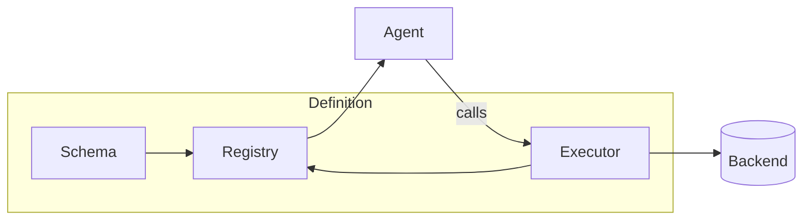

# Tools Guide

Tools are the functions that agents can call to perform actions or retrieve information. This guide explains how to define, register, and use tools in the voice agent framework.

---

## Overview

Tools connect agents to business logic, external APIs, and data sources. When an agent needs to perform an action—like checking a balance, blocking a card, or filing a claim—it calls a tool.



Every tool has three components:

| Component | Purpose | Format |
|-----------|---------|--------|
| **Schema** | Describes what the tool does and its parameters | OpenAI function calling JSON |
| **Executor** | Implements the tool's business logic | Async Python function |
| **Registration** | Connects schema + executor to the registry | `register_tool()` call |

---

## Quick Start: Creating a Tool

Here's a minimal tool in 3 steps:

### Step 1: Define the Schema

The schema tells the LLM what the tool does and what parameters it accepts:

```python
get_weather_schema: dict[str, Any] = {
    "name": "get_weather",
    "description": "Get current weather for a city. Use when customer asks about weather.",
    "parameters": {
        "type": "object",
        "properties": {
            "city": {
                "type": "string",
                "description": "City name (e.g., 'Seattle', 'New York')"
            },
        },
        "required": ["city"],
    },
}
```

### Step 2: Implement the Executor

The executor is an async function that does the actual work:

```python
async def get_weather(args: dict[str, Any]) -> dict[str, Any]:
    """Get weather for a city."""
    city = (args.get("city") or "").strip()

    if not city:
        return {"success": False, "message": "City is required."}

    # Your implementation here
    temperature = 72  # Example: call weather API

    return {
        "success": True,
        "city": city,
        "temperature": temperature,
        "message": f"The current temperature in {city} is {temperature}°F"
    }
```

### Step 3: Register the Tool

Connect everything with `register_tool()`:

```python
from apps.artagent.backend.registries.toolstore.registry import register_tool

register_tool(
    name="get_weather",
    schema=get_weather_schema,
    executor=get_weather,
    tags={"utilities", "weather"},
)
```

That's it! The tool is now available to any agent that includes it in their `tools:` list.

---

## Schema Best Practices

The schema is critical because it's what the LLM uses to decide when and how to call your tool.

### Write Descriptive Descriptions

=== "Good"

    ```python
    "description": (
        "Get the current balance for a customer's account. "
        "Use this when the customer asks about their balance, "
        "available funds, or how much money they have."
    )
    ```

=== "Bad"

    ```python
    "description": "Get balance"
    ```

!!! tip "Include Usage Hints"
    Tell the LLM **when** to use the tool, not just what it does. Phrases like "Use when..." help the model make better decisions.

### Use Enums for Constrained Values

```python
"account_type": {
    "type": "string",
    "enum": ["checking", "savings", "credit"],  # Constrain the options
    "description": "Type of account to check"
}
```

### Mark Required vs Optional Parameters

```python
"parameters": {
    "type": "object",
    "properties": {
        "client_id": {"type": "string", "description": "Required identifier"},
        "include_pending": {"type": "boolean", "description": "Include pending transactions"}
    },
    "required": ["client_id"],  # Only truly required params
}
```

### Parameter Types Reference

| JSON Type | Python Type | Use For |
|-----------|-------------|---------|
| `string` | `str` | Text, IDs, names |
| `integer` | `int` | Counts, limits |
| `number` | `float` | Amounts, scores |
| `boolean` | `bool` | Flags, toggles |
| `array` | `list` | Lists of items |
| `object` | `dict` | Nested structures |

---

## Executor Best Practices

### Always Use Async

```python
async def my_tool(args: dict[str, Any]) -> dict[str, Any]:
    # Even if you don't await anything, use async for consistency
    return {"success": True}
```

### Validate Input Early

```python
async def transfer_funds(args: dict[str, Any]) -> dict[str, Any]:
    # Validate and sanitize inputs first
    client_id = (args.get("client_id") or "").strip()
    amount = args.get("amount", 0)

    if not client_id:
        return {"success": False, "message": "client_id is required."}

    if amount <= 0:
        return {"success": False, "message": "Amount must be positive."}

    # Now proceed with business logic...
```

### Return Consistent Structures

All tools should return a dict with at least:

```python
{
    "success": True,    # or False
    "message": "...",   # Human-readable summary
    # ... additional fields
}
```

### Handle Errors Gracefully

```python
async def query_database(args: dict[str, Any]) -> dict[str, Any]:
    try:
        result = await db.query(args["query"])
        return {"success": True, "data": result}
    except DatabaseError as e:
        logger.error("Database query failed: %s", e)
        return {
            "success": False,
            "message": "Unable to retrieve data. Please try again."
        }
```

!!! warning "Don't Expose Internal Errors"
    Return user-friendly messages, not stack traces or internal error details.

### Use Logging

```python
from utils.ml_logging import get_logger

logger = get_logger("agents.tools.my_domain")

async def my_tool(args: dict[str, Any]) -> dict[str, Any]:
    logger.info("Processing request for client: %s", args.get("client_id"))
    # ...
    logger.info("✓ Request completed successfully")
```

---

## Handoff Tools

Handoff tools are special—they transfer the conversation to another agent instead of returning data.

### Handoff Response Format

```python
async def handoff_fraud_agent(args: dict[str, Any]) -> dict[str, Any]:
    """Transfer to fraud specialist."""
    return {
        "handoff": True,                      # Required: signals handoff
        "target_agent": "FraudAgent",         # Required: agent to transfer to
        "message": "",                        # Empty = silent handoff
        "handoff_summary": "Fraud investigation requested",
        "handoff_context": {                  # Context for target agent
            "client_id": args.get("client_id"),
            "reason": args.get("reason"),
        },
    }
```

### Register with is_handoff=True

```python
register_tool(
    "handoff_fraud_agent",
    handoff_fraud_agent_schema,
    handoff_fraud_agent,
    is_handoff=True,  # Important!
    tags={"handoff"},
)
```

!!! note "Silent Handoffs"
    The `message` field should be empty for silent handoffs. The target agent will greet the customer naturally, rather than the source agent saying "Let me transfer you."

---

## Complete Example

Here's a production-ready tool file:

```python
"""
Account Tools
=============

Tools for account balance and transaction inquiries.
"""

from __future__ import annotations

from typing import Any

from apps.artagent.backend.registries.toolstore.registry import register_tool
from utils.ml_logging import get_logger

logger = get_logger("agents.tools.accounts")


# ═══════════════════════════════════════════════════════════════════════════════
# SCHEMAS
# ═══════════════════════════════════════════════════════════════════════════════

get_account_balance_schema: dict[str, Any] = {
    "name": "get_account_balance",
    "description": (
        "Get the current balance for a customer's account. "
        "Use when the customer asks about their balance, available funds, "
        "or how much money they have."
    ),
    "parameters": {
        "type": "object",
        "properties": {
            "client_id": {
                "type": "string",
                "description": "Customer identifier from verification"
            },
            "account_type": {
                "type": "string",
                "enum": ["checking", "savings", "credit"],
                "description": "Type of account (default: checking)"
            },
        },
        "required": ["client_id"],
    },
}


# ═══════════════════════════════════════════════════════════════════════════════
# EXECUTORS
# ═══════════════════════════════════════════════════════════════════════════════

async def get_account_balance(args: dict[str, Any]) -> dict[str, Any]:
    """Get account balance for a customer."""
    client_id = (args.get("client_id") or "").strip()
    account_type = args.get("account_type", "checking")

    if not client_id:
        return {"success": False, "message": "client_id is required."}

    logger.info("Fetching %s balance for client: %s", account_type, client_id)

    # TODO: Replace with real database call
    balance = 5432.10

    logger.info("✓ Balance retrieved: $%.2f", balance)

    return {
        "success": True,
        "balance": balance,
        "account_type": account_type,
        "message": f"Your {account_type} balance is ${balance:,.2f}"
    }


# ═══════════════════════════════════════════════════════════════════════════════
# REGISTRATION
# ═══════════════════════════════════════════════════════════════════════════════

register_tool(
    "get_account_balance",
    get_account_balance_schema,
    get_account_balance,
    tags={"banking", "accounts"},
)
```

---

## Tool Loading

Tools are loaded automatically at application startup.

### How It Works

1. `initialize_tools()` is called during app startup
2. It imports all tool modules in `toolstore/`
3. Each module's `register_tool()` calls execute at import time
4. Tools are stored in the global registry

```python
from apps.artagent.backend.registries.toolstore import initialize_tools

# Call once at startup
count = initialize_tools()
print(f"Loaded {count} tools")
```

### Adding New Tool Modules

1. Create your tool file in the appropriate folder:
   ```
   toolstore/
   ├── my_domain/
   │   └── my_tools.py    # Your new file
   ```

2. Add the import to `registry.py`:
   ```python
   tool_modules = [
       # ... existing modules
       ("my_tools", lambda: __import__("apps.artagent.backend.registries.toolstore.my_domain.my_tools")),
   ]
   ```

---

## Using Tools in Agents

### YAML Configuration

Agents reference tools by name in their `agent.yaml`:

```yaml
# registries/agentstore/agents/concierge/agent.yaml
name: Concierge
tools:
  - verify_client_identity
  - get_account_balance
  - get_recent_transactions
  - handoff_fraud_agent
```

### Programmatic Access

```python
from apps.artagent.backend.registries.agentstore import discover_agents

agents = discover_agents()
concierge = agents["Concierge"]

# Get OpenAI-compatible tool schemas
tools = concierge.get_tools()
# Returns: [{"type": "function", "function": {...}}, ...]

# Execute a tool
result = await concierge.execute_tool("get_account_balance", {"client_id": "123"})
```

---

## Registry API Reference

| Function | Description |
|----------|-------------|
| `register_tool(name, schema, executor, *, is_handoff=False, tags=None)` | Register a new tool |
| `initialize_tools()` | Load all tool modules (call at startup) |
| `get_tools_for_agent(tool_names)` | Get OpenAI-compatible schemas for specific tools |
| `execute_tool(name, args)` | Execute a tool by name |
| `list_tools(*, tags=None, handoffs_only=False)` | List registered tool names with optional filtering |
| `is_handoff_tool(name)` | Check if a tool triggers handoff |

### Example: List Tools by Tag

```python
from apps.artagent.backend.registries.toolstore import list_tools

# All fraud-related tools
fraud_tools = list_tools(tags={"fraud"})
# ['analyze_recent_transactions', 'check_suspicious_activity', ...]

# All handoff tools
handoffs = list_tools(handoffs_only=True)
# ['handoff_fraud_agent', 'handoff_concierge', ...]
```

---

## File Organization

```
toolstore/
├── __init__.py              # Public exports
├── registry.py              # Core registration logic
├── auth.py                  # Authentication & MFA tools
├── escalation.py            # Human escalation tools
├── fraud.py                 # Fraud detection tools
├── compliance.py            # Compliance & regulatory tools
├── handoffs.py              # Agent handoff tools
├── knowledge_base.py        # RAG & search tools
├── customer_intelligence.py # Customer 360 tools
├── personalized_greeting.py # Greeting generation
├── call_transfer.py         # Telephony tools
├── voicemail.py             # Voicemail handling
├── transfer_agency.py       # DRIP/institutional tools
├── banking/                 # Banking domain
│   ├── __init__.py
│   ├── banking.py           # Account & transaction tools
│   ├── investments.py       # Investment & retirement tools
│   └── constants.py         # Card products, limits
└── insurance/               # Insurance domain
    ├── __init__.py
    ├── fnol.py              # First Notice of Loss
    ├── policy.py            # Policy management
    ├── subro.py             # Subrogation
    └── constants.py         # Insurance constants
```

---

## Testing Tools

### Unit Testing

```python
import pytest
from apps.artagent.backend.registries.toolstore.banking.banking import get_account_balance

@pytest.mark.asyncio
async def test_get_account_balance_requires_client_id():
    result = await get_account_balance({})
    assert result["success"] is False
    assert "client_id" in result["message"]

@pytest.mark.asyncio
async def test_get_account_balance_returns_balance():
    result = await get_account_balance({"client_id": "test-123"})
    assert result["success"] is True
    assert "balance" in result
```

### Integration Testing

```python
from apps.artagent.backend.registries.toolstore import execute_tool, initialize_tools

@pytest.fixture(scope="module")
def loaded_tools():
    initialize_tools()
    yield

@pytest.mark.asyncio
async def test_tool_execution_via_registry(loaded_tools):
    result = await execute_tool("get_account_balance", {"client_id": "test-123"})
    assert result["success"] is True
```

---

## Troubleshooting

??? question "My tool isn't being loaded"
    1. Check that your module is imported in `registry.py`'s `tool_modules` list
    2. Verify `register_tool()` is called at module level (not inside a function)
    3. Check logs for import errors: `logger.warning("Failed to load: ...")`

??? question "The LLM isn't calling my tool"
    1. Verify the tool is in the agent's `tools:` list in YAML
    2. Check the description—is it clear when to use the tool?
    3. Try adding "Use this when..." phrases to the description

??? question "My tool returns but the agent ignores the response"
    1. Ensure you're returning a dict with `success` and `message` fields
    2. Make sure the `message` field contains what you want the agent to say
    3. Check that you're not returning `None` or an empty dict

---

## Next Steps

- [Tool Reference](tool-catalog.md) — Complete reference of all available tools
- [Agents Guide](agents.md) — How agents use tools
- [Handoff Strategies](../agents/handoffs.md) — Agent-to-agent transfer patterns
- [Scenarios Guide](scenarios.md) — Configure tool availability per scenario
