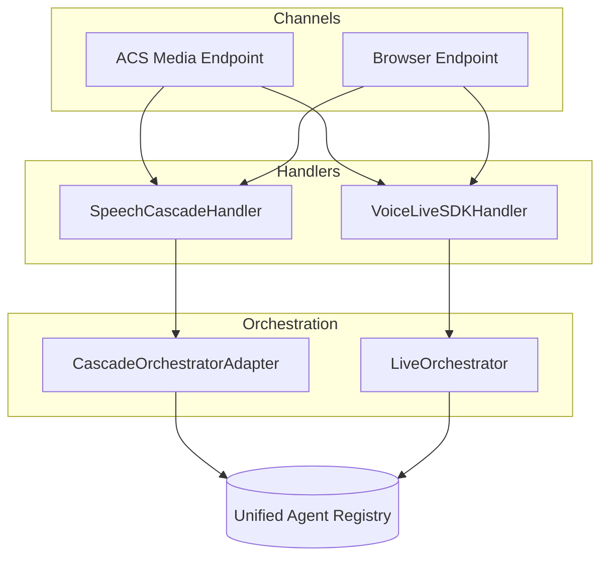

# Streaming Modes

> **Last Updated:** December 2025  
> **Related:** [Orchestration Overview](../orchestration/README.md) | [ACS Flows](../acs/README.md)

The Real-Time Voice Agent supports multiple streaming modes that determine how audio is processed. The same orchestrators power both **phone calls** (via ACS) and **browser conversations**.

---

## Quick Reference

| Mode | Handler | Orchestrator | Best For |
|------|---------|--------------|----------|
| **SpeechCascade** | `SpeechCascadeHandler` | `CascadeOrchestratorAdapter` | Full control, Azure Speech voices |
| **VoiceLive** | `VoiceLiveSDKHandler` | `LiveOrchestrator` | Ultra-low latency, barge-in |
| **Transcription** | 🚧 TBD | 🚧 TBD | Future: Azure Speech Live |

---

## Audio Channels

=== "Phone Calls (ACS)"

    Phone calls flow through Azure Communication Services to the `/api/v1/media/stream` endpoint.

    ```mermaid
    flowchart LR
        Phone([Phone]) <-->|PSTN| ACS[ACS]
        ACS <-->|WebSocket| Media[Media Endpoint]
        Media --> Handler{Mode?}
        Handler --> Cascade[SpeechCascade]
        Handler --> VL[VoiceLive]
    ```

    **Mode Selection:**
    
    - **Inbound calls:** Use `ACS_STREAMING_MODE` environment variable (set at deployment)
    - **Outbound calls:** Select mode from UI dropdown before placing call

=== "Browser (WebRTC)"

    Browser conversations use WebRTC audio via the `/api/v1/browser/conversation` endpoint.

    ```mermaid
    flowchart LR
        Browser([Browser]) <-->|WebRTC| API[Browser Endpoint]
        API --> Handler{Mode?}
        Handler --> Cascade[SpeechCascade]
        Handler --> VL[VoiceLive]
    ```

    **Mode Selection:** Choose from UI before starting conversation

---

## Shared Architecture

Both channels use the **same orchestrators** and **agent registry**:



---

## Mode Details

### SpeechCascade (Azure Speech)

Uses Azure Speech SDK for STT and TTS with a three-thread architecture.

| Feature | Value |
|---------|-------|
| STT | Azure Speech SDK |
| TTS | Azure Speech SDK (Neural Voices) |
| VAD | Client-side (SDK) |
| Latency | 100-300ms |
| Phrase Lists | ✅ Supported |

**Best for:** Full control over voice, custom phrase lists, Azure Neural voice styles.

### VoiceLive (OpenAI Realtime)

Direct streaming to OpenAI Realtime API with server-side VAD.

| Feature | Value |
|---------|-------|
| STT | OpenAI Realtime |
| TTS | OpenAI Realtime |
| VAD | Server-side (OpenAI) |
| Latency | 200-400ms |
| Phrase Lists | ❌ Not supported |

**Best for:** Ultra-low latency, natural barge-in, simpler setup.

### Transcription (Azure Speech Live) 🚧

> **Future State:** Planned integration with Azure Speech Live Transcription.

---

## Configuration

### Environment Variables

| Variable | Default | Description |
|----------|---------|-------------|
| `ACS_STREAMING_MODE` | `media` | Mode for inbound ACS calls |
| `STT_POOL_SIZE` | `10` | Speech-to-text pool (SpeechCascade only) |
| `TTS_POOL_SIZE` | `10` | Text-to-speech pool (SpeechCascade only) |
| `AZURE_VOICE_LIVE_ENDPOINT` | — | VoiceLive API endpoint |

### UI Mode Selection

The frontend provides mode selection for:

- **Outbound calls:** Dropdown before dialing
- **Browser conversations:** Dropdown before connecting

Both use the same `StreamingModeSelector` component with options for VoiceLive and SpeechCascade.

---

## Related Documentation

- [Resource Pools](resource-pools.md) - TTS/STT client pooling and session isolation
- [Orchestration Overview](../orchestration/README.md) - Dual orchestrator architecture
- [Cascade Orchestrator](../orchestration/cascade.md) - SpeechCascade deep dive
- [VoiceLive Orchestrator](../orchestration/voicelive.md) - VoiceLive deep dive
- [ACS Flows](../acs/README.md) - Phone call integration