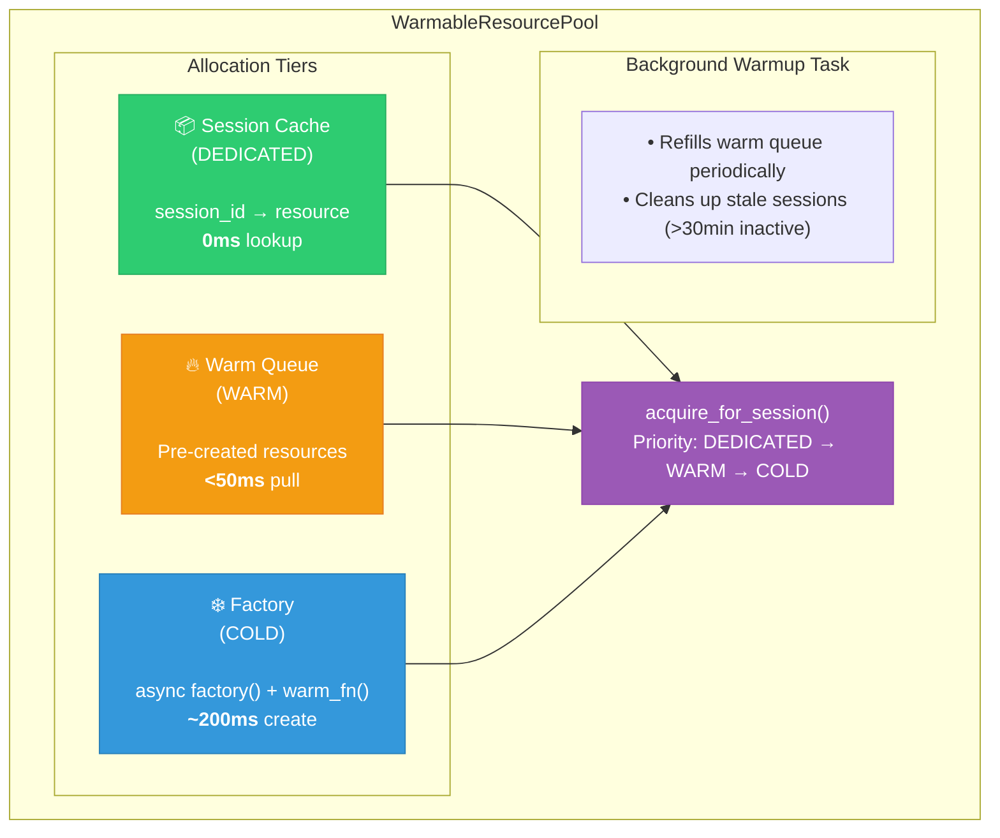

# Speech Resource Pools

This document explains how the speech resource pooling system works, how to configure it, and how to troubleshoot common issues.

## Overview

The resource pool system manages Azure Speech SDK client instances (TTS and STT) to optimize latency and resource usage. Instead of creating new clients for every request (which incurs ~200ms cold-start latency), the pool pre-warms and reuses clients.

### Key Benefits

- **Reduced latency**: Pre-warmed clients avoid cold-start delays
- **Session isolation**: Per-session caching prevents cross-call interference  
- **Resource efficiency**: Controlled pool sizes prevent resource exhaustion
- **Automatic cleanup**: Stale sessions and unused resources are cleaned up

## Architecture



## Allocation Tiers

| Tier | Source | Latency | Use Case |
|------|--------|---------|----------|
| `DEDICATED` | Session cache | 0ms | Same session requesting again |
| `WARM` | Pre-warmed queue | <50ms | First request with warmed pool |
| `COLD` | Factory creation | ~200ms | Pool empty, on-demand creation |

## Pool Types

### WarmableResourcePool

The primary pool implementation with full features:

```python
from src.pools import WarmableResourcePool, AllocationTier

pool = WarmableResourcePool(
    factory=create_tts_client,           # Async factory function
    name="tts_pool",                      # Pool name for logging
    warm_pool_size=3,                     # Pre-warm 3 clients (0 = disabled)
    enable_background_warmup=True,        # Keep pool filled
    warmup_interval_sec=30.0,             # Check every 30s
    session_awareness=True,               # Enable session caching
    session_max_age_sec=1800.0,           # Cleanup after 30min inactive
    warm_fn=warmup_voice,                 # Optional: warm voice after creation
)

await pool.prepare()  # Initialize and pre-warm
```

### OnDemandResourcePool

Lightweight alternative when pooling overhead isn't needed:

```python
from src.pools import OnDemandResourcePool

pool = OnDemandResourcePool(
    factory=create_tts_client,
    name="tts_pool",
    session_awareness=True,
)
```

## Configuration

### Environment Variables

| Variable | Default | Description |
|----------|---------|-------------|
| `SPEECH_POOL_WARM_SIZE` | `0` | Number of pre-warmed clients |
| `SPEECH_POOL_SESSION_AWARENESS` | `true` | Enable per-session caching |
| `SPEECH_POOL_WARMUP_INTERVAL` | `30` | Background refill interval (seconds) |
| `SPEECH_POOL_SESSION_MAX_AGE` | `1800` | Session timeout (seconds) |

### Initialization Example

```python
# apps/artagent/backend/main.py

from src.pools import WarmableResourcePool
from src.speech import SpeechSynthesizer, StreamingSpeechRecognizerFromBytes

async def create_tts_pool() -> WarmableResourcePool:
    """Create TTS pool with pre-warming."""
    
    async def tts_factory():
        return SpeechSynthesizer(
            speech_key=os.getenv("AZURE_SPEECH_KEY"),
            speech_region=os.getenv("AZURE_SPEECH_REGION"),
        )
    
    async def warm_voice(synth: SpeechSynthesizer) -> bool:
        """Pre-warm default voice to reduce first-synthesis latency."""
        try:
            synth.synthesize_to_pcm(
                text="warmup",
                voice="en-US-JennyNeural",
                sample_rate=24000,
            )
            return True
        except Exception:
            return False
    
    pool = WarmableResourcePool(
        factory=tts_factory,
        name="tts_pool",
        warm_pool_size=int(os.getenv("SPEECH_POOL_WARM_SIZE", "3")),
        enable_background_warmup=True,
        session_awareness=True,
        warm_fn=warm_voice,
    )
    await pool.prepare()
    return pool
```

## Usage Patterns

### Acquiring Resources

```python
# For session-aware acquisition (recommended)
synth, tier = await pool.acquire_for_session(session_id)
# tier indicates: AllocationTier.DEDICATED, WARM, or COLD

# For anonymous acquisition (no session tracking)
synth = await pool.acquire(timeout=2.0)
```

### Releasing Resources

```python
# Release session resource (clears state, removes from cache)
await pool.release_for_session(session_id, synth)

# Release anonymous resource (returns to warm pool if space)
await pool.release(synth)
```

### Temporary Resource Pattern

When you need a one-off resource that shouldn't be cached:

```python
temp_synth = None
try:
    temp_synth = await pool.acquire(timeout=2.0)
    # Use temp_synth...
finally:
    if temp_synth:
        # Pass None as session_id to clear state without cache lookup
        await pool.release_for_session(None, temp_synth)
```

## Session Isolation

### The Problem

Speech clients accumulate session-specific state:
- `call_connection_id` - Correlation ID for tracing
- `_session_span` - OpenTelemetry span for the session
- `_prepared_voices` - Cached voice warmup state (TTS)

Without cleanup, this state leaks to the next session using the same client.

### The Solution

Speech clients implement `clear_session_state()`:

```python
# src/speech/text_to_speech.py
def clear_session_state(self) -> None:
    """Clear session-specific state for safe pool recycling."""
    self.call_connection_id = None
    
    if self._session_span:
        try:
            self._session_span.end()
        except Exception:
            pass
        self._session_span = None
    
    if hasattr(self, "_prepared_voices"):
        delattr(self, "_prepared_voices")
```

The pool automatically calls this on release:

```python
# In release() and release_for_session()
if hasattr(resource, "clear_session_state"):
    resource.clear_session_state()
```

## Monitoring

### Pool Metrics

Get current pool state with `snapshot()`:

```python
status = pool.snapshot()
# Returns:
# {
#     "name": "tts_pool",
#     "ready": True,
#     "warm_pool_size": 2,
#     "warm_pool_target": 3,
#     "session_awareness": True,
#     "active_sessions": 5,
#     "background_warmup": True,
#     "metrics": {
#         "allocations_total": 150,
#         "allocations_dedicated": 120,   # Cache hits
#         "allocations_warm": 25,          # From warm pool
#         "allocations_cold": 5,           # Factory calls
#         "active_sessions": 5,
#         "warm_pool_size": 2,
#         "warmup_cycles": 42,
#         "warmup_failures": 0,
#         "timestamp": 1701705600.123
#     }
# }
```

### Key Metrics to Watch

| Metric | Healthy Range | Action if Outside |
|--------|---------------|-------------------|
| `allocations_cold` / `allocations_total` | < 10% | Increase `warm_pool_size` |
| `warmup_failures` | 0 | Check Azure Speech connectivity |
| `active_sessions` | < 100 | Check for session leaks |
| `warm_pool_size` | = `warm_pool_target` | Check background warmup task |

### Logging

Pool operations are logged at DEBUG level:

```
[tts_pool] Pre-warming 3 resources...
[tts_pool] Started background warmup (interval=30.0s)
[tts_pool] Pool ready (warm_size=3, session_awareness=True)
[tts_pool] Acquired DEDICATED resource for session abc12345...
[tts_pool] Acquired WARM resource
[tts_pool] Acquired COLD resource
[tts_pool] Released session resource for abc12345...
[tts_pool] Cleaned up 2 stale sessions
```

## Troubleshooting

### High Cold Allocation Rate

**Symptom**: Many `COLD` allocations, high first-response latency

**Causes**:
1. `warm_pool_size` too small for traffic
2. Background warmup disabled or failing
3. Pool exhausted by concurrent requests

**Solutions**:
```python
# Increase warm pool size
warm_pool_size=5  # or set SPEECH_POOL_WARM_SIZE=5

# Enable background warmup
enable_background_warmup=True

# Check warmup failures in metrics
status = pool.snapshot()
if status["metrics"]["warmup_failures"] > 0:
    # Check Azure Speech credentials/connectivity
    pass
```

### Session Leaks

**Symptom**: `active_sessions` grows continuously, memory usage increases

**Causes**:
1. Missing `release_for_session()` calls
2. Session cleanup not triggered on disconnect
3. `session_max_age_sec` too high

**Solutions**:
```python
# Ensure cleanup in WebSocket disconnect handlers
async def on_disconnect(session_id: str):
    await tts_pool.release_for_session(session_id)
    await stt_pool.release_for_session(session_id)

# Reduce session max age for faster cleanup
session_max_age_sec=600  # 10 minutes instead of 30
```

### Cross-Session State Leakage

**Symptom**: Wrong `call_connection_id` in logs, traces show wrong sessions

**Causes**:
1. `clear_session_state()` not implemented on resource
2. `release()` used instead of `release_for_session()`
3. Resource returned without state cleanup

**Solutions**:
```python
# Ensure resources implement clear_session_state()
class MySpeechClient:
    def clear_session_state(self) -> None:
        self.call_connection_id = None
        # Clear any other session state

# Use release_for_session() for temp resources
await pool.release_for_session(None, temp_synth)  # Pass None for session_id
```

### Pool Not Ready

**Symptom**: `acquire()` hangs or fails immediately

**Causes**:
1. `prepare()` not called
2. Factory function failing
3. Pool shutdown already called

**Solutions**:
```python
# Ensure prepare() is called at startup
await pool.prepare()

# Check pool readiness
if not pool.snapshot()["ready"]:
    logger.error("Pool not ready!")
    
# Verify factory works
try:
    test_client = await factory()
except Exception as e:
    logger.error(f"Factory failed: {e}")
```

## Best Practices

### 1. Always Use Session-Aware Methods

```python
# ✅ Good - tracks session, enables caching
synth, tier = await pool.acquire_for_session(session_id)
# ... use synth ...
await pool.release_for_session(session_id)

# ❌ Avoid - no session tracking
synth = await pool.acquire()
await pool.release(synth)
```

### 2. Clean Up on Disconnect

```python
@app.websocket("/ws")
async def websocket_handler(websocket: WebSocket):
    session_id = str(uuid.uuid4())
    try:
        # Handle connection...
        pass
    finally:
        # Always clean up session resources
        await app.state.tts_pool.release_for_session(session_id)
        await app.state.stt_pool.release_for_session(session_id)
```

### 3. Handle Temporary Resources Properly

```python
# When using temp resources that shouldn't be cached
temp_synth = None
try:
    temp_synth = await pool.acquire(timeout=2.0)
    # ... use for one-off synthesis ...
finally:
    if temp_synth:
        await pool.release_for_session(None, temp_synth)  # None clears state
```

### 4. Monitor Pool Health

```python
# Add periodic health check
async def check_pool_health():
    for name, pool in [("tts", tts_pool), ("stt", stt_pool)]:
        status = pool.snapshot()
        metrics = status["metrics"]
        
        cold_rate = metrics["allocations_cold"] / max(1, metrics["allocations_total"])
        if cold_rate > 0.1:
            logger.warning(f"{name} pool cold rate: {cold_rate:.1%}")
        
        if metrics["warmup_failures"] > 0:
            logger.warning(f"{name} pool warmup failures: {metrics['warmup_failures']}")
```

### 5. Tune Pool Size for Traffic

```python
# Rule of thumb: warm_pool_size ≈ expected concurrent sessions × 1.5
# For 10 concurrent calls: warm_pool_size = 15

# Start conservative, increase if cold rate > 10%
warm_pool_size = int(os.getenv("SPEECH_POOL_WARM_SIZE", "3"))
```

## File Reference

| File | Purpose |
|------|---------|
| [src/pools/warmable_pool.py](../../../src/pools/warmable_pool.py) | Main pool implementation |
| [src/pools/on_demand_pool.py](../../../src/pools/on_demand_pool.py) | Lightweight fallback pool |
| [src/pools/__init__.py](../../../src/pools/__init__.py) | Public exports |
| [src/speech/text_to_speech.py](../../../src/speech/text_to_speech.py) | TTS client with `clear_session_state()` |
| [src/speech/speech_recognizer.py](../../../src/speech/speech_recognizer.py) | STT client with `clear_session_state()` |
| [tests/test_on_demand_pool.py](../../../tests/test_on_demand_pool.py) | Pool unit tests |
