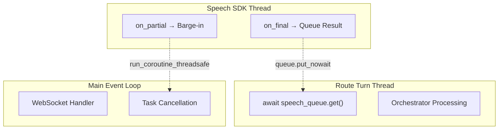

# Speech Services Reference

> **Quick Reference:** Azure Speech SDK integration for STT and TTS

---

## Speech Recognition (STT)

### Core Class

**Source:** `src/speech/speech_recognizer.py`

```python
from src.speech.speech_recognizer import StreamingSpeechRecognizerFromBytes

recognizer = StreamingSpeechRecognizerFromBytes(
    speech_region="eastus",
    languages=["en-US", "es-ES"],
    enable_diarization=True,
    use_default_credential=True,  # Azure Entra ID
)

# Set callbacks
recognizer.on_partial_result = handle_partial  # Barge-in detection
recognizer.on_final_result = handle_final      # Complete utterance
```

### Handler Integration

| Endpoint | Handler | STT Pattern |
|----------|---------|-------------|
| `/api/v1/media/stream` | SpeechCascadeHandler | Three-thread architecture |
| `/api/v1/media/stream` | VoiceLiveHandler | OpenAI Realtime (internal) |
| `/api/v1/browser/conversation` | BrowserHandler | Per-connection pooled client |

### Three-Thread Architecture (SpeechCascade)



### Audio Format

All endpoints expect **16 kHz, mono PCM**:

```python
SAMPLE_RATE = 16000
CHANNELS = 1
SAMPLE_WIDTH = 2  # 16-bit
```

---

## Speech Synthesis (TTS)

### Core Class

**Source:** `src/speech/text_to_speech.py`

```python
from src.speech.text_to_speech import SpeechSynthesizer

synthesizer = SpeechSynthesizer(
    region="eastus",
    voice="en-US-JennyMultilingualNeural",
    enable_tracing=True,
    playback="never",  # Headless deployment
)
```

### Basic Usage

```python
# Synthesize to memory
audio_data = synthesizer.synthesize_speech(
    "Hello! How can I help?",
    style="chat",
    rate="+10%"
)

# Streaming for WebSocket
frames = synthesizer.synthesize_to_base64_frames(text, sample_rate=16000)
for frame in frames:
    websocket.send(frame)
```

### Voice Styling

```python
audio = synthesizer.synthesize_speech(
    text,
    voice="en-US-EmmaNeural",
    style="cheerful",  # chat, news, excited, sad, angry
    rate="+5%",
    pitch="+2Hz",
    volume="+10dB"
)
```

---

## Configuration

### Environment Variables

| Variable | Purpose |
|----------|---------|
| `AZURE_SPEECH_REGION` | Speech service region |
| `AZURE_SPEECH_RESOURCE_ID` | Resource ID for managed identity |
| `STT_POOL_SIZE` | Concurrent recognizer pool (default: 10) |
| `TTS_POOL_SIZE` | Concurrent synthesizer pool (default: 10) |
| `TTS_ENABLE_LOCAL_PLAYBACK` | Enable speaker output (dev only) |

### Authentication

```python
# Production: Azure Entra ID (recommended)
synthesizer = SpeechSynthesizer(
    region="eastus",
    use_default_credential=True,
)

# Development: API Key
synthesizer = SpeechSynthesizer(
    key=os.getenv("AZURE_SPEECH_KEY"),
    region="eastus",
)
```

---

## Resource Pooling

Both STT and TTS use connection pools managed by the application:

```python
# Handlers automatically acquire/release pool resources
stt_client = await stt_pool.acquire()
try:
    # Process audio
    ...
finally:
    await stt_pool.release(stt_client)
```

Pool size is configured via environment variables (`STT_POOL_SIZE`, `TTS_POOL_SIZE`).

---

## OpenTelemetry Integration

Both services include built-in tracing:

```python
synthesizer = SpeechSynthesizer(
    region="eastus",
    enable_tracing=True,
    call_connection_id="acs-call-123",  # Correlation ID
)
```

Traced operations include:
- Session lifecycle
- Audio processing latency
- Error conditions and recovery

---

## Related Documentation

- [Streaming Modes](README.md) — Mode selection and comparison
- [ACS Call Flows](../acs/README.md) — Telephony integration
- [Session Management](../data/README.md) — State persistence
