# 📊 Telemetry & Observability Plan for Voice-to-Voice Agent

> **Status:** DRAFT | **Created:** 2025 | **Audience:** Engineering Team

This document outlines a structured approach to instrumentation, metrics, and logging for our real-time voice agent application. The goal is to provide actionable observability without overwhelming noise, aligned with [OpenTelemetry GenAI semantic conventions](https://opentelemetry.io/docs/specs/semconv/gen-ai/) and optimized for **[Azure Application Insights Application Map](https://learn.microsoft.com/azure/azure-monitor/app/app-map)**.

!!! info "Official Guidance"
    This implementation follows Microsoft's recommended patterns for [tracing AI agents in production](https://learn.microsoft.com/azure/ai-foundry/how-to/develop/trace-agents-sdk) and [Azure Monitor OpenTelemetry integration](https://learn.microsoft.com/azure/azure-monitor/app/opentelemetry-enable).

---

## 🎯 Goals

1. **Application Map Visualization** - Show end-to-end topology with component→dependency relationships
2. **Measure Latency Per Turn** - Track time-to-first-byte (TTFB) at each integration point
3. **Instrument LLM Interactions** - Follow OpenTelemetry GenAI semantic conventions
4. **Monitor Speech Services** - STT/TTS latencies and error rates
5. **Support Debugging** - Correlate logs/traces across call sessions
6. **Avoid Noise** - Filter out high-frequency WebSocket frame logs

---

## 🗺️ Application Map Design

The [Application Map](https://learn.microsoft.com/azure/azure-monitor/app/app-map) shows **components** (your code) and **dependencies** (external services). Per Microsoft's documentation, proper visualization requires correct resource attributes and span kinds.

> 📖 **Reference:** [Application Map: Triage Distributed Applications](https://learn.microsoft.com/azure/azure-monitor/app/app-map)

### Target Application Map Topology


### Critical Application Map Requirements

| Requirement | How It's Achieved | App Map Impact |
|-------------|-------------------|----------------|
| **Cloud Role Name** | `service.name` resource attribute | Creates **node** on map |
| **Cloud Role Instance** | `service.instance.id` resource attribute | Drill-down for load balancing |
| **Dependencies** | Spans with `kind=CLIENT` + `peer.service` | Creates **edges** to external services |
| **Requests** | Spans with `kind=SERVER` | Shows inbound traffic |
| **Correlation** | W3C `traceparent` header propagation | Connects distributed traces |

### Resource Attributes (Set at Startup)

Per [Azure Monitor OpenTelemetry configuration](https://learn.microsoft.com/azure/azure-monitor/app/opentelemetry-configuration#set-the-cloud-role-name-and-the-cloud-role-instance), `service.name` maps to Cloud Role Name and `service.instance.id` maps to Cloud Role Instance:

```python
# In telemetry_config.py
from opentelemetry.sdk.resources import Resource

resource = Resource.create({
    "service.name": "artagent-api",           # → Cloud Role Name
    "service.namespace": "voice-agent",       # → Groups related services
    "service.instance.id": os.getenv("HOSTNAME", socket.gethostname()),  # → Instance
    "service.version": os.getenv("APP_VERSION", "1.0.0"),
    "deployment.environment": os.getenv("ENVIRONMENT", "development"),
})
```

---

## 📐 Architecture Layers & Instrumentation Points

```mermaid
flowchart TB
    subgraph FRONTEND ["🖥️ FRONTEND (Dashboard)"]
        dashboard["Browser Client"]
    end

    subgraph API ["☁️ API LAYER (FastAPI Endpoints)"]
        direction LR
        ws_voice["/ws/voice<br/>(Browser)<br/>SERVER ↓"]
        media_acs["/media/acs<br/>(ACS calls)<br/>SERVER ↓"]
        api_events["/api/events<br/>(webhooks)<br/>SERVER ↓"]
    end

    subgraph HANDLERS ["⚙️ HANDLERS (MediaHandler)"]
        cascade["SpeechCascadeHandler<br/>INTERNAL spans"]
        cascade_methods["_on_user_transcript()<br/>_on_partial_transcript()<br/>_on_vad_event()"]
    end

    subgraph ORCHESTRATION ["🎭 ORCHESTRATION LAYER"]
        direction LR
        agent["ArtAgentFlow<br/>INTERNAL"]
        tools["ToolExecution<br/>INTERNAL"]
        response["ResponseOrchestrator<br/>INTERNAL"]
    end

    subgraph EXTERNAL ["📡 EXTERNAL SERVICES (CLIENT spans)"]
        direction TB
        subgraph row1 [" "]
            direction LR
            aoai["Azure OpenAI<br/>peer.service=azure.ai.openai<br/>CLIENT ↓"]
            speech["Azure Speech<br/>peer.service=azure.speech<br/>CLIENT ↓"]
            acs["Azure Communication Services<br/>peer.service=azure.communication<br/>CLIENT ↓"]
        end
        subgraph row2 [" "]
            direction LR
            redis["Azure Redis<br/>peer.service=redis<br/>CLIENT ↓"]
            cosmos["Azure CosmosDB<br/>peer.service=cosmosdb<br/>CLIENT ↓"]
        end
    end

    dashboard -->|WebSocket| API
    ws_voice & media_acs & api_events --> HANDLERS
    cascade --> cascade_methods
    HANDLERS --> ORCHESTRATION
    agent & tools & response --> EXTERNAL
```



**Legend:**

| Span Kind | Description | App Insights |
|-----------|-------------|--------------|
| **SERVER ↓** | `SpanKind.SERVER` - inbound request | Creates "request" |
| **CLIENT ↓** | `SpanKind.CLIENT` - outbound call | Creates "dependency" |
| **INTERNAL** | `SpanKind.INTERNAL` - internal processing | Shows in trace details |

---

## 📏 Key Metrics to Capture

### 1. **Per-Turn Metrics** (Conversation Flow)

| Metric | Description | Collection Point |
|--------|-------------|------------------|
| `turn.user_speech_duration` | Time user was speaking | VAD → end-of-speech |
| `turn.stt_latency` | STT final result latency | `_on_user_transcript()` |
| `turn.llm_ttfb` | Time to first LLM token | `ArtAgentFlow.run()` |
| `turn.llm_total` | Total LLM response time | `ArtAgentFlow.run()` |
| `turn.tts_ttfb` | Time to first TTS audio | `speech_synthesizer` |
| `turn.tts_total` | Total TTS synthesis time | `speech_synthesizer` |
| `turn.total_latency` | Full turn round-trip | Start VAD → audio playback begins |

### 2. **LLM Metrics** (OpenTelemetry GenAI Conventions)

These attributes follow the [OpenTelemetry Semantic Conventions for Generative AI](https://opentelemetry.io/docs/specs/semconv/gen-ai/gen-ai-spans/), which define standardized telemetry for LLM operations:

| Attribute | OTel Attribute Name | Example |
|-----------|---------------------|---------|
| Provider | `gen_ai.provider.name` | `azure.ai.openai` |
| Operation | `gen_ai.operation.name` | `chat` |
| Model Requested | `gen_ai.request.model` | `gpt-4o` |
| Model Used | `gen_ai.response.model` | `gpt-4o-2024-05-13` |
| Input Tokens | `gen_ai.usage.input_tokens` | `150` |
| Output Tokens | `gen_ai.usage.output_tokens` | `75` |
| Finish Reason | `gen_ai.response.finish_reasons` | `["stop"]` |
| Duration | `gen_ai.client.operation.duration` | `0.823s` |
| TTFB | `gen_ai.server.time_to_first_token` | `0.142s` |

### 3. **Speech Services Metrics**

| Metric | Attribute | Unit |
|--------|-----------|------|
| STT Recognition Time | `speech.stt.recognition_duration` | seconds |
| STT Confidence | `speech.stt.confidence` | 0.0-1.0 |
| TTS Synthesis Time | `speech.tts.synthesis_duration` | seconds |
| TTS Audio Size | `speech.tts.audio_size_bytes` | bytes |
| TTS Voice | `speech.tts.voice` | string |

### 4. **Session/Call Metrics**

| Metric | Description |
|--------|-------------|
| `session.turn_count` | Total turns in session |
| `session.total_duration` | Session length |
| `session.avg_turn_latency` | Average turn latency |
| `call.connection_id` | ACS call correlation ID |
| `transport.type` | `ACS` or `BROWSER` |

---

## 🏗️ Span Hierarchy (Trace Structure)

Following [OpenTelemetry GenAI semantic conventions](https://opentelemetry.io/docs/specs/semconv/gen-ai/gen-ai-spans/) with proper **[SpanKind](https://opentelemetry.io/docs/concepts/signals/traces/#span-kind)** for Application Map. The span hierarchy below aligns with [Azure AI Foundry tracing patterns](https://learn.microsoft.com/azure/ai-foundry/how-to/develop/trace-agents-sdk):

```
[ROOT] voice_session (SERVER)                          ← Shows as REQUEST in App Insights
├── call.connection_id, session.id, transport.type
│
├─► [CHILD] conversation_turn (INTERNAL)               ← Shows in trace timeline
│   ├── turn.number, turn.user_intent_preview
│   │
│   ├─► [CHILD] stt.recognition (CLIENT)               ← Shows as DEPENDENCY to "azure.speech"
│   │   ├── peer.service="azure.speech"
│   │   ├── server.address="<region>.api.cognitive.microsoft.com"
│   │   └── speech.stt.*, gen_ai.provider.name="azure.speech"
│   │
│   ├─► [CHILD] chat {model} (CLIENT)                  ← Shows as DEPENDENCY to "azure.ai.openai"
│   │   ├── peer.service="azure.ai.openai"
│   │   ├── server.address="<resource>.openai.azure.com"
│   │   ├── gen_ai.operation.name="chat"
│   │   ├── gen_ai.provider.name="azure.ai.openai"
│   │   ├── gen_ai.request.model, gen_ai.response.model
│   │   ├── gen_ai.usage.input_tokens, gen_ai.usage.output_tokens
│   │   └── [EVENT] gen_ai.content.prompt (opt-in)
│   │   └── [EVENT] gen_ai.content.completion (opt-in)
│   │
│   ├─► [CHILD] execute_tool {tool_name} (INTERNAL)    ← if function calling
│   │   ├── gen_ai.operation.name="execute_tool"
│   │   ├── gen_ai.tool.name, gen_ai.tool.call.id
│   │   └── gen_ai.tool.call.result (opt-in)
│   │
│   └─► [CHILD] tts.synthesis (CLIENT)                 ← Shows as DEPENDENCY to "azure.speech"
│       ├── peer.service="azure.speech"
│       ├── server.address="<region>.api.cognitive.microsoft.com"
│       └── speech.tts.*, gen_ai.provider.name="azure.speech"
│
├─► [CHILD] redis.operation (CLIENT)                   ← Shows as DEPENDENCY to "redis"
│   ├── peer.service="redis"
│   ├── db.system="redis"
│   └── db.operation="SET/GET/HSET"
│
└─► [CHILD] cosmosdb.operation (CLIENT)                ← Shows as DEPENDENCY to "cosmosdb"
    ├── peer.service="cosmosdb"
    ├── db.system="cosmosdb"
    └── db.operation="query/upsert"
```

---

## 🔗 Dependency Tracking for Application Map

For each external service call, create a **CLIENT** span with these attributes:

### Azure OpenAI (LLM)

```python
from opentelemetry import trace
from opentelemetry.trace import SpanKind

tracer = trace.get_tracer(__name__)

with tracer.start_as_current_span(
    name=f"chat {model}",  # Span name format: "{operation} {target}"
    kind=SpanKind.CLIENT,
) as span:
    # Required for Application Map edge
    span.set_attribute("peer.service", "azure.ai.openai")
    span.set_attribute("server.address", f"{resource_name}.openai.azure.com")
    span.set_attribute("server.port", 443)
    
    # GenAI semantic conventions
    span.set_attribute("gen_ai.operation.name", "chat")
    span.set_attribute("gen_ai.provider.name", "azure.ai.openai")
    span.set_attribute("gen_ai.request.model", model)
    
    # After response
    span.set_attribute("gen_ai.response.model", response.model)
    span.set_attribute("gen_ai.usage.input_tokens", response.usage.prompt_tokens)
    span.set_attribute("gen_ai.usage.output_tokens", response.usage.completion_tokens)
    span.set_attribute("gen_ai.response.finish_reasons", [choice.finish_reason])
```

### Azure Speech (STT/TTS)

```python
with tracer.start_as_current_span(
    name="stt.recognize_once",  # or "tts.synthesize"
    kind=SpanKind.CLIENT,
) as span:
    # Required for Application Map edge
    span.set_attribute("peer.service", "azure.speech")
    span.set_attribute("server.address", f"{region}.api.cognitive.microsoft.com")
    span.set_attribute("server.port", 443)
    
    # Speech-specific attributes
    span.set_attribute("speech.stt.language", "en-US")
    span.set_attribute("speech.tts.voice", voice_name)
    span.set_attribute("speech.tts.output_format", "audio-24khz-48kbitrate-mono-mp3")
```

### Azure Communication Services

```python
with tracer.start_as_current_span(
    name="acs.answer_call",  # or "acs.play_media", "acs.stop_media"
    kind=SpanKind.CLIENT,
) as span:
    span.set_attribute("peer.service", "azure.communication")
    span.set_attribute("server.address", f"{resource_name}.communication.azure.com")
    span.set_attribute("acs.call_connection_id", call_connection_id)
    span.set_attribute("acs.operation", "answer_call")
```

### Redis

```python
with tracer.start_as_current_span(
    name="redis.hset",
    kind=SpanKind.CLIENT,
) as span:
    span.set_attribute("peer.service", "redis")
    span.set_attribute("db.system", "redis")
    span.set_attribute("db.operation", "HSET")
    span.set_attribute("server.address", redis_host)
    span.set_attribute("server.port", 6379)
```

### Cosmos DB

```python
with tracer.start_as_current_span(
    name="cosmosdb.query_items",
    kind=SpanKind.CLIENT,
) as span:
    span.set_attribute("peer.service", "cosmosdb")
    span.set_attribute("db.system", "cosmosdb")
    span.set_attribute("db.operation", "query")
    span.set_attribute("db.cosmosdb.container", container_name)
    span.set_attribute("server.address", f"{account_name}.documents.azure.com")
```

---

## 🔇 Noise Reduction Strategy

### What to **FILTER OUT** (too noisy):

| Source | Reason | Implementation |
|--------|--------|----------------|
| Individual WebSocket `send()`/`recv()` | High frequency, no signal | `NoisySpanFilterSampler` in telemetry_config.py |
| Per-audio-frame logs | Creates 50+ log entries per second | Sampler drops spans matching patterns |
| Azure credential retry logs | Noise during auth fallback | Logger level set to WARNING |
| Health check pings | `/health`, `/ready` endpoints | Can add to sampler patterns |

### Span Filtering Patterns (Implemented):

The `NoisySpanFilterSampler` drops spans matching these patterns:

```python
NOISY_SPAN_PATTERNS = [
    r".*websocket\s*(receive|send).*",  # WebSocket frame operations
    r".*ws[._](receive|send).*",         # Alternative WS naming
    r"HTTP.*websocket.*",                # HTTP spans for WS endpoints
    r"^(GET|POST)\s+.*(websocket|/ws/).*", # Method + WebSocket path
]

NOISY_URL_PATTERNS = [
    "/api/v1/browser/conversation",  # Browser WebSocket endpoint
    "/api/v1/acs/media",             # ACS media streaming endpoint
    "/ws/",                          # Generic WebSocket paths
]
```

### What to **SAMPLE** (reduce volume):

| Source | Sampling Rate | Reason |
|--------|---------------|--------|
| Partial STT transcripts | 10% | Still need visibility |
| VAD frame events | 1% | Only need aggregate |
| WebSocket keepalive | 0% | No value |

### Logger Suppression (Implemented):

```python
# In telemetry_config.py - suppressed at module import
NOISY_LOGGERS = [
    "azure.identity",
    "azure.core.pipeline",
    "websockets.protocol",
    "websockets.client",
    "aiohttp.access",
    "httpx", "httpcore",
    "redis.asyncio.connection",
    "opentelemetry.sdk.trace",
]

for name in NOISY_LOGGERS:
    logging.getLogger(name).setLevel(logging.WARNING)
```

---

## 📝 Structured Log Format & Session Context

### Automatic Correlation with `session_context`

The project uses `contextvars`-based session context for **automatic correlation propagation**. Set context once at the connection level, and all nested logs/spans inherit the correlation IDs:

```python
from utils.session_context import session_context

# At WebSocket entry point - set ONCE:
async with session_context(
    call_connection_id=call_connection_id,
    session_id=session_id,
    transport_type="BROWSER",  # or "ACS"
):
    # ALL logs and spans within this block automatically get correlation
    await handler.run()
```

**Inside nested functions - NO extra params needed:**

```python
# In speech_cascade_handler.py, media_handler.py, etc.
logger.info("Processing speech")  # Automatically includes session_id, call_connection_id

# Spans also get correlation automatically via SessionContextSpanProcessor
with tracer.start_as_current_span("my_operation"):
    pass  # Span has session.id, call.connection.id attributes
```

### Architecture

```mermaid
flowchart TB
    subgraph WS["WebSocket Endpoint (browser.py / media.py)"]
        subgraph SC["async with session_context(call_id, session_id, ...)"]
            MH["📡 MediaHandler"]
            MH --> SCH["🎙️ SpeechCascadeHandler<br/>(logs auto-correlated)"]
            MH --> STT["🔊 STT callbacks<br/>(logs auto-correlated)"]
            MH --> ORCH["🤖 Orchestrator<br/>(spans auto-correlated)"]
            MH --> DB["💾 All Redis/CosmosDB spans<br/>(auto-correlated)"]
        end
    end
    
    style SC fill:#e8f5e9,stroke:#4caf50
    style MH fill:#2196f3,stroke:#1976d2,color:#fff
```



### How It Works

1. **`SessionCorrelation`** dataclass holds `call_connection_id`, `session_id`, `transport_type`, `agent_name`
2. **`session_context`** async context manager sets the `contextvars.ContextVar`
3. **`TraceLogFilter`** in `ml_logging.py` reads from context and adds to log records
4. **`SessionContextSpanProcessor`** in `telemetry_config.py` injects attributes into all spans

### Legacy Explicit Logging (Still Supported)

For cases outside a session context, explicit `extra` dict still works:

```python
logger.info(
    "Turn completed",
    extra={
        "call_connection_id": call_connection_id,
        "session_id": session_id,
        "turn_number": turn_number,
        "turn_latency_ms": turn_latency_ms,
    }
)
```

### Log Levels by Purpose:

| Level | Use Case |
|-------|----------|
| `DEBUG` | Frame-level, internal state (disabled in prod) |
| `INFO` | Turn boundaries, session lifecycle, latency summaries |
| `WARNING` | Retry logic, degraded performance |
| `ERROR` | Failed operations, exceptions |

---

## 📦 Storage Strategy

### 1. **Real-Time Dashboard (Redis)**

Store in `CoreMemory["latency"]` via existing `LatencyTool`:

```python
# Current implementation in latency_helpers.py
corememory["latency"] = {
    "current_run_id": "abc123",
    "runs": {
        "abc123": {
            "samples": [
                {"stage": "llm_ttfb", "dur": 0.142, "meta": {...}},
                {"stage": "tts_ttfb", "dur": 0.089, "meta": {...}},
            ]
        }
    }
}
```

### 2. **Historical Analysis (Application Insights)**

Export via OpenTelemetry → Azure Monitor:

```python
# Already configured in telemetry_config.py
configure_azure_monitor(
    connection_string=APPLICATIONINSIGHTS_CONNECTION_STRING,
    instrumentation_options={
        "azure_sdk": {"enabled": True},
        "fastapi": {"enabled": True},
    },
)
```

### 3. **Per-Session Summary (Redis → Cosmos DB)**

At session end, persist aggregated metrics:

```python
session_summary = latency_tool.session_summary()
# Returns: {"llm_ttfb": {"avg": 0.15, "min": 0.12, "max": 0.21, "count": 5}}
```

---


## 🎯 Service Level Objectives (SLOs)

### Voice Agent SLO Definitions

| Metric | Target | Warning | Critical | Measurement |
|--------|--------|---------|----------|-------------|
| **Turn Latency (P95)** | < 2,000 ms | > 2,500 ms | > 4,000 ms | End-to-end from user speech end to agent speech start |
| **Turn Latency (P50)** | < 800 ms | > 1,200 ms | > 2,000 ms | Median response time |
| **Azure OpenAI Latency (P95)** | < 1,500 ms | > 2,000 ms | > 3,000 ms | LLM inference time per call |
| **STT Latency (P95)** | < 500 ms | > 800 ms | > 1,200 ms | Speech recognition final result |
| **TTS Latency (P95)** | < 600 ms | > 1,000 ms | > 1,500 ms | Time to first audio byte |
| **Error Rate** | < 1% | > 2% | > 5% | Failed requests / total requests |
| **Availability** | 99.9% | < 99.5% | < 99% | Successful health checks |

### SLO Monitoring KQL Queries

```kql
// Real-Time SLO Dashboard - Turn Latency
dependencies
| where timestamp > ago(1h)
| where isnotempty(customDimensions["turn.total_latency_ms"])
| extend turn_latency_ms = todouble(customDimensions["turn.total_latency_ms"])
| summarize 
    p50 = percentile(turn_latency_ms, 50),
    p95 = percentile(turn_latency_ms, 95),
    p99 = percentile(turn_latency_ms, 99),
    total = count()
    by bin(timestamp, 5m)
| extend 
    p95_slo_met = p95 < 2000,
    p50_slo_met = p50 < 800
| project timestamp, p50, p95, p99, p95_slo_met, p50_slo_met, total
```

```kql
// SLO Compliance Summary (Last 24h)
dependencies
| where timestamp > ago(24h)
| where isnotempty(customDimensions["turn.total_latency_ms"])
| extend turn_latency_ms = todouble(customDimensions["turn.total_latency_ms"])
| summarize 
    total_turns = count(),
    turns_under_2s = countif(turn_latency_ms < 2000),
    turns_under_800ms = countif(turn_latency_ms < 800),
    p95_latency = percentile(turn_latency_ms, 95)
| extend 
    p95_slo_compliance = round(100.0 * turns_under_2s / total_turns, 2),
    p50_slo_compliance = round(100.0 * turns_under_800ms / total_turns, 2)
| project 
    total_turns, 
    p95_latency,
    p95_slo_compliance,
    p50_slo_compliance,
    slo_status = iff(p95_latency < 2000, "✅ Met", "❌ Breached")
```

---

## 🚨 Alert Configuration

### Azure Monitor Alert Rules

Create these alert rules in Azure Portal → Application Insights → Alerts:

#### 1. Turn Latency P95 Breach (Critical)
```kql
// Alert when P95 turn latency exceeds 4 seconds (Critical threshold)
dependencies
| where timestamp > ago(15m)
| where isnotempty(customDimensions["turn.total_latency_ms"])
| extend turn_latency_ms = todouble(customDimensions["turn.total_latency_ms"])
| summarize p95_latency = percentile(turn_latency_ms, 95)
| where p95_latency > 4000
```
- **Frequency:** Every 5 minutes
- **Severity:** Critical (Sev 1)
- **Action:** Page on-call, create incident

#### 2. Turn Latency P95 Warning
```kql
// Alert when P95 turn latency exceeds 2.5 seconds (Warning threshold)
dependencies
| where timestamp > ago(15m)
| where isnotempty(customDimensions["turn.total_latency_ms"])
| extend turn_latency_ms = todouble(customDimensions["turn.total_latency_ms"])
| summarize p95_latency = percentile(turn_latency_ms, 95)
| where p95_latency > 2500 and p95_latency <= 4000
```
- **Frequency:** Every 5 minutes
- **Severity:** Warning (Sev 2)
- **Action:** Notify Slack/Teams channel

#### 3. Azure OpenAI High Latency
```kql
// Alert when OpenAI response time exceeds 3 seconds
dependencies
| where timestamp > ago(15m)
| where target contains "openai" or name startswith "chat"
| summarize 
    p95_duration = percentile(duration, 95),
    call_count = count()
| where p95_duration > 3000 and call_count > 5
```
- **Frequency:** Every 5 minutes
- **Severity:** Warning (Sev 2)

#### 4. High Error Rate
```kql
// Alert when error rate exceeds 5%
dependencies
| where timestamp > ago(15m)
| summarize 
    total = count(),
    failed = countif(success == false)
| extend error_rate = round(100.0 * failed / total, 2)
| where error_rate > 5 and total > 10
```
- **Frequency:** Every 5 minutes
- **Severity:** Critical (Sev 1)

#### 5. Service Health Check Failure
```kql
// Alert when /api/v1/readiness returns non-200
requests
| where timestamp > ago(10m)
| where name contains "readiness"
| summarize 
    total = count(),
    failures = countif(success == false)
| where failures > 3
```
- **Frequency:** Every 5 minutes
- **Severity:** Critical (Sev 1)

### Alert Rule Bicep Template

Deploy alerts via Infrastructure as Code:

```bicep
// infra/bicep/modules/alerts.bicep
param appInsightsName string
param actionGroupId string
param location string = resourceGroup().location

resource appInsights 'Microsoft.Insights/components@2020-02-02' existing = {
  name: appInsightsName
}

resource turnLatencyAlert 'Microsoft.Insights/scheduledQueryRules@2023-03-15-preview' = {
  name: 'Turn-Latency-P95-Critical'
  location: location
  properties: {
    displayName: 'Voice Agent Turn Latency P95 > 4s'
    severity: 1
    enabled: true
    evaluationFrequency: 'PT5M'
    windowSize: 'PT15M'
    scopes: [appInsights.id]
    criteria: {
      allOf: [
        {
          query: '''
            dependencies
            | where isnotempty(customDimensions["turn.total_latency_ms"])
            | extend turn_latency_ms = todouble(customDimensions["turn.total_latency_ms"])
            | summarize p95_latency = percentile(turn_latency_ms, 95)
            | where p95_latency > 4000
          '''
          timeAggregation: 'Count'
          operator: 'GreaterThan'
          threshold: 0
          failingPeriods: {
            minFailingPeriodsToAlert: 1
            numberOfEvaluationPeriods: 1
          }
        }
      ]
    }
    actions: {
      actionGroups: [actionGroupId]
    }
  }
}
```

---

## 🔍 Intelligent View (Smart Detection)

[Application Insights Smart Detection](https://learn.microsoft.com/azure/azure-monitor/alerts/proactive-diagnostics) automatically identifies anomalies in your application telemetry using machine learning algorithms.

### Enabling Smart Detection

1. Navigate to **Application Insights** → **Smart Detection** in Azure Portal
2. Enable the following rules:

| Rule | Purpose | Recommended Setting |
|------|---------|---------------------|
| **Failure Anomalies** | Detect unusual spike in failed requests | ✅ Enabled |
| **Performance Anomalies** | Detect response time degradation | ✅ Enabled |
| **Memory Leak** | Detect gradual memory increase | ✅ Enabled |
| **Dependency Duration** | Detect slow external calls | ✅ Enabled |

### Custom Anomaly Detection Query

```kql
// Detect latency anomalies using dynamic thresholds
let baseline = dependencies
| where timestamp between(ago(7d) .. ago(1d))
| where target contains "openai"
| summarize avg_duration = avg(duration), stdev_duration = stdev(duration);
dependencies
| where timestamp > ago(1h)
| where target contains "openai"
| summarize current_avg = avg(duration) by bin(timestamp, 5m)
| extend threshold = toscalar(baseline | project avg_duration + 2 * stdev_duration)
| where current_avg > threshold
| project timestamp, current_avg, threshold, anomaly = true
```

---

## 🏥 Health Check Endpoints

The application provides comprehensive health monitoring via REST endpoints:

### Liveness Probe: `GET /api/v1/health`

Returns `200 OK` if the server process is running. Used by Kubernetes/load balancers for liveness checks.

**Response includes:**
- Basic service status
- Active session count
- WebSocket connection metrics

### Readiness Probe: `GET /api/v1/readiness`

Returns `200 OK` only if all critical dependencies are healthy. Returns `503 Service Unavailable` if any are unhealthy.

**Dependencies checked (with 1s timeout each):**
- ✅ **Redis** - Connectivity and ping response
- ✅ **Azure OpenAI** - Client initialization
- ✅ **Speech Services** - STT/TTS pool readiness
- ✅ **ACS Caller** - Phone number configuration
- ✅ **RT Agents** - All agents initialized
- ✅ **Auth Configuration** - GUID validation (when enabled)

### Health Check Integration

Health probes follow [Azure Container Apps health probe configuration](https://learn.microsoft.com/azure/container-apps/health-probes) and [Kubernetes probe patterns](https://kubernetes.io/docs/tasks/configure-pod-container/configure-liveness-readiness-startup-probes/).

**Kubernetes Deployment:**
```yaml
livenessProbe:
  httpGet:
    path: /api/v1/health
    port: 8000
  initialDelaySeconds: 10
  periodSeconds: 10
  failureThreshold: 3

readinessProbe:
  httpGet:
    path: /api/v1/readiness
    port: 8000
  initialDelaySeconds: 15
  periodSeconds: 15
  failureThreshold: 2
```

**Azure Container Apps:**
```bicep
probes: [
  {
    type: 'Liveness'
    httpGet: {
      path: '/api/v1/health'
      port: 8000
    }
    periodSeconds: 10
  }
  {
    type: 'Readiness'
    httpGet: {
      path: '/api/v1/readiness'
      port: 8000
    }
    periodSeconds: 15
  }
]
```

---

## 📊 Application Insights Queries (KQL)

> **Note**: These queries use the classic Application Insights table names (`dependencies`, `traces`, `requests`).
> For Log Analytics workspaces, use `AppDependencies`, `AppTraces`, `AppRequests` instead.

### Application Map Dependencies Overview
```kql
// See all dependencies grouped by target (peer.service)
// Validated against Azure Monitor documentation 2024
dependencies
| where timestamp > ago(24h)
| summarize 
    call_count = count(),
    avg_duration_ms = avg(duration),
    failure_rate = round(100.0 * countif(success == false) / count(), 2)
    by target, type, cloud_RoleName
| order by call_count desc
```

### GenAI (LLM) Performance by Model
```kql
// Track Azure OpenAI performance with GenAI semantic conventions
dependencies
| where timestamp > ago(24h)
| where target contains "openai" or name startswith "chat"
| extend model = tostring(customDimensions["gen_ai.request.model"])
| extend input_tokens = toint(customDimensions["gen_ai.usage.input_tokens"])
| extend output_tokens = toint(customDimensions["gen_ai.usage.output_tokens"])
| where isnotempty(model)
| summarize 
    calls = count(),
    avg_duration_ms = avg(duration),
    p50_duration = percentile(duration, 50),
    p95_duration = percentile(duration, 95),
    p99_duration = percentile(duration, 99),
    total_input_tokens = sum(input_tokens),
    total_output_tokens = sum(output_tokens),
    failure_rate = round(100.0 * countif(success == false) / count(), 2)
    by model, bin(timestamp, 1h)
| order by timestamp desc
```

### GenAI Token Usage Over Time (Cost Tracking)
```kql
// Track token consumption for cost analysis
dependencies
| where timestamp > ago(7d)
| where target contains "openai"
| extend model = tostring(customDimensions["gen_ai.request.model"])
| extend input_tokens = toint(customDimensions["gen_ai.usage.input_tokens"])
| extend output_tokens = toint(customDimensions["gen_ai.usage.output_tokens"])
| where input_tokens > 0 or output_tokens > 0
| summarize 
    total_input = sum(input_tokens),
    total_output = sum(output_tokens),
    total_tokens = sum(input_tokens) + sum(output_tokens),
    request_count = count()
    by bin(timestamp, 1d), model
| order by timestamp desc
| render columnchart
```

### Speech Services Latency (STT + TTS)
```kql
// Monitor Azure Speech service performance
dependencies
| where timestamp > ago(24h)
| where target contains "speech" or name startswith "stt" or name startswith "tts"
| extend operation = case(
    name contains "stt" or name contains "recognition", "STT",
    name contains "tts" or name contains "synthesis", "TTS",
    "Other"
)
| summarize 
    calls = count(),
    avg_duration_ms = avg(duration),
    p95_duration = percentile(duration, 95),
    failure_rate = round(100.0 * countif(success == false) / count(), 2)
    by operation, bin(timestamp, 1h)
| render timechart
```

### Turn Latency Distribution
```kql
// Analyze conversation turn latency from span attributes
// Note: Turn metrics are stored in span customDimensions
dependencies
| where timestamp > ago(24h)
| where isnotempty(customDimensions["turn.total_latency_ms"])
| extend turn_latency_ms = todouble(customDimensions["turn.total_latency_ms"])
| extend session_id = tostring(customDimensions["session.id"])
| summarize 
    avg_latency = avg(turn_latency_ms),
    p50 = percentile(turn_latency_ms, 50),
    p95 = percentile(turn_latency_ms, 95),
    p99 = percentile(turn_latency_ms, 99),
    turn_count = count()
    by bin(timestamp, 1h)
| render timechart
```

### Token Usage by Session
```kql
// Aggregate token usage per conversation session
dependencies
| where timestamp > ago(24h)
| where isnotempty(customDimensions["gen_ai.usage.input_tokens"])
| extend 
    session_id = tostring(customDimensions["session.id"]),
    input_tokens = toint(customDimensions["gen_ai.usage.input_tokens"]),
    output_tokens = toint(customDimensions["gen_ai.usage.output_tokens"])
| summarize 
    total_input = sum(input_tokens),
    total_output = sum(output_tokens),
    turns = count()
    by session_id
| extend total_tokens = total_input + total_output
| order by total_tokens desc
| take 50
```

### End-to-End Trace Correlation
```kql
// Find all telemetry for a specific call/session
// Replace <your-session-id> with actual session ID
let target_session = "<your-session-id>";
union requests, dependencies, traces
| where timestamp > ago(24h)
| where customDimensions["session.id"] == target_session
    or customDimensions["call.connection_id"] == target_session
    or operation_Id == target_session
| project 
    timestamp, 
    itemType, 
    name, 
    duration,
    success,
    operation_Id,
    target = coalesce(target, ""),
    message = coalesce(message, "")
| order by timestamp asc
```

### Application Map Health Check
```kql
// Verify all expected service dependencies are reporting
dependencies
| where timestamp > ago(1h)
| summarize 
    last_seen = max(timestamp),
    call_count = count(),
    avg_duration = avg(duration),
    error_count = countif(success == false)
    by target, cloud_RoleName
| extend minutes_since_last = datetime_diff('minute', now(), last_seen)
| extend health_status = case(
    minutes_since_last > 30, "⚠️ Stale",
    error_count > call_count * 0.1, "🔴 High Errors",
    avg_duration > 5000, "🟡 Slow",
    "🟢 Healthy"
)
| project target, cloud_RoleName, call_count, avg_duration, error_count, last_seen, health_status
| order by call_count desc
```

### Error Analysis by Service
```kql
// Identify failing dependencies and error patterns
dependencies
| where timestamp > ago(24h)
| where success == false
| extend error_code = tostring(resultCode)
| summarize 
    error_count = count(),
    first_seen = min(timestamp),
    last_seen = max(timestamp)
    by target, name, error_code
| order by error_count desc
| take 20
```

---

## 🤖 OpenAI Client Auto-Instrumentation

The project uses the `opentelemetry-instrumentation-openai-v2` package for automatic tracing of OpenAI API calls with GenAI semantic conventions. This follows Microsoft's recommended approach for [tracing generative AI applications](https://learn.microsoft.com/azure/ai-foundry/how-to/develop/trace-production-sdk).

> 📖 **Reference:** [Enable tracing for Azure AI Agents SDK](https://learn.microsoft.com/azure/ai-foundry/how-to/develop/trace-agents-sdk)

### What Gets Instrumented Automatically

When enabled, the `OpenAIInstrumentor` creates spans for:

| Operation | Span Name Pattern | Attributes |
|-----------|-------------------|------------|
| Chat Completions | `chat {model}` | `gen_ai.usage.*`, `gen_ai.request.model` |
| Streaming | `chat {model}` | Token streaming with usage tracking |
| Tool Calls | Child of chat span | `gen_ai.tool.name`, arguments |

### How It's Configured

**Enabled automatically in `telemetry_config.py`:**

```python
from opentelemetry.instrumentation.openai_v2 import OpenAIInstrumentor
from opentelemetry import trace

# Called during setup_azure_monitor() after TracerProvider is set
tracer_provider = trace.get_tracer_provider()
OpenAIInstrumentor().instrument(tracer_provider=tracer_provider)
```

### Content Recording (Prompt/Completion Capture)

To capture `gen_ai.request.messages` and `gen_ai.response.choices` in traces:

```bash
# Environment variable (.env or deployment config)
AZURE_TRACING_GEN_AI_CONTENT_RECORDING_ENABLED=true
```

**Warning:** This captures full prompt and completion text, which may contain PII. Only enable in development or with proper data handling.

### Verifying Instrumentation

Check if instrumentation is active:

```python
from utils.telemetry_config import is_openai_instrumented

if is_openai_instrumented():
    print("OpenAI client auto-instrumentation enabled")
```

### Installation

The package is included in `requirements.txt`:

```
opentelemetry-instrumentation-openai-v2
```

### GenAI Semantic Conventions

The instrumentor follows OpenTelemetry GenAI semantic conventions:

**Attributes captured:**
- `gen_ai.request.model` - Model deployment ID
- `gen_ai.request.max_tokens` - Max tokens requested
- `gen_ai.request.temperature` - Sampling temperature
- `gen_ai.usage.input_tokens` - Prompt tokens used
- `gen_ai.usage.output_tokens` - Completion tokens generated
- `gen_ai.response.finish_reason` - Why generation stopped

---

## 🔗 References

### Azure AI & Agents

| Topic | Documentation |
|-------|---------------|
| **Tracing AI Agents** | [Enable tracing for Azure AI Agents SDK](https://learn.microsoft.com/azure/ai-foundry/how-to/develop/trace-agents-sdk) |
| **Production Tracing** | [Tracing in production with the Azure AI SDK](https://learn.microsoft.com/azure/ai-foundry/how-to/develop/trace-production-sdk) |
| **Visualize Traces** | [Visualize your traces in Azure AI Foundry](https://learn.microsoft.com/azure/ai-foundry/how-to/develop/visualize-traces) |

### Azure Monitor & Application Insights

| Topic | Documentation |
|-------|---------------|
| **Application Map** | [Application Map: Triage Distributed Applications](https://learn.microsoft.com/azure/azure-monitor/app/app-map) |
| **OpenTelemetry Setup** | [Enable Azure Monitor OpenTelemetry](https://learn.microsoft.com/azure/azure-monitor/app/opentelemetry-enable) |
| **Cloud Role Configuration** | [Set Cloud Role Name and Instance](https://learn.microsoft.com/azure/azure-monitor/app/opentelemetry-configuration#set-the-cloud-role-name-and-the-cloud-role-instance) |
| **Add/Modify Telemetry** | [Add and modify OpenTelemetry](https://learn.microsoft.com/azure/azure-monitor/app/opentelemetry-add-modify) |
| **Smart Detection** | [Proactive Diagnostics](https://learn.microsoft.com/azure/azure-monitor/alerts/proactive-diagnostics) |
| **Log-based Alerts** | [Create log alerts](https://learn.microsoft.com/azure/azure-monitor/alerts/alerts-create-log-alert-rule) |

### OpenTelemetry Standards

| Topic | Documentation |
|-------|---------------|
| **GenAI Semantic Conventions** | [Generative AI Spans](https://opentelemetry.io/docs/specs/semconv/gen-ai/gen-ai-spans/) |
| **GenAI Metrics** | [Generative AI Metrics](https://opentelemetry.io/docs/specs/semconv/gen-ai/gen-ai-metrics/) |
| **Span Kinds** | [Span Kind](https://opentelemetry.io/docs/concepts/signals/traces/#span-kind) |
| **Context Propagation** | [Context and Propagation](https://opentelemetry.io/docs/concepts/signals/traces/#context-propagation) |

### Azure Services

| Topic | Documentation |
|-------|---------------|
| **Azure Speech Telemetry** | [Speech SDK logging](https://learn.microsoft.com/azure/ai-services/speech-service/how-to-use-logging) |
| **Azure OpenAI Monitoring** | [Monitor Azure OpenAI](https://learn.microsoft.com/azure/ai-services/openai/how-to/monitoring) |
| **Container Apps Health Probes** | [Health probes in Azure Container Apps](https://learn.microsoft.com/azure/container-apps/health-probes) |
| **Redis Monitoring** | [Monitor Azure Cache for Redis](https://learn.microsoft.com/azure/azure-cache-for-redis/cache-how-to-monitor) |
| **Cosmos DB Monitoring** | [Monitor Azure Cosmos DB](https://learn.microsoft.com/azure/cosmos-db/monitor) |

### Project Implementation

- **Telemetry Configuration:** `utils/telemetry_config.py`
- **Latency Tracking Tool:** `src/tools/latency_tool.py`
- **Session Context:** `utils/session_context.py`
- **Logging Configuration:** `utils/ml_logging.py`

---
