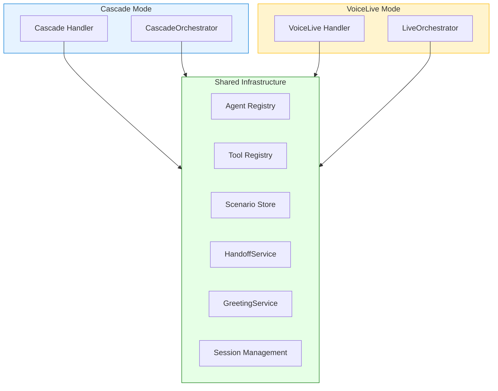
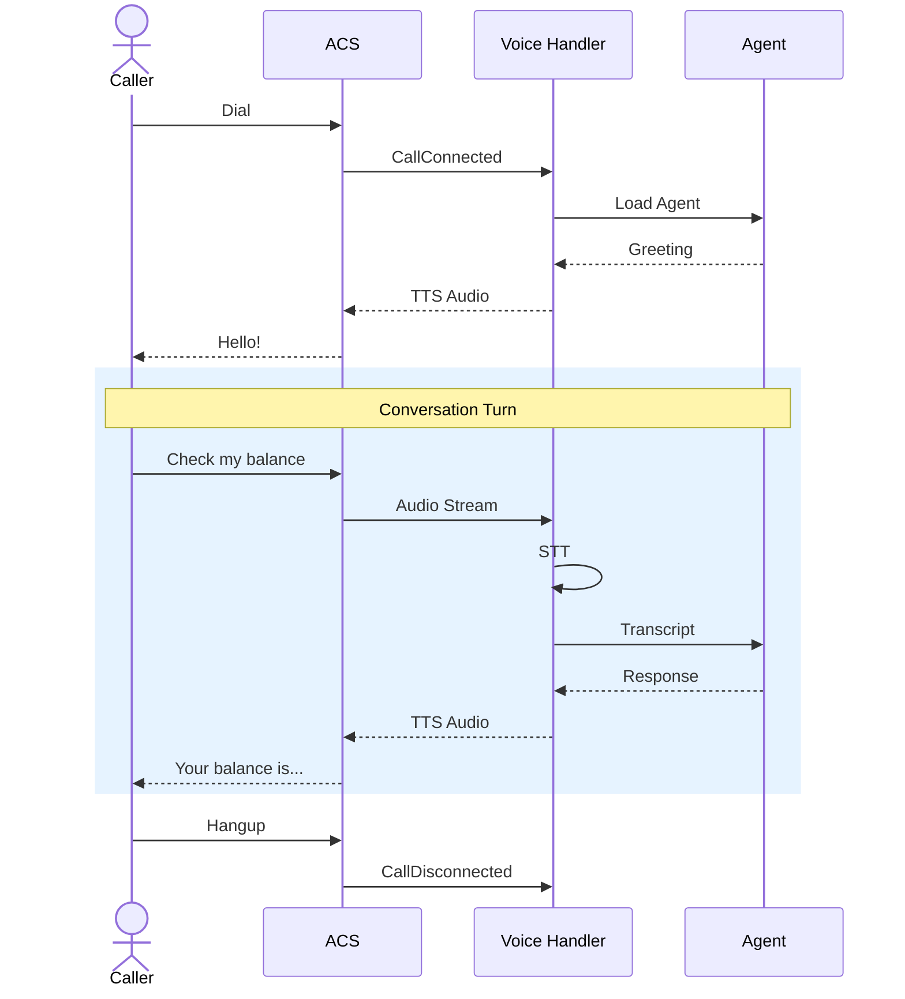
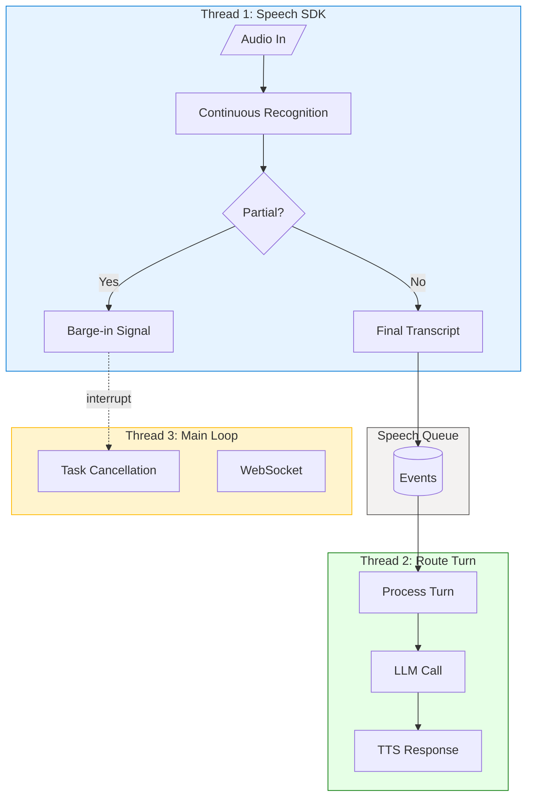
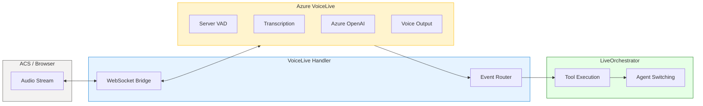
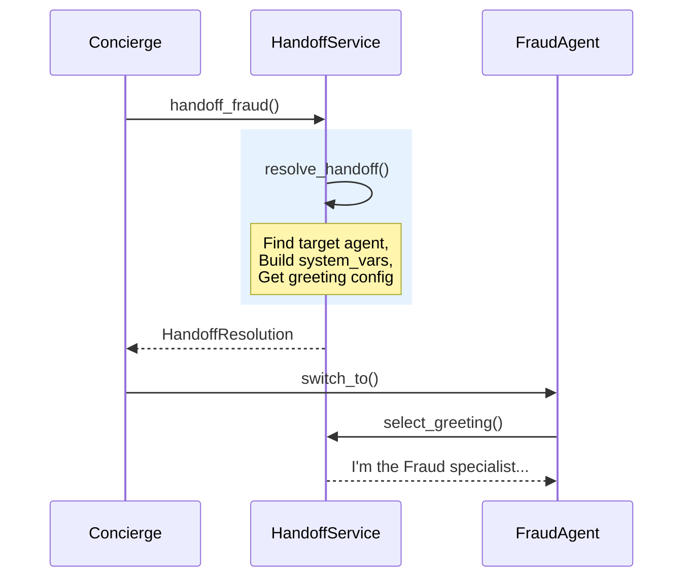

# Voice Processing Architecture

This guide explains how voice interactions work in the ART Voice Agent Accelerator.

---

## Three Patterns on the Managed Services Spectrum

There are **three distinct patterns** for building voice AI applications. The spectrum ranges from **full control** (you manage each component) to **fully managed** (the platform handles audio end-to-end):

=== "Cascade"

    **:material-tune-vertical: Maximum Control**
    
    You independently configure and tune each layer of the voice pipeline with full flexibility over models, regions, and deployment options.
    
    | Component | Options |
    |-----------|---------|
    | **Speech-to-Text** | Azure Speech, Whisper (via Azure OpenAI), or custom fine-tuned STT models |
    | **Language Model** | Foundry Models, swap models without code changes |
    | **Text-to-Speech** | [Azure Neural Voices](https://learn.microsoft.com/azure/ai-services/speech-service/language-support?tabs=tts), Custom Neural Voice, or fine-tuned TTS models |
    | **Telephony** | Azure Communication Services |
    | **Deployment** | Cloud, hybrid, or on-premises via [Speech containers](https://learn.microsoft.com/azure/ai-services/speech-service/speech-container-overview) |
    
    **Best for:**
    
    - **Custom voice personas** — Train [Custom Neural Voice](https://learn.microsoft.com/azure/ai-services/speech-service/custom-neural-voice) with your brand voice
    - **Domain-specific recognition** — [Fine-tune STT](https://learn.microsoft.com/azure/ai-services/speech-service/how-to-custom-speech-create-project) with industry vocabulary
    - **Data residency** — Deploy Speech containers on-premises for air-gapped environments
    - **Model flexibility** — Use Whisper for multilingual STT, GPT-4o for reasoning
    - **Per-component debugging** — Isolate issues in STT, LLM, or TTS independently

=== "VoiceLive"

    **:material-auto-fix: Managed Pipeline with Full Customization**

    Azure-managed voice pipeline with **extensive model and voice options**. See [VoiceLive language support](https://learn.microsoft.com/azure/ai-services/speech-service/voice-live-language-support) for current availability.

    | Component | Options |
    |-----------|---------|
    | **Speech-to-Text** | [Azure Speech](https://learn.microsoft.com/azure/ai-services/speech-service/voice-live-language-support?tabs=speechinput): multilingual model (15 locales), single language, or up to 10 defined languages; phrase lists; [Custom Speech](https://learn.microsoft.com/azure/ai-services/speech-service/custom-speech-overview) models |
    | **Language Model** | [Foundry Models](https://learn.microsoft.com/azure/ai-services/speech-service/voice-live-quickstart?tabs=foundry-new%2Clinux%2Ckeyless&pivots=programming-language-python), or [bring your own model](https://learn.microsoft.com/azure/ai-services/speech-service/how-to-bring-your-own-model) |
    | **Text-to-Speech** | [Azure Neural Voices](https://learn.microsoft.com/azure/ai-services/speech-service/language-support?tabs=tts), HD voices with temperature control, [Custom Neural Voice](https://learn.microsoft.com/azure/ai-services/speech-service/custom-neural-voice), custom lexicon |
    | **Telephony** | Azure Communication Services |
    | **Audio Features** | Noise suppression, echo cancellation, advanced end-of-turn detection, interruption handling |

    !!! warning "Managed ≠ Locked-In"
        VoiceLive is Azure-managed, but you retain **full control over STT and TTS customization**. You can configure phrase lists, custom speech models, custom lexicons, and custom neural voices—the pipeline optimization is managed, not the models themselves.

    **Best for:**

    - **Managed infrastructure** — Azure handles the pipeline optimization
    - **Domain-specific accuracy** — Phrase lists + Custom Speech for industry vocabulary
    - **Brand voice** — Custom Neural Voice or HD voices with temperature control
    - **Production audio quality** — Built-in noise suppression and echo cancellation
    - **Custom LLM** — [Bring your own model](https://learn.microsoft.com/azure/ai-services/speech-service/how-to-bring-your-own-model) for specialized reasoning or fine-tuned models

=== "Direct Realtime"

    **:material-cloud: Fully Managed**
    
    Everything handled by a single API—you only define tools.
    
    | Component | Service |
    |-----------|---------|
    | Audio + STT + LLM + TTS | OpenAI Realtime API |
    | Telephony | Optional (ACS or browser-only) |
    
    **Best for:** Rapid prototyping, browser-based demos, scenarios where you don't need STT/TTS customization.

---

### Comparison

| | Cascade | VoiceLive | Direct Realtime |
|---|:---:|:---:|:---:|
| **Control Level** | Full | Managed | Minimal |
| **STT Options** | [Azure Speech](https://learn.microsoft.com/azure/ai-services/speech-service/speech-to-text), [Whisper](https://learn.microsoft.com/azure/ai-services/openai/whisper-quickstart), [Custom Speech](https://learn.microsoft.com/azure/ai-services/speech-service/custom-speech-overview) | Azure Speech (multilingual: 15 locales, or up to 10 defined), Custom Speech | OpenAI built-in only |
| **TTS Options** | [Azure Neural Voices](https://learn.microsoft.com/azure/ai-services/speech-service/language-support?tabs=tts), [Custom Neural Voice](https://learn.microsoft.com/azure/ai-services/speech-service/custom-neural-voice) | Azure Neural Voices, HD voices, Custom Neural Voice | OpenAI voices only |
| **LLM Options** | [Any Azure OpenAI model](https://learn.microsoft.com/azure/ai-services/openai/concepts/models) | Foundry Models or [bring your own](https://learn.microsoft.com/azure/ai-services/speech-service/how-to-bring-your-own-model) | GPT-4o Realtime only |
| **Phrase Lists** | :white_check_mark: [Supported](https://learn.microsoft.com/azure/ai-services/speech-service/improve-accuracy-phrase-list) | :white_check_mark: Supported | :material-close: Not supported |
| **Custom Lexicon** | :white_check_mark: [Supported](https://learn.microsoft.com/azure/ai-services/speech-service/speech-synthesis-markup-pronunciation) | :white_check_mark: Supported | :material-close: Not supported |
| **Audio Quality** | Manual configuration | Noise suppression, echo cancellation | Basic |
| **Component Swapping** | :white_check_mark: Full control | :material-alert: STT/TTS configurable, pipeline managed | :material-close: Managed pipeline |
| **On-Premises Deployment** | :white_check_mark: [Speech containers](https://learn.microsoft.com/azure/ai-services/speech-service/speech-container-overview) + local SLMs/LLMs | :material-close: Cloud only | :material-close: Cloud only |
| **Latency** | Varies by configuration | Optimized pipeline | Optimized pipeline |
| **Debugging** | Per-component isolation | End-to-end tracing | End-to-end tracing |
| **ACS Telephony** | :white_check_mark: Supported | :white_check_mark: Supported | Optional |
| **In This Accelerator** | :white_check_mark: Implemented | :white_check_mark: Implemented | :material-close: Not implemented |

!!! note "Latency depends on many factors"
    Actual latency varies based on network conditions, model deployment region, utterance length, and configuration. Run your own benchmarks for production planning.

!!! info "Why not Direct Realtime?"
    Direct Realtime *can* integrate with ACS for telephony, but offers no fine-tuning capabilities—no custom voices, no phrase lists, no per-component observability. This accelerator focuses on **Cascade** and **VoiceLive** because they provide the enterprise controls needed for production deployments.

---

### What This Accelerator Showcases

Both implemented patterns use **Azure Communication Services (ACS)** for telephony:

- **Phone numbers & PSTN** — Real phone calls, not just browser demos
- **Media streaming** — Secure WebSocket bridge between calls and your backend  
- **Shared infrastructure** — Same agent registry, tools, handoffs, and session management across both modes

---

## Shared Components

Both Cascade and VoiceLive share the **same core infrastructure**, making it easy to switch between them or run both in parallel:



| Shared Component | Purpose |
|------------------|---------|
| **Agent Registry** | YAML-defined agents with prompts, tools, voice settings |
| **Tool Registry** | Business logic tools (auth, fraud, account lookup) |
| **Scenario Store** | Industry scenarios with handoff graphs |
| **HandoffService** | Unified agent switching logic |
| **GreetingService** | Template-based greeting resolution |
| **Session Management** | Redis-backed call state |

This shared architecture means your **agents, tools, and business logic work identically** in both modes—only the voice pipeline differs.

---

## Enterprise Considerations

Both Cascade and VoiceLive are **well-suited for enterprise deployment** because they offer granular control over the voice pipeline and support custom business logic:

### Cascade: Maximum Control

**Choose Cascade when you need control over:**

| Capability | Options |
|------------|---------|
| **STT models** | Azure Speech, Whisper (via Azure OpenAI), or [custom fine-tuned STT](https://learn.microsoft.com/azure/ai-services/speech-service/how-to-custom-speech-create-project) |
| **TTS models** | [Azure Neural Voices](https://learn.microsoft.com/azure/ai-services/speech-service/language-support?tabs=tts), [Custom Neural Voice](https://learn.microsoft.com/azure/ai-services/speech-service/custom-neural-voice), or fine-tuned voices |
| **LLM selection** | GPT-4, GPT-4o, GPT-4o-mini, or other Azure OpenAI models |
| **Regional deployment** | Deploy each service in specific Azure regions for data residency |
| **On-premises** | [Speech containers](https://learn.microsoft.com/azure/ai-services/speech-service/speech-container-overview) for air-gapped or hybrid environments |

**Custom model examples:**

```yaml
# Use Whisper for multilingual STT
stt:
  type: whisper
  deployment_id: whisper-large
  
# Use Custom Neural Voice for brand persona
tts:
  type: custom
  endpoint: https://eastus.customvoice.api.speech.microsoft.com
  voice_id: contoso-brand-voice
```

> 📖 **Learn more:** [Speech containers](https://learn.microsoft.com/azure/ai-services/speech-service/speech-container-overview), [Custom Speech fine-tuning](https://learn.microsoft.com/azure/ai-services/speech-service/how-to-custom-speech-create-project), [Custom Neural Voice](https://learn.microsoft.com/azure/ai-services/speech-service/custom-neural-voice)

### VoiceLive: Azure-Managed with Full Customization

**VoiceLive provides STT/TTS customization** within a managed pipeline. Based on [Microsoft's VoiceLive language support](https://learn.microsoft.com/azure/ai-services/speech-service/voice-live-language-support):

**Speech Input (STT) Language Options:**

| Option | Description |
|--------|-------------|
| **Automatic Multilingual** | Default model supporting 15 locales: zh-CN, en-AU, en-CA, en-IN, en-GB, en-US, fr-CA, fr-FR, de-DE, hi-IN, it-IT, ja-JP, ko-KR, es-MX, es-ES |
| **Single Language** | Configure one specific language for optimal accuracy |
| **Multiple Languages** | Up to 10 defined languages for broader coverage |
| **Phrase List** | Just-in-time vocabulary hints (product names, acronyms) |
| **Custom Speech** | Fine-tuned STT models trained on your domain data |

**Speech Output (TTS) Customization:**

| Option | Description |
|--------|-------------|
| **Azure Neural Voices** | [All supported voices](https://learn.microsoft.com/azure/ai-services/speech-service/language-support?tabs=tts) via `azure-standard` type (monolingual, multilingual, HD) |
| **Custom Lexicon** | Pronunciation customization for terms |
| **Custom Neural Voice** | Brand voice trained on your audio via `azure-custom` type |
| **Custom Avatar** | Photorealistic video avatar (optional) |

**Example configuration with custom models:**

```json
// STT with phrase list and custom speech
{
  "session": {
    "input_audio_transcription": {
      "model": "azure-speech",
      "phrase_list": ["Neo QLED TV", "AutoQuote Explorer"],
      "custom_speech": {
        "zh-CN": "847cb03d-7f22-4b11-xxx"  // Custom model ID
      }
    }
  }
}

// TTS with Azure neural voice and custom lexicon
{
  "voice": {
    "name": "en-US-Ava:DragonHDLatestNeural",
    "type": "azure-standard",
    "temperature": 0.8,
    "custom_lexicon_url": "<lexicon-url>"
  }
}

// TTS with Custom Neural Voice
{
  "voice": {
    "name": "en-US-CustomNeural",
    "type": "azure-custom",
    "endpoint_id": "your-endpoint-id"
  }
}
```

> 📖 **Learn more:** [VoiceLive customization](https://learn.microsoft.com/azure/ai-services/speech-service/voice-live-how-to-customize), [Custom Speech](https://learn.microsoft.com/azure/ai-services/speech-service/custom-speech-overview), [Custom Neural Voice](https://learn.microsoft.com/azure/ai-services/speech-service/custom-neural-voice)

!!! tip "When to use custom STT/TTS models"
    Both Cascade and VoiceLive support the **same custom model options**. Consider fine-tuning when you need:
    
    - **Domain-specific vocabulary** — Medical terminology, legal jargon, financial products
    - **Locale-specific accents** — Regional dialects, non-native speakers, industry slang
    - **Brand voice consistency** — Custom Neural Voice trained on your brand persona
    - **Improved recognition accuracy** — Proper nouns, product names, acronyms unique to your business
    
    **Choose based on:**
    
    - **Cascade** — You need to swap LLM models, run on-premises, or debug each component independently
    - **VoiceLive** — You want lowest latency and managed infrastructure (same STT/TTS customization, simpler ops)


**Bottom line:** Both Cascade and VoiceLive support extensive STT/TTS customization (Custom Speech, Custom Neural Voice, phrase lists, custom lexicon). VoiceLive adds HD voices and built-in audio quality features. Choose **Cascade** when you need on-premises deployment, component swapping, or per-component debugging. Choose **VoiceLive** for simpler operations and production audio quality features.

---

## Voice Call Lifecycle

Both modes share the same high-level call lifecycle:



---

## Mode Comparison

| Capability | Cascade | VoiceLive | Direct Realtime |
|------------|---------|-----------|-----------------|
| **Telephony (PSTN)** | ✅ ACS | ✅ ACS | Optional (ACS) |
| **STT Provider** | [Azure Speech](https://learn.microsoft.com/azure/ai-services/speech-service/speech-to-text) / [Whisper](https://learn.microsoft.com/azure/ai-services/openai/whisper-quickstart) | [Azure Speech](https://learn.microsoft.com/azure/ai-services/speech-service/voice-live-language-support?tabs=speechinput) (multilingual: 15 locales, or up to 10 defined) | OpenAI Realtime |
| **Custom Speech (STT)** | ✅ [Supported](https://learn.microsoft.com/azure/ai-services/speech-service/custom-speech-overview) | ✅ Supported | ❌ Not supported |
| **LLM Provider** | [Azure OpenAI](https://learn.microsoft.com/azure/ai-services/openai/concepts/models) (any model) | [Foundry Models](https://learn.microsoft.com/azure/ai-services/speech-service/voice-live) or bring your own | GPT-4o Realtime |
| **TTS Provider** | [Azure Neural Voices](https://learn.microsoft.com/azure/ai-services/speech-service/language-support?tabs=tts) | [Azure Neural Voices](https://learn.microsoft.com/azure/ai-services/speech-service/language-support?tabs=tts) + HD + Custom | OpenAI voices |
| **Voice Selection** | [Azure Neural Voices](https://learn.microsoft.com/azure/ai-services/speech-service/language-support?tabs=tts) | Azure Neural Voices | OpenAI voices |
| **HD Voices** | ❌ Not supported | ✅ With temperature control | ❌ Not supported |
| **Custom Neural Voice** | ✅ [Supported](https://learn.microsoft.com/azure/ai-services/speech-service/custom-neural-voice) | ✅ Supported | ❌ Not supported |
| **Phrase Lists** | ✅ [Supported](https://learn.microsoft.com/azure/ai-services/speech-service/improve-accuracy-phrase-list) | ✅ Supported | ❌ Not supported |
| **Custom Lexicon** | ✅ [Supported](https://learn.microsoft.com/azure/ai-services/speech-service/speech-synthesis-markup-pronunciation) | ✅ Supported | ❌ Not supported |
| **Audio Quality** | Manual configuration | ✅ Noise suppression, echo cancellation | Basic |
| **Barge-in** | Client-side VAD | Advanced end-of-turn detection | Server-side VAD |
| **Latency** | Varies by configuration | Optimized pipeline | Optimized pipeline |
| **Debugging** | Per-component isolation | End-to-end tracing | End-to-end tracing |
| **In This Accelerator** | ✅ Implemented | ✅ Implemented | ❌ Not implemented |

---

## Cascade Architecture

Cascade orchestrates **three Azure services** with a three-thread design for low latency:



**How it works:**

1. **Thread 1** — Azure Speech SDK streams audio, emits partials (for barge-in) and finals
2. **Thread 2** — Processes complete utterances through Azure OpenAI, streams TTS per sentence
3. **Thread 3** — Handles WebSocket lifecycle and task cancellation

**Key files:** `voice/speech_cascade/handler.py`, `voice/speech_cascade/orchestrator.py`

---

## VoiceLive Architecture

VoiceLive uses the **Azure VoiceLive SDK** — a single WebSocket connection to Azure that handles audio in, speech recognition, LLM, and audio out:



**How it works:**

1. Audio streams to Azure VoiceLive over WebSocket
2. Server-side VAD detects speech start/end automatically
3. Transcription, LLM response, and TTS happen in one round-trip
4. Handler routes events: tool calls → execute locally, audio deltas → stream to caller

**Key files:** `voice/voicelive/handler.py`, `voice/voicelive/orchestrator.py`

---

## Handoff Flow

Both modes use the same **HandoffService** for agent switching:



**Handoff Types:**

- **Announced** — Target agent plays a greeting (default)
- **Discrete** — Silent handoff, no greeting

---

## Key Files

| Component | Cascade | VoiceLive |
|-----------|---------|-----------|
| Handler | `voice/speech_cascade/handler.py` | `voice/voicelive/handler.py` |
| Orchestrator | `voice/speech_cascade/orchestrator.py` | `voice/voicelive/orchestrator.py` |
| Handoff | `voice/shared/handoff_service.py` | (same) |
| Greeting | `voice/shared/greeting_service.py` | (same) |

---

## Audio Formats

| Transport | Sample Rate | Chunk Size | Notes |
|-----------|-------------|------------|-------|
| Browser (WebRTC) | 48 kHz | 9,600 bytes | Base64 over WebSocket |
| ACS Telephony | 16 kHz | 1,280 bytes | 40ms pacing |

---

## See Also

- [Voice Configuration Guide](configuration.md) - Agent YAML setup for voice
- [Voice Debugging Guide](debugging.md) - Troubleshooting voice issues
- [Orchestrators Reference](../orchestration/orchestrators.md) - Deep dive into both orchestrators
