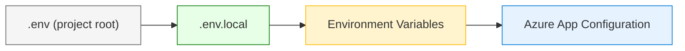

# Voice Configuration Guide

This guide covers all configuration for voice agents:

- [App Configuration](#azure-app-configuration) — Centralized config management
- [Local Overrides](#local-overrides) — `.env.local` and `.env` files
- [Agent YAML](#agent-yaml-structure) — Voice, model, greeting settings
- [Mode-Specific Config](#mode-specific-configuration) — Cascade vs VoiceLive

!!! tip "Looking for a specific config?"
    See the **[Complete Config Reference](config-reference.md)** for all 60+ environment variables with descriptions and defaults.

---

## Configuration Loading Order

The system loads configuration in this order (later sources override earlier):



| Source | Priority | Use Case |
|--------|----------|----------|
| `.env` | Lowest | Project defaults |
| `.env.local` | Medium | **Local development overrides** |
| Environment variables | High | Container/cloud deployments |
| Azure App Configuration | Highest | Centralized enterprise config |

!!! tip "Local Override Rule"
    Keys defined in `.env.local` are **never overwritten** by Azure App Configuration. This lets you test locally with different values while the team shares a central config.

---

## Azure App Configuration

For enterprise deployments, use [Azure App Configuration](https://learn.microsoft.com/azure/azure-app-configuration/) to centralize settings across environments.

### Setup

```bash
# Enable App Configuration
export AZURE_APPCONFIG_ENDPOINT="https://your-config.azconfig.io"
export AZURE_APPCONFIG_LABEL="dev"  # or "staging", "prod"
```

### Key Mapping

App Configuration uses hierarchical keys that map to environment variables:

| App Config Key | Environment Variable |
|----------------|---------------------|
| `azure/openai/endpoint` | `AZURE_OPENAI_ENDPOINT` |
| `azure/openai/deployment-id` | `AZURE_OPENAI_CHAT_DEPLOYMENT_ID` |
| `azure/speech/endpoint` | `AZURE_SPEECH_ENDPOINT` |
| `azure/speech/region` | `AZURE_SPEECH_REGION` |
| `azure/acs/endpoint` | `ACS_ENDPOINT` |
| `azure/voicelive/endpoint` | `AZURE_VOICELIVE_ENDPOINT` |
| `azure/voicelive/model` | `AZURE_VOICELIVE_MODEL` |
| `app/pools/tts-size` | `POOL_SIZE_TTS` |
| `app/pools/stt-size` | `POOL_SIZE_STT` |
| `app/voice/default-tts-voice` | `DEFAULT_TTS_VOICE` |

See [appconfig_provider.py](https://github.com/Azure-Samples/art-voice-agent-accelerator/blob/main/apps/artagent/backend/config/appconfig_provider.py) for the complete mapping.

### Feature Flags

App Configuration supports feature flags for toggles:

| Feature Flag | Environment Variable | Default |
|--------------|---------------------|---------|
| `warm-pool` | `WARM_POOL_ENABLED` | `true` |
| `dtmf-validation` | `DTMF_VALIDATION_ENABLED` | `false` |
| `auth-validation` | `ENABLE_AUTH_VALIDATION` | `false` |
| `call-recording` | `ENABLE_ACS_CALL_RECORDING` | `false` |
| `tracing` | `ENABLE_TRACING` | `true` |

### Upload Your Own Config

1. **Create resource**: Azure Portal → App Configuration → Create
2. **Add keys**: Configuration explorer → Create → Key-value
3. **Use labels**: Set label to environment name (`dev`, `staging`, `prod`)
4. **Connect app**: Set `AZURE_APPCONFIG_ENDPOINT` in your deployment

**Example: Adding a custom key**

```bash
# Azure CLI
az appconfig kv set \
  --name your-config \
  --key "azure/openai/endpoint" \
  --value "https://my-openai.openai.azure.com/" \
  --label "dev"
```

---

## Local Overrides

For local development, create `.env.local` to override any setting:

### File Locations (searched in order)

1. `apps/artagent/backend/.env.local` — App-specific
2. `<project-root>/.env.local` — Project-wide
3. `<project-root>/.env` — Default fallback

### Example `.env.local`

```bash
# apps/artagent/backend/.env.local

# Override Azure OpenAI for local testing
AZURE_OPENAI_ENDPOINT=https://my-dev-openai.openai.azure.com/
AZURE_OPENAI_CHAT_DEPLOYMENT_ID=gpt-4o-mini

# Use local Redis instead of Azure
REDIS_HOST=localhost
REDIS_PORT=6379

# Disable features for faster iteration
WARM_POOL_ENABLED=false
ENABLE_TRACING=false

# Override voice settings
DEFAULT_TTS_VOICE=en-US-AriaNeural
```

### Override Behavior with App Config

When Azure App Configuration is enabled:

| Scenario | What Happens |
|----------|--------------|
| Key in `.env.local` + App Config | **`.env.local` wins** |
| Key only in App Config | App Config value used |
| Key only in `.env.local` | `.env.local` value used |
| Key in neither | Uses code default |

This allows you to:

- Test with different models locally
- Use local Redis/Cosmos emulators
- Disable expensive features during development
- Keep secrets out of App Config during testing

---

## Environment Variables Reference

### Core Azure Services

```bash
# Azure OpenAI
AZURE_OPENAI_ENDPOINT=https://xxx.openai.azure.com/
AZURE_OPENAI_CHAT_DEPLOYMENT_ID=gpt-4o
AZURE_OPENAI_API_VERSION=2024-02-01
DEFAULT_TEMPERATURE=0.7
DEFAULT_MAX_TOKENS=500

# Azure Speech
AZURE_SPEECH_ENDPOINT=https://xxx.cognitiveservices.azure.com/
AZURE_SPEECH_REGION=eastus
AZURE_SPEECH_RESOURCE_ID=/subscriptions/.../speechServices/xxx

# Azure VoiceLive
AZURE_VOICELIVE_ENDPOINT=https://xxx.cognitiveservices.azure.com/
AZURE_VOICELIVE_MODEL=gpt-4o-realtime

# Azure Communication Services
ACS_ENDPOINT=https://xxx.communication.azure.com
ACS_CONNECTION_STRING=endpoint=https://...
ACS_SOURCE_PHONE_NUMBER=+1234567890
ACS_STREAMING_MODE=media  # or "voice_live"
```

### Voice Settings

```bash
# TTS defaults (fallback when agent config missing)
DEFAULT_TTS_VOICE=en-US-AriaNeural
DEFAULT_VOICE_STYLE=chat
DEFAULT_VOICE_RATE=+0%

# Audio processing
TTS_SAMPLE_RATE_ACS=16000
TTS_SAMPLE_RATE_UI=48000
SILENCE_DURATION_MS=1300
RECOGNIZED_LANGUAGE=en-US,es-ES,fr-FR
```

### Pool & Performance

```bash
# Connection pools
POOL_SIZE_TTS=50
POOL_SIZE_STT=50
MAX_WEBSOCKET_CONNECTIONS=200

# Warm pools (pre-initialized for low latency)
WARM_POOL_ENABLED=true
WARM_POOL_TTS_SIZE=3
WARM_POOL_STT_SIZE=2

# Sessions
SESSION_TTL_SECONDS=1800
MAX_CONCURRENT_SESSIONS=1000
```

---

## Agent YAML Structure

Every voice agent is defined in a YAML file under `registries/agentstore/agents/`:

```yaml
# registries/agentstore/agents/my_agent.yaml

# ═══════════════════════════════════════════════════════════════════════
# IDENTITY
# ═══════════════════════════════════════════════════════════════════════
name: MyAgent                    # Unique identifier (PascalCase)
display_name: "My Assistant"     # Shown in UI
description: "Handles customer inquiries"

# ═══════════════════════════════════════════════════════════════════════
# GREETINGS (Jinja2 templates)
# ═══════════════════════════════════════════════════════════════════════
greeting: |
  Hi {{ caller_name | default('there') }}, welcome to {{ institution_name | default('our service') }}.
  How can I help you today?

return_greeting: |
  Welcome back! Is there anything else I can help with?

# ═══════════════════════════════════════════════════════════════════════
# HANDOFF CONFIGURATION
# ═══════════════════════════════════════════════════════════════════════
handoff:
  trigger: handoff_my_agent      # Tool name that routes TO this agent
  is_entry_point: false          # true = can be the starting agent

# ═══════════════════════════════════════════════════════════════════════
# MODEL CONFIGURATION
# ═══════════════════════════════════════════════════════════════════════
model:
  deployment_id: gpt-4o          # Azure OpenAI deployment
  temperature: 0.7               # Creativity (0-1)
  max_tokens: 2048               # Max response length

# Mode-specific models (optional)
voicelive_model:
  deployment_id: gpt-realtime    # For VoiceLive mode
  temperature: 0.7

cascade_model:
  deployment_id: gpt-4o          # For Cascade mode
  temperature: 0.8

# ═══════════════════════════════════════════════════════════════════════
# VOICE CONFIGURATION (Azure TTS)
# ═══════════════════════════════════════════════════════════════════════
voice:
  name: en-US-AriaNeural         # Azure TTS voice
  rate: "-5%"                    # Speech rate (slower for clarity)
  style: chat                    # Voice style

# ═══════════════════════════════════════════════════════════════════════
# TOOLS (referenced by name from toolstore)
# ═══════════════════════════════════════════════════════════════════════
tools:
  - verify_client_identity
  - check_account_balance
  - handoff_concierge            # Handoff tools route to other agents
```

---

## Voice Settings Explained

Voice configuration differs between the two modes:

### Cascade Mode (Azure TTS Voices)

Cascade uses **Azure Neural Voices** — 400+ options with styles and fine-grained control:

```yaml
voice:
  name: en-US-AriaNeural         # Azure TTS voice
  rate: "-5%"                    # Speech rate adjustment
  style: chat                    # Emotional style
```

| Voice | Best For | Characteristics |
|-------|----------|-----------------|
| `en-US-AriaNeural` | General | Friendly, clear |
| `en-US-JennyNeural` | Professional | Formal, crisp |
| `en-US-GuyNeural` | Male voice | Warm, approachable |
| `en-US-SaraNeural` | Casual | Upbeat, young |

**Full list:** [Azure TTS Voice Gallery](https://learn.microsoft.com/en-us/azure/ai-services/speech-service/language-support?tabs=tts)

**Rate adjustment** (recommended for phone clarity):
```yaml
voice:
  rate: "-10%"   # 10% slower (best for telephony)
  rate: "0%"     # Normal speed
  rate: "+10%"   # 10% faster
```

**Emotional styles** (supported by some voices):
```yaml
voice:
  style: chat           # Conversational
  style: customerservice # Professional
  style: empathetic     # Supportive
  style: cheerful       # Upbeat
```

### VoiceLive Mode (Azure VoiceLive)

VoiceLive uses **Azure VoiceLive SDK** with Azure Neural Voices. See [VoiceLive customization docs](https://learn.microsoft.com/azure/ai-services/speech-service/voice-live-how-to-customize) for available voices and configuration options.

```yaml
voicelive_model:
  deployment_id: gpt-4o-realtime
  voice: alloy                   # Voice selection
```

> **Note:** VoiceLive voice configuration may differ from Cascade mode. Refer to the Azure VoiceLive documentation for current voice options and settings.

---

## Greeting Templates

Greetings use [Jinja2](https://jinja.palletsprojects.com/) templates with these variables:

| Variable | Source | Example |
|----------|--------|---------|
| `caller_name` | Auth tool result | "John" |
| `client_id` | Session profile | "12345" |
| `institution_name` | Scenario config | "Contoso Bank" |
| `previous_agent` | Handoff context | "Concierge" |
| `handoff_context.reason` | Handoff tool args | "fraud inquiry" |

### Example: Personalized Greeting

```yaml
greeting: |
  
  Hello {{ caller_name }}, I'm your personal banking assistant.
  
  Hello! I'm your personal banking assistant.
  
  How can I help you today?
```

### Example: Handoff-Aware Greeting

```yaml
greeting: |
  
  Thanks for being transferred. I understand you need help with {{ handoff_context.reason | default('your inquiry') }}.
  
  Welcome! I'm here to help with fraud-related concerns.
  
  What happened?
```

---

## Handoff Configuration

### Agent-Level Handoff

Define how other agents route TO this agent:

```yaml
# fraud_agent.yaml
handoff:
  trigger: handoff_fraud         # Tool name
  is_entry_point: false          # Can't be starting agent
```

### Scenario-Level Handoff

Define handoff behavior in scenario YAML:

```yaml
# registries/scenariostore/scenarios/banking.yaml
handoffs:
  - from_agent: Concierge
    to_agent: FraudAgent
    tool: handoff_fraud
    type: announced              # Play greeting on switch
    share_context: true          # Pass conversation history

  - from_agent: FraudAgent
    to_agent: Concierge
    tool: handoff_concierge
    type: discrete               # Silent switch (no greeting)
    share_context: false         # Fresh context
```

### Handoff Types

| Type | Greeting | Use When |
|------|----------|----------|
| `announced` | Yes | User should know they're being transferred |
| `discrete` | No | Seamless specialist routing |

---

## Mode-Specific Configuration

The agent YAML supports separate model configs for each mode. The system picks the right one at runtime.

### Cascade Mode

Uses separate Azure services: Speech SDK (STT) → Azure OpenAI (LLM) → Azure TTS

```yaml
# Primary model config (used by cascade if cascade_model not specified)
model:
  deployment_id: gpt-4o
  temperature: 0.7
  max_tokens: 2048

# Optional: cascade-specific override
cascade_model:
  deployment_id: gpt-4o-mini     # Use cheaper model for cascade
  temperature: 0.5               # More deterministic

# Azure TTS voice (only used by cascade)
voice:
  name: en-US-JennyNeural
  rate: "-5%"
  style: customerservice
```

### VoiceLive Mode

Uses Azure VoiceLive SDK — audio-in/audio-out over a single WebSocket:

```yaml
# Primary model config (fallback)
model:
  deployment_id: gpt-4o
  temperature: 0.7

# VoiceLive-specific config (required for realtime)
voicelive_model:
  deployment_id: gpt-4o-realtime # Must be a realtime deployment
  temperature: 0.7
  voice: alloy                   # Voice selection

# Note: voice: block (Azure TTS) may be IGNORED in VoiceLive mode
# See Azure VoiceLive docs for current voice configuration options
```

### Dual-Mode Agent Example

An agent that works in both modes:

```yaml
name: BankingConcierge
display_name: "Banking Assistant"

# Cascade uses these
cascade_model:
  deployment_id: gpt-4o
  temperature: 0.7
  max_tokens: 2048

voice:
  name: en-US-AriaNeural
  rate: "-5%"
  style: chat

# VoiceLive uses these
voicelive_model:
  deployment_id: gpt-4o-realtime
  temperature: 0.7
  voice: echo

# Shared
tools:
  - verify_client_identity
  - check_account_balance
```

---

## Complete Example: Fraud Agent

```yaml
# registries/agentstore/agents/fraud_agent.yaml

name: FraudAgent
display_name: "Fraud Specialist"
description: "Handles fraud detection and card security"

greeting: |
  
  Hi {{ caller_name }}, I'm a fraud specialist at {{ institution_name | default('your bank') }}.
  
  Hi, I'm a fraud specialist here to help.
  
  I understand you may have concerns about unauthorized activity. Can you tell me what happened?

return_greeting: |
  Welcome back. Let's continue looking into your fraud concern.

handoff:
  trigger: handoff_fraud
  is_entry_point: false

model:
  deployment_id: gpt-4o
  temperature: 0.3               # Low creativity for security topics
  max_tokens: 1024

voice:
  name: en-US-JennyNeural        # Professional voice
  rate: "-5%"
  style: empathetic              # Supportive tone

tools:
  - verify_client_identity
  - check_recent_transactions
  - block_card
  - report_fraud
  - handoff_concierge
```

---

## Validating Your Configuration

After creating/editing an agent YAML:

```bash
# 1. Check YAML syntax
python -c "import yaml; yaml.safe_load(open('registries/agentstore/agents/my_agent.yaml'))"

# 2. Run agent discovery to validate
python -c "from apps.artagent.backend.registries.agentstore.loader import discover_agents; print(discover_agents().keys())"

# 3. Test greeting rendering
python -c "
from apps.artagent.backend.registries.agentstore.loader import discover_agents
agents = discover_agents()
print(agents['MyAgent'].render_greeting({'caller_name': 'Test User'}))
"
```

---

## Programmatic Config Access

In code, always import from `config.settings` — never use `os.getenv()` directly:

```python
# ✅ Correct - uses settings module
from config.settings import (
    AZURE_OPENAI_ENDPOINT,
    AZURE_SPEECH_REGION,
    ACS_STREAMING_MODE,
)

# ❌ Wrong - bypasses config loading
import os
endpoint = os.getenv("AZURE_OPENAI_ENDPOINT")  # Don't do this
```

### Why?

The settings module:

1. Loads `.env.local` and `.env` files
2. Connects to Azure App Configuration
3. Applies key mappings and type conversions
4. Respects override priorities

### Checking Loaded Config

```python
# Debug: see what config was loaded
from config.settings import get_loaded_config
config = get_loaded_config()
print(config)
```

---

## See Also

- [Voice Architecture Overview](README.md) - How voice processing works
- [Voice Debugging Guide](debugging.md) - Troubleshooting issues
- [Agent Reference](../agents/reference/index.md) - All available agents
