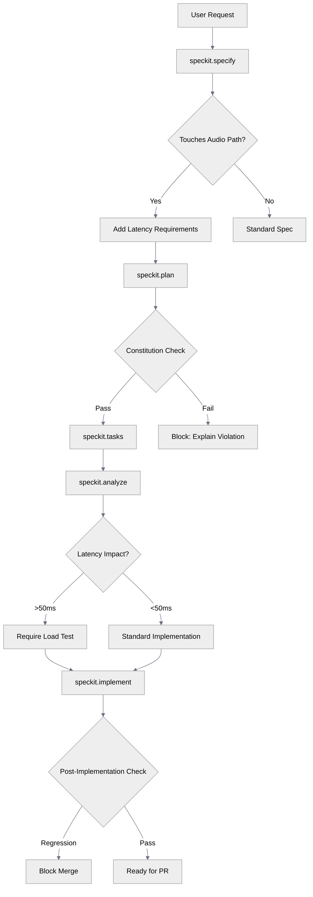
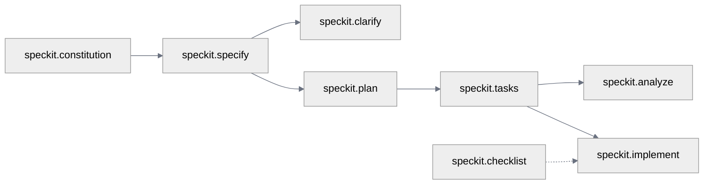

# Specify Integration Proposal for ARTVoice Agent Accelerator

**Author**: Jin Lee  
**Date**: 2025-12-10  
**Status**: Proposal  

---

## Executive Summary

This document proposes integrating the **Spec-Driven Development (SDD)** methodology from `art-specify` into the `art-voice-agent-accelerator` repository. The integration includes the AGENTS.md open standard for AI coding agents, a project-specific constitution, and a complete workflow for feature specification, planning, and implementation.

---

## Table of Contents

1. [Vision: Natural Language Adoption](#vision-natural-language-adoption)
2. [Key Use Cases](#key-use-cases)
3. [Protecting the Low-Latency Pipeline](#protecting-the-low-latency-pipeline)
4. [Proposed Directory Structure](#proposed-directory-structure)
5. [AGENTS.md Integration](#agentsmd-integration)
6. [Constitution Design](#constitution-design)
7. [Speckit Agents for ARTVoice](#speckit-agents-for-artvoice)
8. [Workflow Integration](#workflow-integration)
9. [Migration Strategy](#migration-strategy)

---

## Vision: Natural Language Adoption

The primary goal of integrating Speckit into ARTVoice is to **enable users to adopt, customize, and extend the codebase through natural language** while ensuring the integrity of the low-latency audio pipeline is never compromised.

### The Challenge

ARTVoice is a sophisticated real-time voice framework with:
- Complex async patterns that are easy to break
- Latency-critical paths where small changes have big impacts
- Multiple Azure service integrations with specific patterns
- Observability requirements that must be maintained

Users who want to customize the framework often struggle with:
- Understanding which files to modify for their use case
- Maintaining async patterns and avoiding blocking I/O
- Preserving OpenTelemetry instrumentation
- Writing tests that properly mock Azure services

### The Solution

Speckit provides a **structured natural language interface** where users describe what they want, and AI agents:
1. Generate specifications that capture requirements correctly
2. Create implementation plans that respect architectural constraints
3. Produce task breakdowns with proper file paths and patterns
4. Implement changes while enforcing constitution principles
5. Generate tests following project conventions
6. Update documentation automatically

**Example**: Instead of reading 50+ files to understand how to add a new tool:

```
User: /speckit.specify "Add a weather lookup tool that agents can use during conversations"

→ Speckit generates spec with latency requirements, async patterns, test requirements
→ Speckit generates plan with proper file locations, registry updates, protocol patterns
→ Speckit generates tasks with specific implementation steps
→ Speckit implements with constitution compliance checks
→ Speckit generates tests using Protocol mocks
→ Speckit updates docs with new tool documentation
```

---

## Key Use Cases

### 1. Automated Documentation Generation

**Problem**: Documentation drifts from code. New features lack docs. API changes aren't reflected.

**Speckit Solution**:

| Trigger | Action | Output |
|---------|--------|--------|
| `/speckit.specify` completes | Extract user stories, requirements | `spec.md` serves as living documentation |
| `/speckit.plan` completes | Document architecture decisions | `plan.md`, `research.md` capture rationale |
| `/speckit.implement` completes | Generate API docs, update README | Auto-generated docstrings, usage examples |
| New tool added | Document tool schema | Update `docs/api/tools.md` with tool signature |
| New agent added | Document agent capabilities | Update `docs/agents/` with agent documentation |

**Custom Agent: `speckit.document`** (proposed addition)

```markdown
## speckit.document Agent

Trigger: After implementation or on-demand
Actions:
1. Scan modified files for docstring completeness
2. Generate/update API documentation from Pydantic models
3. Update README feature list
4. Generate usage examples from test cases
5. Update architecture diagrams if structure changed
```

**Example Workflow**:
```
/speckit.document "Generate docs for the new weather tool"

→ Reads src/tools/weather_tool.py
→ Extracts Pydantic schemas, function signatures
→ Generates docs/api/tools/weather.md
→ Updates docs/api/tools/index.md with new entry
→ Adds usage example from tests/test_weather_tool.py
```

---

### 2. Consistent Test Automation

**Problem**: Tests are inconsistent. Mocking patterns vary. Coverage gaps exist.

**Speckit Solution**:

#### Test Generation Patterns (Constitution-Enforced)

| Component Type | Test Pattern | Mock Strategy |
|----------------|--------------|---------------|
| Tool implementation | Unit test + integration | Protocol-based mock |
| ACS event handler | Event simulation test | Fake ACS client |
| WebSocket handler | Async test with mock WS | `AsyncMock` patterns |
| Speech operations | Latency-aware test | Timed mock responses |
| Redis operations | State verification test | `fakeredis` or Protocol |

#### Integration with `/speckit.tasks`

When generating tasks, Speckit automatically includes test tasks:

```markdown
## Phase 2: Weather Tool Implementation

- [ ] T005 [P] [US1] Create WeatherTool class in src/tools/weather_tool.py
- [ ] T006 [P] [US1] Create WeatherToolProtocol in src/tools/protocols.py
- [ ] T007 [US1] Write unit tests in tests/test_weather_tool.py
  - Test successful weather lookup
  - Test API timeout handling (must complete < 100ms mock)
  - Test invalid location error
  - Test PII filtering in weather responses
- [ ] T008 [US1] Write integration test with mock agent in tests/test_weather_integration.py
```

#### Test Template Enforcement

The constitution mandates test patterns. Speckit generates tests that comply:

```python
# Generated test follows project patterns
import pytest
from unittest.mock import AsyncMock
from src.tools.weather_tool import WeatherTool
from src.tools.protocols import WeatherServiceProtocol

class FakeWeatherService:
    """Protocol-compliant fake for testing."""
    async def get_weather(self, location: str) -> dict:
        return {"temp": 72, "conditions": "sunny"}

@pytest.fixture
def weather_tool():
    return WeatherTool(weather_service=FakeWeatherService())

@pytest.mark.asyncio
async def test_weather_lookup_success(weather_tool):
    result = await weather_tool.execute({"location": "Seattle"})
    assert result["temp"] == 72
    # Verify no blocking calls (constitution compliance)
```

---

### 3. Natural Language Customization Scenarios

#### Scenario A: "I want to add a new tool"

```
User: /speckit.specify "Add a CRM lookup tool that retrieves customer info by phone number"
```

Speckit automatically:
- Identifies this is a tool implementation (not ACS, not speech)
- Generates spec with tool schema requirements
- References existing tools as patterns (`src/tools/`)
- Includes registry update tasks (`tool_registry.py`)
- Adds latency requirements (tool calls have 2s budget)
- Generates Pydantic input/output models
- Creates Protocol for dependency injection
- Generates tests with mock CRM service

#### Scenario B: "I want to customize the voice pipeline"

```
User: /speckit.specify "Add noise cancellation before STT processing"
```

Speckit automatically:
- Flags this as **high-risk** (modifies audio pipeline)
- Generates spec with explicit latency budget (must add < 50ms)
- Requires load test task before merge
- References VAD patterns in `src/vad/`
- Includes rollback plan in spec
- Mandates feature flag for gradual rollout
- Adds performance regression test

#### Scenario C: "I want to add a new agent type"

```
User: /speckit.specify "Add a specialized billing agent that handles payment inquiries"
```

Speckit automatically:
- References existing agent patterns (`apps/artagent/backend/src/agents/`)
- Generates YAML agent definition task
- Includes handoff registration tasks
- Generates prompt template
- Adds tool assignments
- Creates agent-specific tests
- Updates agent documentation

#### Scenario D: "I want to deploy to my own Azure subscription"

```
User: /speckit.specify "Customize infrastructure for single-region deployment with existing Redis"
```

Speckit automatically:
- Scopes to `infra/` directory
- References Bicep/Terraform patterns
- Generates parameter customization plan
- Preserves required Azure service dependencies
- Documents deployment steps in spec

---

### 4. Onboarding Acceleration

**Problem**: New contributors take weeks to understand the codebase.

**Speckit Solution**: Structured discovery through natural language.

| Onboarding Question | Speckit Command | Output |
|---------------------|-----------------|--------|
| "How do I add a feature?" | `/speckit.specify` | Guided spec creation with project patterns |
| "What are the project rules?" | `/speckit.constitution` | Interactive constitution review |
| "Where does X code live?" | `/speckit.analyze` | Codebase analysis with file mapping |
| "How do I test my changes?" | `/speckit.checklist "testing"` | Testing checklist with project patterns |

**Onboarding Workflow** (proposed):

```
Day 1: 
  /speckit.constitution → Understand project principles
  
Day 2:
  /speckit.specify "Add hello world tool" → First feature (guided)
  
Day 3:
  /speckit.plan → Understand planning phase
  /speckit.tasks → See task breakdown
  
Day 4:
  /speckit.implement → Execute with guardrails
  /speckit.checklist "code review" → Pre-PR validation
```

---

### 5. Architecture Decision Records (ADR) Automation

**Problem**: Architecture decisions are made in Slack/meetings, never documented.

**Speckit Solution**: `research.md` and `plan.md` capture decisions automatically.

```
/speckit.plan "I need to choose between Azure Speech SDK and Whisper for STT"
```

Generates `research.md`:
```markdown
# Research: STT Provider Selection

## Decision: Azure Speech SDK

## Rationale:
- Native Azure integration (reduced latency)
- Real-time streaming support
- Enterprise SLA compliance
- Existing team expertise

## Alternatives Considered:

### Whisper (OpenAI)
- Pros: Higher accuracy for some accents
- Cons: Higher latency, separate API call, no streaming

### Google Speech-to-Text
- Pros: Competitive accuracy
- Cons: Cross-cloud latency, additional credentials

## Constitution Compliance:
✅ Real-Time First: Azure Speech SDK has <100ms streaming latency
✅ Modular Separation: Abstracted via SpeechProtocol
```

---

## Protecting the Low-Latency Pipeline

The **most critical** aspect of this integration is ensuring that natural language customization **never breaks the real-time voice pipeline**.

### Constitution as Guardrail

The constitution isn't just documentation—it's **actively enforced** during Speckit workflows:



### Automatic Latency Budget Enforcement

When Speckit detects changes to latency-sensitive paths:

| Path Pattern | Automatic Requirement |
|--------------|----------------------|
| `src/speech/*` | Latency budget in spec, load test task |
| `src/vad/*` | <10ms per-frame budget, memory allocation review |
| `src/acs/*` | WebSocket latency test, connection pool review |
| `apps/*/handlers/*` | Async compliance check, timeout verification |

### Pipeline Protection Checklist

Auto-generated for any feature touching audio paths:

```markdown
## Pipeline Protection Checklist (Auto-Generated)

### Pre-Implementation
- [ ] CHK001 Latency budget defined (target + maximum)
- [ ] CHK002 No synchronous I/O in audio path
- [ ] CHK003 Memory allocation strategy documented
- [ ] CHK004 Rollback plan defined

### Implementation
- [ ] CHK005 All new functions are `async`
- [ ] CHK006 Explicit timeouts on all `await` calls
- [ ] CHK007 No spans created per audio frame
- [ ] CHK008 PII filtering applied before logging

### Validation
- [ ] CHK009 Unit tests pass
- [ ] CHK010 Load test shows no regression (p99 < baseline + budget)
- [ ] CHK011 Memory profile shows no leaks
- [ ] CHK012 Tracing shows proper span hierarchy
```

### Blocked Patterns

Speckit actively blocks known anti-patterns:

| Pattern | Detection | Action |
|---------|-----------|--------|
| `time.sleep()` in async code | Static analysis in `/speckit.implement` | Block with explanation |
| Span per audio chunk | Pattern match in trace setup | Block with alternative |
| Synchronous HTTP client | Import detection | Block, suggest `aiohttp` |
| Global singleton state | Pattern match | Block, suggest DI |
| Missing timeout on await | AST analysis | Warning, require justification |

### Emergency Escape Hatch

For cases where constitution rules must be bent:

```markdown
## Constitution Override Request

**Principle**: Real-Time First
**Requested Exception**: Allow 100ms additional latency for enhanced noise cancellation

**Justification**:
- Customer requirement for industrial environment
- 100ms latency acceptable for this use case
- Feature-flagged, not default behavior

**Mitigation**:
- Configuration-driven latency budget
- Monitoring alert at 80% of budget
- Automatic fallback to standard path if exceeded

**Approval**: [Required reviewer sign-off]
```

---

## Proposed Directory Structure

```
art-voice-agent-accelerator/
├── AGENTS.md                          # Root-level AGENTS.md (open standard)
├── .github/
│   ├── copilot-instructions.md        # (existing) Keep for IDE-specific guidance
│   └── agents/                         # GitHub Copilot Chat Mode agents
│       ├── speckit.analyze.agent.md
│       ├── speckit.checklist.agent.md
│       ├── speckit.clarify.agent.md
│       ├── speckit.constitution.agent.md
│       ├── speckit.implement.agent.md
│       ├── speckit.plan.agent.md
│       ├── speckit.specify.agent.md
│       ├── speckit.tasks.agent.md
│       └── speckit.taskstoissues.agent.md
├── .specify/
│   ├── memory/
│   │   └── constitution.md            # Project-specific constitution
│   ├── scripts/
│   │   ├── bash/
│   │   │   ├── check-prerequisites.sh
│   │   │   ├── common.sh
│   │   │   ├── create-new-feature.sh
│   │   │   ├── setup-plan.sh
│   │   │   └── update-agent-context.sh
│   │   └── powershell/                 # Optional Windows support
│   │       └── ...
│   └── templates/
│       ├── agent-file-template.md
│       ├── checklist-template.md
│       ├── plan-template.md
│       ├── spec-template.md
│       └── tasks-template.md
├── specs/                              # Feature specifications (git branch-based)
│   └── {N}-{feature-short-name}/       # e.g., 1-add-barge-in-detection/
│       ├── spec.md                     # Feature specification
│       ├── plan.md                     # Implementation plan
│       ├── tasks.md                    # Task breakdown
│       ├── research.md                 # Research notes (optional)
│       ├── data-model.md               # Data model (if applicable)
│       ├── contracts/                  # API contracts (OpenAPI, etc.)
│       ├── checklists/                 # Generated checklists
│       │   ├── ux.md
│       │   ├── security.md
│       │   └── api.md
│       └── quickstart.md               # Integration scenarios
├── apps/
├── src/
├── tests/
├── docs/
│   └── agents/                         # (existing) Agent documentation
└── ...
```

### Relationship to Existing Structure

| Existing Path | Integration Approach |
|---------------|---------------------|
| `.github/copilot-instructions.md` | **Keep** - IDE-specific developer guidance |
| `docs/agents/` | **Keep** - Runtime agent architecture documentation |
| `CONTRIBUTING.md` | **Update** - Reference SDD workflow |

---

## AGENTS.md Integration

The root-level `AGENTS.md` follows the [agents.md open standard](https://agents.md/) - a simple, open format used by 60k+ open-source projects for guiding AI coding agents.

### Proposed AGENTS.md Content

```markdown
# AGENTS.md

This file provides context and instructions for AI coding agents working on the ARTVoice Agent Accelerator.

## Project Overview

ARTVoice Accelerator is a real-time voice agent framework built on Azure:
- **Language**: Python 3.11+
- **Framework**: FastAPI + WebSockets
- **Cloud**: Azure Communication Services, Azure Speech, Azure OpenAI
- **Pattern**: Low-latency, real-time voice processing

## Dev Environment Setup

```bash
# Install dependencies
pip install -e ".[dev]"

# Run tests
pytest tests/ -v

# Start local server
make serve

# Run linting
make lint
```

## Build & Test Commands

- **Install**: `pip install -e ".[dev]"` or `make install-dev`
- **Test**: `pytest tests/ -v` or `make test`
- **Lint**: `ruff check . && mypy src/` or `make lint`
- **Format**: `ruff format .` or `make format`
- **Serve**: `uvicorn apps.artagent.backend.main:app --reload` or `make serve`

## Code Style Guidelines

### Python Conventions
- Use `pydantic.BaseModel` for all request/response definitions
- Define all HTTP/WebSocket handlers as `async` functions
- Use FastAPI `Depends` for dependency injection
- Store secrets in environment variables or `.env` files
- Output logs in JSON format with correlation IDs

### Async Patterns
- Use explicit timeouts on all `await` statements
- Never block the event loop
- Use `asyncio.create_task` for background tasks
- Manage task lifecycles appropriately

### OpenTelemetry Instrumentation
- Set `service.name` and `service.instance.id` on TracerProvider
- Use `SERVER` spans for inbound handlers, `CLIENT` for outbound requests
- **Never** create spans per audio chunk
- Use W3C `traceparent` for context propagation

## Testing Instructions

- Tests live in `tests/` directory
- Use `conftest.py` fixtures for common test setup
- Mock Redis, Speech, and Azure OpenAI via Protocols
- Integration tests require `.env.sample` configuration

```bash
# Run all tests
pytest tests/ -v

# Run specific test file
pytest tests/test_acs_events_handlers.py -v

# Run with coverage
pytest tests/ --cov=src --cov-report=term-missing
```

## Architecture Overview

```
src/
├── acs/          # Azure Communication Services integration
├── aoai/         # Azure OpenAI integration  
├── speech/       # Speech-to-Text / Text-to-Speech
├── vad/          # Voice Activity Detection
├── redis/        # Session state management
├── cosmosdb/     # Persistent storage
├── tools/        # Agent tool implementations
├── prompts/      # Prompt templates
└── stateful/     # Stateful conversation management
```

## Spec-Driven Development

This project uses Spec-Driven Development (SDD). See `.specify/memory/constitution.md` for project principles.

### Workflow Commands (GitHub Copilot)
- `/speckit.specify` - Create feature specification
- `/speckit.plan` - Generate implementation plan  
- `/speckit.tasks` - Break down into executable tasks
- `/speckit.implement` - Execute implementation

### Feature Specs Location
Feature specifications live in `specs/{N}-{feature-name}/`:
- `spec.md` - Requirements and user stories
- `plan.md` - Technical implementation plan
- `tasks.md` - Granular task breakdown

## Strictly Prohibited

- ❌ Creating spans per audio frame/chunk
- ❌ Using global singletons
- ❌ Manually adding `service.name` or `span.kind` to spans
- ❌ Storing clients on `Request` or `WebSocket` objects
- ❌ Blocking I/O in async handlers

## Monorepo Structure

For subproject-specific guidance:
- `apps/artagent/` - Main application (nested AGENTS.md optional)
- `samples/` - Usage examples and labs
- `infra/` - Infrastructure as Code (Bicep/Terraform)

## PR Guidelines

- Title format: `[component] Brief description`
- Run `make lint && make test` before committing
- Include test coverage for new features
- Reference feature spec in PR description when applicable
```

### Nested AGENTS.md Files (Optional)

For complex subprojects, add nested `AGENTS.md` files:

```
apps/artagent/AGENTS.md          # App-specific agent guidance
samples/AGENTS.md                # Sample-specific patterns
infra/AGENTS.md                  # IaC-specific instructions
```

---

## Constitution Design

The constitution defines non-negotiable principles for the ARTVoice project. It extends the generic template with domain-specific rules.

### Proposed Constitution Location

`.specify/memory/constitution.md`

### Proposed Constitution Content

```markdown
# ARTVoice Agent Accelerator Constitution

## Core Principles

### I. Real-Time First

All features must preserve the low-latency (<500ms end-to-end) voice processing pipeline. Performance regressions are blocking issues:
- Latency budgets must be documented for new components
- No synchronous I/O in the audio processing path
- Memory allocations in hot paths require justification
- New dependencies must be evaluated for async compatibility

### II. Async-Native Architecture

All code must be fully asynchronous:
- All HTTP and WebSocket handlers are `async` functions
- Use `await` with explicit timeouts for all I/O operations
- Background tasks use `asyncio.create_task` with proper lifecycle management
- No blocking calls (`time.sleep`, synchronous HTTP clients) in async context
- Use Protocols for dependency injection to enable async mocking in tests

### III. Modular Separation

Clear boundaries between infrastructure, backend logic, and AI/voice layers:
- ACS (Azure Communication Services) layer handles telephony only
- Speech layer handles STT/TTS without business logic
- Agent layer contains conversation/orchestration logic
- Storage layer (Redis, CosmosDB) is abstracted via repository pattern
- No layer may directly depend on another's implementation details

### IV. Observable by Default

All production code must be instrumented for observability:
- OpenTelemetry traces for all requests with proper span hierarchy
- Structured JSON logging with correlation IDs (`callConnectionId`, `sessionId`)
- Metrics for latency, throughput, and error rates
- Health endpoints for all services
- No spans per audio frame (performance requirement)

### V. Test-First for Core Components

Critical path code requires tests before merge:
- Unit tests for all tool implementations
- Integration tests for ACS event handlers
- Mock-based tests for Azure service dependencies
- Load tests for latency-sensitive paths (use `tests/load/`)

### VI. Security Posture

Voice applications require strict security controls:
- No secrets in code or logs (use environment variables)
- All external inputs validated via Pydantic models
- Correlation tokens are not secrets (treat `callConnectionId` appropriately)
- PII must be filtered before logging (use `utils/pii_filter.py`)
- Regular dependency vulnerability scanning

### VII. Incremental Delivery

Ship small, focused changes:
- Single responsibility per PR
- Feature flags for work-in-progress functionality
- Backward-compatible API changes when possible
- Breaking changes require explicit migration path documentation

## Technology Constraints

- **Language**: Python 3.11+ (async/await, type hints required)
- **Web Framework**: FastAPI with Pydantic v2
- **Azure Services**: ACS, Azure Speech, Azure OpenAI (configurable)
- **Storage**: Redis (session state), CosmosDB (persistent)
- **Observability**: OpenTelemetry, structured logging

## Governance

- Constitution supersedes all other practices
- Amendments require:
  1. Written proposal with rationale
  2. Impact assessment on existing code
  3. Migration plan if breaking
- All PRs must verify compliance with these principles

**Version**: 1.0.0 | **Ratified**: 2025-12-10 | **Last Amended**: 2025-12-10
```

---

## Speckit Agents for ARTVoice

The speckit agents from `art-specify` should be copied to `.github/agents/` with minimal modifications. Key adaptations:

### Agent Customization Points

| Agent | ARTVoice-Specific Adaptations |
|-------|------------------------------|
| `speckit.specify` | Add prompts for latency requirements, ACS integration points |
| `speckit.plan` | Include Azure service selection (ACS vs Voice Live API) |
| `speckit.tasks` | Add Python/FastAPI-specific task patterns |
| `speckit.implement` | Pre-configure Python ignore patterns, add make targets |
| `speckit.checklist` | Add real-time/voice-specific checklist domains |
| `speckit.constitution` | Reference `.specify/memory/constitution.md` path |

### Agent Handoff Flow



---

## Workflow Integration

### Feature Development Lifecycle

```
1. Create Feature Branch
   └── /speckit.specify "Add barge-in detection for voice interruption"
       ├── Generates: specs/1-barge-in-detection/spec.md
       └── Creates branch: 1-barge-in-detection

2. Clarify Requirements (Optional)
   └── /speckit.clarify
       └── Resolves ambiguities in spec.md

3. Technical Planning
   └── /speckit.plan "I am building with Python 3.11, FastAPI, Azure Speech SDK"
       ├── Generates: specs/1-barge-in-detection/plan.md
       ├── Generates: specs/1-barge-in-detection/research.md
       └── Generates: specs/1-barge-in-detection/data-model.md (if needed)

4. Task Breakdown
   └── /speckit.tasks
       └── Generates: specs/1-barge-in-detection/tasks.md

5. Pre-Implementation Validation
   └── /speckit.analyze
       └── Reports: inconsistencies, gaps, constitution violations

6. Generate Checklists (As Needed)
   └── /speckit.checklist "security review for voice data handling"
       └── Generates: specs/1-barge-in-detection/checklists/security.md

7. Implementation
   └── /speckit.implement
       └── Executes tasks.md sequentially with validation

8. Merge & Cleanup
   └── Standard PR workflow with spec reference
```

### Integration with Existing Practices

| Existing Practice | Integration Point |
|-------------------|-------------------|
| `Makefile` targets | Add `make spec`, `make plan`, `make tasks` shortcuts |
| `.pre-commit-config.yaml` | Add constitution compliance check (optional) |
| GitHub Actions | Add spec validation workflow (optional) |
| `CONTRIBUTING.md` | Document SDD workflow for contributors |

---

## Migration Strategy

### Phase 1: Foundation

1. **Create directory structure**
   ```bash
   mkdir -p .specify/memory .specify/scripts/bash .specify/templates specs
   mkdir -p .github/agents
   ```

2. **Copy core files from art-specify**
   - `.specify/memory/constitution.md` (customize for ARTVoice)
   - `.specify/scripts/bash/*`
   - `.specify/templates/*`
   - `.github/agents/*.md`

3. **Create root AGENTS.md**
   - Consolidate guidance from `.github/copilot-instructions.md`
   - Add build/test/dev commands
   - Reference constitution and SDD workflow

### Phase 2: Constitution Customization

1. **Adapt constitution** for real-time voice domain
2. **Validate** against existing `copilot-instructions.md`
3. **Update** agent templates with ARTVoice paths

### Phase 3: Pilot Feature

1. **Pick a small feature** (e.g., "add new tool for weather lookup")
2. **Run full SDD workflow** end-to-end
3. **Document learnings** and adjust templates

### Phase 4: Team Adoption

1. **Update CONTRIBUTING.md** with SDD workflow
2. **Add Makefile shortcuts** for common commands
3. **Train team** on speckit agent usage

---

## File Templates

### spec-template.md (ARTVoice-specific additions)

Add these sections to the standard spec template:

```markdown
## Latency Requirements

<!-- Define latency budgets for this feature -->
| Stage | Target | Maximum |
|-------|--------|---------|
| End-to-end | | |
| STT | | |
| LLM | | |
| TTS | | |

## Azure Service Integration

<!-- Which Azure services does this feature use? -->
- [ ] Azure Communication Services
- [ ] Azure Speech (STT)
- [ ] Azure Speech (TTS)
- [ ] Azure OpenAI
- [ ] Azure Voice Live API
- [ ] Azure AI Foundry Agents

## Real-Time Considerations

<!-- Any special handling for real-time voice? -->
- Barge-in behavior:
- Audio buffering requirements:
- Failure recovery approach:
```

### plan-template.md (ARTVoice-specific additions)

```markdown
## Voice Pipeline Impact

<!-- How does this feature affect the voice processing pipeline? -->
- [ ] Modifies STT path
- [ ] Modifies LLM path  
- [ ] Modifies TTS path
- [ ] Adds new async operation to audio loop
- [ ] Requires new WebSocket handler

## Performance Considerations

<!-- Document expected latency impact -->
```

---

## Success Criteria

The integration is successful when:

### Adoption Metrics
1. ✅ New features start with `/speckit.specify` (>80% of features)
2. ✅ Time-to-first-contribution for new developers reduced by 50%
3. ✅ Documentation coverage increases to >90% of public APIs

### Quality Metrics
4. ✅ Implementation tasks are traceable to spec requirements
5. ✅ Constitution principles are enforced in PR reviews (0 violations merged)
6. ✅ Test coverage for new features >80%
7. ✅ No latency regressions from Speckit-generated code

### Developer Experience Metrics
8. ✅ AGENTS.md provides useful context for AI coding agents (measured by reduced clarification questions)
9. ✅ Natural language customization successfully adds tools, agents, and features
10. ✅ Team velocity improves through clearer specifications

### Pipeline Integrity Metrics
11. ✅ Zero blocking I/O introduced in audio paths
12. ✅ p99 latency remains within baseline + documented budget
13. ✅ All Speckit-generated code passes constitution compliance checks

---

## Proposed Custom Agents for ARTVoice

Beyond the standard Speckit agents, ARTVoice would benefit from domain-specific agents:

### speckit.tool (New)

Generate new agent tools with proper patterns:

```markdown
---
description: Generate a new tool for voice agents following ARTVoice patterns
---

## Workflow:
1. Gather tool purpose, inputs, outputs
2. Generate Pydantic schemas in src/tools/schemas/
3. Generate Protocol in src/tools/protocols.py
4. Generate tool implementation in src/tools/
5. Update tool registry
6. Generate unit tests with Protocol mocks
7. Update tool documentation
```

### speckit.latency (New)

Analyze and report latency impact of changes:

```markdown
---
description: Analyze latency impact of current feature branch
---

## Workflow:
1. Identify modified files in audio path
2. Calculate theoretical latency impact
3. Run targeted load tests
4. Generate latency impact report
5. Flag violations of constitution latency budgets
```

### speckit.migrate (New)

Help users migrate from older versions or customize existing components:

```markdown
---
description: Guide migration or customization of ARTVoice components
---

## Workflow:
1. Identify target component for migration/customization
2. Document current state and dependencies
3. Generate migration plan with rollback
4. Create feature-flagged implementation path
5. Generate validation tests
```

---

## Open Questions

1. **Spec directory naming**: Use `specs/` or `features/` or `.specify/specs/`?
2. **Constitution ownership**: Who approves amendments and emergency overrides?
3. **AGENTS.md depth**: How detailed should subproject AGENTS.md files be?
4. **CI integration**: Should specs be validated in GitHub Actions? Should constitution checks block PRs?
5. **Latency testing automation**: Should `/speckit.latency` run automatically on PRs touching audio paths?
6. **Documentation generation**: Should `/speckit.document` run post-merge to keep docs in sync?
7. **Custom agent priority**: Which custom agents (tool, latency, migrate) should be built first?
8. **Metrics collection**: How do we measure adoption and success criteria?

---

## References

- [AGENTS.md Open Standard](https://agents.md/)
- [OpenAI Codex AGENTS.md](https://github.com/openai/codex/blob/main/AGENTS.md) - Reference implementation with nested directory patterns
- [Codex AGENTS.md Discovery](https://github.com/openai/codex/blob/main/docs/agents_md.md) - Multi-level discovery patterns
- [Spec Kit Documentation](https://github.com/spec-kit/spec-kit)
- [ARTVoice Architecture Docs](../architecture/)
- [GitHub Copilot Chat Modes](https://docs.github.com/en/copilot)
- [OpenTelemetry Python](https://opentelemetry.io/docs/instrumentation/python/)
- [FastAPI Best Practices](https://fastapi.tiangolo.com/advanced/)

---

## Appendix A: Patterns from OpenAI Codex AGENTS.md

The OpenAI Codex project provides an excellent reference implementation of AGENTS.md. Key patterns to adopt:

### Nested AGENTS.md Discovery

Codex supports a hierarchical AGENTS.md structure where:
1. Global `~/.codex/AGENTS.md` provides personal preferences
2. Repository root `AGENTS.md` provides project-wide guidance
3. Subdirectory `AGENTS.md` files provide component-specific instructions
4. `AGENTS.override.md` takes precedence when local overrides are needed

**Proposed ARTVoice Structure:**
```
~/.codex/AGENTS.md           # Personal global (optional)
art-voice-agent-accelerator/
├── AGENTS.md                 # Project-wide (mandatory)
├── src/
│   ├── AGENTS.md             # Source code patterns
│   ├── speech/AGENTS.md      # Speech-specific rules
│   └── vad/AGENTS.md         # VAD-specific rules (latency-critical)
├── apps/artagent/
│   └── AGENTS.md             # Application-specific
├── infra/
│   └── AGENTS.md             # IaC patterns
└── tests/
    └── AGENTS.md             # Testing conventions
```

### Validation Work Patterns

From Codex prompt.md:
> "If the codebase has tests or the ability to build or run, consider using them to verify changes once your work is complete. When testing, your philosophy should be to start as specific as possible to the code you changed so that you can catch issues efficiently, then make your way to broader tests as you build confidence."

**ARTVoice Adaptation:**
```markdown
## Validating Your Work

1. Run specific test for changed code: `pytest tests/test_<module>.py -v`
2. Run related module tests: `pytest tests/test_<related>*.py -v`
3. Run full suite only after specific tests pass: `make test`
4. For latency-sensitive changes, run load tests: `pytest tests/load/ -v`
5. Run linting before finalizing: `make lint`
```

### Test Assertions Pattern

From Codex AGENTS.md:
> "Tests should use pretty_assertions::assert_eq for clearer diffs... Prefer deep equals comparisons whenever possible. Perform assert on entire objects, rather than individual fields."

**ARTVoice Adaptation:**
```markdown
## Test Assertions

- Use `pytest-diff` or similar for clearer test diffs
- Prefer comparing entire Pydantic model instances over individual fields
- Use snapshot testing for complex response structures
- Always assert the complete expected state, not just presence of fields
```

### Proactive Formatting

From Codex:
> "Run `just fmt` automatically after making code changes; do not ask for approval to run it."

**ARTVoice Adaptation:**
```markdown
## Auto-Format Without Approval

- Run `ruff format .` after any code changes (no approval needed)
- Run `make lint` to verify before finalizing (no approval needed)
- Ask before running full test suite if it takes >30 seconds
```

### Planning Quality Examples

From Codex prompt.md, high-quality vs low-quality plan examples:

**High-Quality Plan:**
1. Add CLI entry with file args
2. Parse Markdown via CommonMark library
3. Apply semantic HTML template
4. Handle code blocks, images, links
5. Add error handling for invalid files

**Low-Quality Plan:**
1. Create CLI tool
2. Add Markdown parser
3. Convert to HTML

**ARTVoice Implication:** Speckit `/speckit.tasks` should generate high-quality, specific task breakdowns.

### Progress Updates Pattern

From Codex:
> Show preamble messages like:
> - "I've explored the repo; now checking the API route definitions."
> - "Next, I'll patch the config and update the related tests."

**ARTVoice Adaptation:** Agents should provide natural progress updates during long operations.

---

## Appendix B: Recommended Nested AGENTS.md Content

### src/speech/AGENTS.md

```markdown
# Speech Module Guidelines

## Latency Constraints
- STT streaming must maintain <100ms latency
- TTS synthesis must complete within 200ms
- No blocking I/O in any speech handler

## Patterns
- Use `SpeechProtocol` for all speech operations
- Wrap Azure SDK calls with explicit timeouts
- Log all operations with `callConnectionId` context

## Testing
- Mock Azure Speech SDK via Protocol
- Include latency assertions in tests
- Use `pytest-asyncio` for all async tests
```

### src/vad/AGENTS.md

```markdown
# VAD (Voice Activity Detection) Guidelines

## CRITICAL: Performance Requirements
- Per-frame processing MUST complete in <10ms
- No memory allocations in hot path
- No logging per audio frame (batch logging only)
- No span creation per frame

## Patterns
- Pre-allocate buffers at initialization
- Use numpy for array operations
- Prefer in-place operations over copies

## Testing
- Include timing assertions
- Test with realistic audio chunk sizes
- Verify no memory leaks with long sessions
```

### tests/AGENTS.md

```markdown
# Testing Guidelines

## Test Structure
- One test file per source module
- Use `conftest.py` for shared fixtures
- Name tests: `test_<function>_<scenario>`

## Mocking Patterns
- Use Protocol-based fakes, not mocks
- Never mock async with sync
- Include timeout in async test fixtures

## Running Tests
- Specific: `pytest tests/test_<module>.py -v`
- Coverage: `pytest tests/ --cov=src --cov-report=term-missing`
- Load: `pytest tests/load/ -v` (for latency-sensitive code)
```
