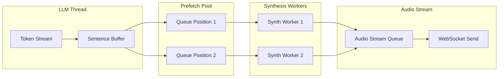

# TTS Streaming Latency Analysis & Optimization Plan

## Executive Summary

Current TTS playback in the Speech Cascade architecture experiences **critical latency** where TTS waits for the **entire LLM response** to complete before starting audio playback, regardless of response length. This document identifies the root cause and proposes a fix with validation tests.

---

## 🚨 CRITICAL ROOT CAUSE IDENTIFIED

### The Processing Loop Deadlock

**Location:** [handler.py#L615-L766](../apps/artagent/backend/voice/speech_cascade/handler.py#L615)

**Problem:** The `_processing_loop` runs in a single async task and processes events serially. When a `FINAL` speech event arrives, it calls `_process_final_speech()` which **awaits** the orchestrator. While awaiting, the processing loop is **blocked** and cannot dequeue `TTS_RESPONSE` events.

```mermaid
sequenceDiagram
    participant Loop as _processing_loop
    participant Orch as Orchestrator (LLM)
    participant Queue as speech_queue
    participant TTS as TTS Playback

    Loop->>Loop: Get FINAL event from queue
    Loop->>Orch: await _process_final_speech()
    Note over Loop: LOOP IS BLOCKED HERE
    
    Orch->>Orch: LLM streaming starts
    Orch->>Queue: queue_tts("First sentence.")
    Orch->>Queue: queue_tts("Second sentence.")
    Orch->>Queue: queue_tts("Third sentence.")
    Note over Queue: TTS_RESPONSE events<br>STUCK in queue!
    Orch->>Orch: LLM streaming completes
    Orch-->>Loop: orchestrator returns
    
    Note over Loop: LOOP RESUMES NOW
    Loop->>Loop: Get TTS_RESPONSE from queue
    Loop->>TTS: await play_to_acs()
    Loop->>Loop: Get TTS_RESPONSE from queue
    Loop->>TTS: await play_to_acs()
```

**Result:** ALL TTS chunks wait in the queue until the entire LLM response completes. Then they're played back-to-back, but the user experiences a long silence during LLM processing.

---

## Current Architecture Flow (Broken)

```mermaid
sequenceDiagram
    participant LLM as Azure OpenAI (Streaming)
    participant Thread as Streaming Thread
    participant Queue as asyncio.Queue
    participant Callback as on_tts_chunk
    participant SpeechCascade as SpeechCascadeHandler
    participant TTSPlayback as TTSPlayback
    participant Synth as SpeechSynthesizer
    participant WS as WebSocket

    LLM->>Thread: Token chunk (streaming)
    Thread->>Thread: Buffer in sentence_buffer
    Note over Thread: Wait for min_chunk (15 chars)<br>+ sentence boundary (.!?;:)
    Thread->>Queue: _put_chunk(sentence)
    Queue->>Callback: await on_tts_chunk(text)
    Callback->>SpeechCascade: queue_tts(text, voice_config)
    Note over SpeechCascade: ⚠️ Events STUCK in queue<br>_processing_loop is blocked!
    Note over LLM,Callback: ... more chunks queue up ...
    Note over LLM: LLM completes
    Note over SpeechCascade: _processing_loop resumes
    SpeechCascade->>TTSPlayback: play_to_browser/play_to_acs()
    TTSPlayback->>TTSPlayback: Acquire _tts_lock
    TTSPlayback->>Synth: synthesize_to_pcm() [BLOCKING]
    Note over Synth: Full synthesis completes<br>before any streaming
    Synth-->>TTSPlayback: Complete PCM bytes
    TTSPlayback->>WS: Stream chunks to client
```

---

## Secondary Latency Sources

### 1. **Sentence Buffering Delay** (Estimated: 200-800ms)

**Location:** [orchestrator.py#L1051-L1175](../apps/artagent/backend/voice/speech_cascade/orchestrator.py#L1051)

**Problem:** The LLM streaming thread buffers tokens until:
- Buffer reaches `min_chunk = 15` characters, AND
- A sentence terminator is found (`.!?;:\n`)

**Impact:** First audio dispatch is delayed until the LLM generates a complete sentence or phrase (~15+ characters with punctuation).

```python
# Current buffering logic
min_chunk = 15  # Minimum chars before dispatching
max_buffer = 80  # Force dispatch if buffer exceeds this

while len(sentence_buffer) >= min_chunk:
    term_idx = -1
    for t in primary_terms:  # ".!?"
        idx = sentence_buffer.rfind(t)
        if idx > term_idx:
            term_idx = idx
    # ... dispatch on sentence boundary
```

---

### 2. **Queue-Based Event Processing** (Estimated: 50-150ms)

**Location:** [handler.py#L274-L290](../apps/artagent/backend/voice/speech_cascade/handler.py#L274), [handler.py#L631-L645](../apps/artagent/backend/voice/speech_cascade/handler.py#L631)

**Problem:** TTS chunks are queued as `SpeechEvent` objects in an `asyncio.Queue` and processed serially:

```python
# on_tts_chunk puts events in queue
def queue_tts(self, text: str, ...) -> bool:
    return self.queue_event(
        SpeechEvent(event_type=SpeechEventType.TTS_RESPONSE, text=text, ...)
    )

# Processing loop handles events one at a time
async def _processing_loop(self) -> None:
    while self.running:
        speech_event = await asyncio.wait_for(self.speech_queue.get(), timeout=1.0)
        if speech_event.event_type == SpeechEventType.TTS_RESPONSE:
            await self.on_tts_request(speech_event.text, ...)
```

**Impact:** Each TTS chunk must wait for the previous one to fully complete (synthesis + streaming) before starting.

---

### 3. **Full Synthesis Before Streaming** (Estimated: 300-1200ms per chunk)

**Location:** [tts.py#L315-L352](../apps/artagent/backend/voice/speech_cascade/tts.py#L315), [text_to_speech.py#L1848-L1970](../src/speech/text_to_speech.py#L1848)

**Problem:** The `synthesize_to_pcm()` method performs **complete synthesis** before returning any bytes:

```python
# TTSPlayback._synthesize() - waits for full synthesis
synth_func = partial(
    synth.synthesize_to_pcm,
    text=text, voice=voice, sample_rate=sample_rate, style=style, rate=rate,
)
result = await loop.run_in_executor(executor, synth_func)

# SpeechSynthesizer.synthesize_to_pcm() - blocking call
result = synthesizer.speak_ssml_async(ssml).get()  # Blocks until complete
return result.audio_data  # Returns complete PCM bytes
```

**Impact:** For a 100-word response, the entire sentence must be synthesized (~500-1500ms) before any audio is sent to the client.

---

### 4. **TTS Lock Serialization** (Estimated: Variable - 0-2000ms)

**Location:** [tts.py#L186-L221](../apps/artagent/backend/voice/speech_cascade/tts.py#L186)

**Problem:** A single `_tts_lock` prevents concurrent TTS operations:

```python
async with self._tts_lock:  # Blocks if another TTS in progress
    if self._cancel_event.is_set():
        self._cancel_event.clear()
        return False
    self._is_playing = True
    # ... synthesis and streaming
```

**Impact:** Even if the next sentence is ready, it cannot begin synthesizing until the previous sentence finishes both synthesis AND streaming.

---

### 5. **No Streaming TTS API Usage** (Missed Opportunity)

**Location:** [text_to_speech.py](../src/speech/text_to_speech.py)

**Problem:** Azure Speech SDK supports streaming synthesis with `PullAudioOutputStream` or event-based callbacks (`synthesis_started`, `synthesizing`, `synthesis_completed`), but the current implementation uses synchronous `speak_ssml_async().get()`.

**Impact:** Cannot begin streaming audio to the client while synthesis is still in progress.

---

## Optimization Strategy

### Phase 0: Fix Processing Loop Deadlock (CRITICAL - P0)

**Goal:** Unblock the processing loop so TTS events can be processed while the orchestrator is still running.

**Root Cause:** `_process_final_speech` awaits the orchestrator inside `_processing_loop`, blocking all queue processing.

**Solution Options:**

#### Option A: Separate TTS Processing Task (Recommended)

Create a dedicated async task for TTS playback that runs independently of the main processing loop.

```python
# In SpeechCascadeHandler.__init__
self._tts_queue: asyncio.Queue[SpeechEvent] = asyncio.Queue()
self._tts_task: asyncio.Task | None = None

async def start(self) -> None:
    """Start all processing loops."""
    if self.running:
        return
    self.running = True
    self.processing_task = asyncio.create_task(self._processing_loop())
    self._tts_task = asyncio.create_task(self._tts_processing_loop())  # NEW

async def _tts_processing_loop(self) -> None:
    """Dedicated TTS processing - runs independently of speech processing."""
    while self.running:
        try:
            event = await asyncio.wait_for(self._tts_queue.get(), timeout=1.0)
            if self.on_tts_request:
                await self.on_tts_request(
                    event.text,
                    event.event_type,
                    voice_name=event.voice_name,
                    voice_style=event.voice_style,
                    voice_rate=event.voice_rate,
                )
        except TimeoutError:
            continue
        except Exception as e:
            logger.error(f"TTS processing error: {e}")

async def _processing_loop(self) -> None:
    """Main processing loop - no longer blocks on TTS."""
    while self.running:
        speech_event = await asyncio.wait_for(self.speech_queue.get(), timeout=1.0)
        
        if speech_event.event_type == SpeechEventType.FINAL:
            await self._process_final_speech(speech_event)
        elif speech_event.event_type == SpeechEventType.TTS_RESPONSE:
            # Route to dedicated TTS queue - NON-BLOCKING
            self._tts_queue.put_nowait(speech_event)
        # ... other event types
```

**Expected Improvement:** TTS starts playing within ~200-500ms of first sentence completion (vs waiting for entire LLM response)

**Validation Tests:**
- [ ] Unit test: `test_tts_queue_independent` - Verify TTS events processed during orchestrator execution
- [ ] Integration test: `test_first_tts_during_llm_stream` - Measure time from first sentence to first audio
- [ ] E2E test: `test_concurrent_llm_and_tts` - Verify TTS plays while LLM still streaming

#### Option B: Fire-and-Forget TTS Tasks

Instead of awaiting TTS in the processing loop, spawn independent tasks:

```python
elif speech_event.event_type == SpeechEventType.TTS_RESPONSE:
    # Fire-and-forget task for TTS - don't await
    asyncio.create_task(self._handle_tts_event(speech_event))
```

**Pros:** Simpler change
**Cons:** Harder to manage task lifecycle, potential for runaway tasks

---

### Phase 1: Reduce Sentence Buffer Threshold (Quick Win)

**Goal:** Dispatch TTS chunks earlier without waiting for full sentences.

**Changes:**
1. Reduce `min_chunk` from 15 to 8-10 characters
2. Add comma (`,`) as a secondary break point (with validation for numeric contexts)
3. Reduce `max_buffer` from 80 to 50 characters for forced dispatch

**Expected Improvement:** 100-400ms reduction in first-byte latency

**Validation Tests:**
- [ ] Unit test: `test_sentence_buffer_early_dispatch` - Verify chunks dispatch at 10 chars with terminator
- [ ] Unit test: `test_sentence_buffer_comma_break` - Verify comma triggers dispatch (excluding "1,000" patterns)
- [ ] Integration test: `test_first_tts_chunk_timing` - Measure time from first LLM token to first TTS dispatch
- [ ] E2E test: `test_streaming_latency_baseline` - Full pipeline timing measurement

---

### Phase 2: Parallel TTS Prefetch (Medium Effort)

**Goal:** Begin synthesizing the next sentence while the current one is streaming.

**Changes:**
1. Create a TTS prefetch queue that holds 1-2 pending synthesis jobs
2. Start synthesis for the next chunk immediately after dispatching current audio
3. Use `asyncio.create_task()` to run synthesis in parallel with streaming

**Architecture:**
```python
class TTSPrefetchQueue:
    def __init__(self, max_prefetch: int = 2):
        self._pending: asyncio.Queue[tuple[str, asyncio.Future]] = asyncio.Queue(maxsize=max_prefetch)
        self._synth_task: asyncio.Task | None = None
    
    async def prefetch(self, text: str, voice_config: VoiceConfig) -> None:
        """Start synthesizing in background."""
        future = asyncio.get_event_loop().create_future()
        await self._pending.put((text, future))
        if not self._synth_task or self._synth_task.done():
            self._synth_task = asyncio.create_task(self._synth_worker())
    
    async def get_audio(self) -> bytes:
        """Get next prefetched audio (blocks if not ready)."""
        text, future = await self._pending.get()
        return await future
```

**Expected Improvement:** 200-800ms reduction per chunk after the first

**Validation Tests:**
- [ ] Unit test: `test_prefetch_queue_ordering` - Verify FIFO order of prefetched audio
- [ ] Unit test: `test_prefetch_cancellation` - Verify prefetch cleanup on barge-in
- [ ] Unit test: `test_prefetch_concurrency` - Verify max 2 concurrent synth jobs
- [ ] Integration test: `test_prefetch_overlap_timing` - Measure gap between TTS chunks
- [ ] E2E test: `test_multi_sentence_streaming` - Full pipeline with 3+ sentences

---

### Phase 3: Streaming TTS Synthesis (High Impact)

**Goal:** Stream audio to client while synthesis is still in progress.

**Changes:**
1. Implement `PullAudioOutputStream` for streaming synthesis
2. Create audio chunk callbacks during synthesis
3. Stream first audio frames within 50-100ms of synthesis start

**New Method:**
```python
async def synthesize_streaming(
    self,
    text: str,
    voice: str,
    sample_rate: int,
    on_audio_chunk: Callable[[bytes], Awaitable[None]],
) -> None:
    """Stream audio chunks as they become available during synthesis."""
    
    class AudioStream(speechsdk.audio.PullAudioOutputStreamCallback):
        def __init__(self, callback, loop):
            super().__init__()
            self._callback = callback
            self._loop = loop
            self._buffer = bytearray()
        
        def write(self, audio_buffer: memoryview) -> int:
            self._buffer.extend(audio_buffer)
            # Dispatch in 40ms chunks (640 bytes at 16kHz)
            while len(self._buffer) >= 640:
                chunk = bytes(self._buffer[:640])
                self._buffer = self._buffer[640:]
                asyncio.run_coroutine_threadsafe(
                    self._callback(chunk), self._loop
                )
            return len(audio_buffer)
    
    stream = AudioStream(on_audio_chunk, asyncio.get_running_loop())
    audio_config = speechsdk.audio.AudioOutputConfig(stream=speechsdk.audio.PullAudioOutputStream(stream))
    synthesizer = speechsdk.SpeechSynthesizer(speech_config=self.cfg, audio_config=audio_config)
    
    result = synthesizer.speak_ssml_async(ssml).get()
```

**Expected Improvement:** 200-600ms reduction in time-to-first-audio per chunk

**Validation Tests:**
- [ ] Unit test: `test_streaming_synth_first_chunk_timing` - Verify <100ms to first audio chunk
- [ ] Unit test: `test_streaming_synth_complete_audio` - Verify all audio bytes delivered
- [ ] Unit test: `test_streaming_synth_cancellation` - Verify clean cancellation mid-synthesis
- [ ] Integration test: `test_streaming_synth_e2e` - Full pipeline with streaming synthesis
- [ ] Load test: `test_streaming_synth_concurrent` - 10 concurrent sessions with streaming

---

### Phase 4: Pipeline Parallelism (Advanced)

**Goal:** Fully pipelined LLM → TTS → WebSocket streaming.

**Architecture:**


**Changes:**
1. Implement 2-worker synthesis pool
2. Audio stream queue with chunk interleaving
3. Priority queue for first chunk of each sentence
4. Backpressure handling for slow clients

**Expected Improvement:** Near-elimination of inter-sentence gaps

**Validation Tests:**
- [ ] Unit test: `test_pipeline_ordering` - Verify sentence order preserved
- [ ] Unit test: `test_pipeline_backpressure` - Verify graceful slowdown under load
- [ ] Integration test: `test_pipeline_concurrent_synthesis` - 2 workers producing in parallel
- [ ] E2E test: `test_pipeline_natural_pacing` - Verify natural audio pacing at client
- [ ] Load test: `test_pipeline_scalability` - 50 concurrent sessions

---

## Test Implementation Plan

### Test File Structure

```
tests/
├── unit/
│   ├── test_tts_sentence_buffer.py      # Phase 1 buffer tests
│   ├── test_tts_prefetch_queue.py       # Phase 2 prefetch tests
│   ├── test_tts_streaming_synth.py      # Phase 3 streaming tests
│   └── test_tts_pipeline.py             # Phase 4 pipeline tests
├── integration/
│   ├── test_tts_latency_metrics.py      # Cross-phase timing validation
│   └── test_tts_e2e_streaming.py        # Full pipeline tests
└── load/
    └── test_tts_concurrent_sessions.py  # Scalability tests
```

### Key Test Fixtures

```python
# conftest.py additions

@pytest.fixture
def mock_speech_synthesizer():
    """Mock Azure Speech SDK synthesizer with controllable timing."""
    synth = MagicMock()
    synth.speak_ssml_async.return_value.get.return_value = MagicMock(
        reason=speechsdk.ResultReason.SynthesizingAudioCompleted,
        audio_data=b'\x00' * 16000,  # 1 second of silence at 16kHz
    )
    return synth

@pytest.fixture
def latency_recorder():
    """Record timing events for latency analysis."""
    class LatencyRecorder:
        def __init__(self):
            self.events: list[tuple[str, float]] = []
            self._start = time.perf_counter()
        
        def mark(self, event: str) -> None:
            self.events.append((event, time.perf_counter() - self._start))
        
        def elapsed(self, from_event: str, to_event: str) -> float:
            times = {e: t for e, t in self.events}
            return times.get(to_event, 0) - times.get(from_event, 0)
    
    return LatencyRecorder()

@pytest.fixture
def streaming_llm_mock():
    """Mock streaming LLM that yields tokens at realistic pace."""
    async def mock_stream(text: str, tokens_per_second: int = 50):
        words = text.split()
        for word in words:
            yield word + " "
            await asyncio.sleep(1 / tokens_per_second)
    return mock_stream
```

---

## Metrics & Success Criteria

### Key Metrics

| Metric | Current (Est.) | Phase 1 Target | Phase 3 Target | Phase 4 Target |
|--------|----------------|----------------|----------------|----------------|
| Time to first TTS dispatch | 400-800ms | 200-400ms | 200-400ms | 200-400ms |
| Time to first audio byte | 800-2000ms | 500-1200ms | 300-600ms | 200-400ms |
| Inter-sentence gap | 500-1500ms | 400-1200ms | 100-400ms | 50-150ms |
| End-to-end latency (5 sentences) | 4-8s | 3-6s | 2-4s | 1.5-3s |

### Telemetry Integration

Add OpenTelemetry spans for each stage:
```python
with tracer.start_as_current_span("tts.sentence_buffer") as span:
    span.set_attribute("buffer.length", len(sentence_buffer))
    span.set_attribute("buffer.dispatch_reason", "sentence_end")  # or "max_buffer", "comma"

with tracer.start_as_current_span("tts.synthesis") as span:
    span.set_attribute("tts.text_length", len(text))
    span.set_attribute("tts.voice", voice_name)
    span.add_event("tts.first_audio_chunk")  # When streaming

with tracer.start_as_current_span("tts.stream_to_client") as span:
    span.set_attribute("tts.chunk_count", chunk_count)
    span.set_attribute("tts.total_bytes", len(pcm_bytes))
```

---

## Implementation Priority

| Phase | Effort | Impact | Priority |
|-------|--------|--------|----------|
| **Phase 0: Fix Processing Loop Deadlock** | Medium (4-8 hours) | **CRITICAL** | **P0 - MUST DO FIRST** |
| Phase 1: Buffer Threshold | Low (2-4 hours) | Medium | P1 |
| Phase 2: Prefetch Queue | Medium (1-2 days) | Medium-High | P2 |
| Phase 3: Streaming TTS | High (3-5 days) | High | P2 |
| Phase 4: Full Pipeline | High (5-7 days) | Very High | P3 |

**Note:** Phase 0 is the critical fix. Without it, all other optimizations have zero effect because TTS events are blocked in the queue.

---

## Risk Considerations

### Phase 1 Risks
- **Audio gaps**: Shorter chunks may create unnatural pauses
- **Mitigation**: Test with real voices and adjust min_chunk based on results

### Phase 2 Risks
- **Memory pressure**: Prefetched audio consumes memory
- **Mitigation**: Limit prefetch queue to 2 items, implement backpressure

### Phase 3 Risks
- **SDK complexity**: PullAudioOutputStream requires careful threading
- **Mitigation**: Extensive unit tests, fallback to sync synthesis on failure

### Phase 4 Risks
- **Ordering bugs**: Parallel synthesis may deliver out of order
- **Mitigation**: Sequence numbers on chunks, strict FIFO playback queue

---

## Appendix: Current Code References

### 🚨 Critical Fix Location (Phase 0)
- File: [handler.py](../apps/artagent/backend/voice/speech_cascade/handler.py)
- Lines: 615-680 (`_processing_loop` method)
- Issue: TTS_RESPONSE events cannot be processed while FINAL event awaits orchestrator
- Fix: Add dedicated `_tts_processing_loop` or use fire-and-forget tasks

### Sentence Buffer Logic
- File: [orchestrator.py](../apps/artagent/backend/voice/speech_cascade/orchestrator.py)
- Lines: 1051-1175
- Key variables: `sentence_buffer`, `min_chunk`, `primary_terms`, `secondary_terms`

### TTS Queue Processing
- File: [handler.py](../apps/artagent/backend/voice/speech_cascade/handler.py)
- Lines: 631-670 (processing loop), 1182-1215 (queue_tts method)
- Key class: `SpeechEventType.TTS_RESPONSE`

### TTS Synthesis
- File: [tts.py](../apps/artagent/backend/voice/speech_cascade/tts.py)
- Lines: 315-352 (`_synthesize` method)
- Key method: `synthesize_to_pcm`

### Azure Speech SDK Usage
- File: [text_to_speech.py](../src/speech/text_to_speech.py)
- Lines: 1848-1970 (`synthesize_to_pcm` method)
- Key API: `speechsdk.SpeechSynthesizer.speak_ssml_async`

---

## Next Steps

1. [x] Identify root cause of TTS blocking (Processing loop deadlock)
2. [x] **Implement Phase 0 fix** - `play_tts_immediate()` bypasses blocked queue
3. [ ] Test TTS plays during LLM streaming (not after)
4. [ ] Write baseline latency tests to validate improvement
5. [ ] Measure and document improvements
6. [ ] Consider Phase 1 buffer threshold changes for further optimization

---

## ✅ Fix Implemented

**Problem:** `on_tts_chunk` called `queue_tts()` which put events in the `speech_queue`, but the `_processing_loop` was blocked awaiting the orchestrator - so TTS events sat waiting until LLM completed.

**Solution:** Added `play_tts_immediate()` method that directly calls the `on_tts_request` callback, bypassing the blocked queue entirely:

**Changes Made:**

1. **[handler.py](../apps/artagent/backend/voice/speech_cascade/handler.py)** - Added `play_tts_immediate()`:
```python
async def play_tts_immediate(
    self,
    text: str,
    *,
    voice_name: str | None = None,
    voice_style: str | None = None,
    voice_rate: str | None = None,
) -> None:
    """Play TTS immediately without queueing."""
    if self.on_tts_request:
        await self.on_tts_request(
            text,
            SpeechEventType.TTS_RESPONSE,
            voice_name=voice_name,
            voice_style=voice_style,
            voice_rate=voice_rate,
        )
```

2. **[unified/__init__.py](../apps/artagent/backend/src/orchestration/unified/__init__.py)** - Changed `on_tts_chunk` to use immediate playback:
```python
# Before: ws.state.speech_cascade.queue_tts(text, ...)
# After:
await ws.state.speech_cascade.play_tts_immediate(text, ...)
