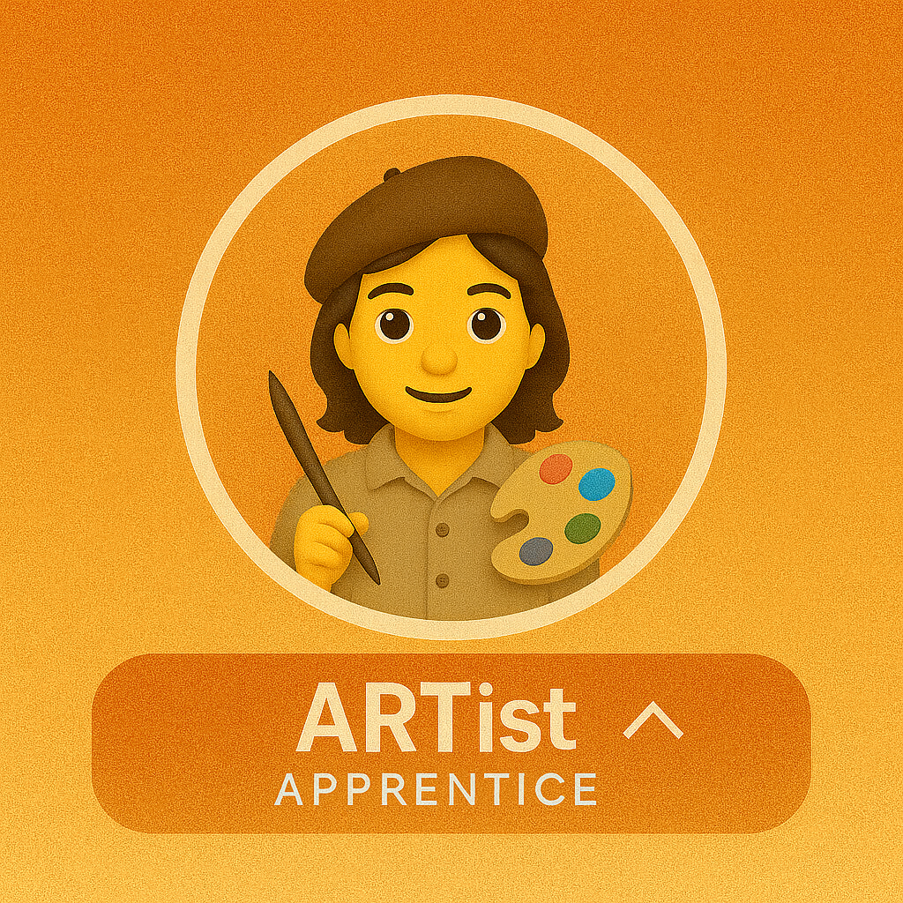
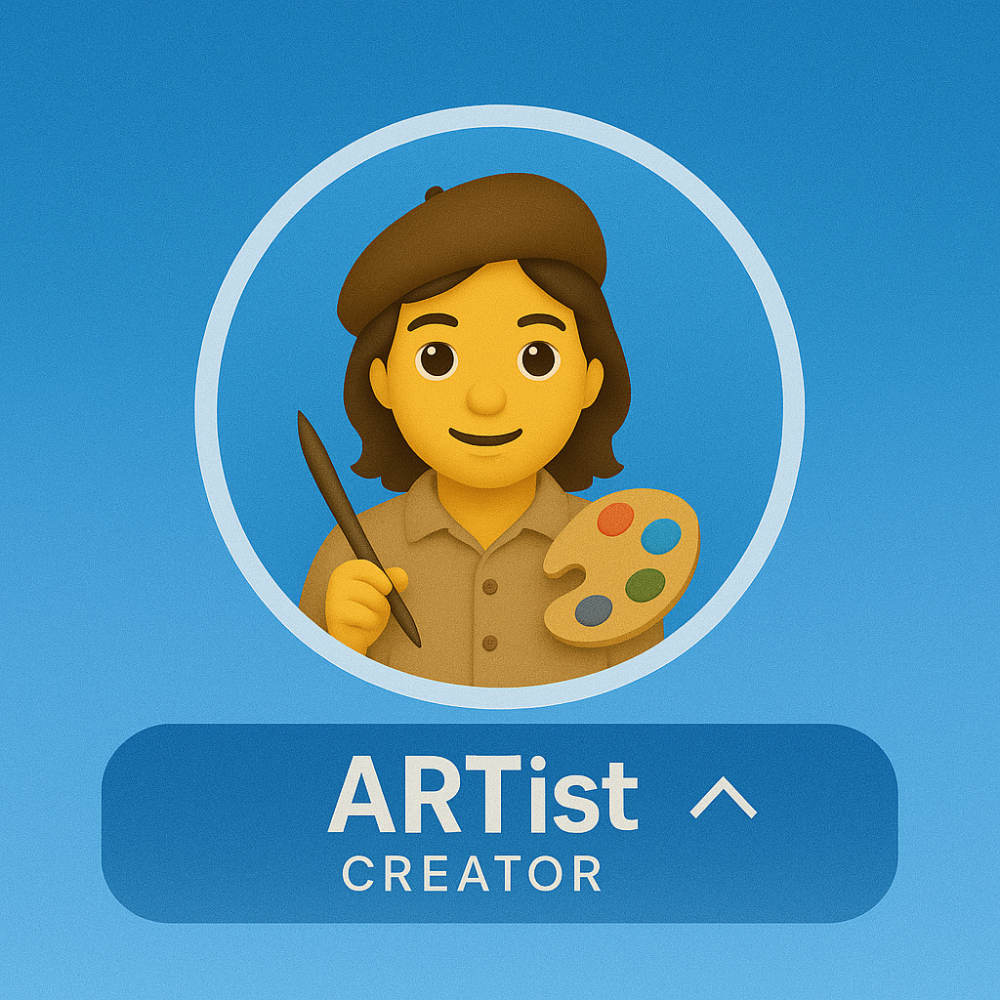
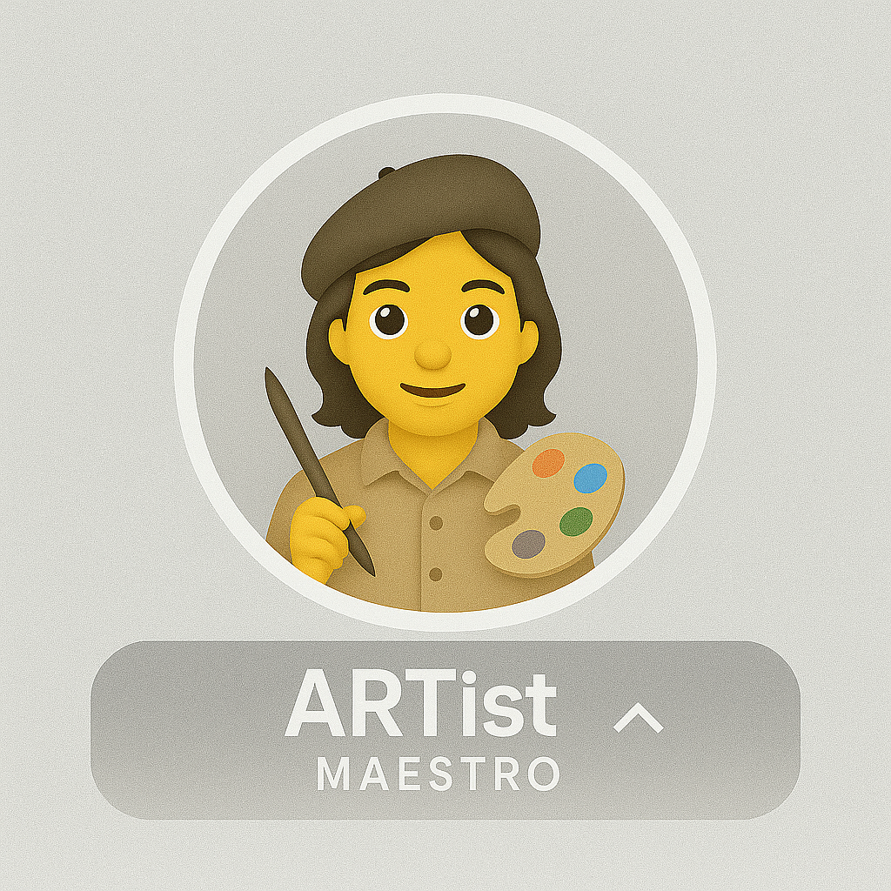

# ARTist Certification Program

**ARTist** = Artist + ART (Azure Real-Time Voice Agent Framework)

A certification program for practitioners building production-ready real-time voice AI agents with the ART Voice Agent Accelerator.

**Program Goals:**
- Validate technical expertise across deployment, architecture, and production operations
- Recognize community contributions and knowledge sharing
- Build a network of certified practitioners

## Certification Levels

### Level 1: Apprentice



**Entry-level certification** — Foundation in deployment and architecture.

<details>
<summary><b>View Requirements</b></summary>

**Technical Checklist:**

- [ ] Run the UI (frontend + backend) locally
- [ ] Successfully demonstrate the framework to others
- [ ] Understand the end-to-end call flow in the UI and backend
- [ ] Explain the architecture: ACS (Call Automation + Media) → Speech (STT/TTS) → LLM
- [ ] Describe the two orchestration approaches: Voice Live API vs Azure Speech + custom agents
- [ ] Use the Agent Builder to run custom flows or multi-agent scenarios
- [ ] Complete at least one end-to-end voice call demo

**Documentation:**

- [ ] Read architecture overview
- [ ] Navigate API reference
- [ ] Review agent configuration guide

**Badge Code:**

```markdown

```

</details>

### Level 2: Creator



**Practitioner certification** — Build and extend custom voice agents.

<details>
<summary><b>View Requirements</b></summary>

**Custom Agent Development:**

- [ ] Create at least one custom agent using YAML configuration (`agents/<agent_name>/agent.yaml`)
- [ ] Define agent-specific prompts, greeting, and return_greeting
- [ ] Configure agent handoff triggers for multi-agent orchestration
- [ ] Customize voice settings (voice name, rate, pitch) for your use case
- [ ] Test end-to-end with both speech input and tool integration

**Tool Integration (choose one or more):**

- [ ] Integrate external REST API (CRM, ticketing, payment system)
- [ ] Connect to database (Cosmos DB, PostgreSQL, etc.)
- [ ] Implement custom business logic tool
- [ ] Add third-party service integration (Twilio, Stripe, etc.)

**Community Contributions:**

- [ ] File a bug report with reproduction steps
- [ ] Submit documentation improvement PR
- [ ] Answer questions in GitHub Discussions

**Badge Code:**

```markdown

```

</details>

### Level 3: Maestro



**Expert certification** — Lead production systems and mentor the community.

<details>
<summary><b>View Requirements</b></summary>

**Production Deployment:**

- [ ] Deploy to Azure with infrastructure-as-code (Bicep or Terraform)
- [ ] Configure Azure Communication Services for PSTN or SIP integration
- [ ] Implement health checks and readiness probes
- [ ] Document deployment architecture and runbooks

**Observability & Performance:**

- [ ] Instrument code with OpenTelemetry spans (see `apps/artagent/backend/src/utils/tracing.py`)
- [ ] Set up distributed tracing with Application Insights or Jaeger
- [ ] Monitor end-to-end latency: < 1s P95 for STT → LLM → TTS pipeline
- [ ] Configure connection pooling (`WarmablePool` or `OnDemandPool`)
- [ ] Implement resource limits and backpressure handling

**Advanced Development (choose at least one):**

- [ ] Extend ACS event handlers for custom call control logic
- [ ] Build custom media processing (VAD tuning, audio preprocessing)
- [ ] Implement advanced orchestration patterns (stateful handoffs, context transfer)
- [ ] Contribute framework enhancement (new pool type, improved error handling, etc.)

**Security & Compliance:**

- [ ] Implement authentication flow (see `auth_agent` example)
- [ ] Configure PII detection/redaction using Azure Content Safety or custom filters
- [ ] Enable audit logging for compliance (HIPAA, GDPR, PCI-DSS)
- [ ] Secure secrets management (Key Vault, Managed Identity)

**Community Leadership:**

- [ ] Review and merge community PRs
- [ ] Lead a workshop or create video tutorial
- [ ] Mentor 2+ developers through certification

**Badge Code:**

```markdown

```

</details>

## Hall of Fame

Certified practitioners recognized for expertise in real-time voice AI.

<details open>
<summary><b>Maestros (Level 3)</b></summary>

| Name | GitHub | Organization |
|------|--------|--------------|
| Pablo Salvador Lopez | [@pablosalvador10](https://github.com/pablosalvador10) | Microsoft |
| Jin Lee | [@JinLee794](https://github.com/JinLee794) | Microsoft |

</details>

<details>
<summary><b>Creators (Level 2)</b></summary>

| Name | GitHub | Organization |
|------|--------|--------------|
| *Be the first Creator!* | | |

</details>

<details>
<summary><b>Apprentices (Level 1)</b></summary>

| Name | GitHub | Organization |
|------|--------|--------------|
| *Complete onboarding to join!* | | |

</details>

## Certification Process

<details>
<summary><b>Self-Assessment Path</b></summary>

**Steps:**

1. Complete the technical checklist for your target level
2. Prepare evidence portfolio (see requirements below)
3. Open a GitHub Discussion with title: `[ARTist Certification] <Level> - <Your Name>`
4. Program maintainers review within 5 business days
5. Receive badge and Hall of Fame entry upon approval

**Required Portfolio Evidence:**

**For Level 1 (Apprentice):**
- Screenshot of successful local deployment
- Brief architecture explanation (5-10 sentences)
- Recording or log of completed voice call

**For Level 2 (Creator):**
- Link to GitHub repo with custom agent YAML
- Demo video or call recording (2-5 minutes)
- Code snippet showing tool integration
- Links to GitHub contributions (issues, PRs, discussions)

**For Level 3 (Maestro):**
- Production deployment URL or architecture diagram
- Observability dashboard screenshot (traces, metrics, logs)
- Performance report showing P95 latency < 1s
- Security documentation (auth flow, PII handling, compliance)
- Evidence of mentorship (PR reviews, workshop slides, tutorial)

</details>

<details>
<summary><b>Workshop Path</b></summary>

Accelerate certification by attending an official workshop:

| Level | Format | Duration | Outcome |
|-------|--------|----------|---------|
| Apprentice | Onboarding session | 2 hours | Deployment + architecture review |
| Creator | Hands-on lab | Full day | Build custom agent with guidance |
| Maestro | Architecture review + mentorship | Ongoing | Production readiness assessment |

Workshop participants receive expedited certification review.

</details>

---

## Badge Reference

<details>
<summary><b>Badge Images</b></summary>

### Level 1: Apprentice


```markdown

```

### Level 2: Creator


```markdown

```

### Level 3: Maestro


```markdown

```

**Sizing Options:**

```markdown
<!-- Small (150px) -->


<!-- Medium (200px, default) -->


<!-- Large (300px) -->

```

</details>

---

## Add to Your Profile

<details>
<summary><b>GitHub Profile Instructions</b></summary>

1. Create a repo: `<your-username>/<your-username>` (special GitHub profile repo)
2. Add your badge to `README.md`:

```markdown
### Certifications


Certified ARTist — crafting real-time voice AI with the ART framework.

[About ARTist Certification →](https://github.com/Azure-Samples/art-voice-agent-accelerator/blob/main/docs/community/artist-certification.md)
```

</details>

---

## Contact & Support

**Certification Inquiries:**
- Open a [GitHub Discussion](https://github.com/Azure-Samples/art-voice-agent-accelerator/discussions) with title format: `[ARTist Certification] <Level> - <Your Name>`
- Tag `@pablosalvador10` or `@JinLee794` for review
- Expected response time: 5 business days

**Technical Questions:**
- GitHub Issues for bugs or feature requests
- GitHub Discussions for architecture or implementation questions
- Community calls: Schedule TBD

---

*The ARTist certification program is maintained by the ART Voice Agent Accelerator community.*
