# :material-rocket: Getting Started

!!! success "Welcome to ARTVoice Accelerator"
    Build real-time voice agents on Azure—from your first deployment to production.

---

## :material-map-marker-path: Choose Your Path

```mermaid
flowchart TD
    START([New to the project?]) --> Q1{Have Azure resources?}
    
    Q1 -->|No| QUICK[📦 Quickstart<br/>Deploy everything with azd up]
    Q1 -->|Yes| LOCAL[💻 Local Development<br/>Run backend/frontend locally]
    
    QUICK --> DEMO[🎮 Demo Guide<br/>Try the voice agent]
    LOCAL --> DEMO
    
    DEMO --> NEXT{What's next?}
    NEXT --> ARCH[📐 Architecture<br/>Understand the system]
    NEXT --> CUSTOM[🔧 Customize<br/>Build your own agents]
    
    style START fill:#e8f5e9
    style QUICK fill:#e3f2fd
    style LOCAL fill:#fff3e0
    style DEMO fill:#f3e5f5
```

---

## :material-format-list-numbered: Step-by-Step Guides

| Step | Guide | Time | Description |
|:----:|-------|:----:|-------------|
| 0️⃣ | [**Prerequisites**](prerequisites.md) | 5 min | Install required tools (one-time setup) |
| 1️⃣ | [**Quickstart**](quickstart.md) | 15 min | Deploy to Azure with `azd up` |
| 2️⃣ | [**Local Development**](local-development.md) | 10 min | Run backend/frontend on your machine |
| 3️⃣ | [**Demo Guide**](demo-guide.md) | 10 min | Create profiles, test agents, explore features |

---

## :material-frequently-asked-questions: Quick Answers

??? question "How long does deployment take?"
    **~15 minutes** for complete infrastructure + application deployment via `azd up`.

??? question "Do I need a phone number?"
    **No** — browser-based voice works without a phone number.
    
    Phone numbers are only needed for PSTN (telephone) integration. See [Phone Number Setup](../deployment/phone-number-setup.md).

??? question "What Azure resources are created?"
    | Category | Services |
    |----------|----------|
    | **AI** | Azure OpenAI, Speech Services, VoiceLive |
    | **Communication** | Azure Communication Services |
    | **Data** | Cosmos DB, Redis, Blob Storage |
    | **Compute** | Container Apps, App Configuration |
    | **Monitoring** | Application Insights, Log Analytics |

??? question "Which Azure regions are supported?"
    Most Azure regions with OpenAI availability work. Recommended: **East US**, **West US 2**, **Sweden Central**.
    
    !!! note "VoiceLive API"
        Currently in preview with limited regions. Check [Speech Services regions](https://learn.microsoft.com/en-us/azure/ai-services/speech-service/regions).

??? question "Can I use existing Azure resources?"
    Yes! Skip `azd up` and configure `.env` manually. See [Local Development - Legacy Setup](local-development.md#option-b-legacy-full-env-file-manual-setup).

---

## :material-help-circle: Getting Help

| Resource | When to Use |
|----------|-------------|
| [Troubleshooting](../operations/troubleshooting.md) | Common issues and solutions |
| [GitHub Issues](https://github.com/Azure-Samples/art-voice-agent-accelerator/issues) | Bug reports |
| [GitHub Discussions](https://github.com/Azure-Samples/art-voice-agent-accelerator/discussions) | Questions and community help |

---

## :material-book-open-variant: Continue Learning

After getting started, explore these areas:

| Topic | Guide |
|-------|-------|
| **Understand the architecture** | [Architecture Overview](../architecture/README.md) |
| **Customize agents** | [Agent Framework](../architecture/agents/README.md) |
| **Production deployment** | [Deployment Guide](../deployment/README.md) |
| **Add phone support** | [Phone Number Setup](../deployment/phone-number-setup.md) |

