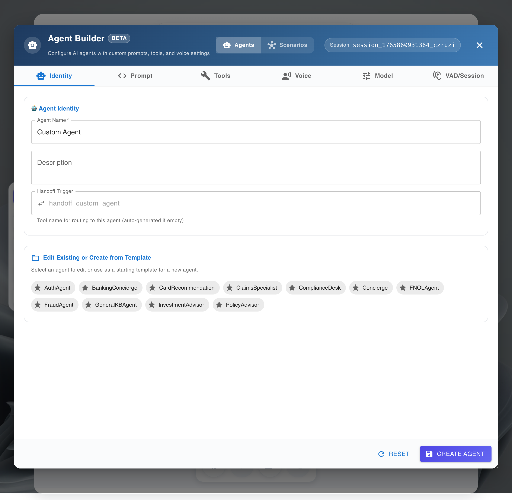
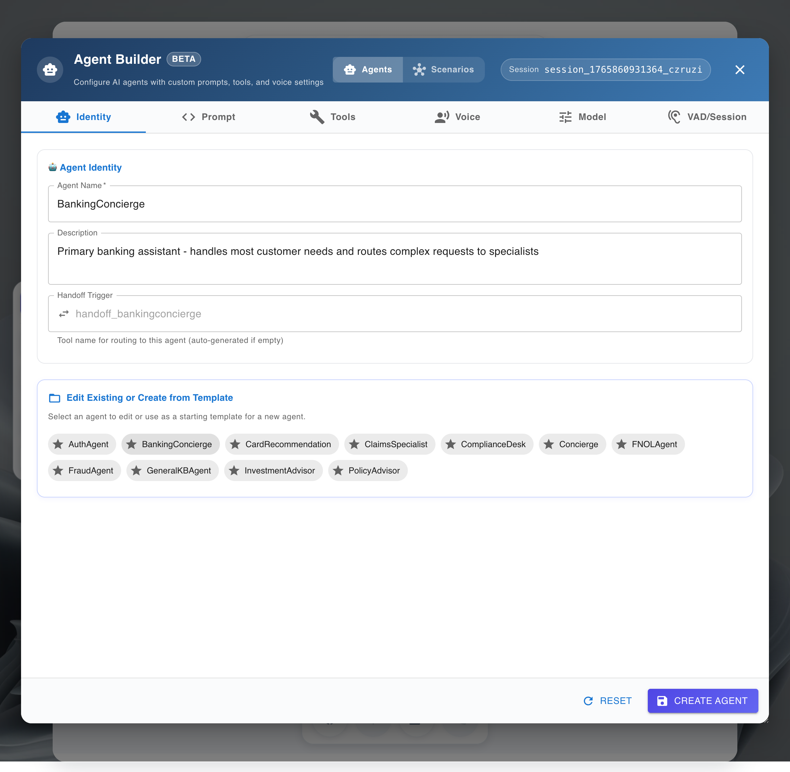
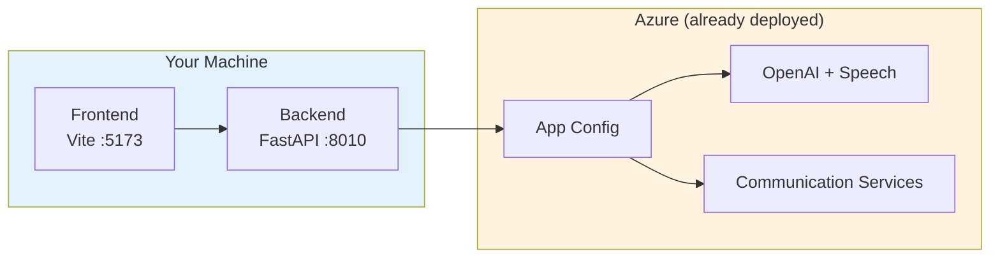

### UI Orientation (Screenshots)

For a fast orientation to the UI and agent setup:

- Agent Builder initial view: 
- Template selection flow: 

Prefer a full walkthrough? See [Quickstart: Step-by-Step](quickstart.md#step-by-step-build-your-first-agent) for numbered instructions with images.

# :material-laptop: Local Development

!!! info "Prerequisite: Azure Resources"
    This guide assumes you've already deployed infrastructure via [Quickstart](quickstart.md).
    
    If you haven't deployed yet, run `azd up` first—it only takes 15 minutes.

---

## :material-target: What You'll Set Up



| Component | Port | Purpose |
|-----------|------|---------|
| **Backend** | `8010` | FastAPI + WebSocket voice pipeline |
| **Frontend** | `5173` | Vite + React demo UI |
| **Dev Tunnel** | External | ACS callbacks for phone calls |

---

## :material-numeric-1-circle: Python Environment

Choose **one** of these options:

=== ":material-star: uv (Recommended)"

    [uv](https://docs.astral.sh/uv/) is 10-100x faster than pip.
    
    ```bash
    # Install uv (if not installed)
    curl -LsSf https://astral.sh/uv/install.sh | sh
    
    # Sync dependencies (creates .venv automatically)
    uv sync
    ```

=== "venv + pip"

    ```bash
    python -m venv .venv
    source .venv/bin/activate  # Windows: .venv\Scripts\activate
    pip install -e .[dev]
    ```

=== "Conda"

    ```bash
    conda env create -f environment.yaml
    conda activate audioagent
    uv sync  # or: pip install -e .[dev]
    ```

---

## :material-numeric-2-circle: Environment Configuration

### Option A: Use App Configuration (Recommended)

After `azd up`, a `.env.local` file was auto-generated:

```bash
# Verify it exists
cat .env.local
```

**Expected contents:**
```bash
AZURE_APPCONFIG_ENDPOINT=https://<your-appconfig>.azconfig.io
AZURE_APPCONFIG_LABEL=dev
AZURE_TENANT_ID=<your-tenant-id>
```

!!! success "That's all you need!"
    The backend automatically fetches all settings (OpenAI, Speech, ACS, Redis, etc.) from Azure App Configuration at startup.

### Option B: Legacy — Full `.env` File (Manual Setup)

If you **don't have infrastructure** or need to work offline:

```bash
cp .env.sample .env
# Edit .env with your values
```

??? example "Required variables for `.env`"
    ```bash
    # Azure OpenAI
    AZURE_OPENAI_ENDPOINT=https://<your-aoai>.openai.azure.com
    AZURE_OPENAI_KEY=<aoai-key>
    AZURE_OPENAI_CHAT_DEPLOYMENT_ID=gpt-4o
    
    # Speech Services
    AZURE_SPEECH_REGION=<region>
    AZURE_SPEECH_KEY=<speech-key>
    
    # ACS (optional - only for phone calls)
    ACS_CONNECTION_STRING=endpoint=https://<acs>.communication.azure.com/;accesskey=<key>
    ACS_SOURCE_PHONE_NUMBER=+1XXXXXXXXXX
    
    # Runtime
    ENVIRONMENT=dev
    BASE_URL=https://<tunnel-url>
    ```

---

## :material-numeric-3-circle: Start Dev Tunnel

Required for ACS callbacks (phone calls). Skip if only using browser.

```bash
devtunnel host -p 8010 --allow-anonymous
```

Copy the HTTPS URL (e.g., `https://abc123-8010.usw3.devtunnels.ms`) and set it:

```bash
# In .env or .env.local
BASE_URL=https://abc123-8010.usw3.devtunnels.ms
```

!!! warning "URL Changes on Restart"
    If the tunnel restarts, you get a new URL. Update `BASE_URL` and any ACS Event Grid subscriptions.

---

## :material-numeric-4-circle: Start Backend

```bash
uv run uvicorn apps.artagent.backend.main:app --host 0.0.0.0 --port 8010 --reload
```

??? tip "Using venv?"
    ```bash
    source .venv/bin/activate
    uvicorn apps.artagent.backend.main:app --host 0.0.0.0 --port 8010 --reload
    ```

---

## :material-numeric-5-circle: Start Frontend

Open a **new terminal**:

```bash
cd apps/artagent/frontend

# Create frontend .env
echo "VITE_BACKEND_BASE_URL=http://localhost:8010" > .env

npm install
npm run dev
```

**Open:** http://localhost:5173

---

## :material-check-circle: Verify It Works

1. Open http://localhost:5173
2. Allow microphone access
3. Start talking
4. You should see:
    - Transcripts appearing
    - AI responses
    - Audio playback

### API Documentation

The backend exposes interactive API documentation:

| URL | Format | Best For |
|-----|--------|----------|
| http://localhost:8010/redoc | ReDoc | Reading API reference |
| http://localhost:8010/docs | Swagger UI | Interactive testing |

!!! tip "Explore Available Endpoints"
    Visit `/redoc` to see all available API endpoints, request/response schemas, and WebSocket contracts for the voice pipeline.

---

## :material-tools: Development Alternatives

### VS Code Debugging

Built-in debug configurations in `.vscode/launch.json`:

| Configuration | What It Does |
|---------------|--------------|
| `[RT Agent] Python Debugger: FastAPI` | Debug backend with breakpoints |
| `[RT Agent] React App: Browser Debug` | Debug frontend in browser |

1. Set breakpoints in code
2. Press **F5**
3. Select configuration
4. Debug!

### Docker Compose

For containerized local development:

```bash
docker-compose up --build
```

| Service | URL |
|---------|-----|
| Frontend | http://localhost:8080 |
| Backend | http://localhost:8010 |

---

## :material-phone: Phone (PSTN) Setup

!!! note "Optional"
    Only needed if you want to make/receive actual phone calls.

1. **Purchase a phone number** via Azure Portal or:
   ```bash
   make purchase_acs_phone_number
   ```

2. **Configure Event Grid** subscription:
   - Event: `Microsoft.Communication.IncomingCall`
   - Endpoint: `https://<tunnel-url>/api/v1/calls/answer`

3. **Dial the number** and talk to your AI agent!

📚 **Full guide:** [Phone Number Setup](../deployment/phone-number-setup.md)

---

## :material-bug: Troubleshooting

| Symptom | Cause | Fix |
|---------|-------|-----|
| 404 on callbacks | Stale `BASE_URL` | Update `.env` with new tunnel URL |
| No audio | Invalid Speech key | Check Azure Speech resource |
| WebSocket closes | Wrong backend URL | Verify `VITE_BACKEND_BASE_URL` |
| Import errors | Missing deps | Re-run `uv sync` |
| Phone call no events | Event Grid not configured | Update subscription endpoint |

📚 **More help:** [Troubleshooting Guide](../operations/troubleshooting.md)

---

## :material-test-tube: Testing

```bash
# Quick unit tests
uv run pytest tests/test_acs_media_lifecycle.py -v

# All tests
uv run pytest tests/ -v
```

📚 **Full guide:** [Testing Guide](../operations/testing.md)